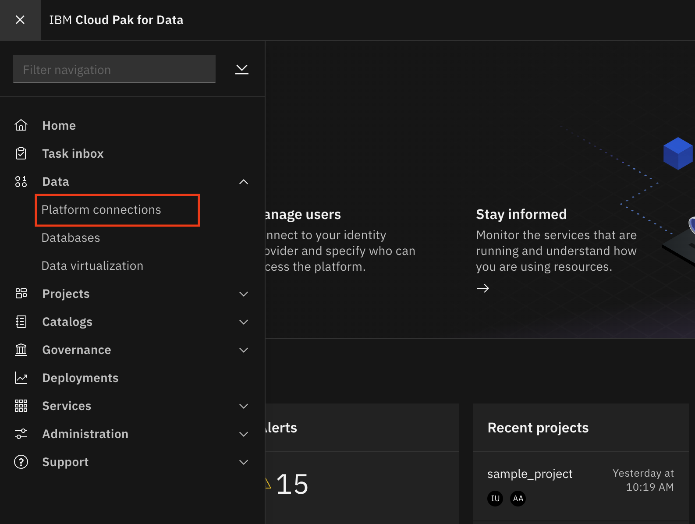

# Admin Guide - Database Connection Configuration

For Cloud Pak for Data to access our data sources (Db2 Warehouse, MongoDB, etd), we need to add *Data Connections* to connect to them via JDBC to Cloud Pak for Data.

## Add DB2 Warehouse Connection

* To add a new data source, go the (☰) navigation menu and under the *Data* section click on *`Platform connections`*.

  

* At the overview, click the *`New connection`* button.

  

* Start by selecting *Db2 Warehouse* as your connection type.

* On the following screen, provide your new connection a name. Also enter the Host, Port, Database, Username and Password values for the connection (*Note: these are the values you saved when you provisioned the instance*).

* Ensure the check box for `Use SSL` is selected, then copy and paste the contents of the SSL certificate for DB2 Warehouse (probably called DigiCertGlobalRootCA.pem).

  >_Note: You can open the pem file in a text editor to copy the credentials content_

* Once you have entered all the connection information, you must first click the `Test Connection` button and after that succeeds, click on the *`Save`* button.

  

* The new connection will be listed in the overview.

__THIS SECTION IS COMPLETE, GO BACK AND CONTINUE WITH THE [ADMIN GUIDE](./README.md)__
