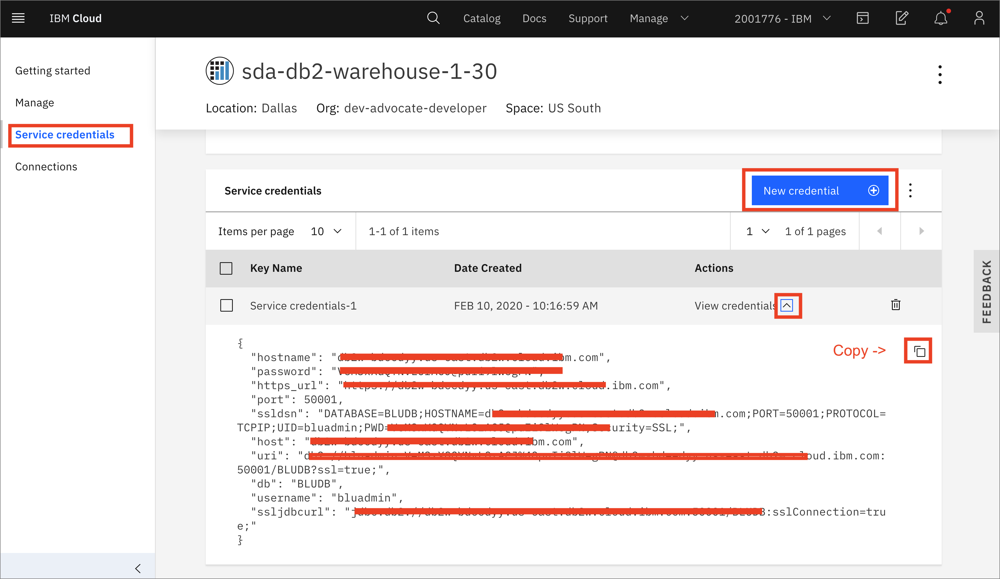
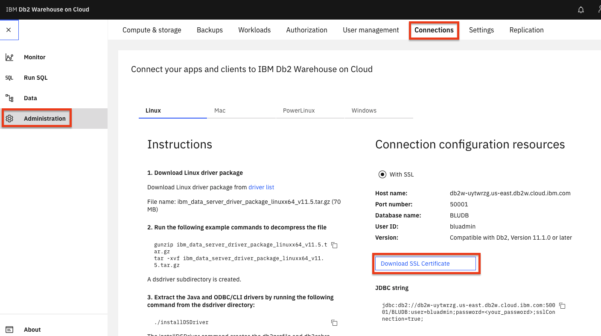
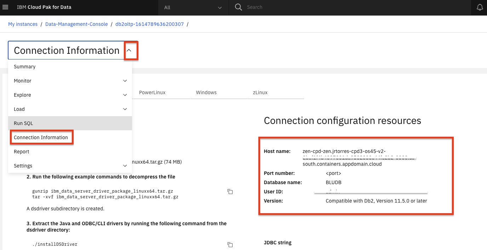

# Admin Guide - Setup and Configure Data Sources

The workshop simulates the real world data connection process by having data reside on one or more external data sources which are then added as connection in Cloud Pak for Data. This workshop is using databases as the data sources, loaded with content from a couple of CSV files. Before delivering the workshop, you will need to set up the databases and then load them with data that will be consumed by participants. There are several deployment options available in this scenario:

* Local: Provision / use the database instances directly inside of Cloud Pak for Data.
* Remote: Provision / use the database instances externally on an IBM Cloud account.

The deployment selected will be based on the workshop and client requirements, CP4D cluster size, etc. For most workshops, it is suggested to deploy a database remotely to house content & data assets. As well as a local database for use by OpenScale. Configure the databases we use in this workshop:

1. [DB2 Warehouse](#create-and-load-db2-warehouse-instance)
1. [DB2 Server](#create-db2-instance)

## Create and Load DB2 Warehouse Instance

You only need to create one DB2 Warehouse instance, follow the instructions below to create and load a Remote (cloud) instance.

### Remote DB2WhoC Instance

#### Provision and Connection Details

* Assuming you are logged in to an IBM Cloud account. Provision an instance of [DB2 Warehouse on IBM Cloud from the catalog.](https://cloud.ibm.com/catalog/services/db2-warehouse).

* Once the service is provisioned, Go to `Service Credentials` and click `New credential +`. Open `View credentials` and copy the credentials (this is your connection details) for use later.

  

#### Load Data

* Now go to `Manage` and click `Open Console`.

  

* From the upper-left (☰) hamburger menu click `Data` and then click on the `Load data` tab.

  

* Click on the `browse files` link in the 'File Selection' section of the page and navigate to where you downloaded this repository, then to `data/split/` and choose `applicant_financial_data.csv`, then click the `Next` button.

* Click `+ New Schema` and name it `CP4DCREDIT`.

* With the new schema selected, click `+ New table`. Under "New Table Name" type "APPLICANTFINANCIALDATA" and click `Create`, then `Next`. Accept the defaults and click `Next`. Click `Begin Load`.

* Repeat the data load steps for the `applicant_personal_data.csv` file, naming the table `APPLICANTPERSONALDATA`.

* Repeat the data load steps for the `applicant_loan_data.csv` file, naming the table `LOANS`.

#### Get SSL Certificate

* You will need an SSL certificate for Cloud Pak for Data to use the IBM Cloud DB2 Warehouse instance.

* In the DB2 Warehouse console, from the upper-left (☰) hamburger menu click `Adminsitration` and then click the `Connections` tab. Click the `Download SSL Certificate` button.

   

* You'll need to convert the SSL certificate from `.crt` to a `.pem` file using [openssl](https://www.openssl.org/). Run the following command.

  ```bash
  openssl x509 -in DigiCertGlobalRootCA.crt -out DigiCertGlobalRootCA.pem -outform PEM -inform DER
  ```

* Save this file for later use.

## Gather DB2 Instance Details

If you are running the OpenScale Lab, you may want to use a local DB2 Server instance to minimize any network/performance issues. Note that DB2 Warehouse and remote databases may also be supported.

### Local DB2 Instance

* We are assuming the cluster has already been setup such that you have already installed the DB2 assembly, have created the database deployment, have installed the Data Management Console (DMC) assembly, and have provisioned a DMC service instance.

* Log into the Cloud Pak for Data instance as an administrator. From the upper-left (☰) hamburger menu click `Data` and then click on the `Databases` option.

* Click on the three vertical button on the database instance tile and then click on the `Open database` menu item.

* Click on the databases drop down menu on the top left of the page and then click on the `Connection Information` option.

  

* Take note of the connection information, it will be used later on.

__THIS SECTION IS COMPLETE, GO BACK AND CONTINUE WITH THE [ADMIN GUIDE](./README.md)__
