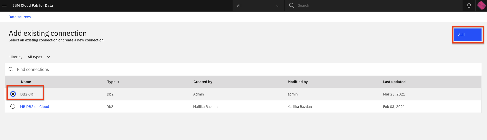
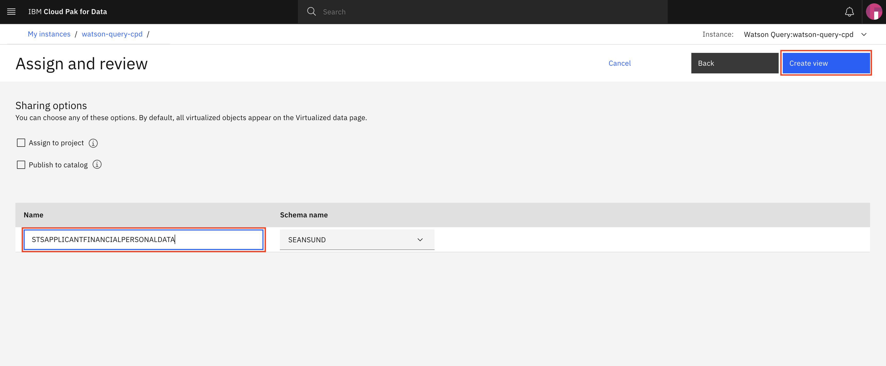
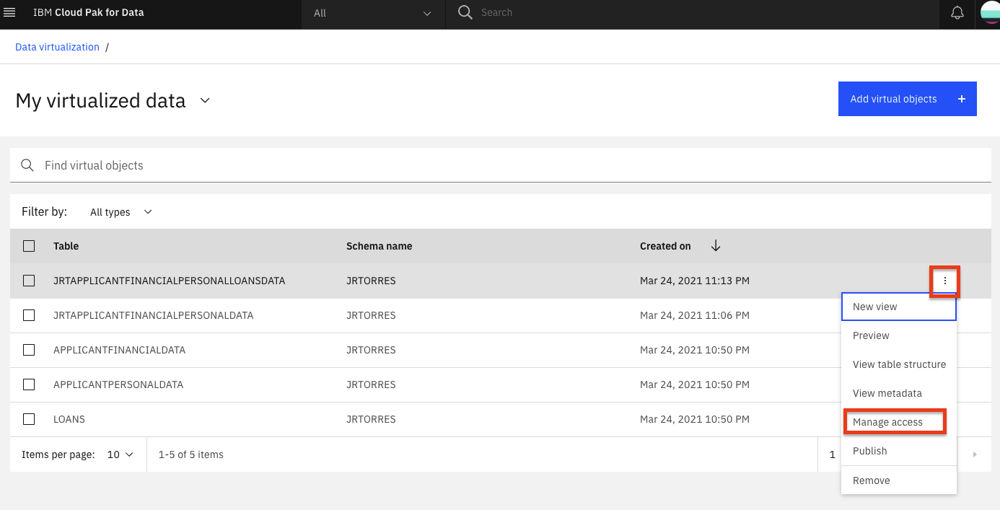

# Admin Guide - Data Virtualization Setup & Configuration

If you are including the data virtualization module in the workshop, there are several steps to provision and configure data virtualization (DV).

* [Provisioning Data Virtualiation (DV).](#provision-data-virtualization)
* [Add Users to DV.](#add-dv-users-and-roles)
* [Add Database Connection to DV.](#add-dv-users-and-roles)

## Provision Data Virtualization

* From the upper-left (☰) hamburger menu click `Services` and then click on the `Instances` option.

* From the list of instances, locate the Data Virtualization service, click the action menu (3 vertical dots) and select `Provision instance`.

* In the 'Configure service' -> 'Start' page, enable the checkbox for automatic semaphore configuration and click the *`Next`* button.

  

* In the 'Configure service' -> 'Nodes' page, leave the default single node and resource allocation and click the *`Next`* button.

  > _Note: Attempting to configure DV instance with greater than 64GB RAM has previously resulted in configuration errors.

  

* In the 'Configure service' -> 'Storage' page, you must choose *ibmc-file-gold-gid* as the storage class for both persistent and cache storage. Then click the *`Next`* button.

  

* In the 'Configure service' -> 'Summary' page, click the *`Configure`* button.

  

* The configuration process may take a while to complete.

## Add DV Users and Roles

We need to add the CP4D user accounts to Data Virtualization and also assign the "Engineer" role to the account, so attendees will have access to complete the DV labs. *Note: This is assuming you have already added users to the CPD platform from the prior section of the admin guide.*

* Launch the data virtualization tool to start the configuration process. Go the (☰) navigation menu and click `Data` -> `Data virtualization`.

  

* From the Data Virtualization sub-menu, Click on *User management* from the drop down list.

  

* Click on the *`Add user`* button.

  

* Click the checkbox next to the user records that need to be added (the accounts that will run the data virtualization lab) and ensure all users have the *Engineer* role. Then click the *`Add`* button.

  

## Add Connection to DV

With the data connections created in a previous section of the admin guide, we next add the connections as data sources that can be used in data virtualization.

* Launch the data virtualization tool to start the configuration process. Go the (☰) navigation menu and click `Data` -> `Data virtualization`.

  

* From the Data Virtualization sub-menu, Click on `Virtualization` -> *`Data Sources`* from the drop down list.

* Click the *`Add data source`* button on the top right and select the `Select existing connection` option.

  

* Select the data source we made in the previous section of the admin guide, and click the *`Next`* button.

  

* Select the `Skip` button on the "Add to a remote connector (optional)" page.

  

* The new connection will be added and listed as a data source for data virtualization.

* Repeat the process if you have any other connections in the workshop.

## Virtualizing Data

In this section, we will run through the data virtualization portion of the workshop to create virtualized table views and joined table views. We will store these views in an `INSTRUCTOR` schema and share them with all Data Virtualization users. This is done as a backup in case there are any unexpected issues with any of the data sources.

* Run through the [Virtualize Data section of the data virtualization lab](../data-connection-and-virtualization/README.md). Note that before running through the lab, you are only running through the first section  (`Virtualize Data`, not assign `Grant Access to Virtualized Data`) and there are two key changes that you need to make from the lab instructions:

  * When you virtualize the tables in the lab, enter `INSTRUCTOR` as the schema instead of accepting the default schema name (i.e USERXXXX).

    

  * When you are joining virtual objects, specify `INSTRUCTOR` as the schema instead of accepting the default schema name (i.e USERXXXX).

    

### Grant Access to all Users

In order for all workshop participants to have access to the data that you just virtualized, you need to grant them access so its visible to them. **ONLY FOLLOW THESE STEPS ONCE YOU DETERMINE YOU NEED TO MAKE THE VIRTUALIZED DATA ACCESSIBLE (I.E. IF THE USERS ENCOUNTER ISSUES DURING THE WORKSHOP).**

* Go to *Data Virtualization* option from the (☰) menu. Click on `Menu` -> `My virtualized data`.

* Click on the virtualized data you've created, then click the 3 horizontal dots `...` to the right of one, and choose `Manage access`:

  

* Click the `All data virtualization users` radio button and then the `Continue` button in the dialog window.

__THIS SECTION IS COMPLETE, GO BACK AND CONTINUE WITH THE [ADMIN GUIDE](./README.md)__
