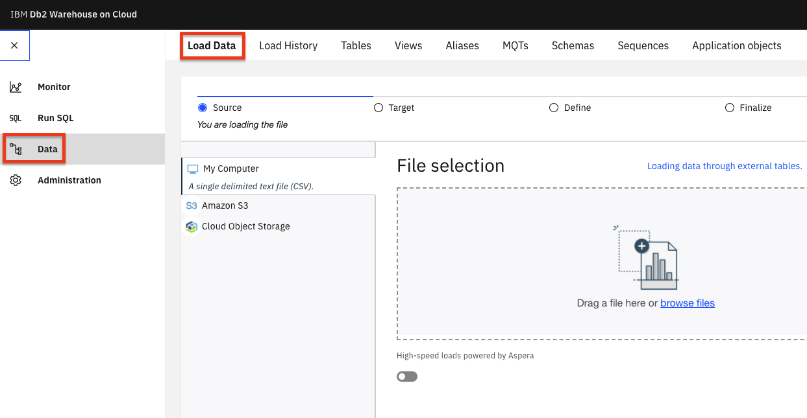
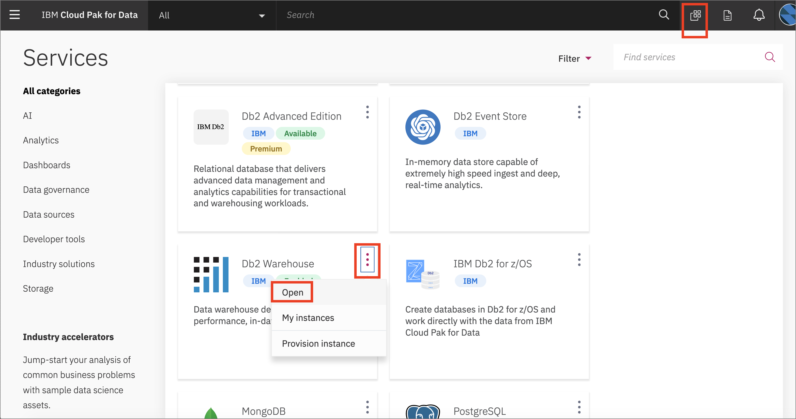
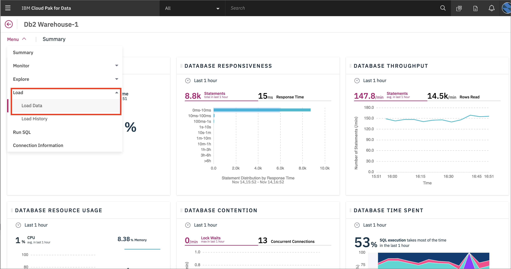
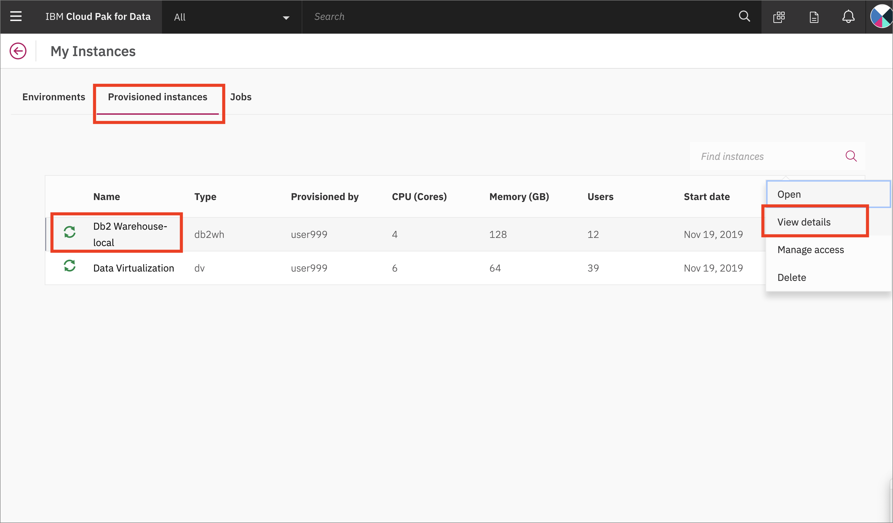
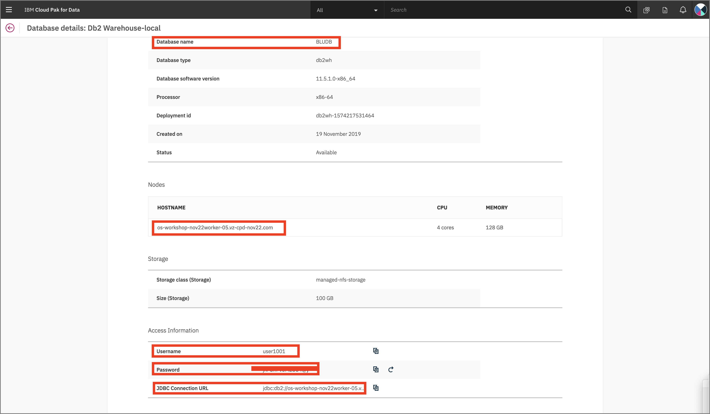
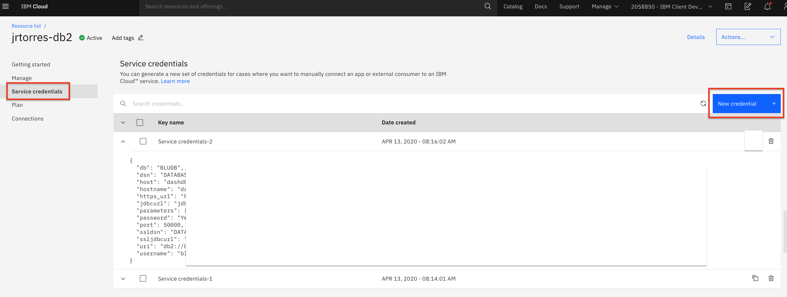

# Admin Guide - Setup and Configure Data Sources

The workshop simulates the real world data connection process by having data reside on one or more data sources which are then added as connection in Cloud Pak for Data. This workshop is using databases as the data sources, loaded with content from a couple of CSV files. Before delivering the workshop, you will need to set up the databases and then load them with data that will be consumed by participants. There are several deployment options available in this scenario:

* Local: Provision / use the database instances directly inside of Cloud Pak for Data.
* Remote: Provision / use the database instances externally on an IBM Cloud account.

The deployment selected will be based on the workshop and client requirements, CP4D cluster size, etc. For most workshops, it is suggested to deploy databases remotely in order to conserve resources on the CP4D cluser. Configure the databases we use in this workshop:

1. [DB2 Warehouse](#create-and-load-db2-warehouse-instance)
1. [DB2 Server](#create-db2-instance)

## Create and Load DB2 Warehouse Instance

You only need to create one DB2 Warehouse instance, follow the instructions for either the Remote (cloud) instance **OR** the local instance below.

### Remote DB2WhoC Instance

#### Provision and Connection Details

* Assuming you are logged in to an IBM Cloud account. Provision an instance of [DB2 Warehouse on IBM Cloud from the catalog.](https://cloud.ibm.com/catalog/services/db2-warehouse).

* Once the service is provisioned, Go to `Service Credentials` and click `New credential +`. Open `View credentials` and copy the credentials (this is your connection details) for use later.

   

#### Load Data

* Now go to `Manage` and click `Open Console`:

   

* From the upper-left (☰) hamburger menu click `Load` -> `Load data`:

   

* Choose `Browse file` and navigate to where you cloned this repository, then to `data/split/` and choose `applicant_financial_data.csv`, then click `Next`.

* Click `+ New Schema` and name it `CP4DCREDIT`.

* With the new schema selected, click `+ New table`. Under "New Table Name" type "APPLICANTFINANCIALDATA" and click `Create`, then `Next`. Accept the defaults and click `Next`. Click `Begin Load`.

* Repeat the data load steps for the `applicant_personal_data.csv` file, naming the table `APPLICANTPERSONALDATA`.

* Repeat the data load steps for the `applicant_loan_data.csv` file, naming the table `LOANS`.

#### Get SSL Certificate

* You will need an SSL certificate for Cloud Pak for Data to use the IBM Cloud DB2 Warehouse instance.

* In the DB2 Warehouse console, from the upper-left (☰) hamburger menu click `Connection Info` -> `Connection Information`. Then click `Download SSL Certificate`:

   

* You'll need to convert the SSL certificate from `.crt` to a `.pem` file using [openssl](https://www.openssl.org/). Run the following command:

  ```bash
  openssl x509 -in DigiCertGlobalRootCA.crt -out DigiCertGlobalRootCA.pem -outform PEM -inform DER
  ```

* Save this file for later use.

### Local DB2WhoC Instance

These instructions are for loading the data into the local CP4D version of DB2 Warehouse. Again, you do not need to run both the remote and local instances.

* You will need to already have done the `Provision instance` for DB2 Warehouse.

* Got to `Services` and click on `DB2 Warehouse` and click `Open`:

   

* Under `Menu` choose `Load` and `Load Data`:

   

* Choose `Browse file` and navigate to where you cloned this repository, then to `data/split/` and choose `applicant_financial_data.csv`, then click `Next`.

* Click `+ New Schema` and name it `CP4DCREDIT`.

* With the new schema selected, click `+ New table`. Under "New Table Name" type "APPLICANTFINANCIALDATA" and click `Create`, then `Next`. Accept the defaults and click `Next`. Click `Begin Load`.

* Repeat the data load steps for the `applicant_personal_data.csv` file, naming the table `APPLICANTPERSONALDATA`.

* Repeat the data load steps for the `applicant_loan_data.csv` file, naming the table `LOANS`.

#### Get local connection info

* To get the connection info for you local DB2 Warehouse, go to the (☰) menu and click on the *My Instances* option.

* In *My instances* go to the *Provisioned instances* tab. Highlight you local DB2 Warehouse and click the 3 vertical dots on the far right, and then click `View Details`:

  

* Either keep this window open in a separate tab, or copy the required Connection info: *Host*, *Port*, *Database name*, *Username*, and *Password*. You can get the port from the *JDBC Connection URL*, i.e for the URL `jdbc:db2://os-workshop-nov22worker-05.cpd-nov22.com:30290/BLUDB` the port is the number after the colin in the URL `30290`:

  

## Create DB2 Instance

If you are running the OpenScale Lab, you will need a DB2 Server instance (DB2 Warehouse is not supported but there are other databases that can be used in place of DB2). The DB2 instance can be local on CP4D or remote.

### Remote DB2 Instance

* Assuming you are logged in to an IBM Cloud account. Provision an instance of [DB2 Server from the catalog.](https://cloud.ibm.com/catalog/services/db2).

* Once the service is provisioned, Go to `Service Credentials` and click `New credential +`. Open `View credentials` and copy the credentials for use later.

  

__THIS SECTION IS COMPLETE, GO BACK AND CONTINUE WITH THE [ADMIN GUIDE](./README.md)__
