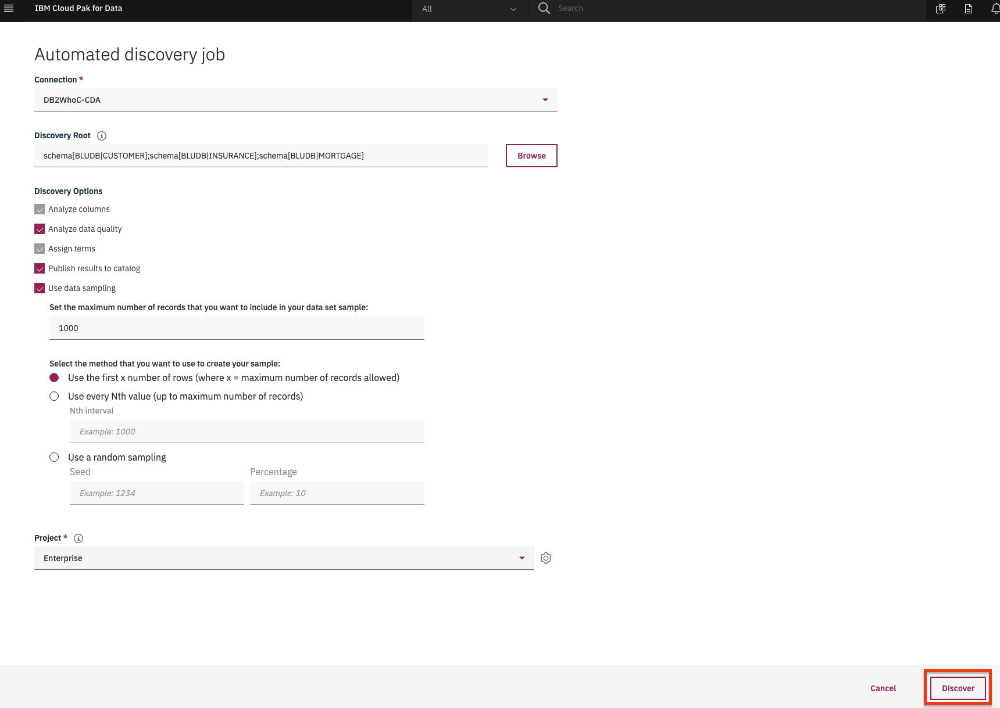
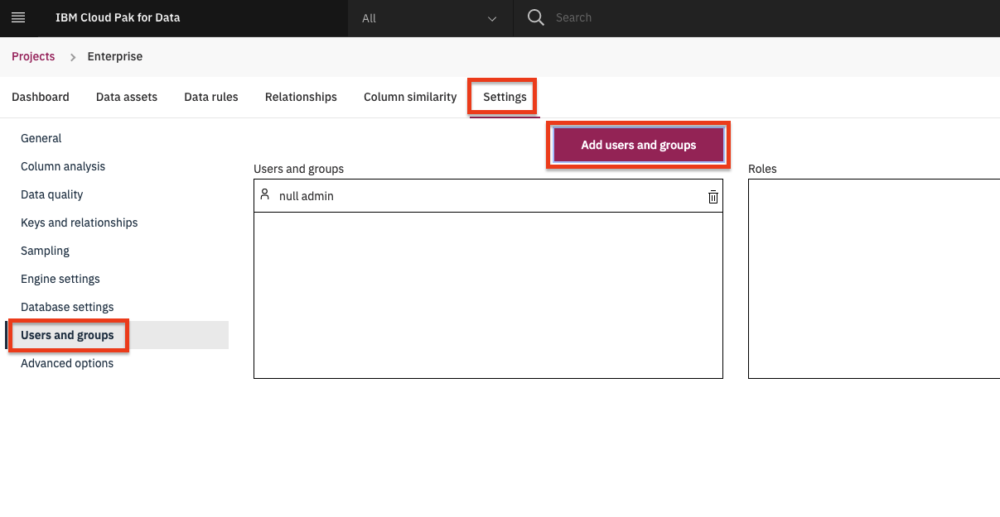
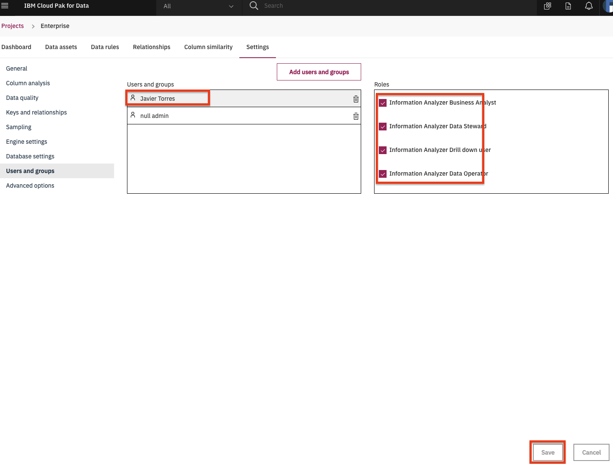

# Admin Guide - Watson Knowledge Catalog Setup

## WKC for Users Setup

* See the separate instructions to [setup WKC Enterprise Catalog](./wkc-setup-readme.md)

### Setup Data Discovery

* Go to `Organize` -> `Curation` -> `Data discovery`. Click on `New Discovery job` -> `Automated discovery`.

* Under `Connection` select your DB connection (i.e. 'Analytics Data Warehouse').

  > *Note: Discovery may have issues/errors discovering assets from a connection in the catalog. If that is the case, select the `Add connection` option to add the global database connection you set up previously.*

* Under `Discovery root` drill down and check `CUSTOMER`, `INSURANCE`, and `MORTGAGE`.

  > *Note: If you experience issues using the drill down, enter the following root: `schema[BLUDB|CUSTOMER];schema[BLUDB|INSURANCE];schema[BLUDB|MORTGAGE]`*

* Click all the options and choose `1000` for max number of records to scan.

* Under `Project`: click the `Add project` option. In the `Create Project` pop up window, enter `Enterprise` as the name and click the `Create` button.

* Click the `Discover` button.

  >*Note: This may take a while to run. Refresh the page to make sure its finished.*

* When the discovery is complete, you will need to add users to the the data quality project. Go the (☰) navigation menu and click on the *Projects* link and then click on `Enterprise` data quality project.

* Click on the `Settings` tab, then on the `Users and groups` option from the left navigation panel. Click on the `Add users and groups` button.

* Search for the user ids of the participants, then click the checkbox next to the user you want to add and click the `Add` button.

* Click the user you just added and ensure they have the appropriate roles.

**As indicated in the catalog setup section, all workshop attendess will need to be added to the Enterprise catalog as an Editor and added to the Enterprise Catalog Data project as an Editor. They will not be able to view the Data Flow as a Viewer.**

## WKC for Admins Setup

* To run the [WKC for admins](../watson-knowledge-catalog/README.md) module, the users will need CPD cluster admin role.

__THIS SECTION IS COMPLETE, GO BACK AND CONTINUE WITH THE [ADMIN GUIDE](./README.md)__
