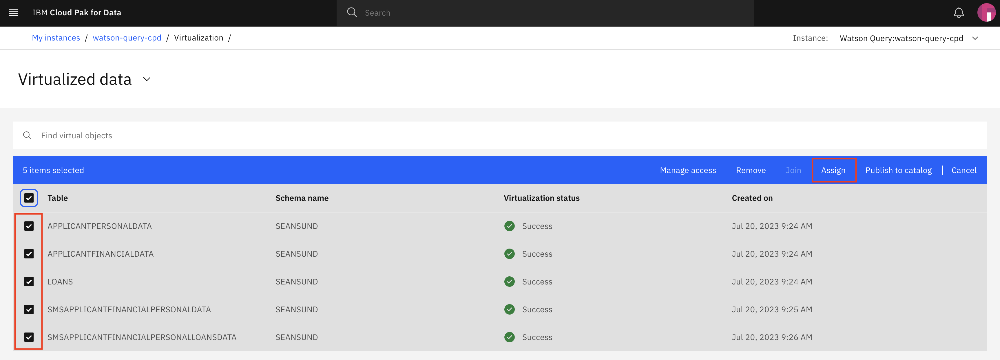
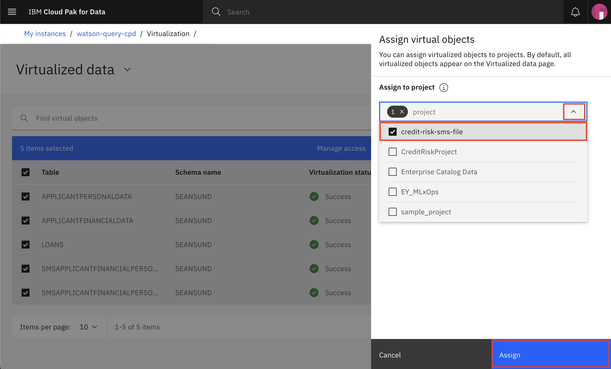
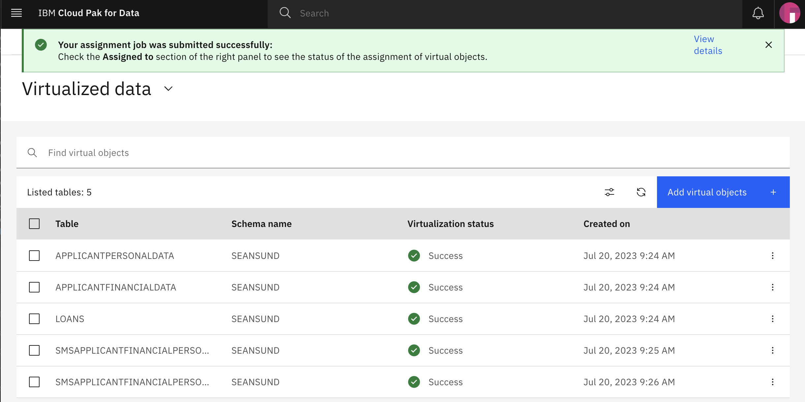

# Importing data in your projects

There are many ways to bring your data into your project, in this section we'll cover using from the following data sources:

* Using virtualized data

>*Note: The lab instructions below assume you have your project already available. If not, follow the instructions in the pre-work section to create a project.*

## Importing Virtualized Data

For this section we'll explore the data that is available from the virtualized views that have been created in Data Virtualization. This data may come from various data sources or tables within a single source, but will appear as a single data asset. We will add this data to an analytics project so that it can be used in subsequent modules of this workshop (i.e for data analysis and to build ML models).

### Assign the data to your project

* To launch the data virtualization tool, go the (☰) navigation menu and under the *`Data`* section click on `Data virtualization`.

* From the data virtualization sub-menu at the top left of the page, click on the menu drop down list and choose *`My virtualized data`*. Here you should see the data you have virtualized or that you have been given access to (or that the administrator has assigned to you).

* Select the checkbox next to the data sets you want to use in your project and click the *`Assign`* button to start importing it to your project.

> _Note: The name of the data assets to select may vary based on names chosen during data virtualization. The default names to select are: LOANS, APPLICANTFINANCIALDATA, APPLICANTPERSONALDATA, XXXAPPLICANTFINANCIALPERSONALDATA AND XXXAPPLICANTFINANCIALPERSONALLOANDATA_

* In the 'Assign virtual objects' panel, choose your project(s) from the drop-down list. Then click the *`Assign`* button to add the data to your project.

* Once completed, you will receive a confirmation notification at the top of the page.

* Go to your project by selecting the (☰) navigation menu and under the *`Projects`* section click on `All projects`.

* Click on the name of the project where the data was assigned in the previous step to open it.

* In the project page, clicking on the `Assets` tab will show the virtualized tables and joined tables that are now in your project (along with other assets that are in the project).

 **Do not go to the next section until you see the data assets in your project.**

## Conclusion

This lab shows just one of the ways to gather data for your analytics projects in Cloud Pak for Data. In this case you used data that was previously virtualized. Other ways might include: 
- browsing the catalogs
- importing flat files
- importing data from connections directly in the project
