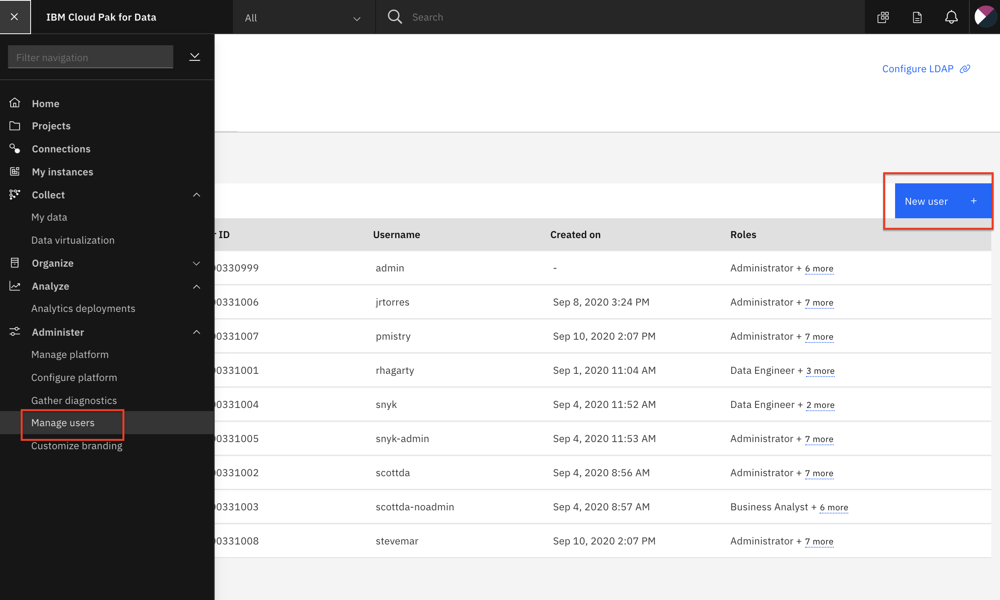

# Admin Guide - Cloud Pak for Data Environment Configuration

* [Provisioning Data Virtualiation.](#provision-data-virtualization)
* [Adding user accounts to cluster.](#add-cluster-user-accounts)
* [Adding users to data virtualization.](#add-dv-users-and-roles)

## Provision Data Virtualization

* Go to the `Services` tab. Under `Data sources` choose the `Data Virtualization` tile. Click the 3 vertical dots and choose `Deploy`.

* Follow the instructions to deploy Data Virtualization.

   > For deployment using Managed OpenShift you must do the following:
  IMPORTANT: Do NOT check the box for automatic semaphore configuration
  IMPORTANT: Do NOT choose the defaults for storage. You must choose *ibmc-file-gold-gid* as the storage class

## Add Cluster User Accounts

* Go the (☰) menu and click manage the `Administer` section followed by `Manage Users`. add user.

* There are two approaches that can be followed for adding user accounts that participants will use:

   1. If you are pre-creating user accounts for participants. Click on the `New user` option. Fill in the account details using a pattern (i.e user100, user101, user102, etc). Ensure you select the Roles necessary for the modules that will be executed at the workshop (at minimum: `Developer`, `Data Scientist`, `Data Steward`, and `Data Engineer`)
   1. If you the attendees are creating / requesting an account on their own from the CP4D login page. When you arrive at the `Manage Users` page, the requested accounts will be displayed. For each new account, click the edit icon (i.e pencil): assign the necessary roles and change the `Account Status` to approved. Click the `Save` button.

   

## Add DV Users and Roles

We need to add the CP4D user accounts to Data Virtualization, so attendees will have access and also assign the "Steward" role to the account.

* Go to *Data Virtualization* option from the menu. 

* Click on *User management*

* Click on *Add user* and ensure all users have the *Steward* role.

