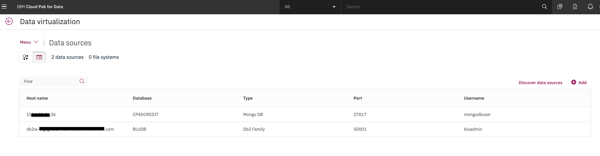

# Admin Guide

This section covers the setup and configuration of the Cloud Pak for Data cluster as well as supporting services necessary for the workshop. This involves the following steps:

1. [Configure Cloud Pak for Data](#cloud-pak-for-data-environment-configuration)
1. [Create Data Sources](#database-setup)
1. [Configure Data Connections](#database-configuration)
1. [Setup Data Virtualization](#data-virtualization-configuration)
1. [Setup Watson Knowledge Catalog](#watson-knowledge-catalog-setup)

> **NOTE**: Parts of this section requires the user running it to have `Admin` user access to the Cloud Pak for Data cluster.

## Cloud Pak for Data Environment Configuration

There are a couple of steps to configure services and setup the platform so users can access the environment. This covers:

* Provisioning Data Virtualiation.
* Adding user accounts to cluster.
* Adding users to data virtualization.

Run through the instructions in the [Platform Configuration Readme](PlatformConfiguration.md)

## Database Setup

The workshop uses data stored in several data sources, these databases need to be installed and setup prior to the workshop. This involves:

* Provisioning databases.
* Loading data.
* Gathering connection information.

Run through the instructions in the [Database Configuration Readme](DatasourceConfiguration.md)

## Database Configuration

For Cloud Pak for Data to access our data sources (Db2 Warehouse, MongoDB, etd), we need to add *Data Connections* to connect to them via JDBC to Cloud Pak for Data.

### Add DB2 Warehouse Connection

* To add a new data source, go to the (☰) menu and click on the *Connections* option.

  

* At the overview, click *Add connection*.

  

* Start by giving your new *Connection* a name and select *Db2 Warehouse on Cloud* as your connection type. More fields should apper. Fill the new fields with the same credentials for your own Db2 Warehouse connection from the previous section .

* Click the check box for `Use SSL`. Next click `Select file` and navigate to where you converted the SSL certificate for DB2 Warehouse form a `.crt` file to a `.pem` file (probably called DigiCertGlobalRootCA.pem).

* Click `Test Connection` and, after that succeeds, click `Add`.

  

* The new connection will be listed in the overview.

  

### Add MongoDB Connection

* To add a new data source, go to the (☰) menu and click on the *Connections* option.

  

* At the overview, click *Add connection*.

  

* Start by giving your new *Connection* a name and select *Mongo* as your connection type. More fields should apper. Fill the new fields with the credentials you saved for the MongoDB connection from the previous section.

  

* Click Save. The new connection will be listed in the overview.

## Data Virtualization Configuration

With the data connections created, we next add them as data sources that can be used in data virtualization.

* To launch the data virtualization tool, go the (☰) menu and click `Collect` and then `Data Virtualization`.

  

* At the empty overview, click *Add* and choose *Add data source*. If you do not get to the `Data Sources` page. Click the `Menu` under 'Data virtualization' and selct `Data Sources`.

  

* Select the data source we made in the previous step, and click *Next*.

  

* The new connection will be listed as a data source for data virtualization.

  

* Repeat the process to add the mongoDB instance.

  

### Virtualizing Data

In this section, we will run through the data virtualization lab to create virtualized table views and joined table views. We will store these views in an `INSTRUCTOR` schema and share them with all Data Virtualization users. This is done as a backup in case there are any unexpected issues with any of the data sources.

* Run through the [Virtualize Data section of the data virtualization lab](../data-connection-and-virtualization/README.md). Note that before running through the lab, you are only running through the first section  (`Virtualize Data`, not assign `Grant Access to Virtualized Data`) and there are two key changes that you need to make from the lab instructions:

  * When you virtualize the tables in the lab, specify `INSTRUCTOR` as the schema instead of accepting the default schema name (i.e USERXXXX).

    

  * When you are joining virtual objects, specify `INSTRUCTOR` as the schema instead of accepting the default schema name (i.e USERXXXX).

    

### Grant Access to all Users

In order for all workshop participants to have access to the data that you just virtualized, you need to grant them access. Follow these steps to make your Virtualized data visible to them.

* Go to *Data Virtualization* option from the (☰) menu. Click on `Menu` -> `My virtualized data`.

* Click on the virtualized data you've created, then click the 3 horizontal dots `...` to the right of one, and choose `Manage access`:

  

* Click the `All data virtualization users` radio button and then the `Continue` button in the dialog window.

## Watson Knowledge Catalog Setup

### Setup the Enterprise catalog

* Unzip [CP4dExperienceOrganizeArtifacts.zip](../../data/wkc/CP4dExperienceOrganizeArtifacts.zip)

* Perform the steps in `Organize-Experience-Runbook.docx` to setup the WKC Enterprise catalog.

* Go to `Organize` -> `Data discovery` then click `Workspaces` and `Add workspace`. Name it *Enterprise*.

* In your `Enterprise` Data discovery workspace, go to `Settings` -> `Users and groups` and add the CPD cluster users (your workshop attendees).

### Setup Data Discovery

* In `Data discovery` click on `New Discovery job` -> `Quick scan`.

* Under `Select a connection` click your DB connection.

* Under `Discovery root` drill down and check `CUSTOMER`, `INSURANCE`, and `MORTGAGE`.

* Click all the options and choose `1000` for max number of records to scan.

* Under `Select a workspace` choose `Enterprise`.

* click the `Discover` button.

### WKC for admins

* To run the [WKC for admins](../watson-knowledge-catalog/README.md) module, the users will need CPD cluster admin role.
