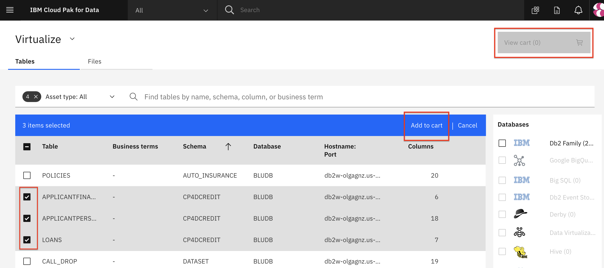
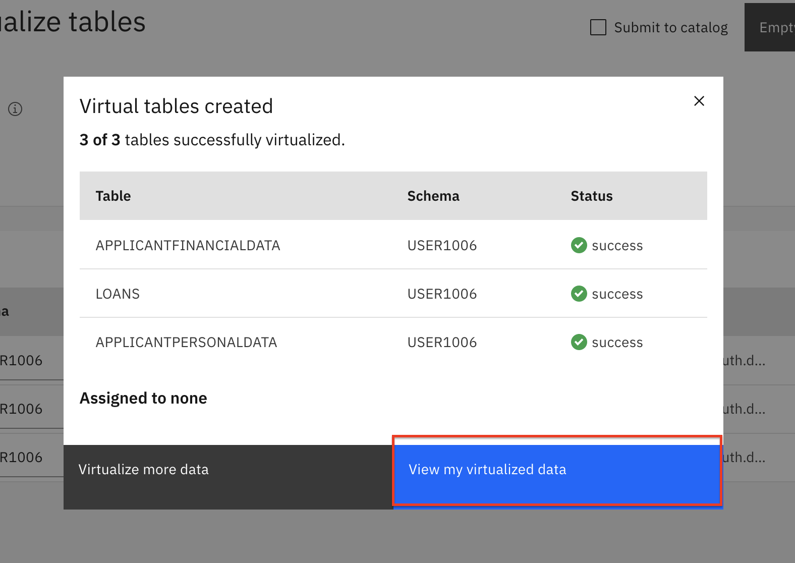

# Admin guide

This section covers the setup and configuration of the Cloud Pak for Data cluster as well as supporting services necessary for the workshop. This involves the following steps:

1. [Configure Cloud Pak for Data](#cloud-pak-for-data-environment-configuration)
1. [Create Data Sources](#cloud-pak-for-data-environment-configuration)
1. [Configure Data Connections](#cloud-pak-for-data-environment-configuration)
1. [Setup Data Virtualization](#cloud-pak-for-data-environment-configuration)

> **NOTE**: Parts of this section requires the user running it to have `Admin` user access to the Cloud Pak for Data cluster.

## Cloud Pak for Data Environment Configuration

There are a couple of steps to configure services and setup the platform so users can access the environment. This covers:

* Provisioning Data Virtualiation.
* Adding user accounts to cluster.
* Adding users to data virtualization.

Run through the instructions in the [Platform Configuration Readme](PlatformConfiguration.md)

## Database Setup

The workshop uses data stored in several data sources, these databases need to be installed and setup prior to the workshop. This involves:

* Provisioning databases.
* Loading data.
* Gathering connection information.

Run through the instructions in the [Database Configuration Readme](DatabaseConfiguration.md)

## Database Configuration

For Cloud Pak for Data to access our data sources (Db2 Warehouse, MongoDB, etd), we need to add a new *Data Source* to connect them via JDBC to Cloud Pak for Data. 

## Data Virtualization Configuration

To launch the data virtualization tool, go the (☰) menu and click `Collect` and then `Data Virtualization`.

At the empty overview, click *Add* and choose *Add data source*.

Select the data source we made in the previous step, and click *Next*.

The new connection will be listed as a data source for data virtualization.

### Start virtualizing data

In this section, since we now have access to the Db2 Warehouse data, we can virtualize the data to our Cloud Pak for Data project. Click on the *Menu* button and choose *Virtualize*.

Several tables will appear (many are created as sample data when a Db2 Warehouse instance is provisioned) in the table. Find the tables you created earlier, the instructions suggested naming them: `FINANCIAL`, `PERSONAL`, and `NONFIN`. Once selected click on *Add to cart* and then on *View Cart*.
You can search for the Schema `NULLIDRA` and they should show up:

The next panel prompts the user to choose which project to assign the data to, choose the project you created in the previous exercise. Click *Virtualize* to start the process.

You'll be notified that the virtual tables have been created! Let's see the new virtualized data from the Data Virtualization tool by clicking *View my data*.

### Join the virtualized data

Now we're going to **join** the tables we created so we have a merged set of data. It will be easier to do it here rather than in a notebook where we'd have to write code to handle three different data sets. Click on any two tables (`PERSONAL` and `FINANCIAL` for instance) and click the *Join view* button.

To join the tables we need to pick a key that is common to both data sets. Here we choose to map `customerID` from the first table to `customerID` on the second table. Do this by clicking on one and dragging it to another. When the line is drawn click on *Join*.

In the next panel we'll give our joined data a name, I chose `FINANCIALPERSONAL`, then review the joined table to ensure all columns are present and only one `customerID` column exists. Click *Next* to continue.

Next we choose which project to assign the joined view to, choose the project you created in the previous exercise. Click *Create view* to start the process.

You'll be notified that the join has succeeded! Click on *View my data*. to repeat this again so we have all three tables.

**IMPORTANT** Repeat the same steps as above, but this time choose to join the new joined view (`FINANCIALPERSONAL`) and the last virtualized table (`NONFIN`), to create a new joined view that has all three tables, let's call it `FINANCIALPERSONALNONFIN`. Switching to our project should show all three virtualized tables, and two joined tables. Do not go to the next section until this step is performed.

## Watson Knowledge Catalog setup

### Setup the Enterprise catalog

* Unzip [CP4dExperienceOrganizeArtifacts.zip](../../data/wkc/CP4dExperienceOrganizeArtifacts.zip)

* Perform the steps in `Organize-Experience-Runbook.docx` to setup the WKC Enterprise catalog.

* Go to `Organize` -> `Data discovery` then click `Workspaces` and `Add workspace`. Name it *Enterprise*.

* In your `Enterprise` Data discovery workspace, go to `Settings` -> `Users and groups` and add the CPD cluster users (your workshop attendees).

### Setup Data Discovery

* In `Data discovery` click on `New Discovery job` -> `Quick scan`.

* Under `Select a connection` click your DB connection.

* Under `Discovery root` drill down and check `CUSTOMER`, `INSURANCE`, and `MORTGAGE`.

* Click all the options and choose `1000` for max number of records to scan.

* Under `Select a workspace` choose `Enterprise`.

* click the `Discover` button.

### WKC for admins

* To run the [WKC for admins](../watson-knowledge-catalog/README.md) module, the users will need CPD cluster admin role.
