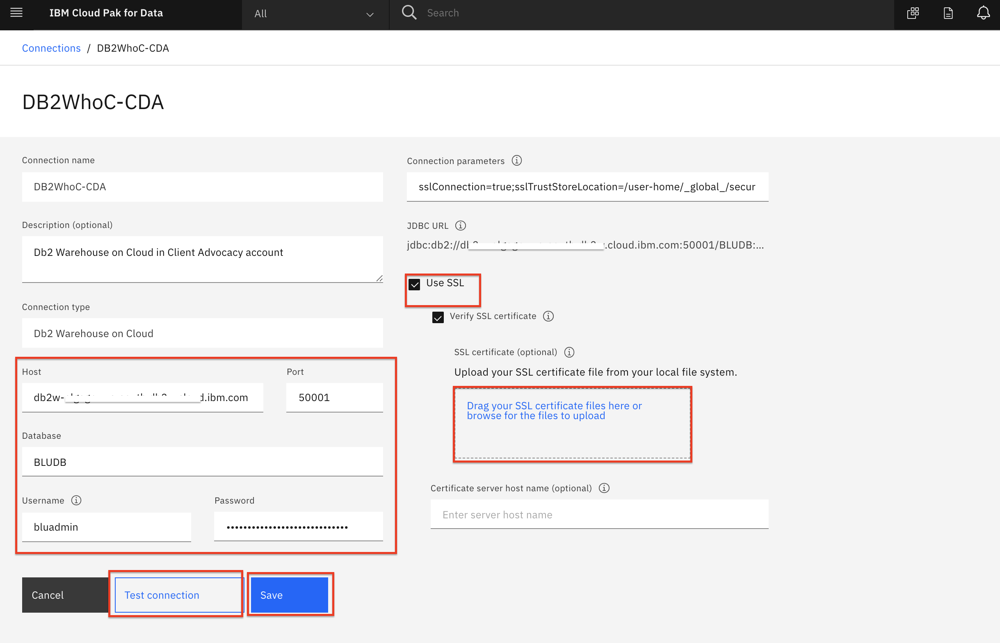

# Admin Guide - Database Connection Configuration

For Cloud Pak for Data to access our data sources (Db2 Warehouse, MongoDB, etd), we need to add *Data Connections* to connect to them via JDBC to Cloud Pak for Data.

## Add DB2 Warehouse Connection

* To add a new data source, go to the (☰) navigation menu and click on the *Connections* option.

  

* At the overview, click the *`New connection`* button.

  

* Start by giving your new *Connection* a name and select *Db2 Warehouse on Cloud* as your connection type. More fields should apper.

* Enter the Host, Port, Database, Username and Password values for the connection (*Note: these are the values you saved when you provisioned the instance*).

* Click the check box for `Use SSL`. Next click `Select file` and navigate to where you converted the SSL certificate for DB2 Warehouse from a `.crt` file to a `.pem` file (probably called DigiCertGlobalRootCA.pem).

* Once you have entered all the conneciton information, you must first click the `Test Connection` button and after that succeeds, click on the *`Save`* button.

  

* The new connection will be listed in the overview.

__THIS SECTION IS COMPLETE, GO BACK AND CONTINUE WITH THE [ADMIN GUIDE](./README.md)__
