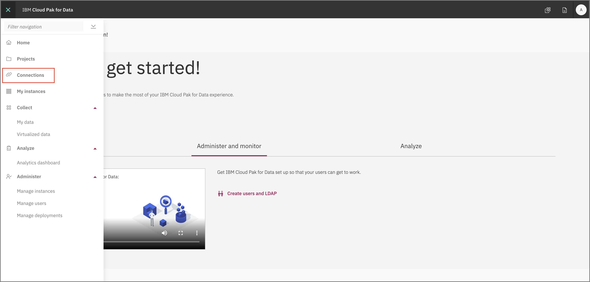
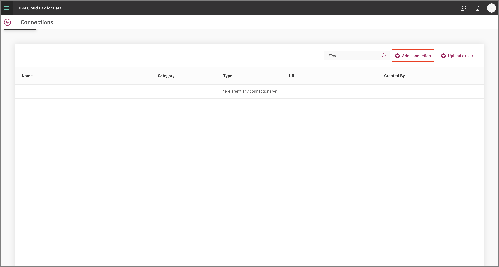
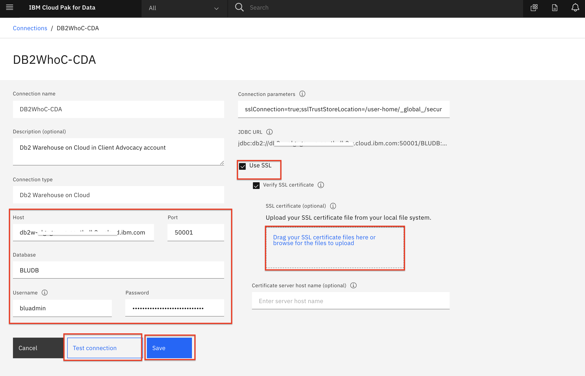
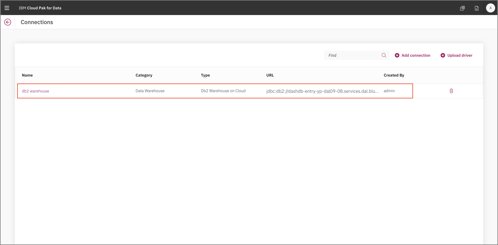

# Admin Guide - Database Connection Configuration

For Cloud Pak for Data to access our data sources (Db2 Warehouse, MongoDB, etd), we need to add *Data Connections* to connect to them via JDBC to Cloud Pak for Data.

## Add DB2 Warehouse Connection

* To add a new data source, go to the (☰) menu and click on the *Connections* option.

  

* At the overview, click *Add connection*.

  

* Start by giving your new *Connection* a name and select *Db2 Warehouse on Cloud* as your connection type. More fields should apper. Fill the new fields with the same credentials for your own Db2 Warehouse connection from the previous section .

* Click the check box for `Use SSL`. Next click `Select file` and navigate to where you converted the SSL certificate for DB2 Warehouse form a `.crt` file to a `.pem` file (probably called DigiCertGlobalRootCA.pem).

* Click `Test Connection` and, after that succeeds, click `Add`.

  

* The new connection will be listed in the overview.

  

### Add MongoDB Connection

* To add a new data source, go to the (☰) menu and click on the *Connections* option.

  

* At the overview, click *Add connection*.

  

* Start by giving your new *Connection* a name and select *Mongo* as your connection type. More fields should apper. Fill the new fields with the credentials you saved for the MongoDB connection from the previous section.

  

* Click Save. The new connection will be listed in the overview.