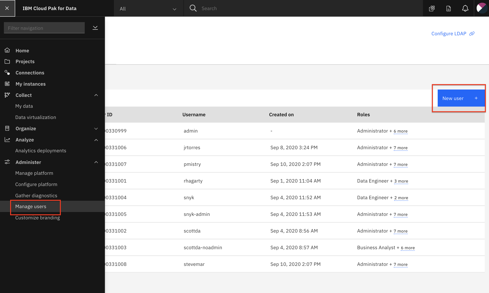

# Admin Guide - Cloud Pak for Data Environment Configuration

* [Adding user accounts to cluster.](#add-cluster-user-accounts)

## Add Cluster User Accounts

* Go the (☰) menu and under manage the `Administer` section, click on the `Manage Users` option from the menu. Then click on the *`New user`* button on the top right.

* Fill in the account details using a pattern (i.e user100, user101, user102, etc). Ensure you select the Roles necessary for the modules that will be executed at the workshop (at minimum: `Developer`, `Data Scientist`, `Data Steward`, and `Data Engineer`). Click the `Save` button.

* Repeat the above step to create as many user accounts as necessary for the workshop.

> *Note: The above user creation is being automated and this section will be updated in the future.*

__THIS SECTION IS COMPLETE, GO BACK AND CONTINUE WITH THE ADMIN GUIDE__
