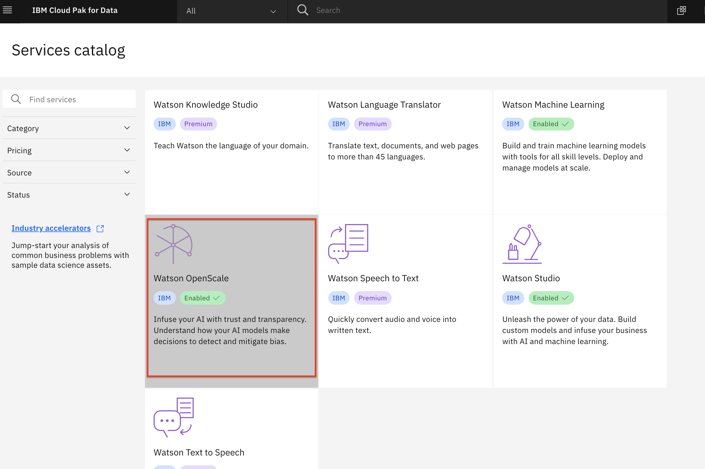

# Admin Guide - Watson OpenScale Configuration

For the Watson OpenScale modules in the workshop, we need to run through the fastpath configuration that will deploy the sample model, configure openscale to monitor that sample model, and load some historical data.

* In the Cloud Pak for Data instance, click on the `Services` icon.

  

* Find and click on the `Watson OpenScale` tile.

  

* Launch the OpenScale UI tooling by clicking on the *`Launch`* button

  

* Since this is the first time we are launching OpenScale, you will be presented with a welcome message, where we can launch the auto setup process. Click on the *`Auto setup`* button.

  

* In the 'Connect to Watson Machine Learning' panel, leave the defaults since we are using the WML instance deployed in the same cluster. Click on the *`Next`* button.

  

* In the 'Connect to your database' panel, enter the connection details for your database (this is the database you provisioned in a previous section of the admin guide). Click on the *`Next`* button.

  

>*Note: If you used a DB2 Warehouse on Cloud, you will need to select the 'Use SSL' checkbox but dont need to provide a certificate.*

* The fast path auto setup of a model will take some time to run.

  

* Once it completes, you will see a message if it succeded.

  

* Click through the insights dashboard for the deployed models to make sure the pages load.

__THIS SECTION IS COMPLETE, GO BACK AND CONTINUE WITH THE [ADMIN GUIDE](./README.md)__
