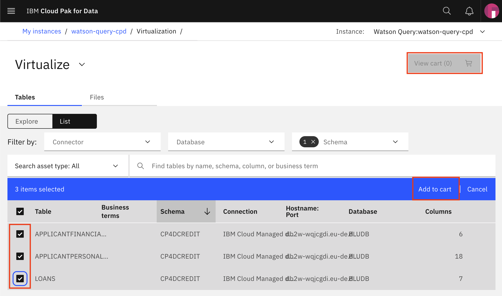
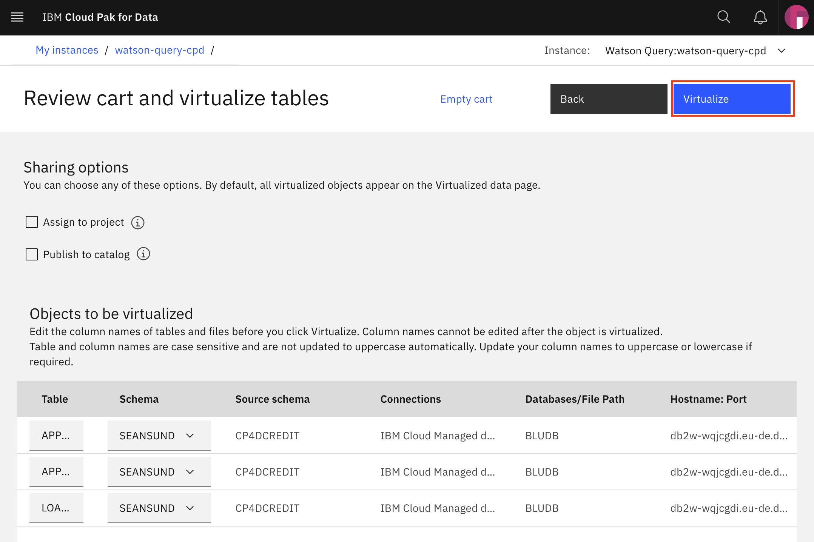
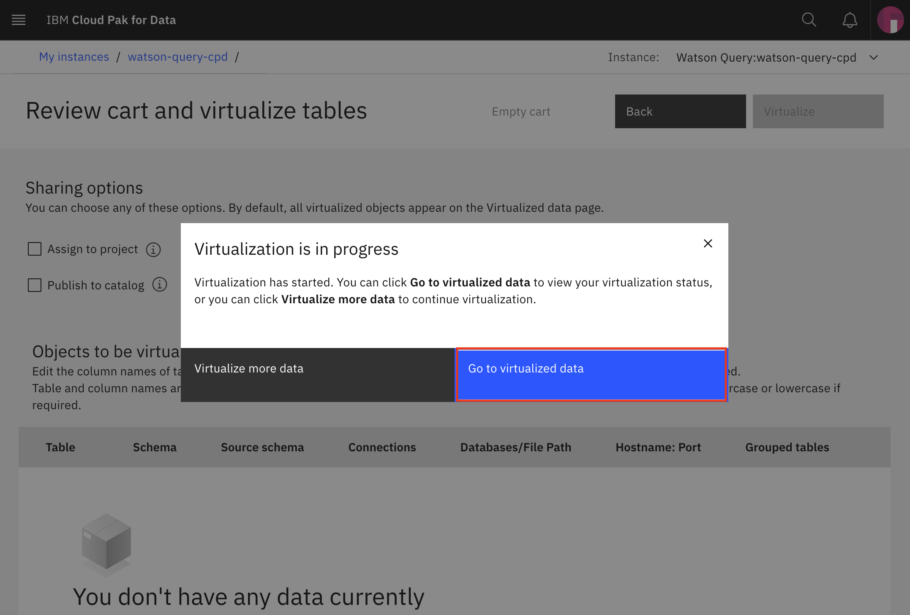
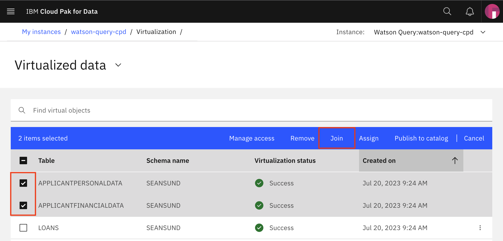
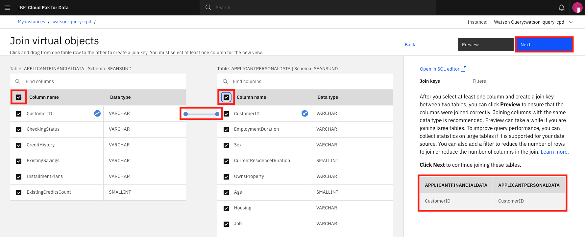
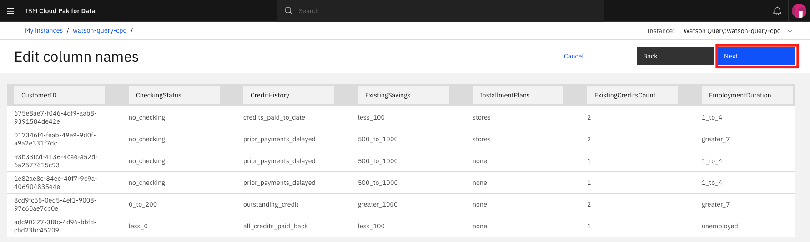
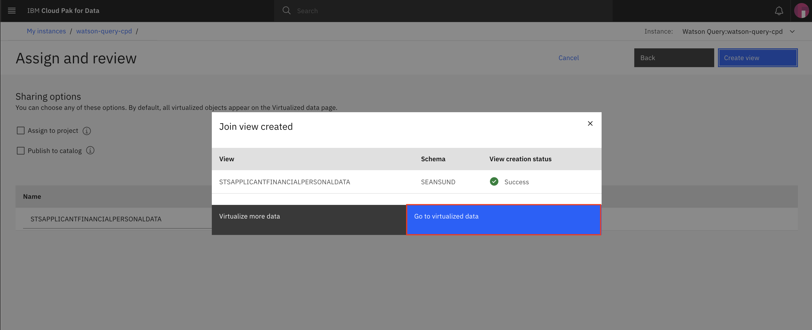
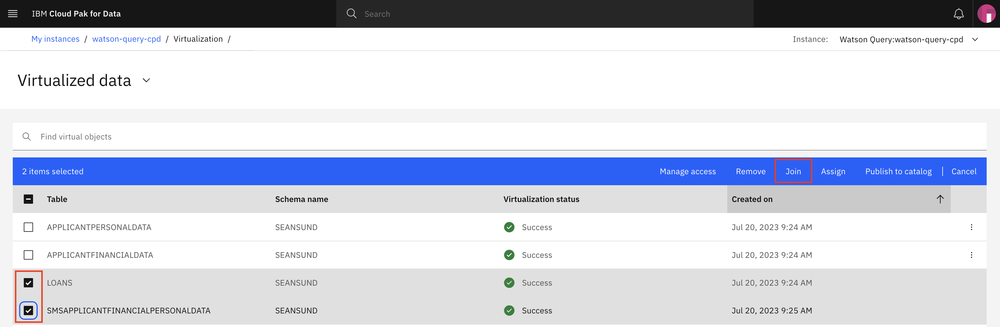
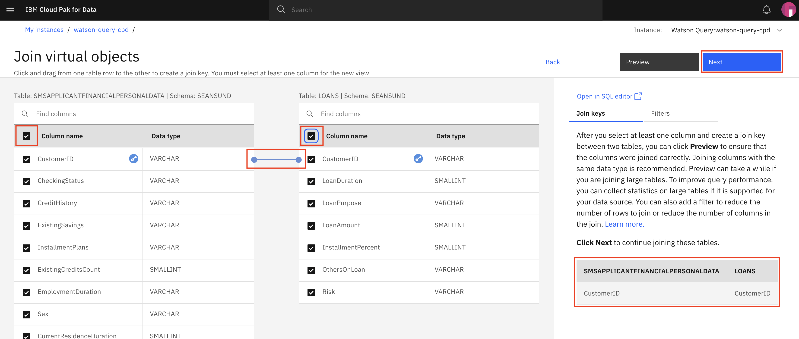
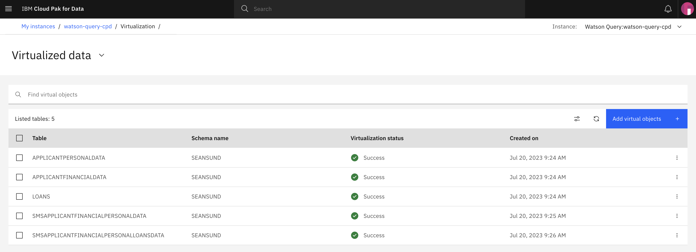

# Data Connection and Virtualization

This section will cover aspects of collecting data in Cloud Pak for Data. Specifically we will be connecting to different data sources and creating views against those data sources to create a single unified set of data assets that can be used in other modules of this workshop.

> **Note: To complete this section, an Admin or Data Engineer role needs to be assigned to your user account. The workshop instructor will assign this role as appropriate.**

## Virtualizing Data

In this section, we will gather data from several tables across data sources. We will use data virtualization to access these tables and then create joined views against those virtualized tables.

### Create Virtualized Tables

* To launch the data virtualization tool, go the (☰) navigation menu and under the *`Data`* section click on `Data virtualization`.

* From the Data virtualization sub-menu at the top left of the page, click on the menu drop down list and choose *`Virtualize`*.

* Change from the **`Explore`** view to the **`List`** view to see all the available tables across the different data sources.

* Several tables names will be displayed across any of the data sources that are included in the data virtualization server. You will notice that on the top of the panel, we can filter the tables being displayed by selecting the database type.

* To simplify the search for tables you will use, we will filter the list to one schema. Click on the *`Schema`* dropdown and select the **`CP4DCREDIT`** schema. click on the `Schemas` column header to sort the tables by Schema. 

* Three tables should be displayed: `APPLICANTFINANCIALDATA`, `APPLICANTPERSONALDATA` and `LOANS`. Select the checkboxes next to these three tables, and then click on *`Add to cart`* followed by the *`View Cart`* button.

* The next panel prompts you to select where to assign the virtualized tables. Click the *`Virtualize`* button to add the virtualized tables to your data (we left the default values, so the tables will be virtualized under your own user schema with the same table names as the original tables).

* A pop up dialog panel will indicate that the virtual tables have been created. Let's see the new virtualized tables by clicking the *`Go to virtualized data`* button.

> *Note: You may receive a notification at the top of the page that the virtual assets were published to the catalog. Feel free to dismiss the notification by clicking on the `X`*

### Create Joined Virtual Views

Now we're going to **join** the tables we previously virtualized, so we have a final merged set of data. It will be easier to do it here rather than in a notebook where we'd have to write code to handle three different data sets.

* Open the 'Virtualized data' page by clicking on the dropdown arrow and selecting **`Virtualized data`**. (You may already be there if you selected *`Go to virtualized data`* in the previous step.)

* From the 'Virtualized data' page, click on two of the virtualized tables (`APPLICANTPERSONALDATA` and `APPLICANTFINANCIALDATA`) and click the *`Join`* button.

* Click the checkboxes at the top of each table to select all columns for the join. Next, to join the tables we need to pick a key that is common to both data sets. Here we choose to map `CustomerID` from the first table to `CustomerID` on the second table. Do this by clicking on one and dragging it to another. When the line is drawn, click on the *`Next`* button.

> *Note: The blue line between the joined columns may disappear. The 'Join keys' view on the right-hand side should still contain the join definition, even if the line disappears.*

* In the next panel, although we could change the names of our columns, we will accept the existing names for our columns. Click the *`Next`* button to continue.

* In the next panel we'll give our joined data view a unique name (to be consistent with SQL standards, pick an all uppercase name), choose something like: `XXXAPPLICANTFINANCIALPERSONALDATA` (where `XXX` is your initials in *all upper case*) then click the *`Create view`* button to add the virtualized aggregate view to your data.

* A pop up dialog panel will indicate that the join view creation has succeeded! Click on *`Go to virutalized data`* button.

* Repeat the same steps as above, but this time choose to join the new joined view you just created (`XXXAPPLICANTFINANCIALPERSONALDATA`) and the last virtualized table (`LOANS`) to create a new joined view that has all three tables. Click the *`Join`* button.

* Again check the two checkboxes at the top of each table definition to select all the columns for the join. Also, define the join columns by mapping the `CustomerID` from the first table to `CustomerID` on the second table. Do this by clicking on one and dragging it to another. When the line is drawn, click on the *`Next`* button.

> *Note: The blue line between the joined columns may disappear. The 'Join keys' view on the right-hand side should still contain the join definition, even if the line disappears.*

* In the next panel, although we could change the names of our columns, we will accept the existing names for our columns. Click the *`Next`* button to continue.

* In the next panel we'll give our joined data view a unique name (to be consistent with SQL standards, pick an all uppercase name), choose someething like: `XXXAPPLICANTFINANCIALPERSONALLOANSDATA` (where `XXX` is your initials in *all upper case*). Click the *`Create view`* button to add the virtualized aggregate view to your data.

* A pop up dialog panel will indicate that the join view creation has succeeded! Click on *`Go to virtualized data`* button.

* From the `Virtualized data` page you should now see all three virtualized tables and two joined tables. Do not go to the next section until you have all the tables.

## Conclusion

In this section we learned how to make connection to databases that contain our data, how to virtualize them, and how to use the virtualized data.

Remember that you can add data from different databases and servers if you need to. Moreover, you can virtualize the data from different sources together as well! The goal is to take care of bringing the data to the platform early on so all the data scientists can use that data while you keep full control of who has access to what data.
