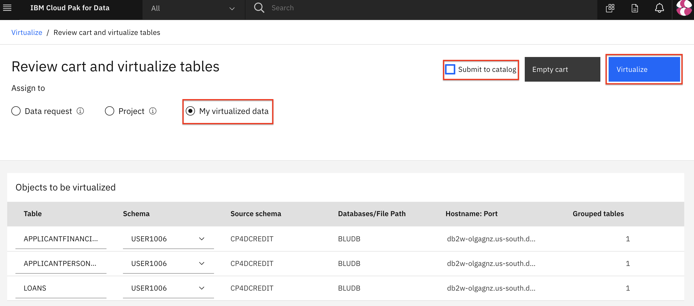
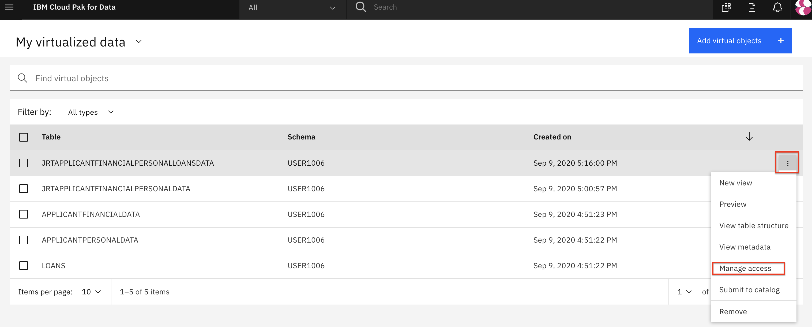

# Data Connection and Virtualization

This section will cover aspects of collecting data in Cloud Pak for Data. Specifically we will be connecting to different data sources and creating views against those data sources to create a single unified set of data assets that can be used in other modules of this workshop.

> **Note: To complete this section, an Admin or Data Engineer role needs to be assigned to your user account. The workshop instructor will assign this role as appropriate.**

The section is broken up into the following steps:

1. [Virtualize Data](#virtualize-data)
1. [Grant Access to Virtualized Data](#grant-access-to-virtualized-data)

## Virtualizing Data

In this section, we will gather data from several tables across a couple of different data sources. We will use data virtualization to access these tables and then create joins against those tables.

* To launch the data virtualization tool, go the (☰) menu and click `Collect` and then `Data Virtualization`.

* From the Data virtualization sub-menu, Click on the *Menu* drop down list and choose *Virtualize*.

* Several tables names will be displayed across any of the data sources that are included in the data virtualization server. You will notice that on the left panel, we have tables being displayed from two main sources: (1) A DB2 database and (2) A MongoDB database.

* To simplify the search for tables you will use, click on the `Schemas` column header to sort the tables by Schema. Then find the tables we will be using for this workshop: `APPLICANTFINANCIALDATA`, `APPLICANTPERSONALDATA` and `LOANS`. Select the checkboxes next to these three tables, and then click on *Add to cart* followed by the *View Cart* button.

* The next panel prompts the user to select where to assign the virtualized tables. Select the `My virtualized data` radio button. If there is a `Submit to catalog` checkbox on the top right, unselect it and finally click the *Virtualize* button to add the virtualized tables to your data.

* You'll be notified that the virtual tables have been created. Let's see the new virtualized tables from the Data Virtualization tool by clicking *View my virtualized data* button.

### Join the virtualized data

Now we're going to **join** the tables we previously virtualized, so we have a final merged set of data. It will be easier to do it here rather than in a notebook where we'd have to write code to handle three different data sets.

* Click on two of the virtualized tables (`APPLICANTPERSONALDATA` and `APPLICANTFINANCIALDATA` for instance) and click the *Join view* button.

* To join the tables we need to pick a key that is common to both data sets. Here we choose to map `CUSTOMERID` from the first table to `CUSTOMERID` on the second table. Do this by clicking on one and dragging it to another. When the line is drawn click on *Join*.

* In the next panel we'll give our joined data a unique name (to be consistent with SQL standards, pick an all uppercase name), I chose `XXXAPPLICANTFINANCIALPERSONALDATA` (where `XXX` is my *All Upper Case* user ID), then review the joined table to ensure all columns are present and only one `CUSTOMERID` column exists. Click *Next* to continue.

* In the next screen we choose where to assign the joined view we created, select the `My virtualized data` radio button. If there is a `Submit to catalog` checkbox on the top right, unselect it and finally click the *`Create view`* button to add the virtualized aggregate table to your data.

* You'll be notified that the join view creation has succeeded! Click on *View my virutalized data* button.

* Repeat the same steps as above, but this time choose to join the new joined view (`XXXAPPLICANTFINANCIALPERSONALDATA`) and the last virtualized table (`LOANS`), to create a new joined view that has all three tables. Click the `Join view` button.

* To join the tables we need to pick a key that is common to both data sets. Again, choose to map `CUSTOMERID` from the first table to `CUSTOMERID` on the second table. Do this by clicking on one and dragging it to another. This time, also deselect the `ID` column from the `LOAN` table. Click on the *Join* button.

* As before, on the next panel we'll give our joined data a unique name (to be consistent with SQL standards, pick an all uppercase name), for example `XXXAPPLICANTFINANCIALPERSONALDATALOANS` (where `XXX` is my *All Upper Case* user ID), then review the joined table to ensure all columns are present and only one `CUSTOMERID` column exists. Click *Next* to continue.

* On the next screen we choose where to assign the joined view we created, select the `My virtualized data` radio button. If there is a `Submit to catalog` checkbox on the top right, unselect it and finally click the *`Create view`* button to add the virtualized aggregate table to your data.

* You'll be notified that the join view creation has succeeded! Click on *View my virutalized data* button.

* From the `My virtualized data` page you should now see all three virtualized tables, and two joined tables. Do not go to the next section until you have all the tables.

## 2. Grant access to the virtualized data

>*Note: This section only needs to be completed if there are non-Admin or non-Data Engineer users you are working in a group with. The instructors would have indicated that it needs to be completed to give those users access to the data you have virtualized above.*

In order for other users to have access to the data that you just virtualized, you need to grant them access. Follow these steps to make your Virtualized data visible to them.

Go to *Data Virtualization* option from the (☰) menu. Click on `Menu` -> `My virtualized data`.

Click on the virtualized data you've created, then click the 3 horizontal dots `...` to the right of one, and choose `Manage access`:

Click the `Specific users` button and click `+ grant access`:

Select the users you wish to grant access to and click `Add`:

## Conclusion

In this section we learned how to make connection to databases that contain our data, how to virtualize them, and how to allow other to collaborate with us and use the virtualized data.

Remember that you can add data from different databases and servers if you need to. Moreover, you can virtualized these data from different sources together as well! The goal is to take care of bringing the data to the platform early on so all the data scientists can use it without reinventing the wheel while you keep full control of who has access to what data.
