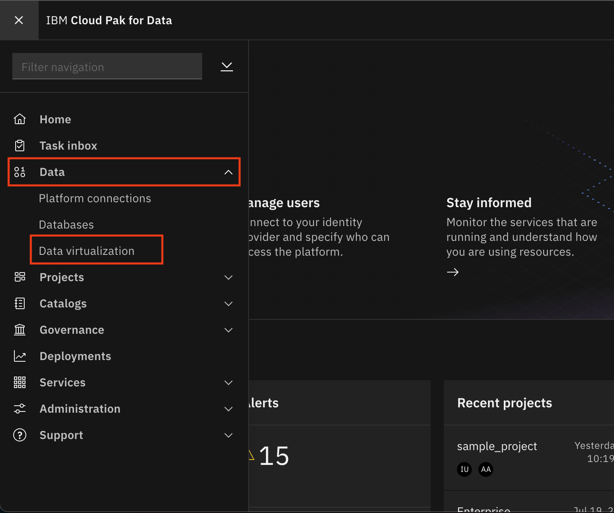

# Grant Access to Virtualized Data

This section will continue exploring aspects of collecting data on Cloud Pak for Data. Specifically, there will be scenarios where a platform user (i.e a Data Engineer) will want to make data available to other users of the platform. This can be for any number of reasons. For this workshop, we will assume the scenario that one set of users know/understand the underlying data sources and will be responsible for creating virtualized views of the data needed. While a broader set of users will need to access the data (to assess, refine, etc). In this lab, we will make the data (views/tables/joins) that was virtualized in the `Data Virtualization` module, available to other users. In order for other users to have access to the data, you need to grant them access.

> **Note: This section only needs to be completed if there are non-Admin or non-Data Engineer users you are working in a group with. The instructors would have indicated that it needs to be completed to give those users access to the data you have virtualized above.**

## Grant access to the virtualized data

* To launch the data virtualization tool, go the (☰) navigation menu and under the *`Data`* section click on `Data virtualization`.

* From the Data virtualization sub-menu at the top left of the page, click on the menu drop down list and choose *`My virtualized data`*.

* For one of the virtualized data assets you've created, click the 3 vertical dots on the right and choose `Manage access`.

* Click the `Specific users` button and click the `Add user` button.

* In the popup dialog window, click the checkbox next to the user (or multiple users) you wish to grant access to and then click the `Add users` button.

* Repeat the above steps to give access to the remaining virtualized tables and views (all five that you created).

## Conclusion

In this section we learned how to allow users to collaborate and make use of virtualized data, without needing to go through the virtualization process themselves.
