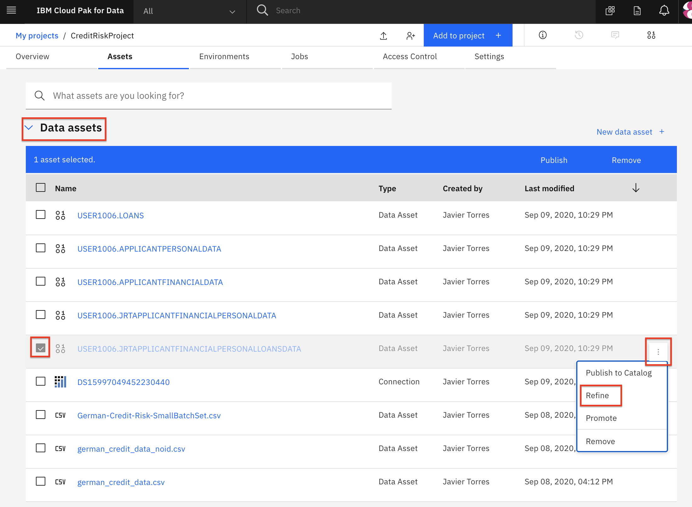
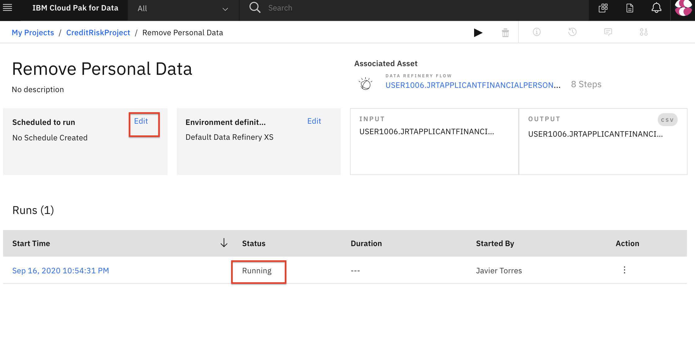
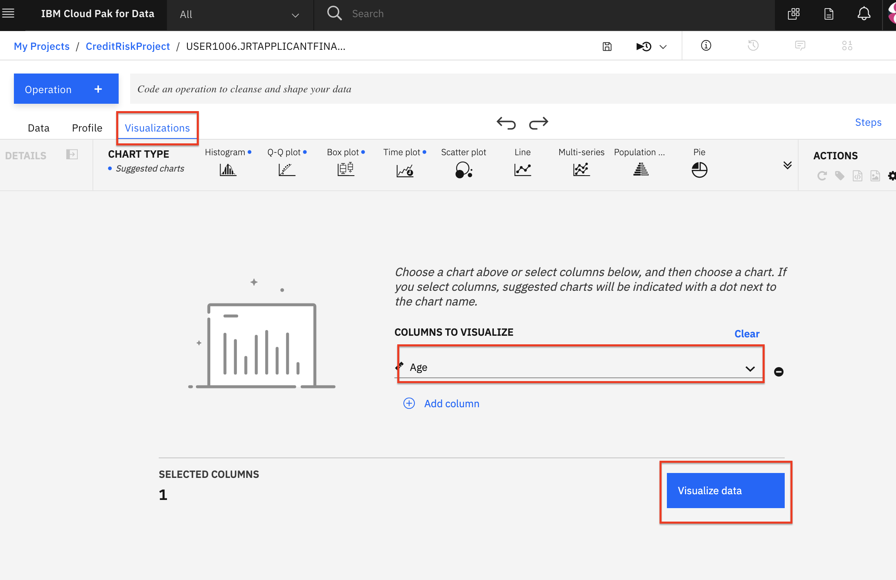
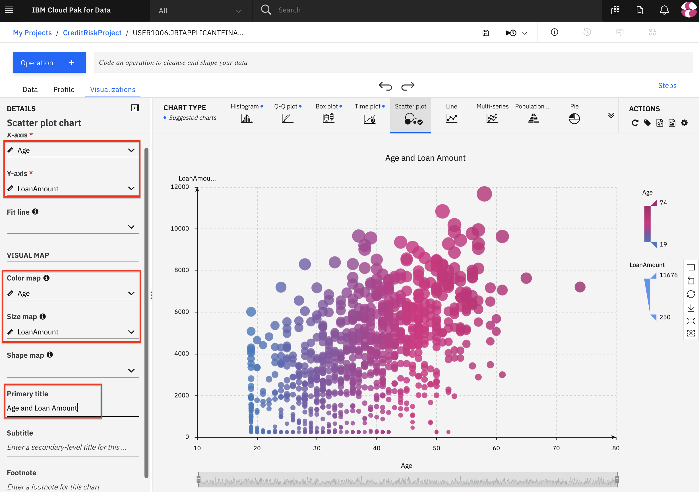

# Data Visualization and Data Refinery

Let's take a quick detour to the *Data Refinery* tool. Data Refinery can quickly filter and mutate data, create quick visualizations, and do other data cleansing tasks from an easy to use user interface.

This section is broken up into the following steps:

1. [Load the *XXXAPPLICANTFINANCIALPERSONALLOAN* data table into data refinery](#1-load-the-xxxapplicantfinancialpersonalloan-data-table-into-data-refinery)
1. [Refine your data](#2-refine-your-data)
1. [Use Data Flow steps to keep track of your work](#3-use-data-flow-steps-to-keep-track-of-your-work)
1. [Schedule jobs](#4-schedule-jobs)
1. [Profile the data](#5-profile-the-data)
1. [Visualize with charts and graphs](#6-visualize-with-charts-and-graphs)

## 1. Load the *XXXAPPLICANTFINANCIALPERSONALLOAN* data table into data refinery

* From the *Project* home, under the *Assets* tab, click on the *Data assets* arrow to toggle it and open up the list of data assets. Click the box next to *XXXAPPLICANTFINANCIALPERSONALLOAN* (where `XXX` is your username or the username of the person who granted you data access) to check it, and click the 3 dots to the right, and then *Refine* :

Data Refinery should launch and open the data like the image below:

* Click the `X` by the *Details* button to close it.

## 2. Refine your data

We'll start out in the *Data* tab.

### Transform your sample data set by entering R code in the command line or selecting operations from the menu

* For example, type *filter* on the Command line and observe that autocomplete will give hints on the syntax and how to use the command:

* When you have completed a command, click Apply to apply the operation to your data set.

* Click the `+Operation` button:

* Let's use the `filter` operation to check some values. Click on `filter`:

* We want to make sure that there are no empty values, and there may to be some for the *StreetAddress* column, so let's fix that. Click on `filter` and choose the *StreetAddress* column from the drop down, then the Operator *Is empty*, then `Apply`:

If nothing shows up in this filter, it means that the 1000 rows we are previewing do not have any empty values for *StreetAddress*. On the other hand, we may see some empty values.

* Now, click on the counter-clockwise "back" arrow, to remove the filter. Alternately, we can just remove the filter under the *Steps*:

If the emtpy rows show up, you can remove them.

* Choose the Operation *Remove empty rows*, select the *StreetAddress* column, and click `Apply`:

Let's say we've decide that there are features (columns) that we don't want to use later in our Machine Learning model. We'll remove the `FirstName,LastName,Email,StreetAddress,City,State,PostalCode` columns.

* For each columnn to be removed, go to `Operation` -> `Remove` and choose the column. Click `Next` and then `Apply`. The columns will be removed.

### 3. Use Data Flow steps to keep track of your work

What if you need to show a non-technical person the steps you took? What if we do something we don't want?

As we saw in the last section, we keep track of the steps and we can even undo (or redo) an action using the circular arrows.

As you refine your data, IBM Data Refinery keeps track of the steps in your data flow. You can modify them and even select a step to return to a particular moment in your data’s transformation.

To see the steps in the data flow that you have performed, click the *Steps* button. The operations that you have performed on the data will be shown.

You can modify these steps in real time and save for future use.

### 4. Schedule jobs

Data Refinery allows you to run jobs at scheduled times, and save the output. In this way, you can regularly refine new data as it is updated.

* Click on the "jobs" icon and then `Save and create job`:

* Give the job a name and optional description. Note that you can `Edit` the steps in this Data Refinery flow at this time. Also, note the output name, which in this case is *USER1051.APPLICANTFINANCIALPERSONALLOAN_shaped.csv*. Click `Create and Run`:

The job will be listed as *Status* *Running* and then the *Status* will change to *Completed*. You can click `Edit` under *Scheduled to run*:

* Toggle the *Schedule to run* switch and choose a date and time. Then click `Done`:

### 5. Profile the data

* Back at the top level of our *USER1051.APPLICANTFINANCIALPERSONALLOAN*, clicking on the *Profile* tab will bring up a quick view of several histograms about the data.

You can get insight into the data from the histograms:

* The median age  of the applicants is 35, with the bulk under 49.

* About as many people had credits_paid_to_date as prior_payments_delayed. Few had no_credits.

*  The median was 3 years for duration at current residence. Range was 1-6 years.

### 6. Visualize with charts and graphs

* Choose the *Visualizations* tab to bring up an option to choose which columns to visualize. Under *Columns to Visualize* choose *Age* and click `Visualize data`:

We first see the data in a histogram by default. Looking at the distribution can give us insights. For example, there is a large bulk of applicants in the 18-20 year old range. Hover over that bar in the histogram and you can see that it is exactly 82 people in this sample data set.
The next histogram bar for 20-22 year olds is much smaller, with only 34 members in this cohort. These insights can help with finding gaps in our data, and aid in preventing bias and building a more accurate predictive model.

* You can choose other chart types. We'll pick `Scatter plot` next by clicking on it:

* In the scatter plot, choose *Age* for the x-axis and *LoanAmount* for the y-axis. Choose *Age* for the Color map and *LoanAmount* for the Size map. Give it a title and subtitle.

You can see an expected correlation between age and loan amount, with a nice graphic representation using color and size. Play around with the parameters, and feel free to choose other columns to visualize. You can also choose other Chart types.

Under the `Actions` panel, notice that you can perform tasks such as *Start over*, *Download chart details*, *Download chart image*, or set *Global visualization preferences* (_Note: Hover over the icons to see the names_).

* Click on the "gear" icon in the `Actions` panel:

We see that we can do things in the *Global visualization preferences* for *Titles*, *Tools*, *Theme*, and *Notifications*. Click on the `Theme` tab and update the color scheme to *Dark*. Then click the `Apply` button. Play around with various Themes and find one that you like.

Now the colors for all of our charts will reflect this.

### Conclusion

We've seen a small sampling of the power of Data Refinery on IBM Cloud Pak for Data. We saw how we can transform data using R code, at the command line, or using various Operations on the columns such as changing the data type, removing empty rows, or deleting the column altogether. We next saw that all the steps in our Data Flow are recorded, so we can remove steps, repeat them, or edit an individual step. We were able to quickly profiile the data, so see histograms and statistics for each column. And finally we created more in-depth Visualizations, creating a scatter plot mapping TotalCharges vs. MonthlyCharges, with the Churn results highlighted in color.
