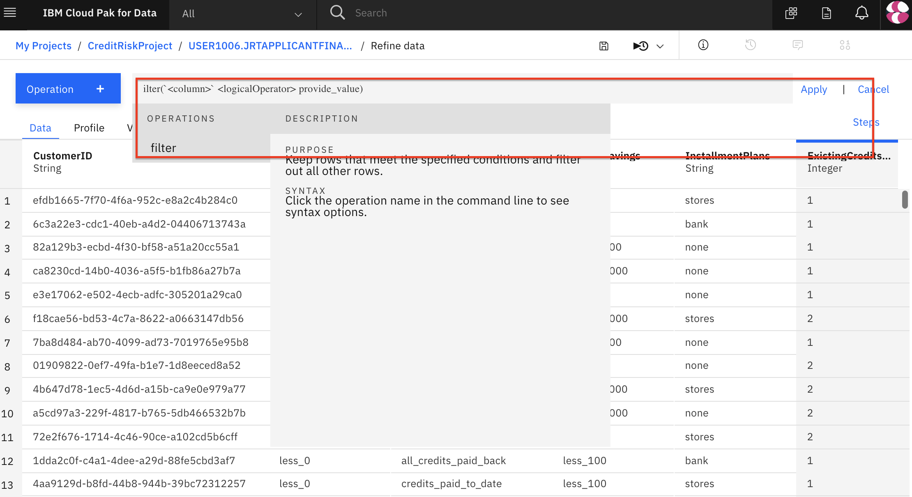
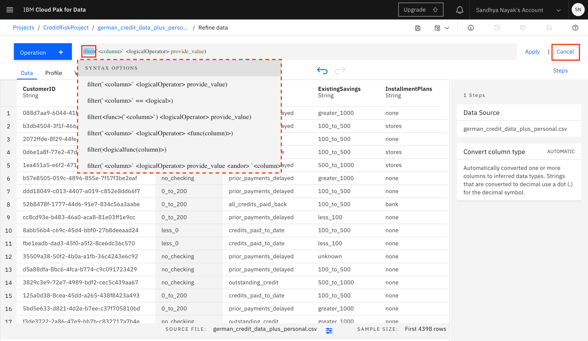
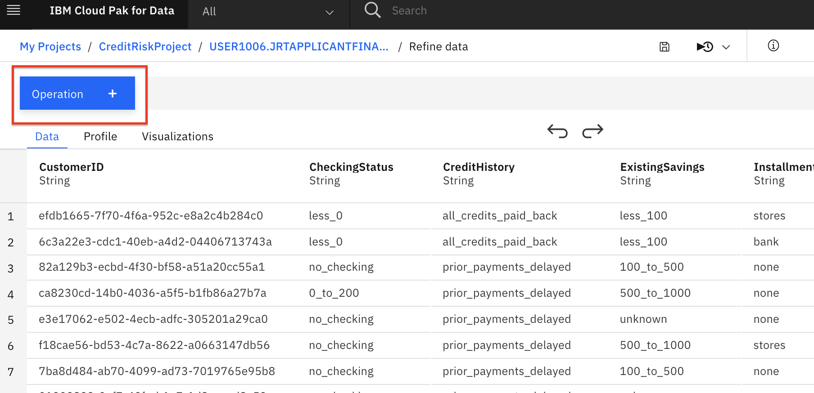
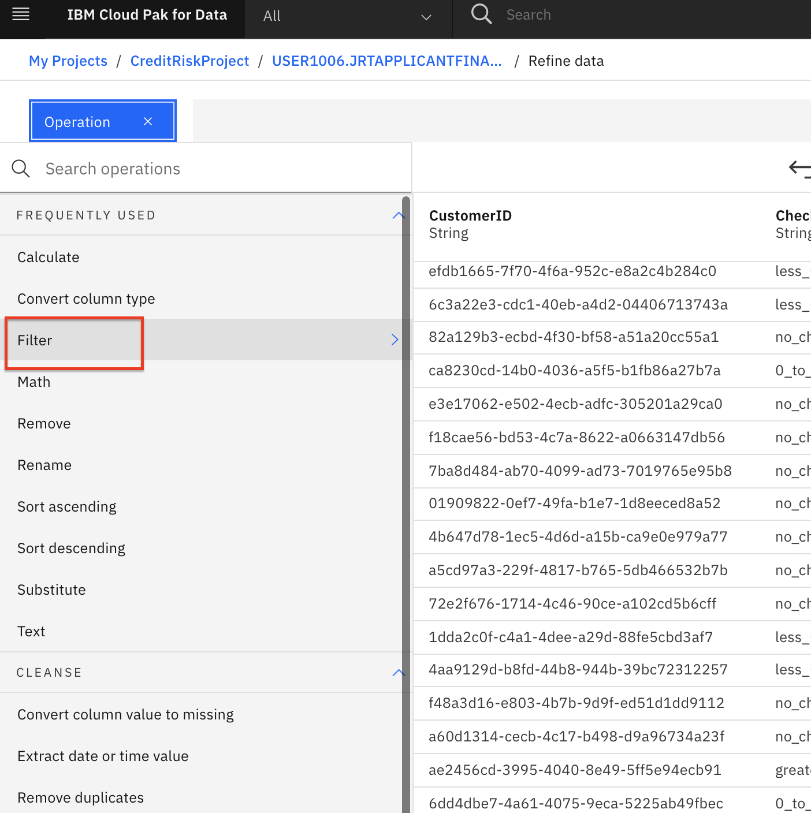
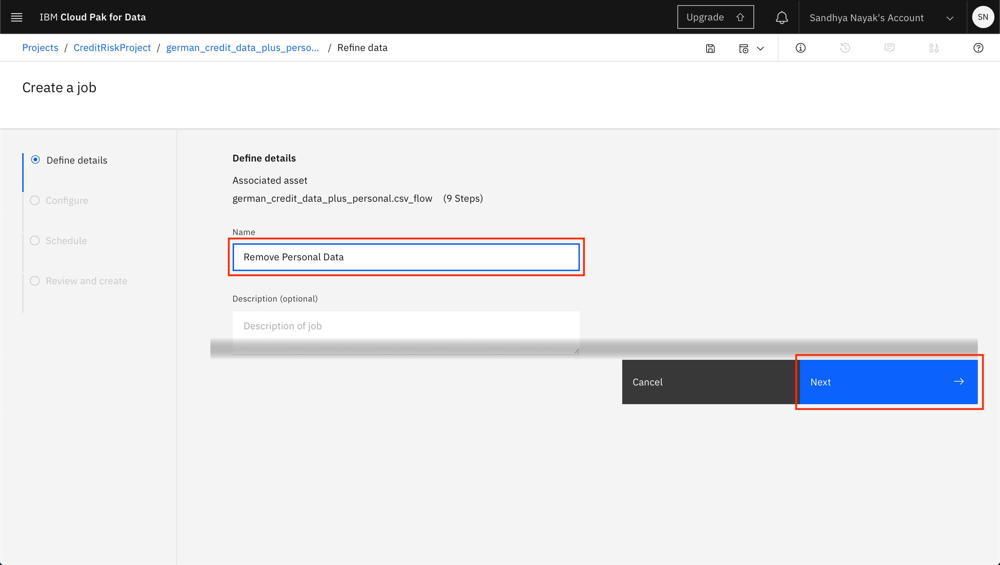
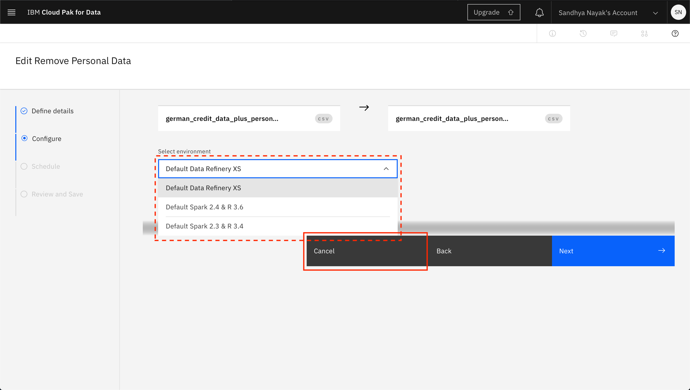
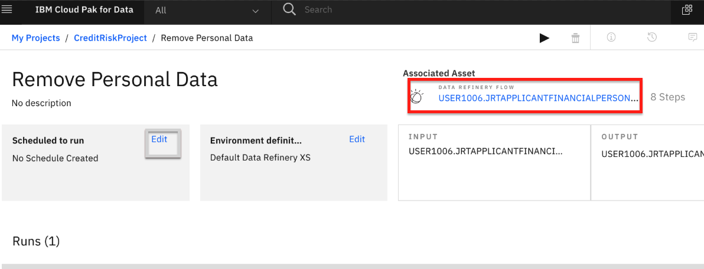
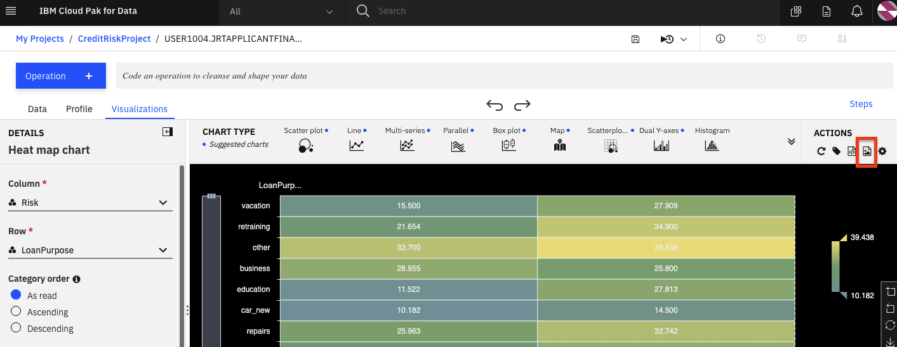

# Data Visualization and Data Refinery

Let's take a quick detour to the `Data Refinery` tool. Data Refinery can quickly filter and mutate data, create quick visualizations, and do other data cleansing tasks from an easy to use user interface.

This section is broken up into the following steps:

1. [Load the data](#1-load-data)
2. [Refine the data](#2-refine-data)
3. [Profile the data](#3-profile-data)
4. [Visualize the data](#4-visualize-data)

>**Note:** The lab instructions below assume you have a project already and have data you will refine. If not, follow the instructions in the pre-work to create a project. Data will also be loaded into the project when you create it.

## 1. Load Data

* Go the (☰) navigation menu, expand `Projects` and then click on your analytics project.


* From the `Project` home, on the `Assets` tab, ensure the `Data assets` section is expanded or click on the arrow to toggle it and open up the list of data assets.

* Find the `german_credit_data_plus_personal.csv` data asset, then click the 3 vertical dots to the right, and select the `Refine` option from the menu.


* Data Refinery will launch and open to the `Data` tab. It will also display the information panel with details of the data refinery flow and where the output of the flow will be placed. Go ahead and click the `X` to the right of the `Information` panel to close it.


## 2. Refine Data

We'll start out in the `Data` tab where we wrangle, shape and refine our data. As you refine your data, IBM Data Refinery keeps track of the steps in your data flow. You can modify them and even select a step to return to a particular moment in your data’s transformation.

### Create Transformation Flow

* With Data Refinery, we can transform our data by directly entering operations in [R syntax](https://cran.r-project.org/manuals.html) or interactively by selecting operations from the menu. For example, start typing `filter` on the Command line and observe that the list of operations displayed will get updated. Click on the `filter` operation.



* A `filter` operation syntax will be displayed in the Command line. Clicking on the operation name within the Command line will give hints on the syntax and how to use the command. For instance the following command filters for customers who have paid the credits up to date:
  ``` R
  filter(`CreditHistory` == 'credits_paid_to_date')
  ```
  Finally, click `Cancel` to clear out the command line.



* We will next use the UI to explore and transform the data. Click the `Operation +` button.



* Let's use the `Filter` operation to check some values. Click on `Filter` in the left panel.



* We want to make sure that there are no empty values in the `StreetAddress` column. Select the `StreetAddress` column from the `Column` drop down list, select `Is empty` from the `Operator` drop down list, and then click the `Apply` button.


> **Note:** If there are records where the selected column is empty, they will be displayed after clicking the apply button. If there are no records for this filter, it means that the 1000 rows we are previewing do not have any empty values for the selected column.

* Now, click on the counter-clockwise "back" arrow to remove the filter. Alternatively, we can also remove the filter by clicking the trash icon for the Filter step in the `Steps` panel on the right.


* We can remove these records with empty values. Click the `Operation +` again and this time select the `Remove empty rows` operation. Select the `StreetAddress` column, then click the `Next` button and finally the `Apply` button.


* Let's say we've decide that there are columns that we don't want to leave in our dataset ( maybe because they might not be useful features in our Machine Learning model, or because we don't want to make those data attributes accessible to others, or any other reason). We'll remove the `FirstName`, `LastName`, `Email`, `StreetAddress`, `City`, `State`, `PostalCode` columns.

* For each column to be removed: Click the `Operation +` button, then select the `Remove` operation. Click the `Change column selection` option.


* In the `Select column` drop down, choose one of the columns to remove (i.e `FirstName`). Click the `Next` button and then the `Apply` button. The column will be removed. Repeat for each of the above columns.

* At this point, you have a data transformation flow with 9 steps. As we saw in the last section, we keep track of each of the steps and we can even undo (or redo) an action using the circular arrows. To see the steps in the data flow that you have performed, click the `Steps` button. The operations that you have performed on the data will be shown.


* You can modify these steps in real time and save for future use.

### Schedule Jobs

Data Refinery allows you to run jobs at scheduled times, and save the output. In this way, you can regularly refine new data as it is updated.

* Click on the `jobs` icon and then `Save and create a job` option from the menu.


* Give the job a name and optional description. Click `Next`.



* Click `Next` on the next 2 screens. You will reach the `Review and create` screen. Note the output name, which is `german_credit_data_plus_personal.csv_shaped`. Click the `Create and run` button.


* The job will be listed as `Status Running` and then the `Status` will change to `Completed`. Click `Edit job`.


* Click the pencil icon next to `Schedule`. 


* Notice that you can toggle the *Schedule to run* switch and choose a date and time to run this transformation as a job. We will not run this as a job, so go ahead and click the `Cancel` button.


* Click on `Edit job` once again. This time click on the pencil icon next to `Configuration`.


* Notice that you can change the compute environment for this transformation. We will not be changing the compute environment right now, so go ahead and click the `Cancel` button.



### 3. Profile Data

* Go back to the project by clicking the name of the project in the breadcrumbs in the top left area of the browser. 


* Scroll down to the `Data Refinery flows` section and click on the `german_credit_data_plus_personal.csv_flow` flow.



* Clicking on the `Profile` tab will bring up a view of several statistics and histograms for the attributes in your data.


* You can get insight into the data from the views and statistics:

  * The median age of the applicants is 36, with the bulk under 49.

  * About as many people had credits_paid_to_date as prior_payments_delayed. Few had no_credits.

  * The median was 3 years for duration at current residence. Range was 1-6 years.

### 4. Visualize Data

Let's do some visual exploration of our data using charts and graphs. Note that this is an exploratory phase and we're looking for insights in out data. We can accomplish this in Data Refinery interactively without coding.

* Choose the `Visualizations` tab to bring up the page where you can select columns that you want to visualize. Add `LoanAmount` as the first column and click `Add Column` to add another column. Next add `LoanDuration` and click `Visualize`. The system will pick a suggested plot for you based on your data and show more suggested plot types at the top.


* Remember that we are most interested in knowing how these features impact a loan being at the risk. So, let's add the `Risk` as a color on top of our current scatter plot. That should help us visually see if there's something of interest here.
* From the left, click the `Color Map` section and select `Risk`. Also, to see the full data, drag the right side of the data selector at the bottom all the way to the right, in order to show all the data inside your plot.


 
* We notice that there are more purple on this plot towards the top right, than there is on the bottom left. This is a good start as it shows that there is probably a relationship between the riskiness of a loan and its duration and amount. It appears that the higher the amount and duration, the riskier the loan. Interesting, let's dig in further in how the loan duration could play into the riskiness of a loan. 

* Let's plot a histogram of the `LoanDuration` to see if we can notice anything. First, select `Histogram` from the `Chart Type`. Next on the left, select `Risk` in the Split By section, check the `Stacked` option, and uncheck the `Show kde curve, as well as the show distribution curve. You should see a chart that looks like the following image.


* It looks like the longer the duration the larger the blue bar (risky loan count) become and the smaller the purple bars (non risky loan count) become. That indicate loans with longer duration are in general more likely to be risky. However, we need more information.

* We next explore if there is some insight in terms of the riskiness of a loan based on its duration when broken down by the loan purpose. To do so, let's create a Heat Map plot.
* At the top of the page, in the `Chart Type` section, open the arrows on the right, select `Heat Map`, and accept the warning.


* Next, select `Risk` in the column section and `LoanPurpose` for the Row section. Additionally, to see the effects of the loan duration, select `Mean` in the summary section, and select `LoanDuration` in the `Value` section.


* You can now see that the least risky loans are those taken out for purchasing a new car and they are on average 10 years long. To the left of that cell we see that loans taken out for the same purpose that average around 15 years for term length seem to be more risky. So one could conclude the longer the loan term is, the more likely it will be risky. In contrast, we can see that both risky and non-risky loans for the `other` category seem to have the same average term length, so one could conclude that there's little, if any, relationship between loan length and its riskiness for the loans of type `other`. 
* In general, for each row, the bigger the color difference between the right and left column, the more likely that loan duration plays a role for the riskiness of the loan category.

* Now let's look into customizing our plot. Under the `Actions` panel, notice that you can perform tasks such as `Start over`, `Download chart details`, `Download chart image`, or set `Global visualization preferences` (_Note: Hover over the icons to see the names_).

* Click on the `gear` icon in the `Actions` panel. We see that we can do things in the `Global visualization preferences` for `Titles`, `Tools`, `Theme`, and `Notifications`. Click on the `Theme` tab and update the color scheme to `Dark`. Then click the `Apply` button, now the colors for all of our charts will reflect this. Play around with various Themes and find one that you like.


* Finally, to save our plot as an image, click on the image icon on the top right, highlighted below, and then save the image.
  


### Conclusion

We've seen a some of the capabilities of the Data Refinery. We saw how we can transform data using R code, as well as using various operations on the columns such as changing the data type, removing empty rows, or deleting the column altogether. We next saw that all the steps in our Data Flow are recorded, so we can remove steps, repeat them, or edit an individual step. We were able to quickly profile the data, to see histograms and statistics for each column. And finally we created more in-depth Visualizations, creating a scatter plot, histogram, and heatmap to explore the relationship between the riskiness of a loan and its duration, and purpose. 
