# Frequently Asked Questions 

- [Frequently Asked Questions](#frequently-asked-questions)
  - [I see only two notebooks, is that ok?](#i-see-only-two-notebooks-is-that-ok)
  - [I got an error 'IndexError: list index out of range' when I run Jupytor notebook to save the model (Chapter 5: Analyze - [Lab] Building AI Model in Jupyter Notebooks) in step  "4.4 Save the Model"](#i-got-an-error-indexerror-list-index-out-of-range-when-i-run-jupytor-notebook-to-save-the-model-chapter-5-analyze---lab-building-ai-model-in-jupyter-notebooks-in-step-44-save-the-model)
  - [I'm doing the Data Preparation Lab for the 3rd track, but in my Cloud Pak Data project I can only download, promote and remove the csv data; I don't have the option to refine it.](#im-doing-the-data-preparation-lab-for-the-3rd-track-but-in-my-cloud-pak-data-project-i-can-only-download-promote-and-remove-the-csv-data-i-dont-have-the-option-to-refine-it)
  - [What do I do if importing the project into the platform takes a long time?](#what-do-i-do-if-importing-the-project-into-the-platform-takes-a-long-time)
  - [Why do I see the following when I push the python app to IBM Cloud `**ERROR** Could not install python`](#why-do-i-see-the-following-when-i-push-the-python-app-to-ibm-cloud-error-could-not-install-python)
    - [Accessing Files](#accessing-files)
    - [Importing Files into the Cloud Pak for Data as a Service platform](#importing-files-into-the-cloud-pak-for-data-as-a-service-platform)

## I see only two notebooks, is that ok?

Answer: Yes it is ok. There are only two notebooks in your zip file, even thought you see more in the video. The additional notebooks are for the demos, therefore not included in the zip file. We decided this to reduce the number of notebooks and reduce confusion. (Apparently, in has caused instead cause confusion!!)

We will make sure to update the zip file after the conference and add them in so you can go through them at your own pace after the workshop.

## I got an error 'IndexError: list index out of range' when I run Jupytor notebook to save the model (Chapter 5: Analyze - [Lab] Building AI Model in Jupyter Notebooks) in step  "4.4 Save the Model"

Answer: This Error does not cause a problem with saving the model, and can safely be ignored.

## I'm doing the Data Preparation Lab for the 3rd track, but in my Cloud Pak Data project I can only download, promote and remove the csv data; I don't have the option to refine it.

Answer: When you go to the Navigation "hamburger" menu and choose Services -> Services instances do you see "Watson Studio"? If not, you need to create one:

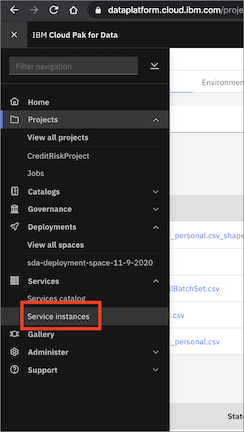

If you don't see "Watson Studio" under "Services instances", click +Add Service and search for "Watson Studio" and add it. Make sure that it is in the same region as your Cloud Pak for Data service.

## What do I do if importing the project into the platform takes a long time?

If you are facing any issues with importing the project into the IBM Cloud Pak for Data as a Service platform, all you need to do is import the relevant notebooks and/or data assets for each lab.

## Why do I see the following when I push the python app to IBM Cloud `**ERROR** Could not install python`

Answer: Frequently, IBM Cloud updates to the newer versions of Python and deprecates the older versions. If you see this error, open the `runtime.txt` file in your python app folder and bump up the python version to `python-3.6.12` or newer as suggested in the error message.

Alternatively, you can remove the `runtime.txt` if you just want to use whatever is the latest version, thought it is best practice to always know what version of he tools you're using and update the version yourself. 

### Accessing Files

If you ran the following commands to download the project, navigate to `projects` then unzip the folder named `CreditRiskProject.zip` to access the content you need for each lab. All files you need are in the `assests` folder.

```bash
   git clone https://github.com/IBM/credit-risk-workshop-cpd.git
   cd credit-risk-workshop-cpd
   ```
If you downloaded the zip folder from the link provided in the Pre-work section, make sure you extract the zip folder after it's downloaded. All files you need are in the `assests` folder.

### Importing Files into the Cloud Pak for Data as a Service platform

You will need to create a new empty project to import the files you'll use into.

* Go the (☰) navigation menu, expand *Projects* and click on the `View all projects` link.


* Click on the `New +` button on the top.


* We are going to create an empty project. Select the `Create an empty project` option.

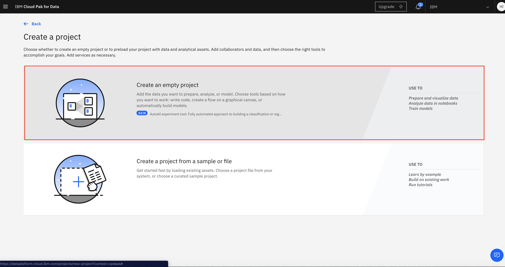

* Give the project a name. You also need to provide an object storage instance for this project. If you haven't already created a Cloud Object Storage instance in your IBM Cloud account, you can create one now by clicking `Add`.

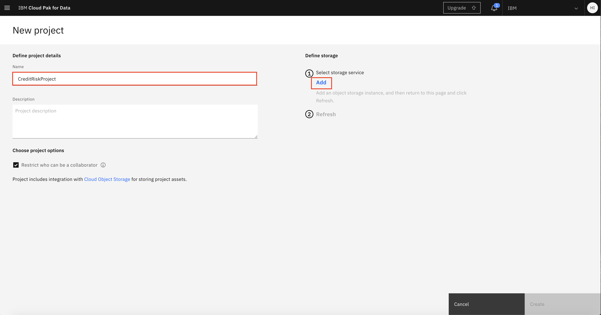

* A new tab opens up, where you can create the Cloud Object Service. By default, a `Lite` (Free) plan will be selected. Scroll down and update the name of your Cloud Object Storage service if you wish, and click `Create`.


* The browser tab will automatically close when the Cloud Object Storage instance has been created. Back on IBM Cloud Pak for Data as a Service, click `Refresh`.

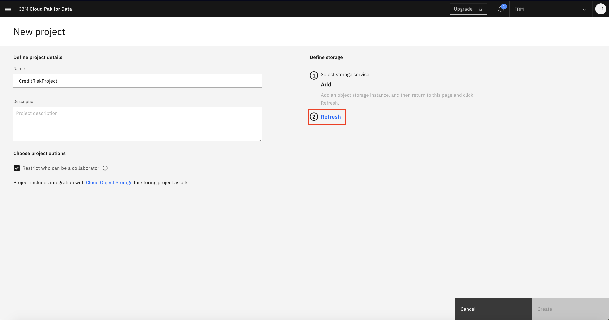

* The newly created Cloud Object Storage instance will now be displayed under "Storage". Click `Create` to finish creating the project.

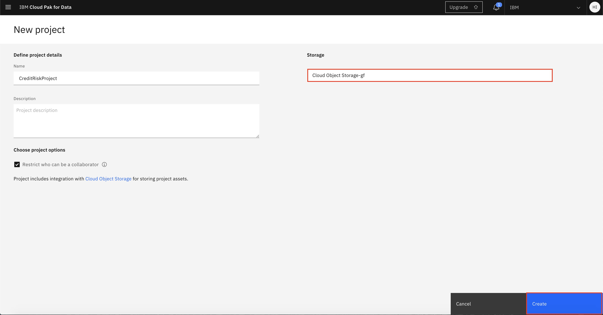

* To import the notebook you need for a lab, click on `Add to project +` button.

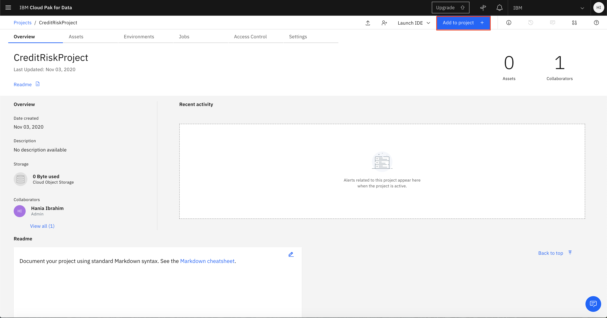

* Choose `Notebook`.

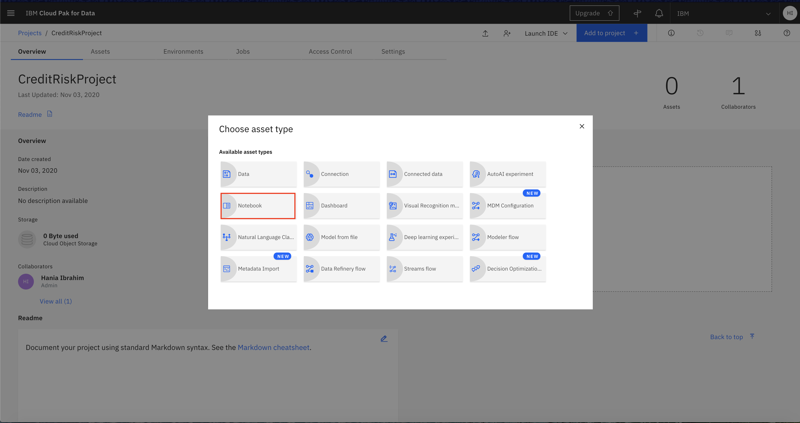

* Then, choose `From file`. Keep the environment the same and browse your files or drag and drop your notebook file. Give your notebook a name.

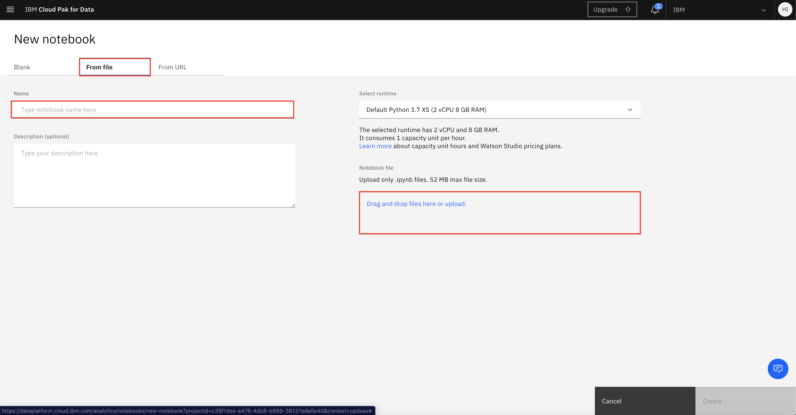

* Finally. click `Create`.

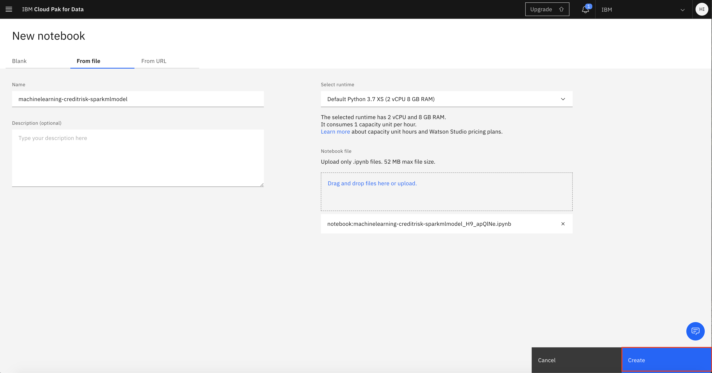

* To import any data asset you need like CSV files, click on `0100` button at the top right.

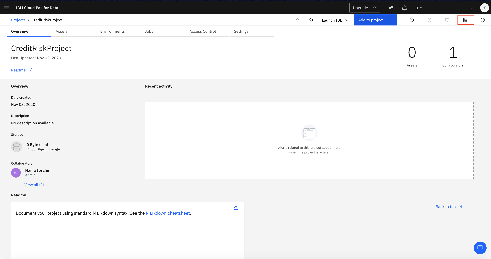

* Browse or drag and drop the data asset you want to add. 

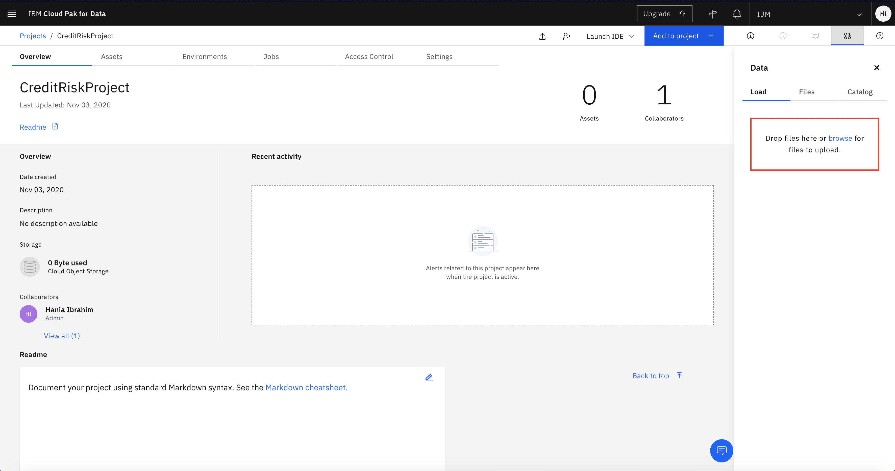

* Once upload is complete, click on `Assets` to view your uploaded file.

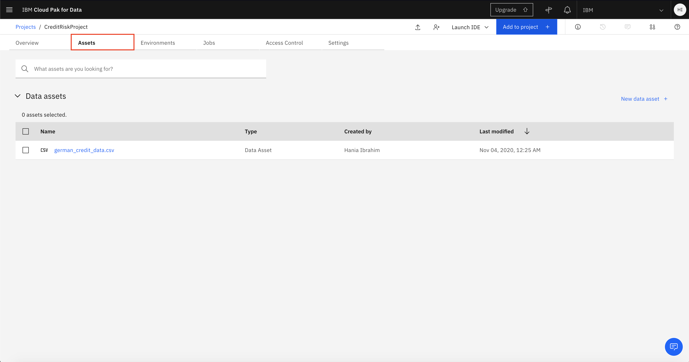


