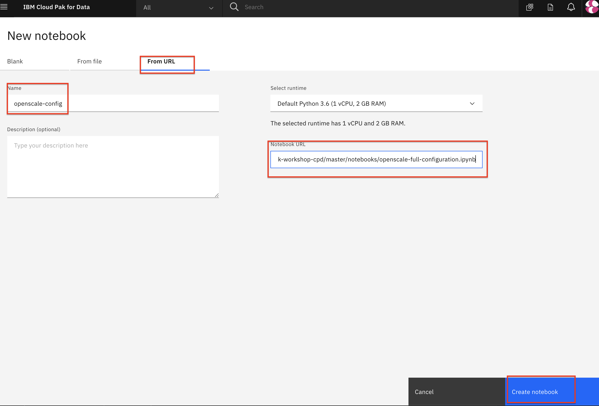

# Frequently Asked Questions & Helpful Tips / Tricks

## Manually Importing Jupyter Notebooks

During the pre-work section of this workshop, you create a project based on an existing project file. If, for some reason, you are not using the project zip file to create your project then you will not have all the assets (Jupyter Notebooks, CSV files, etc) necessary for the labs. You can manually import these assets into an existing or empty project. Use the following steps to import the Jupyter notebook files manually.

* At your project overview page, click the `Add to project` button, and choose the `Notebook` option.

* On the next panel: select the `From URL` tab, give your notebook a name, provide the notebook URL, and leave the default Python environment:

>*Note: The URL and name shown in the screenshot may not match your scenario. Use the table below to determine what URL to use.*

* Use the following table to find the URL to use for each of the Workshop notebooks:

  | Module | Suggested Name | URL |
  | - | - | - |
  | ML Spark Model | machinelearning-creditrisk-sparkmlmodel | `https://raw.githubusercontent.com/IBM/credit-risk-workshop-cpd/master/notebooks/machinelearning-creditrisk-sparkmlmodel.ipynb` |
  | ML Model Deployment | machinelearning-creditrisk-batchscoring | `https://raw.githubusercontent.com/IBM/credit-risk-workshop-cpd/master/notebooks/machinelearning-creditrisk-batchscoring.ipynb` |
  | OpenScale Full Config | openscale-full-configuration | `https://raw.githubusercontent.com/IBM/credit-risk-workshop-cpd/master/notebooks/openscale-full-configuration.ipynb` |
  | OpenScale Manual Config - Initial Setup| openscale-initial-setup | `https://raw.githubusercontent.com/IBM/credit-risk-workshop-cpd/master/notebooks/openscale-initial-setup.ipynb` |
  | OpenScale Manual Config - Fairness / Explainability | openscale-fairness-explainability | `https://raw.githubusercontent.com/IBM/credit-risk-workshop-cpd/master/notebooks/openscale-fairness-explainability.ipynb` |
  | OpenScale Manual Config - Quality | openscale-quality-feedback | `https://raw.githubusercontent.com/IBM/credit-risk-workshop-cpd/master/notebooks/openscale-quality-feedback.ipynb` |
  | OpenScale Manual Config - Drift| openscale-drift-config | `https://raw.githubusercontent.com/IBM/credit-risk-workshop-cpd/master/notebooks/openscale-drift-config.ipynb` |
  | OpenScale Manual Config - Historic Data| openscale-historic-data | `https://raw.githubusercontent.com/IBM/credit-risk-workshop-cpd/master/notebooks/openscale-historic-data.ipynb` |

* Click the `Create notebook` button. The Jupyter notebook will be loaded and the kernel is started. Once the kernel is ready you can go back to the workshop instructions.
