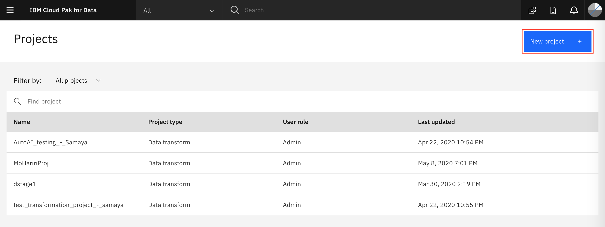

# Frequently Asked Questions 

## I got an error 'IndexError: list index out of range' when I run Jupytor notebook to save the model (Chapter 5: Analyze - [Lab] Building AI Model in Jupyter Notebooks) in step  "4.4 Save the Model"

Answer: This Error does not cause a problem with saving the model, and can safely be ignored.

## I'm doing the Data Preparation Lab for the 3rd track, but in my Cloud Pak Data project I can only download, promote and remove the csv data; I don't have the option to refine it.

Answer: When you go to the Navigation "hamburger" menu and choose Services -> Services instances do you see "Watson Studio"? If not, you need to create one:


If you don't see "Watson Studio" under "Services instances", click +Add Service and search for "Watson Studio" and add it. Make sure that it is in the same region as your Cloud Pak for Data service.

## What do I do if importing the project into the platform takes a long time?

If you are facing any issues with importing the project into the IBM Cloud Pak for Data as a Service platform, all you need to do is import the relevant notebooks and/or data assets for each lab.

### Accessing Files

If you ran the following commands to download the project, navigate to `projects` then unzip the folder named `CreditRiskProject.zip` to access the content you need for each lab. All files you need are in the `assests` folder.

```bash
   git clone https://github.com/IBM/credit-risk-workshop-cpd.git
   cd credit-risk-workshop-cpd
   ```
If you downloaded the zip folder from the link provided in the Pre-work section, make sure you extract the zip folder after it's downloaded. All files you need are in the `assests` folder.

### Importing Files into the Cloud Pak for Data as a Service platform

You will need to create a new empty project to import the files you'll use into.

* Go the (☰) navigation menu, expand *Projects* and click on the `View all projects` link.


* Click on the `New +` button on the top.



* We are going to create an empty project. Select the `Create an empty project` option.


* Give the project a name. You also need to provide an object storage instance for this project. If you haven't already created a Cloud Object Storage instance in your IBM Cloud account, you can create one now by clicking `Add`.


* A new tab opens up, where you can create the Cloud Object Service. By default, a `Lite` (Free) plan will be selected. Scroll down and update the name of your Cloud Object Storage service if you wish, and click `Create`.


* The browser tab will automatically close when the Cloud Object Storage instance has been created. Back on IBM Cloud Pak for Data as a Service, click `Refresh`.


* The newly created Cloud Object Storage instance will now be displayed under "Storage". Click `Create` to finish creating the project.


* To import the notebook you need for a lab, click on `Add to project +` button.


* Choose `Notebook`.


* Then, choose `From file`. Keep the environment the same and browse your files or drag and drop your notebook file. Give your notebook a name.


* Finally. click `Create`.


* To import any data asset you need like CSV files, click on `0100` button at the top right.


* Browse or drag and drop the data asset you want to add. 


* Once upload is complete, click on `Assets` to view your uploaded file.


