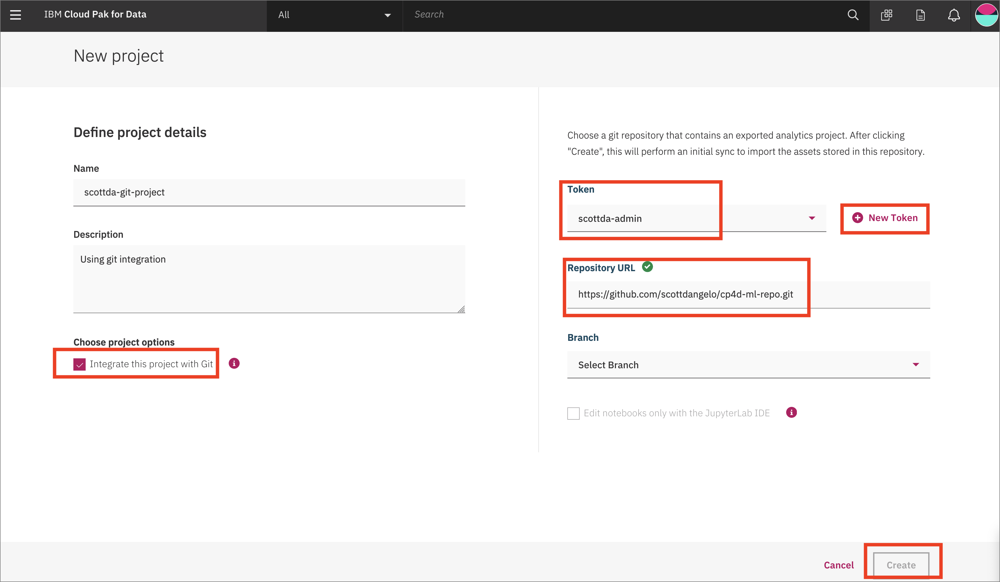
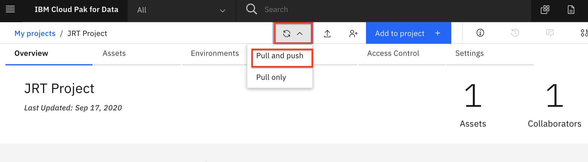
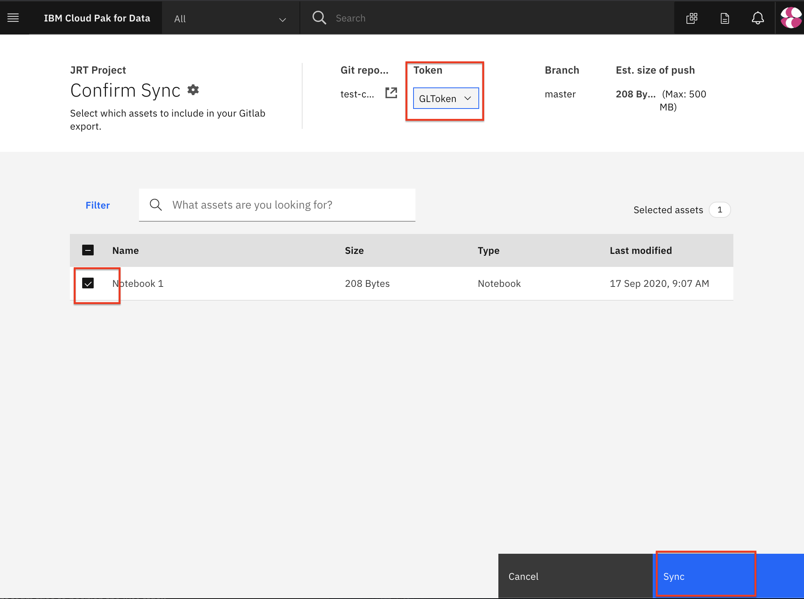

# Git Repository Integration

A Cloud Pak for Data project can be integrated with a git repository.

## Generate a token in GitLab

* To create a token for Gitlab, login to [GitLab](https://about.gitlab.com/), click on your user account in the top right and choose `Settings`:

   

* From the left navigation bar select `Access tokens` and fill in the *name*, *expiration date*, and check the boxes for *read_repository* and *write_repository*. Finally, click `Create personal access token` button:

   

* On the resulting page, you'll see your personal access token. Copy this.

   > NOTE: This token gives access to your git repository. Do not share with anyone.

   

* Now go back to the Cloud Pak for Data *Create project* page and we'll add the token.

## Create a project with git integration

* Go the (☰) menu and click *Projects*

   

* Click on *New project*

   

* Create a new project, choose `Analytics project`. Give the project a name.

* Click the box for `Integrate this project with git`. Add the token that you have created, and then select it. Put in the repository URL, Select a branch, and click `Create`.

   

## Create assets and push to git

* Now if we create an asset in the project, we can push to git.

* At the project overview, either click the `+Add to project` button, and choose `Notebook`, or to the right of *Notebooks* click `+ New notebook`:

   

* On the next panel select the *From URL* tab, give your notebook a name, provide the following URL, and choose the Python 3.6 environment:

```bash
https://raw.githubusercontent.com/IBM/credit-risk-workshop-cpd/master/notebooks/machinelearning-creditrisk-sparkmlmodel.ipynb
```

* Now, go back to the top-level project page, click the "rectangular arrow" sync-icon, and choose `Pull and Push`:

   

* On the *Confirm Sync* page, select your token, check the box for your notebook, and click `Sync`:

   

* The next screen will verify "Did you remove credentials from assets?". After confirming this, click `Continue export`.

* After syncing, the screen will show Success. You can click `Back to project`.

* You can integrate git into your workflow in your usual way, syncing with teammates via 'git pull' and using 'git push' to upload your changes to the git remote repository.
