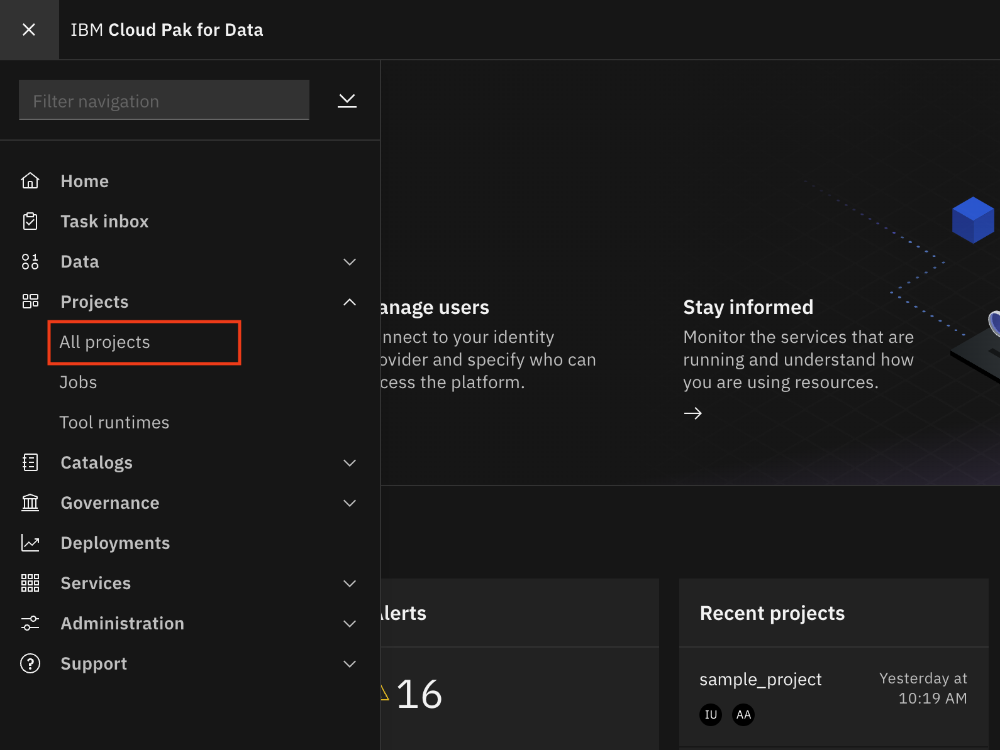
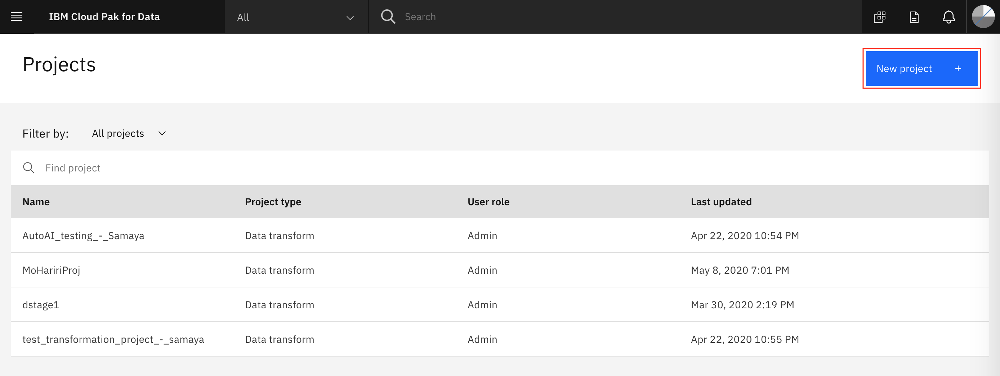
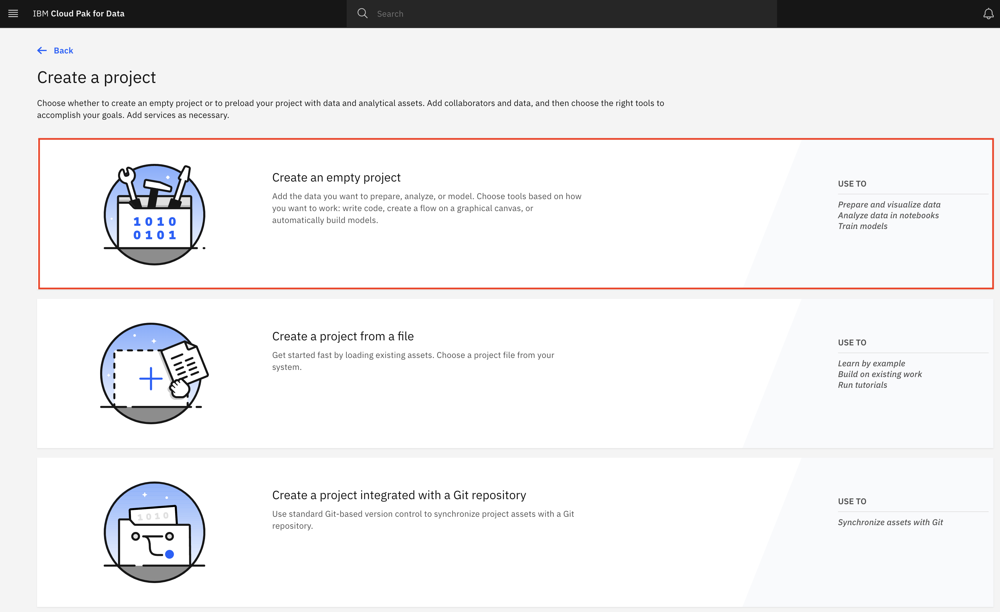

# Git Repository Integration

***IMPORTANT NOTE: This module has been archived and is no longer being actively maintained. The readme will be left below for reference only.***

A Cloud Pak for Data project can be integrated with a git repository. The Git integration must be done at project creation time.

## Generate GitLab Token

* To create a token for Gitlab, login to [GitLab](https://about.gitlab.com/), click on your user account in the top right and choose `Settings`:

* From the left navigation bar select `Access tokens` and fill in the *name*, *expiration date*, and check the boxes for *read_repository* and *write_repository*. Finally, click `Create personal access token` button:

* On the resulting page, you'll see your personal access token. Copy this.

> NOTE: This token gives access to your git repository. Do not share with anyone.

## Create Analytics Project with Git Integration

* Go the (☰) navigation menu and click on the *Projects* link.

* Click on the *New project* button on the top right.

* Select the `Analytics project` radio button and click the **Next** button.

* We are going to create an empty project. Select the _*Create an empty project*_ option.

* Give the project a name and Click the box for `Integrate this project with git`. Then click the `New Token` link on the right.

* In the Git Integration panel: select the Gitlab option from the *Platform* drop down list, Paste in your access token from the previous section, Enter your GitLab username, provide a name to the token. Then click the *`Continue`* button.

* Now select the token you just created in the *Token* drop down list. Put in the repository URL, Select a branch, and click `Create`.

> *Note: We are assuming you have a project already created in the repository that you will synch to. If not, go ahead and create an empty project in GitLab*

## Create Asset and Push to GitLab

Now whenever we create an asset in the project, we will be able to push it to the GitLab repository.

* From the project overview, either click the `Add to project +` button, and choose `Notebook`.

* On the *'New notebook'* panel, give the notebook a name and optional description. Leave the default runtime. Click the *`Create notebook`* button.

* We can start making changes to the notebook but first lets sync with the repository. Go back to the top-level project page by clicking on the project name in the navigation hierarchy in the top left of the page.

* Click the "circular arrow" sync-icon and choose the `Pull and Push` option from the menu.

* On the *Confirm Sync* page, select your token, check the box next to your notebook, and click the `Sync` button.

* A window will come up asking you to verify "Did you remove credentials from assets?". After confirming this, click the `Continue export` button.

* After syncing, the window will show Success. You can click the `Back to project` button.

* You can check your GitLab project to see the notebook has been added under the *'assets'* directory.

## Conclusion

In this section we covered how to enable the Git integration to your projects in Cloud Pak for Data. You can integrate git into your workflow in your usual way, syncing with teammates via 'git pull' and using 'git push' to upload your changes to the git remote repository.
