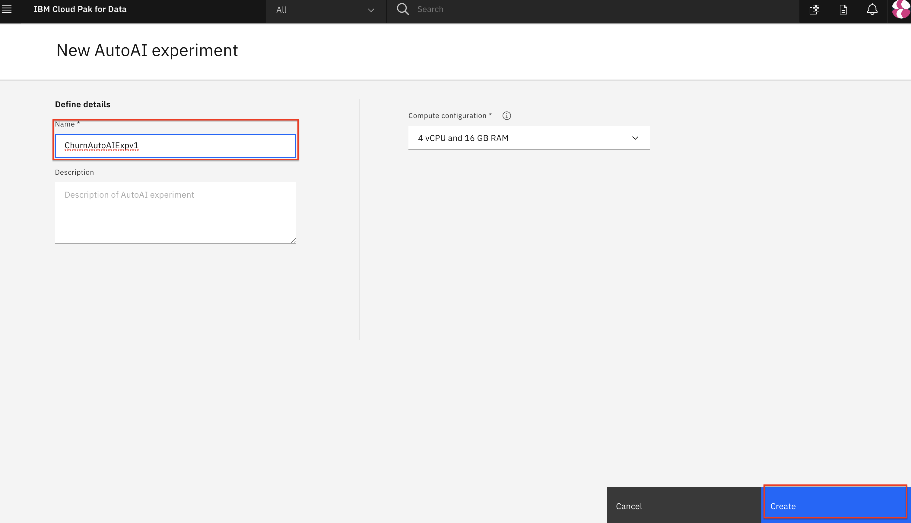
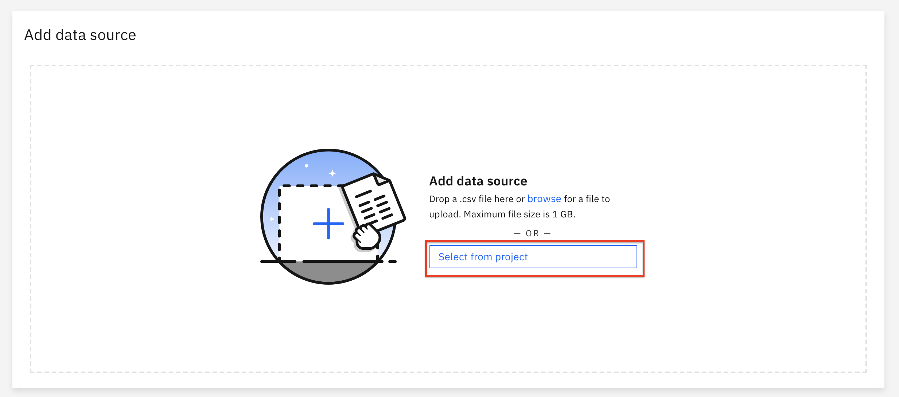
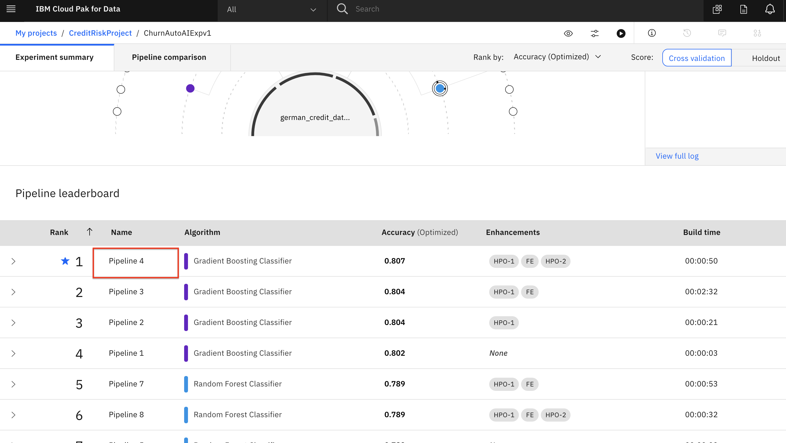
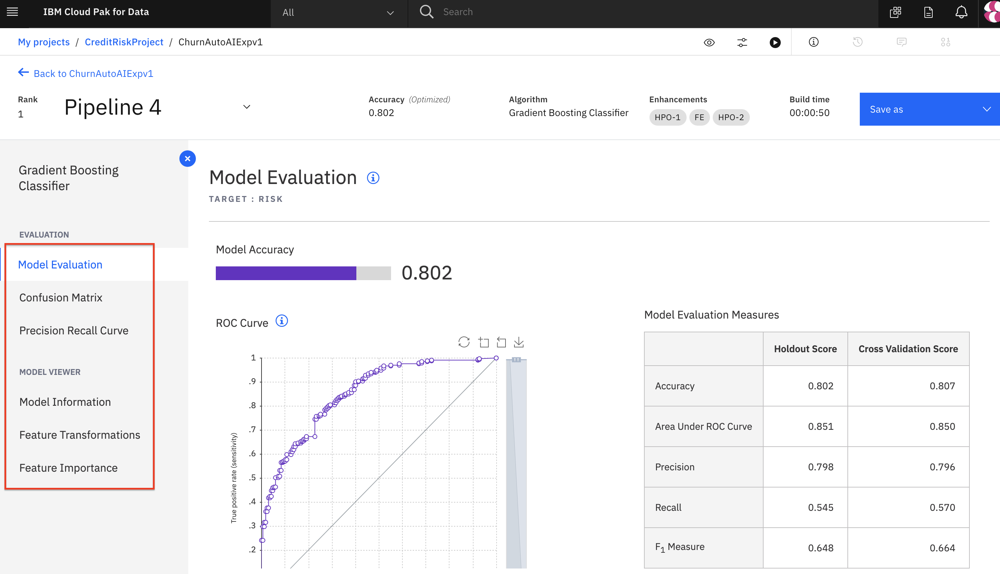
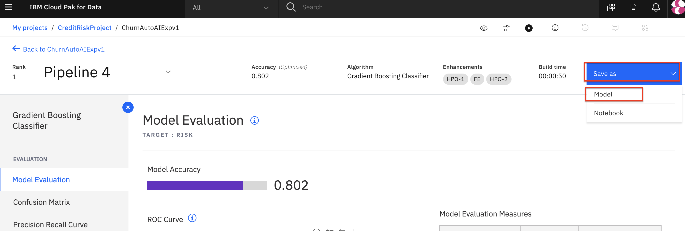
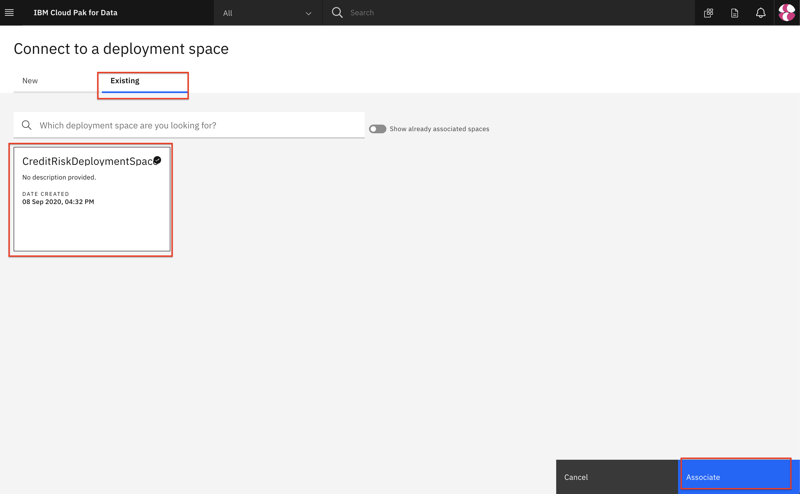
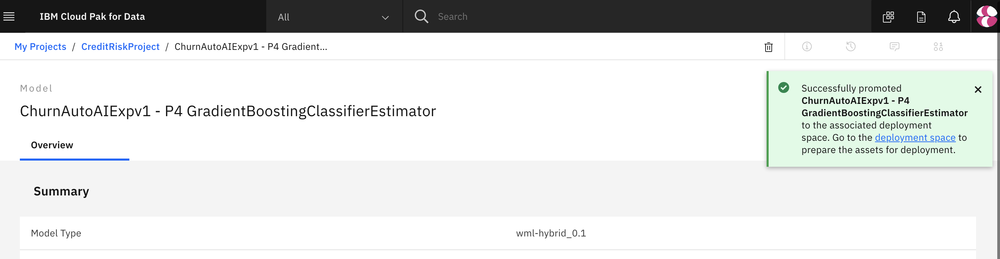

# Automate model building with AutoAI

For this part of the workshop, we'll learn how to use [AutoAI](https://www.ibm.com/support/producthub/icpdata/docs/content/SSQNUZ_current/wsj/analyze-data/autoai-overview.html).
AutoAI is a capability that automates various tasks to ease the workflow for data scientists that are creating machine learning models. It automatautomates steps such as preparing your data for modeling, chooses the best algorithm/estimator for your problem, experiments with pipelines and parameters for the trained models.

This section is broken up into the following steps:

1. [Run AutoAI Experiment](#1-run-autoai-experiment)
2. [Save AutoAI Model](#2-save-autoai-model)
3. [Promote the Model](#3-promote-the-model)

>*Note: The lab instructions below assume you have a project already with the assets necessary to build a model. If not, follow the instructions in the pre-work section to create a project.*

## 1. Run AutoAI Experiment

* Go the (☰) navigation menu and click on the *Projects* link and then click on your analytics project.

* To start the AutoAI experiment, click the *`Add to Project`* button from the top of the page and select the `AutoAI experiment` option.

* Name your AutoAI experiment asset and leave the default compute configuration option listed in the drop-down menu. Then click the `Create` button.

* To configure the experiment, we must first give it the dataset that will be used to train the machine learning model. We will be using one of the CSV file datasets we have preloaded into the project. Click on the `Select from project` option.

* In the dialog, select the `german_credit_data_noid.csv` file and click the `Select asset` button.

* Once the dataset is read in, we will need to indicate what we want the model to predict. Under *Select prediction column* panel, find and click on the `Risk` row.

* AutoAI will set up defaults values for the experiment based on the dataset and the column selected for the prediction. This includes the type of model to build, the metrics to optimize against, the test/train split, etc. You could view/change these values under 'Experiment settings', however, for now we will accept the defaults and click the *`Run experiment`* button.

* The AutoAI experiment will now run. AutoAI will run through steps to prepare the dataset, split the dataset into training and evaluation groups and then find the best performing algorithms / estimators for the type of model. It will then build the following series of candidate pipelines for each of the top N performing algorithms (where N is a number chosen in the configuration which defaults to 2):

  * Baseline model (Pipeline 1)
  * Hyperparameter optimization (Pipeline 2)
  * Automated feature engineering (Pipeline 3)
  * Hyperparameter optimization on top of engineered features(Pipeline 4)

* The UI will show progress as different algorithms/evaluators are selected and as different pipelines are created & evaluated. You can view the performance of the pipelines that have completed by expanding each pipeline section in the leaderboard.

* The experiment can take several minutes to run. Upon completion you will see a message that the pipelines have been created. Do not proceed to the next section until the experiment completes.

## 2. Save AutoAI Model

* Once the experiment completes, you can explore the various pipelines and options in the UI. Some of the options available are to see a comparison of the pipelines, to change the ranking based on a different performance metric, to see a log of the experiment, or to see the ranked listing of the pipelines (ranking based on the optimization metric in your experiment, in this case accuracy.)

* Scroll down to see the *Pipeline leaderboard*. The top performing pipeline is in the first rank.

* The next step is to select the model that gives the best result and view its perfromance. In this case, Pipeline 4 gave the best result for our experiment. You can view the detailed results by clicking the corresponding pipeline name from the leaderboard:

* The model evaluation page will show metrics for the experiment, confusion matrix, feature transformations that were performed (if any), which features contribute to the model, and more details of the pipeline. Optionally, feel free to click through these views of the pipeline details.

* In order to deploy this model, click on the *`Save as`* button and select the `Model` option to save it.

* In the 'Save as model' window you can accept the default values or give your model a meaningful name/description and then click the `Save` button.

* You receive a notification to indicate that your model is saved to your project. Go back to your project main page by clicking on the project name on the navigator on the top left:

* You will see the new model under *Models* section of the *Assets* page:

## 3. Promote the model

* Now that we have saved our model, we will next need to make the model available in our deployment space so it can be deployed. Under the *Models* section of the *Assets* page, click the name of your saved model.

* To make the model available to be deployed, we need to make it available in the deployment space we previously set up. Click on the `Promote to deployment space`:

* You will receive a message that assets can not yet be promoted, until you associate a deployment space to your project. In order to associate your project with a deployment space. Click the *`Associate Deployment Space`* button.

* Click on the `Existing` tab and choose your deployment space and then click the `Associate` button.

> ***Note: This is assuming you have already created a deployment space in the *pre-work* section of the workshop. Also that you have not associated that deployment space with any other project, since there default screen will not show deployment spaces that are already associated.***

* Once the deployment space is associted, you will be brought back to the same model page, once again click on the `Promote to deployment space`.

* Click on the *`Promote to space`* button.

* You will see a notification that the model was promoted to the deployment space succesfully.

## Conclusion

In this section we covered one approach to building machine learning models on Cloud Pak for Data. We have seen how AutoAI helps find an optimal model by automating tasks such as:

* Data Wrangling
* Model Algorithm Evaluation & Selection
* Feature Engineering
* Hyperparameter Optimization.
