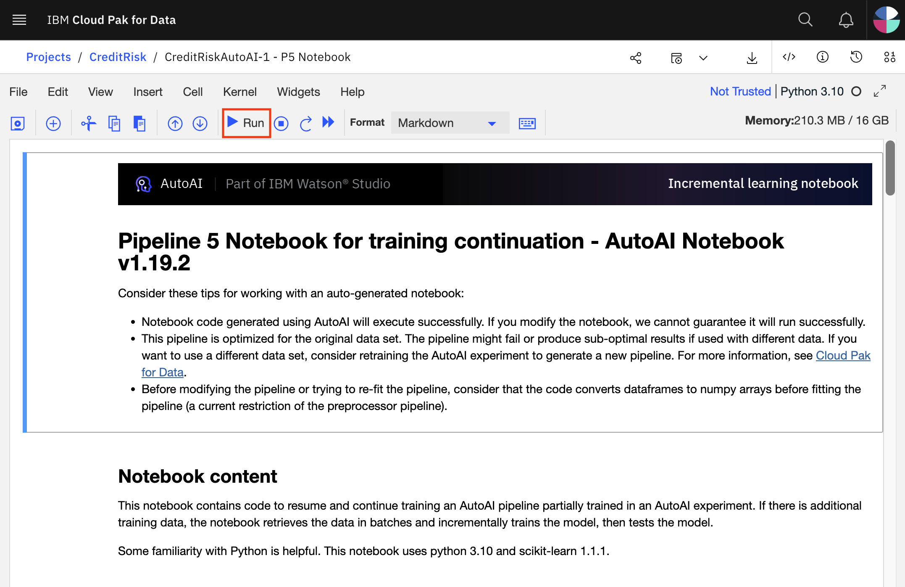

# Modifying and Running an AutoAI generated notebook

Spend some time looking through the sections of the notebook to get an overview. A notebook is composed of text (markdown or heading) cells and code cells. The markdown cells provide comments on what the code is designed to do.

You will run cells individually by highlighting each cell, then either click the `Run` button at the top of the notebook or hitting the keyboard short cut to run the cell (Shift + Enter but can vary based on platform). While the cell is running, an asterisk ([\*]) will show up to the left of the cell. When that cell has finished executing a sequential number will show up (i.e. [17]).

The notebook generated is pre-filled with Python code. Most of the sections will be configured with the appropriate 
values or with the logic required to lookup the necessary values. The one section that requires an update is *Create online deployment*.

## Create online deployment

In the *Working with spaces* subsection, update the `space_id` value with the name of the deployment space
that you created previously.

## Conclusion

In this part of the lab, we examined and ran a Jupyter notebook that was generated as the result of an AutoAI experiment. Feel free to modify and re-run the notebook, making any changes that you are comfortable with.
