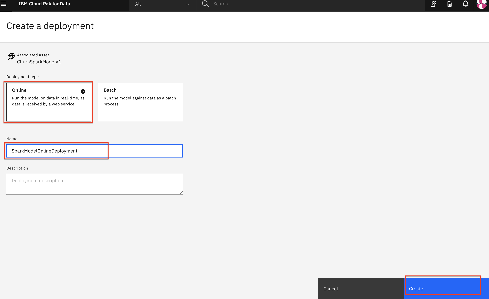
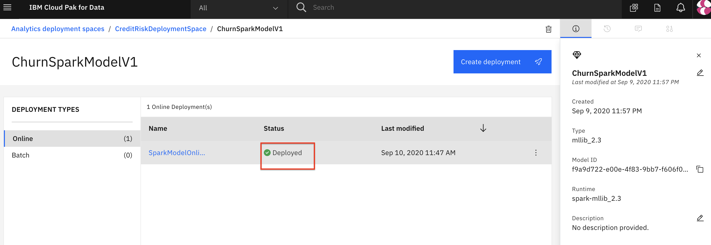
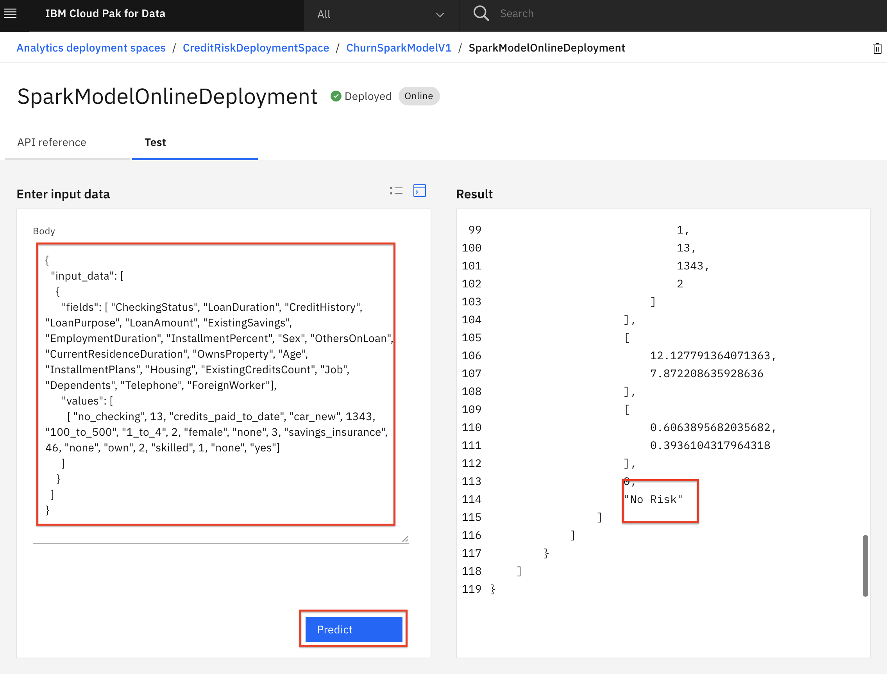
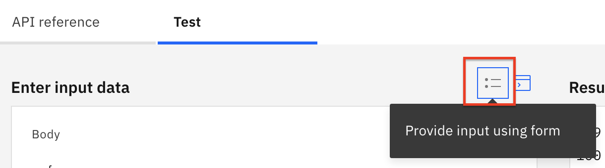

# Machine Learning Model Deployment and Scoring

In this module, we will learn how to deploy our Machine Learning models. By doing so, we make them available for use in production such that applications and business processes can derive insights from them. There are several types of deployments available ([depending on the model framework used](https://www.ibm.com/support/producthub/icpdata/docs/content/SSQNUZ_current/wsj/analyze-data/pm_service_supported_frameworks.html)), of which we will explore:

* Online Deployments - Allows you to run the model on data in real-time, as data is received by a web service.
* Batch Deployments - Allows you to run the model against data as a batch process.

This module is broken up into several sections that explore the different model deployment options as well as the different ways to invoke or consume them. The first section of this lab will build an online deployment and test the model endpoint using both the built in testing tool as well as external testing tools. The remaining sections are optional, they build and test the batch deployment, followed by using the model from a python application.

1. [Online Deployment for a Model](#online-model-deployment)
   * Create Online model deployment
   * Test the deployed model web UI
   * (Optional) Test model using cURL

2. [(Optional) Batch Deployment for a Model](#optional-batch-model-deployment)
   * Create Batch Deployment
   * Create and Schedule a Job

3. [(Optional) Integrate Model to an External Application](#optional-integrate-model-to-python-flask-application)

> **Note:** The lab instructions below assume you have completed the pre-work section already, if not, be sure to complete the pre-work first to create a project and a deployment space.

## Online Model Deployment

After a model has been created, saved and promoted to our deployment space, we can proceed to deploying the model. For this section, we will be creating an online deployment. This type of deployment will make an instance of the model available to make predictions in real time via an API. Although we will use the Cloud Pak for Data UI to deploy the model, the same can be done programmatically.

* Navigate to the left-hand (☰) hamburger menu and choose `Deployment spaces` -> `View all spaces`:


* Choose the deployment space you setup previously by clicking on the name of your space.

* From your deployment space overview, in the table, click on the model name that you previousely promoted. Next, you can click on the `Create Deployment`. 

> Note: There may be more than one model listed in them 'Models' section. This can happen if you have run the Jupyter notebook more than once or if you have run through both the Jupyter notebook and AutoAI modules to create models. Although you could select any of the models you see listed in the page, the recommendation is to start with whicever model is available that is using a `spark-mllib_2.3` runtime (this is denoted in the `Software Specification` column).


* On the `Create a deployment` screen, choose `Online` for the `Deployment Type`, give the Deployment a name and optionally a description and click the `Create` button.



* The Deployment will show as `In progress` and then switch to `Deployed` when done.



### Test Online Model Deployment

Cloud Pak for Data offers tools to quickly test out Watson Machine Learning models. We begin with the built-in tooling.

* From the Model deployment page, once the deployment status shows as `Deployed`, click on the name of your deployment. The deployment `API reference` tab shows how to use the model using `cURL`, `Java`, `Javascript`, `Python`, and `Scala`.

* To get to the built-in test tool, click on the `Test` tab and then click on the `Provide input data as JSON` icon.


* Copy and paste the following data objects into the `Body` panel 

> (**Note:** Make sure the input below is the only content in the field. Do not append it to the default content `{ "input_data": [] }` that may already be in the field. Instead, remove the existing content and replace it with the following data.).

```json
{
  "input_data": [
    {
      "fields": [ "CheckingStatus", "LoanDuration", "CreditHistory", "LoanPurpose", "LoanAmount", "ExistingSavings", "EmploymentDuration", "InstallmentPercent", "Sex", "OthersOnLoan", "CurrentResidenceDuration", "OwnsProperty", "Age", "InstallmentPlans", "Housing", "ExistingCreditsCount", "Job", "Dependents", "Telephone", "ForeignWorker"],
      "values": [
        [ "no_checking", 13, "credits_paid_to_date", "car_new", 1343, "100_to_500", "1_to_4", 2, "female", "none", 3, "savings_insurance", 46, "none", "own", 2, "skilled", 1, "none", "yes"]
      ]
    }
  ]
}
```

* Click the `Predict` button. The model will be called with the input data and the results will display in the `Result` window. Scroll down to the bottom of the result to see the prediction (i.e "Risk" or "No Risk"):



> **Note:** For some deployed models (for example AutoAI based models), you can provide the request payload using a generated form by clicking on the `Provide input using form` icon and providing values for the input fields of the form. If the form is not available for the model you deployed, the icon will not be present or will remain grayed out.
> 

### (Optional) Test Online Model Deployment using cURL

Now that the model is deployed, we can also test it from external applications. One way to invoke the model API is using the cURL command.

> **Note for WINDOWS users:** This section uses commands available in unix-based systems (MacOS, Linux, ...). Windows users can use [IBM Cloud Shell](https://cloud.ibm.com/shell) or if you want to run the commands locally, it is recommended to [download gitbash](https://gitforwindows.org/) or enable [Windows Linux Subsystem (WSL)](https://docs.microsoft.com/en-us/windows/wsl/install-win10) if you use Windows 10. If neither option works for you, you will need to adapt the commands for your system to follow this section (for instance, you need to change `export` commands to `set` commands, and find an alternative for `cURL`)

* First step is to install the [IBM Cloud CLI](https://cloud.ibm.com/functions/learn/cli). You can follow the instructions in the link to do so. 
  
* In order to get access token you need to have `API Key`, that you can get from your IBM cloud account. You can create one by running following command. Remember to save your API Key as they can't be retrieved after they are created.

```bash
ibmcloud iam api-key-create <key name>
```


* Next, in a terminal window, run the following command to get a token to access the API. Replace `<API Key>` with the api key that you got from running above command.

```bash
curl -X POST 'https://iam.cloud.ibm.com/identity/token' -H 'Content-Type: application/x-www-form-urlencoded' -H 'Accept: application/json' --data-urlencode 'grant_type=urn:ibm:params:oauth:grant-type:apikey' --data-urlencode 'apikey=<API Key>'
```

* A json string will be returned with a value for `accessToken` that will look *similar* to this:

```json
{"access_token":"AAAAAAAfakeACCESSTOKENNNNNNN","refresh_token":"BBBBBBBBBBBFAKEREFRESHTOKENNNNNNNNNNNNN","token_type":"Bearer","expires_in":3600,"expiration":1601317201,"scope":"ibm openid"}
```

* You will save the access token right after the `access_token` in a temporary environment variable in your terminal. Copy the access token value (without the quotes) in the terminal and then use the following export command to save the "accessToken" to a variable called `WML_AUTH_TOKEN`.

```bash
export WML_AUTH_TOKEN=<value-of-access-token>
```


* Back on the model deployment page, gather the `URL` to invoke the deployed model from the *API reference* by copying the `Endpoint`.


* Now save that endpoint to a variable named `URL` in your terminal by exporting it. URL also requires a version query parameter.

```bash
export WML_URL=<value-of-endpoint>
```

Example of an URL:

```bash
export WML_URL="https://us-south.ml.cloud.ibm.com/ml/v4/deployments/<DEPLOYMENT_ID>/predictions?version=2020-09-01"
```

* Now run this curl command from the terminal to invoke the model with the same payload we used previousy:

```bash
curl -k -X POST --header 'Content-Type: application/json' --header 'Accept: application/json' --header "Authorization: Bearer  $WML_AUTH_TOKEN" -d '{"input_data": [{"fields": [ "CheckingStatus", "LoanDuration", "CreditHistory", "LoanPurpose", "LoanAmount", "ExistingSavings", "EmploymentDuration", "InstallmentPercent", "Sex", "OthersOnLoan", "CurrentResidenceDuration", "OwnsProperty", "Age", "InstallmentPlans", "Housing", "ExistingCreditsCount", "Job", "Dependents", "Telephone", "ForeignWorker"],"values": [[ "no_checking", 13, "credits_paid_to_date", "car_new", 1343, "100_to_500", "1_to_4", 2, "female", "none", 3, "savings_insurance", 46, "none", "own", 2, "skilled", 1, "none", "yes"]]}]}' $WML_URL
```

* A json string will be returned with the response, including a  prediction from the model (i.e a "Risk" or "No Risk" at the end indicating the prediction of this loan representing risk).

## (Optional) Batch Model Deployment

Another approach to expose the model to be consumed by other users/applications is to create a batch deployment. This type of deployment will make an instance of the model available to make predictions against data assets or groups of records. The model prediction requests are scheduled as jobs, which are executed asynchronously. For the lab, we will break this into two steps: 
1. Creating the batch deployment
2. Creating and scheduling the batch job

Lets start by creating the deployment:

* Navigate to the left-hand (☰) hamburger menu and choose `Deployment Spaces` -> `View all spaces`:


* Choose the deployment space you created previously by clicking on the name of the space.

* From your deployment space overview, in the table, find the model name for the model you previously built and now want to create a deployment against. Use your mouse to hover over the right side of that table row and click the `Deploy` rocket icon (the icons are not visible by default until you hover over them).

> Note: There may be more than one model listed in them 'Models' section. This can happen if you have run the Jupyter notebook more than once or if you have run through both the Jupyter notebook and AutoAI modules to create models. Although you could select any of the models you see listed in the page, the recommendation is to start with whichever model is available that is using a `spark-mllib_2.3` runtime.


* On the 'Create a deployment' screen: choose `Batch` for the *Deployment Type*, give the deployment a name and optional description. From the 'Hardware definition' drop down, select the smallest option (`1 standard CPU, 4GB RAM` in this case though for large or frequent batch jobs, you might choose to scale the hardware up). Click the *`Create`* button.


* Once the status shows as *Deployed* you will be able to start submitting jobs to the deployment.


### Create and Schedule a Job

Next we can schedule a job to run against our batch deployment. We could create a job, with specific input data (or data asset) and schedule, either programmatically or through the UI. For this lab, we are going to do this programmatically using the Python client SDK. For this part of the exercise we're going to use a Jupyter notebook to create and submit a batch job to our model deployment.

>*Note: The batch job input is impacted by the machine learning framework used to build the model. Currently, SparkML based model batch jobs require inline payload to be used. For other frameworks, we can use data assets (i.e CSV files) as the input payload.*

#### Run the Batch Notebook

The Jupyter notebook is already included as an asset in the project you imported earlier.

* Go the (☰) navigation menu and click on the `Projects` link and then click on your analytics project.


* From the project overview page, click on the `Assets` tab to open the assets page where your project assets are stored and organized.

* Scroll down to the `Notebooks` section of the page and click on the pencil icon at the right of the `machinelearning-creditrisk-batchscoring` notebook.


* When the Jupyter notebook is loaded and the kernel is ready, we will be ready to start executing it in the next section.

##### Notebook sections

With the notebook open, spend a minute looking through the sections of the notebook to get an overview. A notebook is composed of text (markdown or heading) cells and code cells. The markdown cells provide comments on what the code is designed to do. You will run cells individually by highlighting each cell, then either click the `Run` button at the top of the notebook or hitting the keyboard short cut to run the cell (Shift + Enter but can vary based on platform). While the cell is running, an asterisk (`[*]`) will show up to the left of the cell. When that cell has finished executing a sequential number will show up (i.e. `[17]`).

> **Note:** Please note that some of the comments in the notebook are directions for you to modify specific sections of the code. These are written in **red**. Perform any changes necessary, as indicated in the cells, before executing them.


> **Important**: *Make sure that you stop the kernel of your notebook(s) when you are done, in order to conserve resources! You can do this by going to the Asset page of the project, selecting the three vertical dots under the Action column for the notebook you have been running and selecting to `Stop Kernel` from the Actions menu. If you see a lock icon on the notebook, click it to unlock the notebook before you click the Actions so you can see the stop kernel option.*
> 

## (Optional) Integrate Model to Python Flask Application

You can also access the online model deployment directly through the REST API. This allows you to use your model for inference in any of your apps. For this workshop we'll be using a Python Flask application to collect information, score it against the model, and show the results.

There are many ways of running python applications. We will cover two of them, first running as a python application on your machine, and next as a deployed application on IBM Cloud. 

### Common Steps

Regardless of which option we choose for deployment, we need to configure our Python application so it knows how to connect to our specific model. To do that follow these steps.

1. Unzip the python app zip file that you downloaded in the [pre-work](https://ibm-developer.gitbook.io/cloudpakfordata-credit-risk-workshop/v/workshop-DDC/getting-started/pre-work) section. Depending on your operation system the command to do this will differ, so an online search might be in order if you don't know how already!
2. It's best practice to store secrets and configurations as environment variables, instead of hard-coding them in the code. Following this convention, we will sore our API Key and model URL in a `.env` file. The key-value pairs in this files are treated as environment variables when the code runs.

   * Copy the `env.sample` file to `.env`.

     ```bash
     cp env.sample .env
     ```

   * Edit `.env` to and fill in the `MODEL_URL` and `API_TOKEN` variables.

     * `API_TOKEN` is your API Token that we created in the [pre-work](https://ibm-developer.gitbook.io/cloudpakfordata-credit-risk-workshop/v/workshop-DDC/getting-started/pre-work) section. If you don't have your API Key, see the [Get the IBM Cloud platform API Key](https://ibm-developer.gitbook.io/cloudpakfordata-credit-risk-workshop/v/workshop-DDC/getting-started/pre-work#get-the-ibm-cloud-platform-api-key) section of the [pre-work](https://ibm-developer.gitbook.io/cloudpakfordata-credit-risk-workshop/v/workshop-DDC/getting-started/pre-work).
     * `MODEL_URL` is your online deployment's Endpoint. We covered how to find this URL (the `MODEL_URL`) in the [Test Online Model Deployment using cURL](https://ibm-developer.gitbook.io/cloudpakfordata-credit-risk-workshop/v/workshop-DDC/credit-risk-workshop/machine-learning-deployment-scoring#optional-test-online-model-deployment-using-curl) section above. For convenience, we're adding a reminder blow.)

   * To find your MODEL_URL
     1.  Go to the (☰) hamburger menu > `Deployments` > `View all spaces`. 
     2.  Select your Deployment Space name from the [pre-work](https://ibm-developer.gitbook.io/cloudpakfordata-credit-risk-workshop/v/workshop-DDC/getting-started/pre-work) section
     3.  Select your model from the ML with [Jupyter Notebook](https://ibm-developer.gitbook.io/cloudpakfordata-credit-risk-workshop/v/workshop-DDC/credit-risk-workshop/machine-learning-in-jupyter-notebook) section.
     4.  In the `Online` tab, select your deployment's name. 
     5.  Finally, you can find the Endpoint in the API reference section. 
     
     


   * Here is an **example** of a completed lines of the .env file. Your `API_TOKEN` and `MODEL_URL` will defer.

     ```bash
     # Copy this file to .env.
     # Edit the .env file with the required settings before starting the app.

     # 1. Required: Provide your web service URL for scoring.
     # E.g., MODEL_URL=https://<cluster_url>/v4/deployments/<deployment_space_guid>/predictions
     MODEL_URL=https://us-south.ml.cloud.ibm.com/ml/v4/deployments/012f3ebd-9885-4d1f-a720-9d2f2008ff2a/predictions?version=2020-10-31


     # 2. Required: fill in EITHER section A OR B below:

     # ### A: Authentication using API_TOKEN
     #   Fill in your API Token. You don't need to update the TOKEN_REQUEST_URL
     #   Example:
     #     TOKEN_REQUEST_URL=https://iam.ng.bluemix.net/identity/token
     #     API_TOKEN=<Your API Key>
     TOKEN_REQUEST_URL=https://iam.ng.bluemix.net/identity/token
     API_TOKEN=0evvIIfebBQZc2AIxWE2rYkYc2KGAoiHpMiphntzhxqO
     ```

And we're done! Now you can proceed to your favorite option below.


### Option 1: Running you your machine
 
Choose this option if you want to run the Python Flask application locally on our machines. Note that this application will still access your deployed model in Cloud Pak for Data as a Service over the internet.

> **Important pre-requisites** 
> - Completion of pre-work and Online Deployment section
> - Completion of the common steps section above.
> - A working installation of Python 3.6 or above

#### Installing the dependencies

You could run this Python application in your default python environment; however, the general recommendation for Python development is to use a virtual environments (see [`venv`](https://docs.python.org/3/tutorial/venv.html)). To install and initialize a virtual environment, use the `venv` module on Python 3:

* Initialize a virtual environment with [`venv`](https://docs.python.org/3/tutorial/venv.html). Run the following commands in a terminal (or command prompt):

  ```bash
  # Create the virtual environment using Python.
  # Note, it may be named python3 on your system.
  python -m venv venv       # Python 3.X

  # Source the virtual environment. Use one of the two commands depending on your OS.
  source venv/bin/activate  # Mac or Linux
  ./venv/Scripts/activate   # Windows PowerShell
  ```

  > **TIP** To terminate the virtual environment use the `deactivate` command.

Next, to install the Python requirements, from a terminal (or command prompt) navigate to where you downloaded the python app zip file during the [pre-work](https://ibm-developer.gitbook.io/cloudpakfordata-credit-risk-workshop/v/workshop-DDC/getting-started/pre-work). Unzip the downloaded python application and the following commands:

  ```bash
  # Don't forget to do the common steps above first!
  cd flaskapp
  pip install -r requirements.txt
  ```

#### Start Application

Now we are ready to start our python application. 

* Start the flask server by running the following command:

  ```bash
  # You might need to use python3 instead of python
  python creditriskapp.py
  ```

* Finally, use your browser to go to [http://localhost:5000](http://localhost:5000) and try it out.

  > **TIP**: Use `ctrl`+`c` to stop the Flask server when you are done.

#### Testing the application

* Either use the default values pre-filled in the input form, or modify the value and then click the `Submit` button. The python application will invoke the predictive model and a risk prediction & probability is returned:


### Option 2: Running on IBM Cloud

As an alternative, you can deploy this application in the your IBM Cloud account as a Cloud Foundry application. 

> **Important pre-requisites** 
> - Completion of [pre-work](https://ibm-developer.gitbook.io/cloudpakfordata-credit-risk-workshop/v/workshop-DDC/getting-started/pre-work) and Online Deployment section
> - Completion of the common steps section above.
> - A working installation of IBM Cloud CLI. ([See how to get started](https://cloud.ibm.com/docs/cli?topic=cli-getting-started)) 

1. Configuring our application:
   - First, make sure you have completed the Common Sections section above.
   - [Optional]: You can inspect or change the deployment definitions for this application in the file named `manifest.yml`. As defined, your application will have a random URL. You can could change that by setting `  random-route: false` and picking a unique name in the `name` section.
2. Authenticating with the IBM Cloud:
   - Make sure you have the IBM Cloud CLI installed
   - Then use `ibmcloud login` command to authenticate. (You can also use `ibmcloud login --sso` if your organization uses single-sign-on)
   - Target the desired cloud foundry endpoint by using the following `ibmcloud target --cf`
3. Publishing our Application
   - We are now ready to publish our application. Use `ibmcloud cf push` to push your application to the cloud
   - Once it is complete you will see the URL for your application on the IBM Cloud.
4. Testing our application
   - For the final step, navigate to the URL that you got after publishing your application 
   - You can then change the field and click `Submit`. The application makes a call to your deployed model on the backend and visualize the predictions for you. All on the Cloud!
  
  
Summary of the commands
``` sh
# 1. Don't forget the common steps section!

# 2. Login to IBM Cloud
ibmcloud login # or ibmcloud login --sso
ibmcloud target --cf

# 3. Publishing our application
ibmcloud cf push
```
And we are all done. We configured our application, logged in using the IBM Cloud cli, and published our application to the cloud. 
## Conclusion

In this section we covered the followings:

* Creating and Testing Online Deployments for models.
* (Optional) Creating and Testing Batch Deployments for models.
* (Optional) Integrating the model deployment in an external application.

Taking a predictive model and infusing AI into applications.
