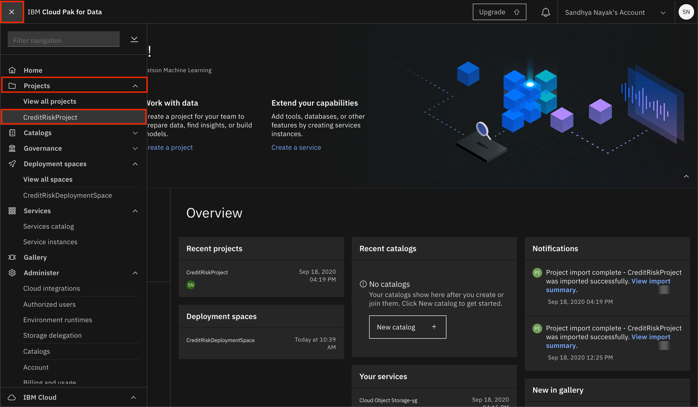
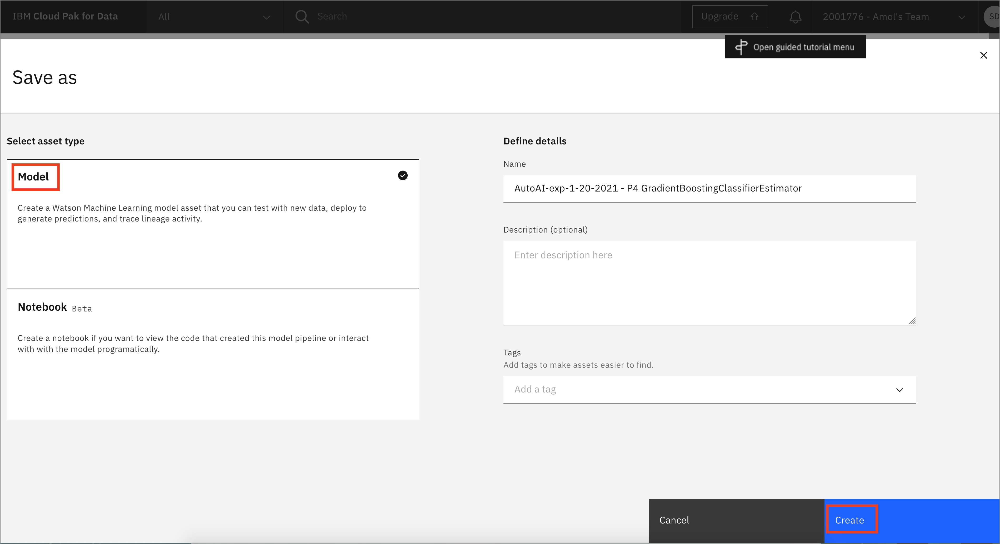
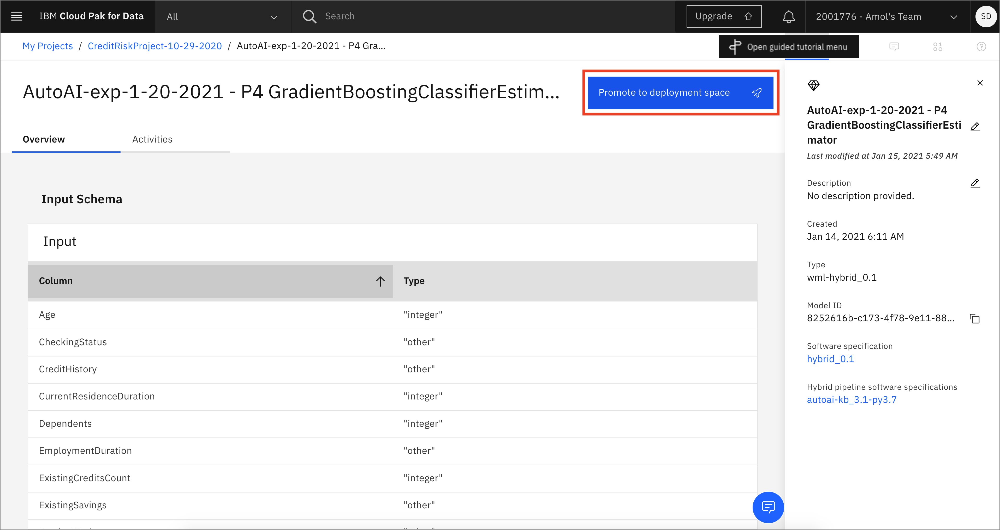
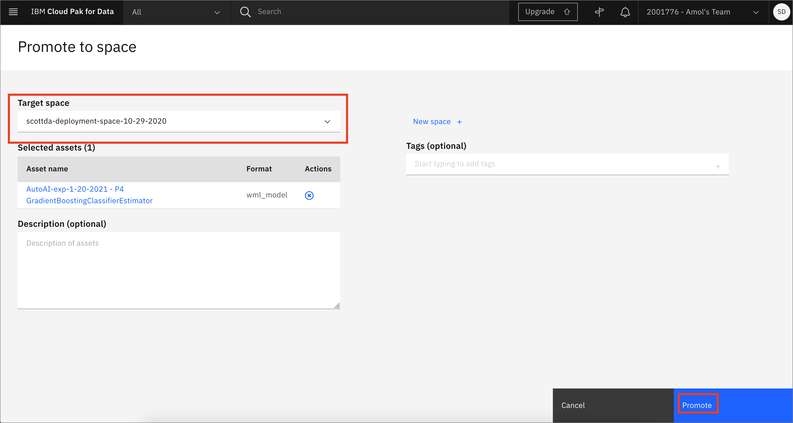
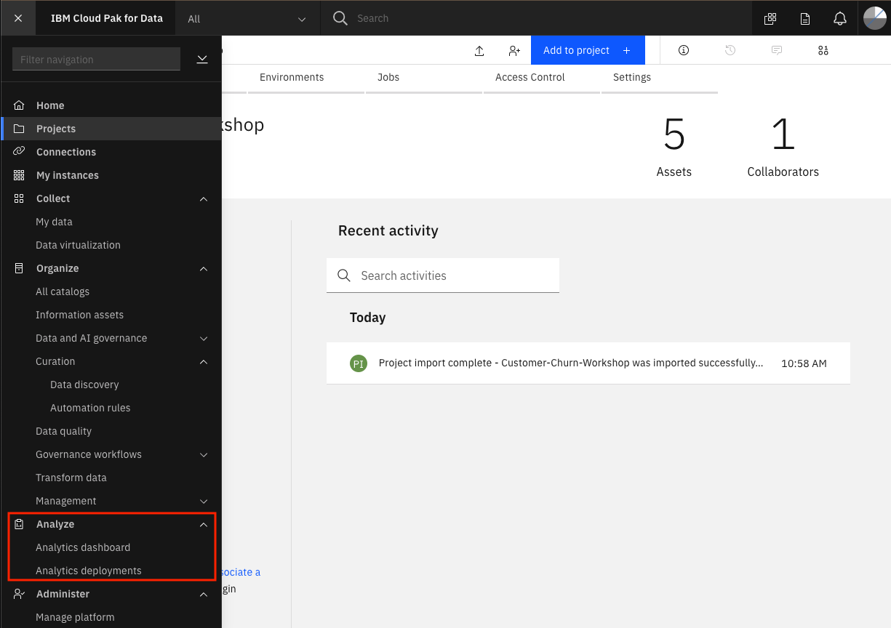

# Updating your models and deployments

In this module, we will explore how we can update a model or deployment once it has been released/created. Model operations and lifecycle management includes many different aspects that would need to be addressed, including, but not limited to: determining when a model needs to be replaced, testing models, comparing model performance, deployment testing (for example canary testing), and much more. In this lab we will focus just on the capabilities to update the model or the deployment, not on the methodology or testing approach.

> **Note:** The lab instructions below assume you have completed the Machine Learning with AutoAI labs. You should have already created a model and an online deployment which we will update in this lab.

## Updating a Deployment

Once a deployment is created for a model, there may be consumers/clients of that model that depend on the endpoint to that deployment not changing. In this section we are going to update an existing deployment to use a new model asset (for example, when you have created a model with improved performance).

### Save and Promote a Second Model

* To get started, we will need to identify the new model we want to use. Go the (☰) navigation menu, expand `Projects` and then click on your analytics project.

* Click on the completed AutoAI experiment you previously ran.

* Scroll down to see the `Pipeline leaderboard`. In this case, Pipeline 4 (a Gradient Boosting Classifier) was the pipeline with the best result for our experiment and the one we deployed previously. We will deploy a second pipeline using a different model algorithm. Click on the `Save as` button next for one of other pipelines. In this case, we are saving Pipeline 8 (an XGB classifier).

* Choose the `Model` tile, accept the default name or change it if you like. Add optional description or tags, and click `Create`.

* You will receive a notification to indicate that your model is saved to your project. Go back to your project main page by clicking on the `View in project` link.

* Alternately, closing the window will expose the path back to the project at the top of the screen.

* You will see the new models under `Models` section of the `Assets` page.

* Now click on the name of your second saved model.

* Next, click on the `Promote to deployment space`:

* Select the deployment space that was created as part of the pre-work as the `Target space` and click `Promote`.

* You will see a notification that the model was promoted to the deployment space succesfully.

### Modify the Online Deployment

* Next, lets go to our deployment space to view our model assets and deployments. Navigate to the left-hand (☰) hamburger menu and choose `Analyze` -> `Analytics deployments`:

* Choose the deployment space you setup previously by clicking on the name of your space. You will see the models you promoted to this space in the assets panel. Lets check the deployment you created previously. Click on the `Deployment` tab and select the deployment name you previously created.

* Notice in the deployment details the endpoint has an unique ID and the deployment is pointing to a specific model asset (in this case the Pipeline 4 model). Optionally, feel free to test the model by submitting a sample payload in the test panel as you did in the [model deployment lab](./README.md).

* Go back to the deployment space overview by clicking on the deployment space name in the navigation breadcrumbs on the top left.

* Now, on the `Deployments` tab. Click on the three vertical dots to the right of your deployment. Then select the `Replace asset` option from the menu.

* You can now select the asset that will replace the existing model for this deployment. One thing to note is that you should only select an asset that is using a framework compatible with the existing deployed mdoel and that the input schema exists and matches between the new and deployed model. Otherwise, the deployment may fail. Click the checkbox next to the model you promoted to this space in the section above (in this case, Pipeline 8). Then click the `Replace` button.

* The deployment will be updated to use the replaced model. This may take a few minutes, during which time you will see the status set to `Updating`.

* Once the update completes, you will receive a notification that the deployment has been updated. Notice that the asset name has already changed. To validate the update, click on the deployment name.

* Notice that the endpoint has not changed (the unique id is still the same) but the associated asset has been updated to our new model.

* Optionally, feel free to test the model by submitting a sample payload in the test panel as you did in the [model deployment lab](./README.md). You may notice that the model makes a different prediction.

## Conclusion

In this section we covered one approach to updating the deployment of a machine learning model. Although there are other aspects to managing and operating machine learning models in production, we have seen how to make changes to a model without impacting the model serving endpoint.
