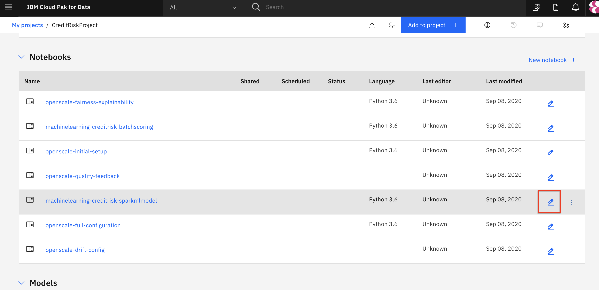
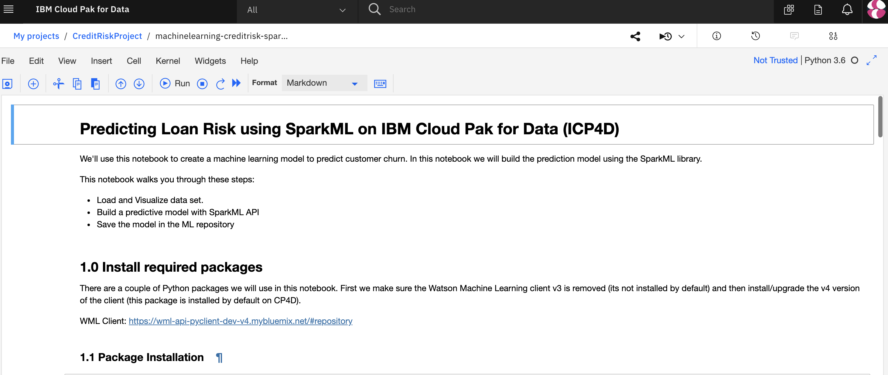
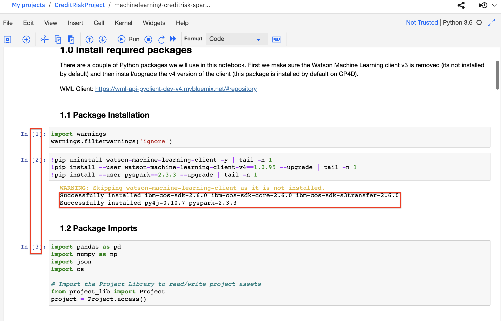
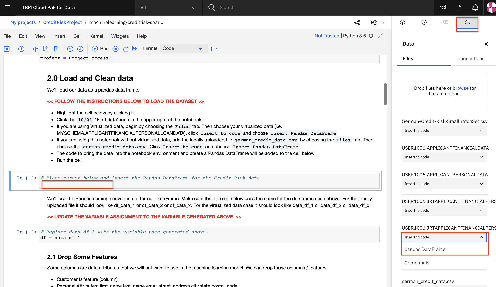
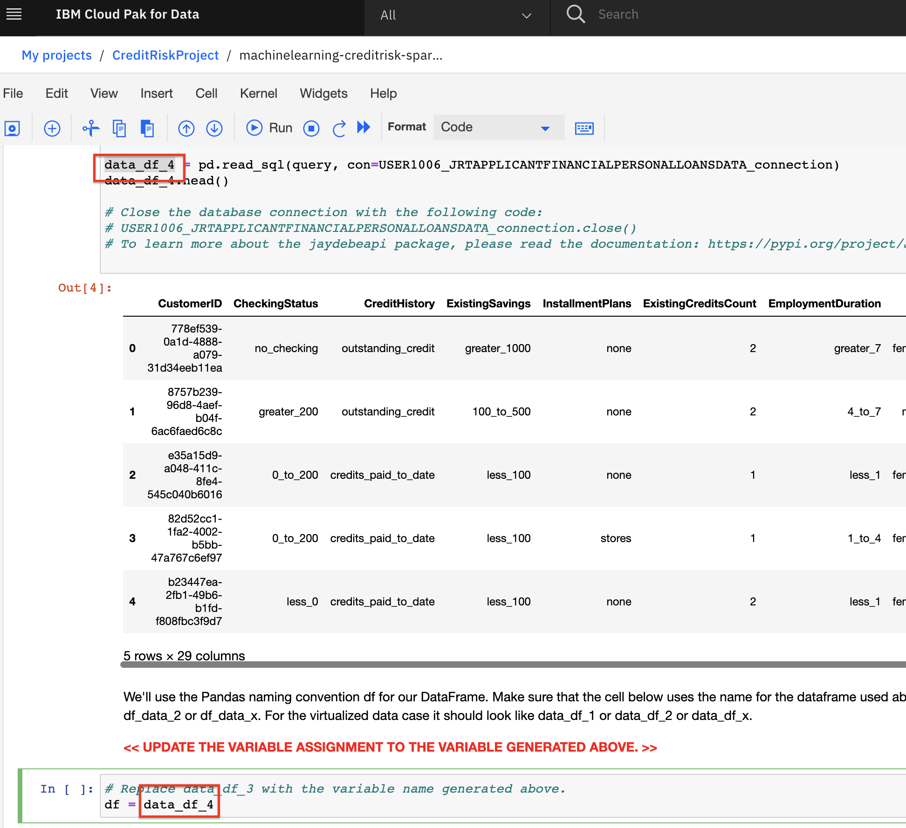
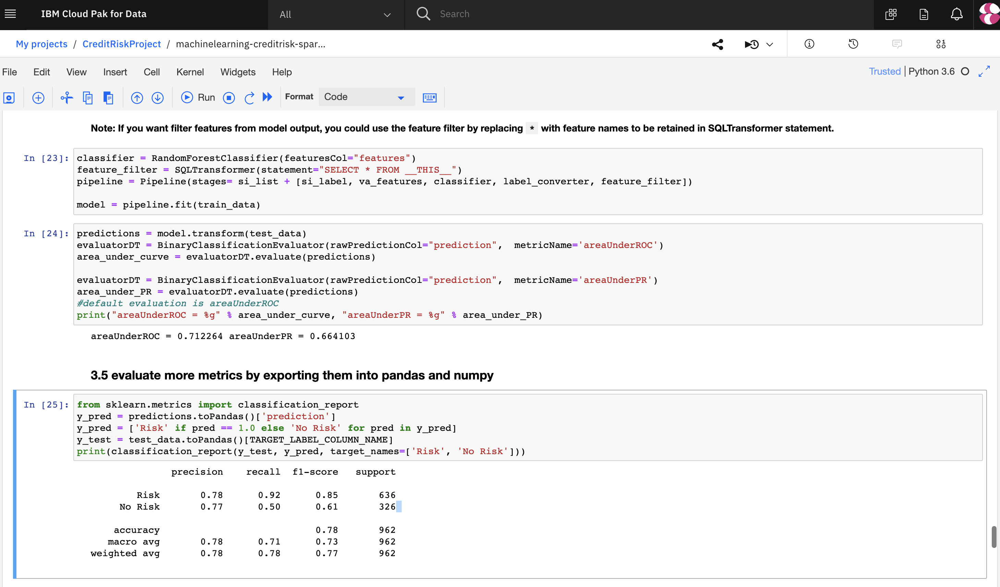
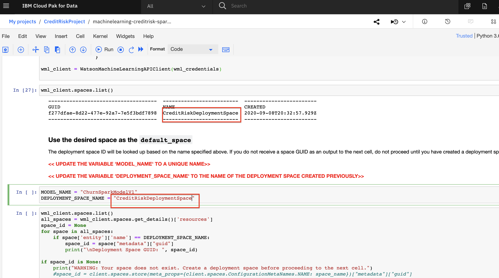
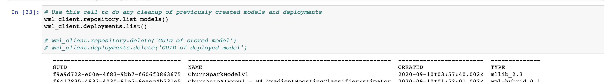

# Machine Learning in Jupyter Notebook

In this module, we will go through the process of exploring our data set and building a predictive model that can be used to determine the likelihood of a credit loan having 'Risk' or 'No Risk'. For this use case, the machine learning model we are building is a classification model that will return a prediction of 'Risk' (the features of the loan applicant predict that there is a good chance of default on the loan) or 'No Risk' (the applicant's inputs predict that the loan will be paid off). The approach we will take in this lab is to use the most popular Mchine Learning libraries and frameworks to build our classification model in Python using a Jupyter notebook. Once we have built the model, we will make it available for deployment.

> **Note:** The lab instructions below assume you have completed the pre-work section already, if not, be sure to complete the pre-work first to create a project and a deployment space.

## Build and Save a model

For this lab we're going to use a Jupyter notebook to create the model. The Jupyter notebook is already included as an asset in the project you imported earlier.

<!-- Update this link. It only works in GH as a relative address -->
> **Note:** The Jupyter notebook included in the project has been cleared of outputs. You can see the notebook that has already been completed with output here: [Notebook with output.](../../notebooks/with-output/machinelearning-creditrisk-sparkmlmodel-with-output.ipynb)

### Open the Jupyter notebook

* Go the (☰) navigation menu, expand `Projects` and then click on the project you created in the pre-work.


* From your `Project` overview page, click on the `Assets` tab to open the assets page where your project assets are stored and organized.

* Scroll down to the `Notebooks` section of the page and click on the pencil icon at the right of the `machinelearning-creditrisk-sparkmlmodel` notebook.



* When the Jupyter notebook is loaded and the kernel is ready, we will be ready to start executing it in the next section.



### Run the Jupyter notebook

Spend some time looking through the sections of the notebook to get an overview. A notebook is composed of text (markdown or heading) cells and code cells. The markdown cells provide comments on what the code is designed to do.

You will run cells individually by highlighting each cell and clicking the `Run` button at the top of the notebook. Alternatively, you can press `Shift` + `Enter` keys to do the same. While the cell is running, an asterisk (`[*]`) will show up to the left of the cell. When that cell has finished executing a sequential number will show up (i.e. `[17]`).

> **Note:** Some of the comments in the notebook require you to modify specific sections of the code. Perform any changes as indicated before running the cell. These directions are written in color red.

#### Load and Prepare Dataset

* Section `1.0 Install required packages` will install some of the libraries we are going to use in the notebook (many libraries come pre-installed on Cloud Pak for Data as a Service). Note that we upgrade the installed version of Watson Machine Learning Python Client. Ensure the output of the second code cell is that the python packages were successfully installed.

  * Run the code cells in section 1.1 and 1.2. Ensure that the cells complete before continuing.



* Section `2.0 Load and Clean data` will load the data set we will use to build our machine learning model. In order to import the data into the notebook, we are going to use the code generation capability of Watson Studio.

  * Highlight the code cell below by clicking it. Ensure you place the cursor below the first comment line.
  * Click the 01/00 "Find data" icon in the upper right of the notebook to find the data asset you need to import.
  * Find the `german_credit_data.csv` data set that has been included in the project.
  * Click `Insert to code` and choose `pandas DataFrame`. The code to bring the data into the notebook environment and create a Pandas DataFrame will be added to the cell below.
  * Run the cell and you will see the first five rows of our dataset.




> **Important:** Note that since we are using generated code to import the data, you will need to update the next cell to assign the `df` variable. Copy the variable that was generated in the previous cell ( it will look like `df=data_df_1`, `data_df_2`, etc) and assign it to the `df` variable (for example `df=df_data_1`>.**Important:** 



* Continue to run the remaining cells in section 2 to explore and clean the data.

#### Build Machine Learning Model

* Section `3.0 Create a model` cells will run through the steps to build a model pipeline.

  * We will split our data into training and test data, encode the categorical string values, create a model using the Random Forest Classifier algorithm, and evaluate the model against the test set.
  * Run all the cells in section 3 to build the model.



#### Save the model

* Section `4.0 Save the model` will save the model to your project.

* We will be saving and deploying the model to the Watson Machine Learning service on IBM Cloud. In section 4.1, be sure to update the `api_key` and `location` variables using the IBM Cloud platform API key and WML service region code. Remember that we obtained them in the pre-work section earlier.

```python
api_key = '<api-key>'
location = '<location>'
```

* In section 4.2, you will update the `MODEL_NAME` and `DEPLOYMENT_SPACE_NAME` variables. For the `MODEL_NAME`, make sure to use a unique name. For the `DEPLOYMENT_SPACE_NAME`, copy the name of your deployment space which was output in the previous code cell.

```python
MODEL_NAME = "<model-name>"
DEPLOYMENT_SPACE_NAME = "<deployment-space-name>"
```



* Continue to run the cells in the section to save the model to Cloud Pak for Data. Once your model is saved, the call to `wml_client.repository.list_models()` will show it in the output.



**We've successfully built and saved a machine learning model programmatically. Congratulations!**

> **Important**: Make sure that you stop the kernel of your notebook(s) when you are done, in order to conserve resources! You can do this by going to the Asset page of the project, selecting the three vertical dots under the Action column for the notebook you have been running and selecting to `Stop Kernel` from the Actions menu. If you see a lock icon on the notebook, click it to unlock the notebook before you click the Actions so you can see the stop kernel option.
> 

## Conclusion

In this section we covered one approach to building machine learning models on Cloud Pak for Data. We have seen::

* How to build a model using Jupyter Notebook
* Saving models using the Watson Machine Learning SDK.

With this knowledge you should feel right at home within the Jupyter notebook. Moreover, you now know how to build models and use them in real life scenarios.
