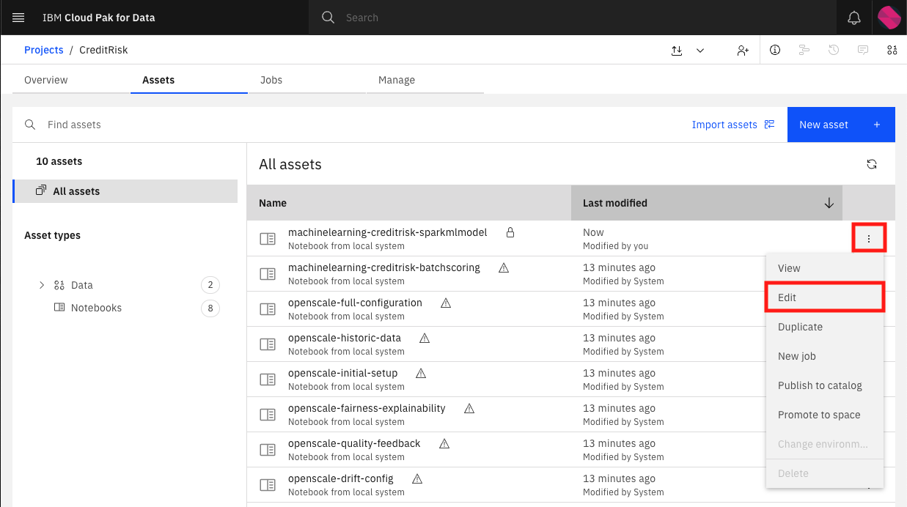
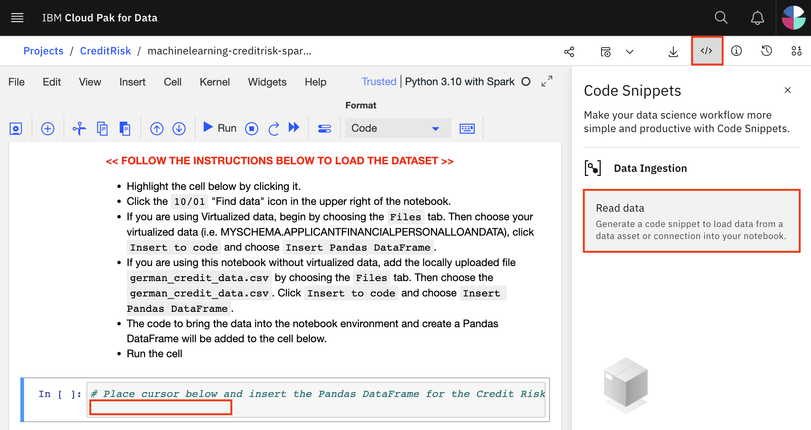
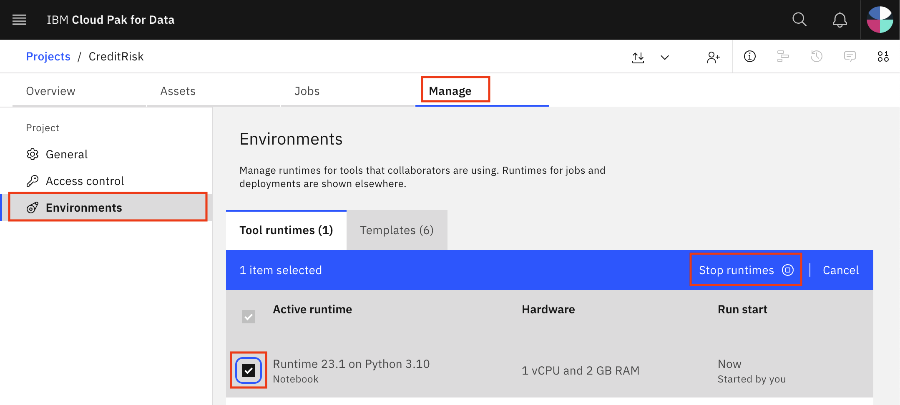

# Machine Learning in Jupyter Notebook

In this module, we will go through the process of exploring our data set and building a predictive model that can be used to determine the likelyhood of a credit loan having 'Risk' or 'No Risk'. For this use case, the machine learning model we are building is a classification model that will return a prediction of 'Risk' (the features of the loan applicant predict that there is a good chance of default on the loan) or No Risk (the applicant's inputs predict that the loan will be paid off). The approach we will take in this lab is to some fairly popular libraries / frameworks to build the model in Python using a Jupyter notebook. Once we have built the model, we will make it available for deployment so that it can be used by others.

> *Note: It is assumed that you have followed the instructions in the pre-work section to create a project based on an existing project file. If you did not use the project import or do not see the Jupyter notebooks mentioned in this module, see the `Workshop Resources` -> `FAQs / Tips` section for instructions to import the necessary notebooks. Also note that the Jupyter notebooks included in the project have been cleared of output. If you would like to see the notebook that has already been completed with output, see the `Workshop Resources` -> `FAQs / Tips` section for links to the completed notebooks.*

## Build and Save a model

For this part of the exercise we're going to use a Jupyter notebook to create the model. The Jupyter notebook is already included as an asset in the project you imported earlier.

### Open the Jupyter notebook

* Go the (☰) navigation menu and under the *Projects* section click on *`All Projects`*.


* Click the project name you created in the pre-work section.

* From your `Project` overview page, click on the *`Assets`* tab to open the assets page where your project assets are stored and organized.

* Scroll down to the `Notebooks` section of the page and click on the "kebab" icon (three vertical dots) to right of the `machinelearning-creditrisk-sparkmlmodel` notebook then click `Edit`.



* When the Jupyter notebook is loaded and the kernel is ready, we will be ready to start executing it in the next section.


### Run the Jupyter notebook

Spend some time looking through the sections of the notebook to get an overview. A notebook is composed of text (markdown or heading) cells and code cells. The markdown cells provide comments on what the code is designed to do.

You will run cells individually by highlighting each cell, then either click the `Run` button at the top of the notebook or hitting the keyboard short cut to run the cell (`Shift + Enter` but can vary based on platform). While the cell is running, an asterisk (`[*]`) will show up to the left of the cell. When that cell has finished executing a sequential number will show up (i.e. `[17]`).

> **Note: Some of the comments in the notebook (those in bold red) are directions for you to modify specific sections of the code. Perform any changes as indicated before running / executing the cell.**

#### Load and Prepare Dataset

* Section `1.0 Install required packages` will install some of the libraries we are going to use in the notebook (many libraries come pre-installed on Cloud Pak for Data). Note that we upgrade the installed version of Watson Machine Learning Python Client. Ensure the output of the first code cell is that the python packages were successfully installed.

    * Run the code cells in section 1.1 and 1.2. Ensuring that the cells complete before continuing.

    

* Section `2.0 Load and Clean data` will load the data set we will use to build out machine learning model. In order to import the data into the notebook, we are going to use the code generation capability of Watson Studio.

    * Highlight the code cell below by clicking it. Ensure you place the cursor below the first comment line.

    * Click the `</>` "Code Snippets" icon in the upper right of the notebook to find the data asset from your project. Click on the `Read data` button.

    

    * Click on the `Select data from project` button.

    

    * Click on `Data asset` to see the data available within the project. 

    * If you are using virtualized data, then choose your virtualized merged view (i.e. `USERXXXX.APPLICANTFINANCIALPERSONALLOANSDATA`). If you are using this notebook without virtualized data, you can use the `german_credit_data.csv` CSV file version of the data set that has been included in the project. Click `Select`.

    

    * For your dataset, select `pandas DataFrame` from the "Load as" dropdown. Click on `Insert code to cell` to add the snippet to the notebook.

    

    * Run the cell and you will see the first five rows of our dataset.

    

* Since we are using generated code to import the data, you will need to update the next cell to assign the `df` variable. Copy the variable that was generated in the previous cell ( it will look like `df=data_df_1`, `data_df_2`, etc) and assign it to the `df` variable (for example `df=df_data_1`).


* Continue to run the remaining cells in section 2 to explore and clean the data.

#### Build Machine Learning Model

* Section `3.0 Create a model` cells will run through the steps to build a model pipeline.

    * We will split our data into training and test data, encode the categorial string values, create a model using the Random Forest Classifier algorithm, and evaluate the model against the test set.
    * Run all the cells in section 3 to build the model.


#### Save the model

* Section `4.0 Save the model` will save the model to your project.

* We will be saving and deploying the model to the Watson Machine Learning service within our Cloud Pak for Data platform. In the first code cell in section 4.1, be sure to update the `wml_credentials` variable as follows:

    * The url should be the full hostname of the Cloud Pak for Data instance, which you can copy from your browsers address bar (for example, it may look like this: `https://zen.clustername.us-east.containers.appdomain.cloud`)
    * The username and password should be the same credentials you used to log into Cloud Pak for Data.

* You will update the `MODEL_NAME` and `DEPLOYMENT_SPACE_NAME` variables. For the `MODEL_NAME`, create a unique and easily identifiable model name. For the `DEPLOYMENT_SPACE_NAME`, copy the name of your deployment space which was output in the previous code cell.

```python
MODEL_NAME = "user123 credit risk model"
DEPLOYMENT_SPACE_NAME = "Name you used for deployment space"
```


* Continue to run the cells in the section to save the model to Cloud Pak for Data. Once your model is saved, the call to `wml_client.repository.list_models()` will show it in the output.


**We've successfully built and saved a machine learning model programmatically. Congratulations!**

## Stop the Environment

**Important**: In order to conserve resources, make sure that you stop the environment used by your notebook(s) when you are done.

* Navigate back to your project information page by clicking on your project name from the navigation drill down on the top left of the page.


* Click on the 'Environments' tab near the top of the page. Then in the 'Active environment runtimes' section, you will see the environment used by your notebook (i.e the `Tool` value is `Notebook`). Click on the three vertical dots at the right of that row and select the `Stop` option from the menu.



* Click the `Stop` button on the subsequent pop up window.

## Conclusion

In this section we covered one approach to building machine learning models on Cloud Pak for Data. We have seen::

* How to build a model using Jupyter Notebook
* Saving models using the Watson Machine Learning SDK.

With this knowledge you should feel right at home within the Jupyter notebook. Moreover, you now know how to build a model and use it in a real life scenario.
