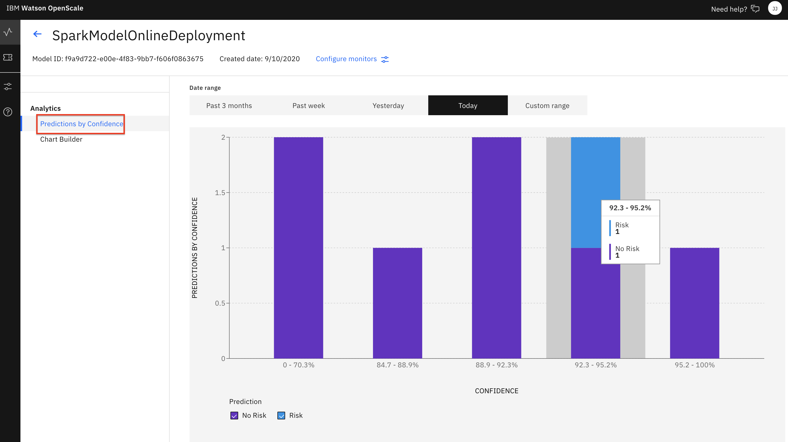

# Trust in AI & Watson OpenScale

This lab will guide you through building a machine learning model and connecting it with Watson OpenScale to monitor the models performance and potential bias.

## Steps

The lab contains the following steps:

1. [Introduction](#1-introduction)
1. [Begin to Explore the Watson OpenScale UI](#2-begin-to-explore-the-watson-openscale-ui)
1. [Monitor Models](#3-monitor-models)
1. [Quality and Explainability](#4-quality-and-explainability)
1. [Configuring OpenScale monitors for Fairness and Drift](#5-configuring-openscale-monitors-for-fairness-and-drift)

## Introduction

Watson OpenScale tracks and measures outcomes from your AI models, and helps ensure they remain fair, explainable and compliant wherever your models were built or are running. OpenScale is designed as an open platform that will operate with various model development environments and various open source tools, including TensorFlow, Keras, SparkML, Seldon, AWS SageMaker, AzureML and more.

Watson OpenScale provides a set of monitoring and management tools that help you build trust and implement control and governance structures around your AI investments.

* Providing production monitoring for compliance and safeguards \(auditing model decisions, detecting biases, etc\)
* Ensuring that models are resilient to changing situations
* Aligning model performance with business outcomes

### Lab Overview

The scenario we will use in this lab is around credit lending. Lenders want to give more loans to a wider variety of customers. To do this, they are turning to complex credit risk machine learning models \(sometimes black box models\) that help determine if those customers are eligible for a loan based on a variety of different features, such as credit history, age, number of dependents, application education, job title, etc.

As credit risk models expand to use these alternate data sources, we introduce risk that the model may find some unexpected correlations in the data and make biased predictions based on an applicant’s age, gender, or other personal traits.

In this lab will walk through the process of deploying a credit risk model and then monitoring the model to explore the different aspects of trusted AI. By the end of the lab, we will have:

* Deployed a model from development to a runtime environment.
* Monitored the performance \(operational\) of the model over time.
* Tracked the model quality \(accuracy metrics\) over time.
* Identified and explored the fairness of the model as it's receiving new data.
* Understood how the model arrived at its predictions.
* Tracked the robustness of the model.

### Prerequisites

It is assumed that an admin has already connected a database to OpenScale, and associated a Machine Learning Provider (in our case, Watson Machine Learning on Cloud Pak for Data).

You have already provided a set of sample data to your model when you tested your deployed ML model in an earlier model of the workshop.

For example, using the UI to test the deployed model, or using cURL or the Python app. Do this now if you have not already run a test.

## Begin to Explore the Watson OpenScale UI

Now that you have created a machine learning model and configured OpenScale, you can utilize the OpenScale dashboard to monitor the model. Although we have not enabled any type of monitoring yet, with the deployment approach we are using for this lab \( Watson Machine Learning as the model engine \), we will be able to see payload and some performance information out of the box.

* In the same browser \(but a separate tab\), open the `Services` tab by clicking the icon in the upper right. Go to the `OpenScale` tile under the `AI` category and click `Open`:

* When the dashboard loads, _**Click**_ on the _**'Model Monitors'**_  tab and you will see the one deployment you configured in the previous section.

Do not worry if the name you see does not match exactly with the screenshot. The deployment name you see will correspond to the variable used in the Jupyter notebook

### Throughput

* From the 'Model Monitors' tab, click on the deployment tile you have created. You will see a graph of average throughput over time \(we have only run a small number of requests through our model, so we see on spike in the graph\)

* Click on the bar in the throughput graph and you will be able to find the actual transactions \(if you executed the cells of the notebook in the previous section only once, you would see just the 8 scoring requests we made after enabling the subscription\).

### Confidence Distribution

You can also use the OpenScale dashboard to visualize the confidence of the models predictions.

* Click on the back arrow icon next to the chart title:

* Click on the _**'Predictions by Confidence'**_ option on the left panel.

* You will see the number of 'Risk' and 'No Risk' predictions for each confidence range.

> NOTE: If you see payload information you have successfully subscribed Watson OpenScale to the deployed machine learning model. You're ready to continue to the next section to enable different model monitors.

## Monitor Models

Model monitors allow Watson OpenScale to capture information about the deployed model, evaluate transaction information and calculate metrics. There are several monitors that can be enabled:

* Fairness monitor scans your deployment for biases, to ensure fair outcomes across different populations.
* Quality monitor \(previously known as the accuracy monitor\) lets you know how well your model predicts outcomes.
* Drift monitor detects when the model drops in accuracy and/or starts receiving data inconsistent with how it was trained.
* Explainability provides transparency in models by allowing you to see what lead the model to make specific predictions.

### Data sets

For many of these monitors, OpenScale will make use of the following data:

* \(Optional\) Training data that was used to train the model.
* Transaction data \(input/request and output/response information\) going to the deployed models which is stored in the payload table of the data mart.
* Feedback data with labeled predictions to measure the effectiveness of predictions and when retraining is needed which is stored in the feedback table of the data mart.

For this lab since our model is deployed in Watson Machine Learning, the scoring payload is automatically sent to Watson OpenScale and stored in its data mart when you score the model.

To emulate the monitoring of a model in production, in addition to making scoring/prediction requests to the actual model, you will also inject historical data into the OpenScale data mart.

## Quality and Explainability

### Quality and Explainability Notebook

Quality \(performance\) monitors allow users to track performance of production AI and its impact on business goals. We will use a Jupyter notebook in the project you imported to enable these additional capabilities in the subscription.

#### Open Notebook

* From your project page, go to `Notebooks`:

* Under the 'Notebooks' section, _**Click**_ on the _**'quality-explainability-monitors'**_ notebook and then click on the pencil icon to enable you to edit / run the notebook.

#### Update Credentials

# TODO fix credentials instructions below

After the notebook environment starts up, scroll down to the section titled _**'Configure Service Credentials'**_.  Copy and Paste the Watson Machine Learning service credentials and the Cloud API Key that you saved to a text editor earlier.

#### Run Notebook

Go back to the first cell in the notebook and run the notebook. You can run the cells individually by clicking on each cell and then click the `Run` button at the top of the notebook.

While the cell is running, an asterisk \(`[*]`\) will show up to the left of the cell. When that cell has finished executing a sequential number will show up. Generally, you want to wait until the cell finished executing before running the subsequent cells.

Alternatively, you can elect to run all the cells by clicking the **'Run All'** option

#### Explore the Watson OpenScale UI

##### Check Model Quality

The quality monitor scans the requests sent to your model deployment \(i.e the payload\) to let you know how well your model predicts outcomes. Quality metrics are calculated hourly, when OpenScale sends manually labeled feedback data set to the deployed model.

* From your project page, go to `Notebooks`.

* When the dashboard loads, _**Click**_ on the _**'Model Monitors'**_  tab and you will see the one deployment you configured in the previous section.

* We now have an alert on the Quality of the model.
* _**Click**_ on the deployment tile to open the details page and then _**Click**_ on the _'Area under ROC'_  option on the left panel.
* We have set a threshold of 70% and based on the feedback data loaded in the notebook, the model is performing below that threshold.

* Feel free to explore the other quality metrics for the model. **Click** on the blue dot \(which represents the quality run we initiated from the Jupyter Notebook\), to view more details for a particular point on the performance graph.

## Configuring OpenScale monitors for Fairness and Drift

There are several ways to configure Watson OpenScale to monitor a machine learning model. For a quick example, you can use the automated setup. You can use the APIs to use Python in a Juptyer notebook.
In this exercise, we'll use the OpenScale tools to configure some of the monitors in the interactive setup.

### Prepare model for monitoring

From the `Insights Dashboard` on the `Model Monitor` tab, click on `Add to dashboard`:

In the `Payload logging` section, select the type of input. In our case, choose `Categorical`:

In the `Model details` sections, select `Manually configure monitors`:

In the `Quality alert` section, set the *alert threshold* to *70%* and the *sample size* to *100*:

### Configure Fairness monitoring

The fairness monitor scans the requests sent to your model deployment \(i.e the payload\) to ensure fair outcomes across different populations. In this lab, the credit risk model uses a training dataset that contains 20 attributes about each loan applicants. Two of those attributes - 'Sex' and 'Age' - are the ones we will monitor for bias.

* Open the [Watson OpenScale dashboard](https://aiopenscale.cloud.ibm.com).
* When the dashboard loads, _**Click**_ on the _**'Model Monitors'**_  tab and you will see the one deployment you configured in the previous section.

* **Click** on **'Configure monitors'**

* **Click** on 'Fairness' on the left panel and then on the 'Begin' button.

* The first thing we define when configuring fairness, is what outcome \(i.e. prediction\) is favorable vs unfavorable. In the risk model, a favorable outcome is a 'No Risk' prediction as this prediction may lead to the application receiving a loan, and an unfavorable outcome is a 'Risk' prediction. Go ahead and drag and drop the two label values to the corresponding favorable/unfavorable values, then click the 'Next' button

* OpenScale will actually analyze the training data and recommend which feature to monitor for fairness. We want to monitor for fairness for the 'Sex' and 'Age' features, ensure those two tiles are selected and click the 'Next' button.

* Next, we want to specify which is the majority group and which the minority group for the 'Sex' feature. In our model, we want to ensure there is no bias towards female loan applicants vs males, and towards younger applicants. OpenScale will recommend the values for you, click the 'Next' button
  * **Majority** groups are values of that feature that we expect to receive a higher percentage of favorable outcomes
  * **Minority** groups are values of that feature that we expect to receive a higher percentage of unfavorable outcomes

* Next we configure at what point we want OpenScale to display an alert if the fairness measurement falls below a certain threshold. If the rate at which the minority/protected group receives favorable outcomes relative to the majority/reference group, falls below this threshold an alert will be triggered \(the model is biased\). For the lab, set the threshold to  95%.

* Complete the same configuration for the 'Age' feature. For this feature we want
  * The Reference \(majority\) group is 26 - 75
  * The monitored group is 18 - 25.
  * The fairness alert threshold should be 95%
* Finally, we have to specify a minimum number of records \(scoring requests\) that need to be received before calculating fairness. Set it to 200 for the lab and click the 'Next' button

* **Click** the 'Save' button on the summary page.

### Drift Configuration

The drift monitor scans the requests sent to your model deployment \(i.e the payload\) to ensure the model is robust and does not drift over time. Drift in model predictions can occur either because the requests sent to the model are requests similar to samples in the training data where the model struggled, or because the requests are becoming inconsistent with the training data the model originally used.

* Continuing from the configure monitors page, **Click** on 'Drift' on the left panel and then on the 'Begin' button.

* In order to train this internal drift detection model, OpenScale will use the training data. Since we provided a connection to our training data \(and its under the size limit\), we can have OpenScale train the model. Select the tile on the left and click the 'Next' button.

* We next set a threshold as percent of degradation in performance before an alert is triggered. Set the threshold to **10%** and click the 'Next button.
* Finally, we have to specify a minimum number of records \(scoring requests\) that are used to  calculate drift. Set it to **100** for the lab and click the 'Next' button.
* Click the 'Save' button.
* The drift model will take a bit of time to train. While it trains, proceed to the next section of the lab below.

### 2. Run Scoring Requests

Now that we have enabled a couple of monitors, we are ready to "use" the model and check if there is any bias or drift. As well as starting to gain transparency by using OpenScale to explain how the model arrived at a prediction.

To do this, we have a Jupyter notebook that will run enough scoring requests to your deployed model to exceed the monitor thresholds we configured above.

If you are waiting for your drift monitor to finish configuring, you can start executing parts of the notebook. Just ensure you do not execute the cell that makes the scoring calls until the drift model is ready \(state is "Monitor ready"\)

#### Open Notebook

* From your project page, go to `Notebooks`:

* Under the 'Notebooks' section, _**Click**_ on the _**'model-scoring-requests'**_ notebook and then click on the pencil icon to enable you to edit / run the notebook.

#### Update Credentials

# TODO: determine proper credentials for CPD

After the notebook environment starts up, scroll down to the section titled _**'Configure Service Credentials'**_.  Copy and Paste the Watson Machine Learning service credentials you saved to a text editor earlier.

#### Run Notebook

Go back to the first cell in the notebook and run the notebook. You can run the cells individually by clicking on each cell and then click the `Run` button at the top of the notebook.

While the cell is running, an asterisk \(`[*]`\) will show up to the left of the cell. When that cell has finished executing a sequential number will show up. Generally, you want to wait until the cell finished executing before running the subsequent cells.

The last cell in the notebook should report that you have received 200 responses for your scoring requests.

### Trigger Monitor Checks

The fairness and drift monitors we configured will automatically be checked every hour or three hours \(as long as we have enough payload records stored\). Instead of waiting, we can force the monitors to be calculated.

* Back in the [Watson OpenScale dashboard](https://aiopenscale.cloud.ibm.com).
* _**Click**_ on the _**'Model Monitors'**_  tab and **Click** will see the one deployment you configured in the previous section.
* You will see we now have two additional sections in the deployment dashboard \(Fairness and Drift\).
* Click on 'Sex' under Fairness and then click on the 'Check fairness now link on the right.
* When the evaluation completes, the page will refresh with bias metrics.

You can also trigger the monitor evaluations programmatically. The notebook called 'dataload-queries-monitortriggers' contains examples on invoking these monitor runs.

### Explore the Watson OpenScale UI

#### Check Model Fairness

Now that we have configured fairness and submitted some scoring requests to our model, we can check if there is bias to either of our protected groups..

* Go back to the [Watson OpenScale dashboard](https://aiopenscale.cloud.ibm.com).
* When the dashboard loads, _**Click**_ on the _**'Model Monitors'**_  tab and you will see the one deployment you configured in the previous section.
* We see there is an alert that the model is exhibiting bias. In this case, we have gone beyond the threshold we set to specify an acceptable difference between the percentage of Favorable outcomes for the Monitored group as compared to the percentage of Favorable outcomes for the Reference group \(Favorable % for monitored group / Favorable % for reference group \* 100 \)
* _**Click**_ on the tile for the model deployment to view details for the deployment.

* You can see the fairness threshold is not met for the 'Sex' attribute.  We are monitoring a female group for fairness by comparing it to the male group \(the reference group\)
  * On the right panel, under ‘ fairness score for Sex’. The fairness score is calculated by comparing 'No Risk' predictions for the female group compared to the male group. You can also see when the last evaluation was conducted.
  * On the graph we can see fairness over time \(which is calculated hourly as predictions are made by the model\).

> NOTE: You must exceed the minimum number of records in the payload table for the fairness calculations to run. If there is not enough new payload data, the graph will show metrics from the last successful evaluation.

#### Fairness Alert Details

> NOTE: The screenshots and metrics numbers may not match your model/deployment. Since we submitted 200 random requests, the data will vary.

We can now dive deeper into the fairness alert, move your mouse pointer over the graph to one of the blue points below the red threshold line \(you will see a 'view details' pop up\)

**Click** on that point to bring up the details.

* From the details page, we can see that the monitored group is receiving favorable outcomes 73%, while the reference group is at 78%.  The default view has the **'Payload + Perturbed'** radio button selected.
  * This displays the fairness outcomes computed by using the actual payload + perturbed data \(synthesized data obtained by flipping the monitored values, male-to-female and female-to-male\).
* _**Click**_ on the 'Payload' radio button to display the payload data the model received for the selected hour.
* _**Click**_ on the 'Training' radio button to display the records used to train the model
  * In this example, we see that there is more training data for men than there is for women.
* _**Click**_ on the 'Debiased' radio button to display the Payload + Perturbed data set after applying the Watson OpenScale debiasing algorithm.
  * OpenScale automatically creates a debiased “shadow model”, which predicts when production model is going to generate a biased output. The de-biased model evaluates whether or note data perturbation \(i.e flipping protected value\) changes the prediction
  * Note that this debiased model has a scoring endpoint that can be put into production and used by clients, but the debiasing of one feature can negatively impact other features.
* _**Click**_ the 'Monitored Feature' drop down and select Age, to view fairness details for different age ranges.

In the debiased view, the **after** accuracy is computed by taking feedback data and sending it to the active debiasing API. The **before** accuracy is computed by taking feedback data and sending it to the production model.

Watson OpenScale supports bias detection for models using structured data in its feature vector. It requires scoring requests to be logged, which is automatic for Watson Machine Learning engines.

#### Transaction Explanation

For both regulatory and business reasons, lenders need to be able to understand why their credit risk models make specific decisions. A powerful feature for OpenScale is the ability to provide an explanation for why a model made a particular prediction.

* _**Click**_ the 'Monitored Feature' drop down and select 'Sex', to view fairness details for gender.
* You can  explain the transactions associated to the fairness metrics, from the 'Payload + Perturbed' screen, **Click** on the **View transactions** button in the fairness details chart.

We want to explore on the transaction that was considered biased. Click on the 'Biased transactions' radio button and then click on 'Explain' for one of the transactions in the table.

> NOTE: The 'Explain a transaction' view can take some to generate as OpenScale is building the contrastive explanations by perturbing data and submitting scoring requests.

From the transaction explanation page, you can see a breakdown of the features contributing to either "Risk" or "No Risk" outcome. We can also see advanced explanations, which show:

* The minimum set of changes in feature values to generate a different prediction. Each feature value is changed so that it moves towards its median value in the training data.
* The maximum changes that can occur in feature values that will not cause the prediction to change. Each feature value is changed so that it moves towards its median value in the training data.

> NOTE: Advanced explanations are not available for regression, image, and unstructured text models.

You can generate explanations for any transaction by clicking on the 'Explain a transaction' icon on the left panel and enter one of the transaction IDs .

### 4.2 Check Model Drift

Over time, the data coming into our model from the initial training data, impacting the both the accuracy of our model and the business processes using the model. Watson OpenScale analyzes transactions to detect drift in model accuracy as well as drift in data.

* Drift in model accuracy happens if there is an increase in transactions that are similar to those that the model did not evaluate correctly in the training data.
* Drift in data estimates the drop in consistency of the data at runtime as compared to the characteristics of the data at training time.

* Go back to the [Watson OpenScale dashboard](https://aiopenscale.cloud.ibm.com).
* When the dashboard loads, _**Click**_ on the _**'Model Monitors'**_  tab and you will see the one deployment you configured in the previous section.

* _**Click**_ on the _**'Drop in accuracy'**_ option on the left panel to show the model drift visualization.

* We can see the model has an estimated drop of 2% and that 12% of the transaction data \(scoring requests\) are inconsistent compared to the training data.
* _**Click**_ on a data point in the 'Drop in accuracy' graph \(blue line in screenshot above\) to view drift details.

> NOTE: The screenshots above may not match exactly what you see in your dashboard. The monitors are using the payload \(scoring requests\) that were sent to the model, which were randomly selected.

In some cases, you may not see a drop in accuracy from model drift. If you do not see anything in your dashboard, you can always submit a new set of requests to the model and trigger the drift evaluation again.

* From here you can explore the transactions that lead to drift in accuracy as well as drifts in data consistency.

> NOTE: If you explore a transaction, it may take some time to generate transaction explanations as OpenScale makes multiple requests to the deployed model.

> NOTE: Drift is supported for structured data only and regression models only support data drift.
