# Monitoring models with OpenScale GUI tool using Auto setup

This exercise shows a few of the features of the OpenScale GUI tool. When you first provision Watson OpenScale, either in the IBM Cloud or on Cloud Pak for Data, you will be offered the choice to automatically configure and setup OpenScale. This is called the Auto setup, and it walks the admin through the required steps and loads some sample data to demonstrate the features of OpenScale. We will use this automated Auto setup in this lab.
It is presumed that OpenScale Auto setup and Watson Machine Learning have already been configured.

## Use the Insights Dashboard

* To launch the OpenScale service, go the (☰) navigation menu and click `Services` -> `Instances`.

 Support tab on the left, and choose `Tour this page.

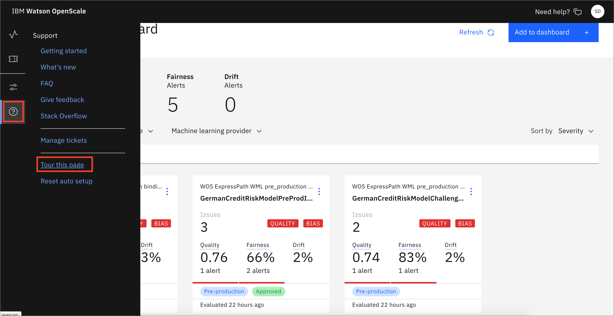

* The OpenScale tour will begin. Follow the tour, and when it is done we'll do some exploration of the tools.

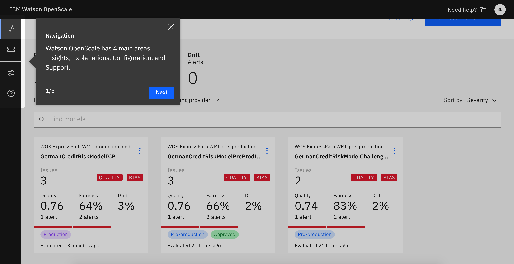

Now lets interact with the tools.

* OpenScale will load the *Insights Dashboard*. This will contain tiles for any models being monitored. The tile for `GermanCreditRiskModelICP` will be the one we will use for this lab, which was configured using the Auto setup script.

* Click on the left-hand menu icon for `Insights`, make sure that you are on the `Model monitors` tab, and then open the tile for the `GermanCreditRiskModelICP` model (click the 3-dot menu on the tile and then `View Details`):

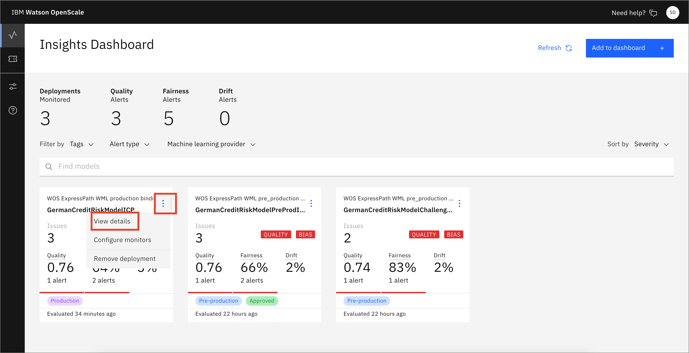

* Notice the red alert indicators on the various monitors (Fairness, Quality, Drift). You should see a red indicator under Fairness. Click on the *Fairness score*.

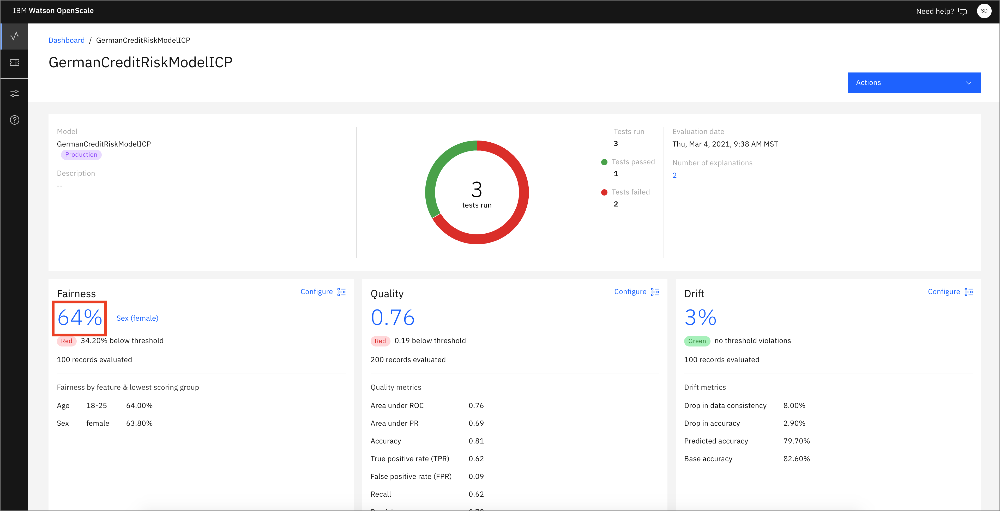

* Click on the triangle with `!` under `Fairness` -> `Sex`. This indicates that there has been an alert for this attribute in the `Fairness` monitor. Alerts are configurable, based on thresholds for fairness outcomes which can be set and altered as desired.

* By moving your mouse pointer over the trend chart, you can see the values change, and which contains bias. Find and click on a spot in the graph that is below the red threshold line to view details.

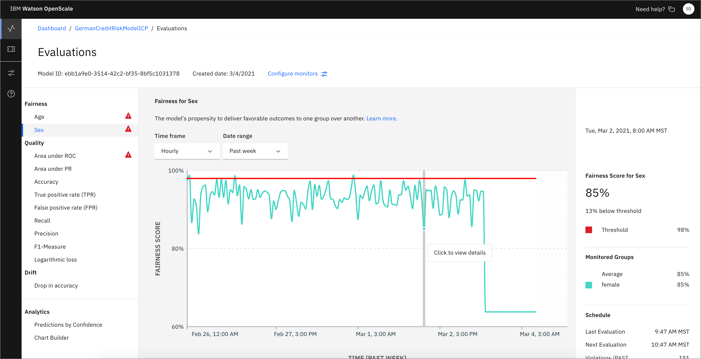

* Once you click on one of the time periods, you will see a list of Transactions. Look for one of the Monitored Group - Female with a "Group Bias" check mark and Prediction of "Risk". Click `Explain prediction`. If the time period on the graph for Fairness Monitoring doesn't contain such an element, go back and choose another time period until you can find one. This will make the explanation more interesting.

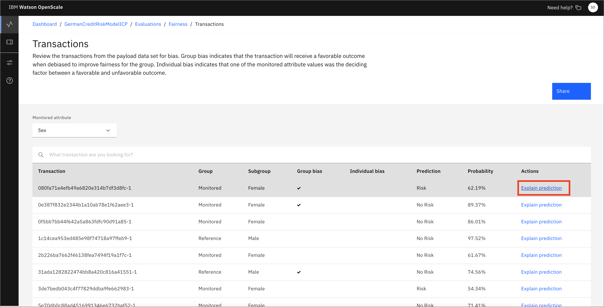

> Note: Each of the individual transactions can be examined to see them in detail. Doing so will cache that transaction, as we will see later. Be aware of the fact that the Explainability feature requires 1000's of REST calls to the endpoint using variations of the data that are slightly perturbed, which can require several seconds to complete.

* On the `Explain` tab for this individual transaction, you can see the relative weights of the most important features for this prediction. Examine the data, then click the `Inspect` tab.

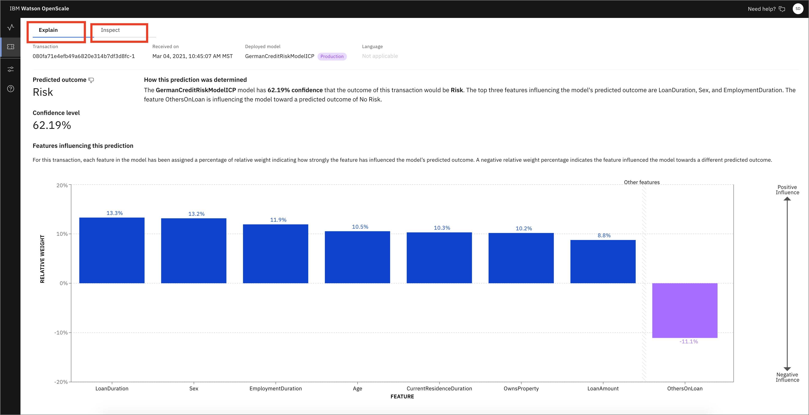

* In the `Inspect` view of this transaction you can see the original features that led to this prediction as well as a series of drop downs and input boxes that offer the ability to change each feature. We can find which features will change the outcome (in this case, from "Risk" to "No Risk") by clicking the `Analysis` button. Note that this requires 1000's of REST calls to the endpoint with slight perturbations in the data, so it can take a few minutes. Click the `Analysis` tab now.

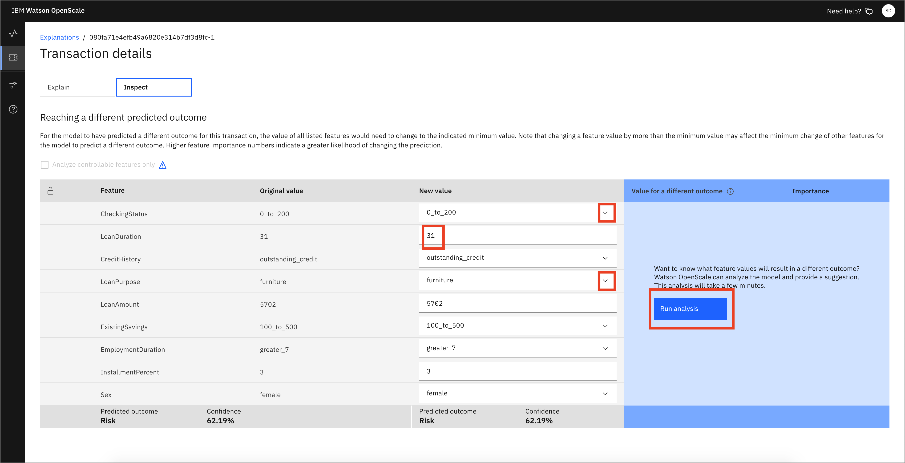

* In this particular transaction, we see that the presence of a "guarantor" on the loan is the only thing required to flip the outcome from "Risk" to "No Risk". Other transactions might show a different analysis, so please be aware that your results might vary from this. In the case in this example, you can click the drop down for *Others on Loan* and change to *guarantor*. 

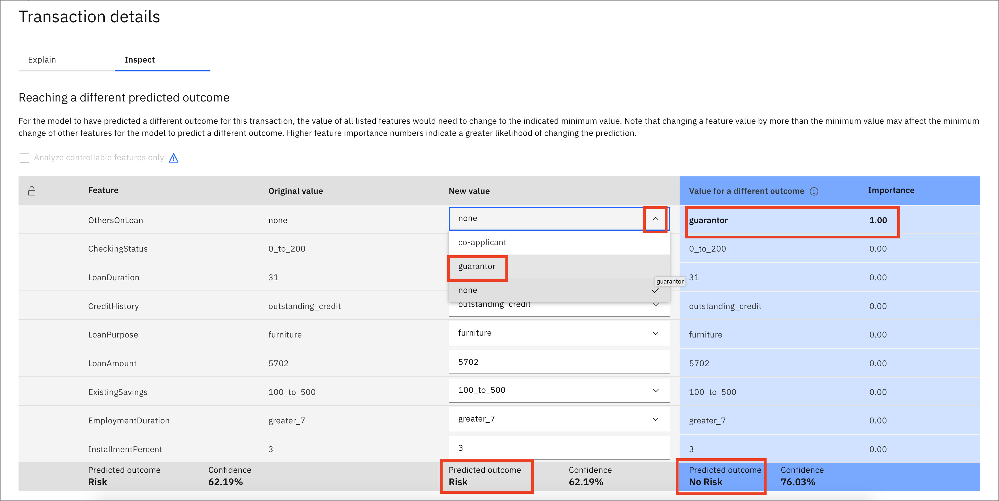

* Choosing this new value for *gurantor* will expose a button for `Score new values`. Click this button.

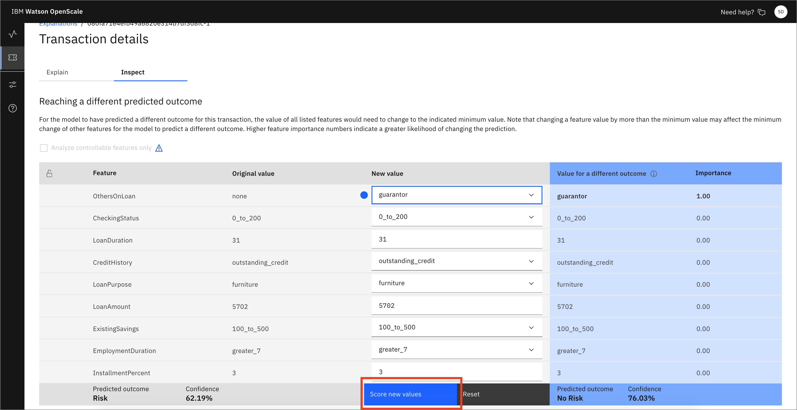

* In this example, we can see that the outcome has now been flipped from "Risk" to "No Risk".

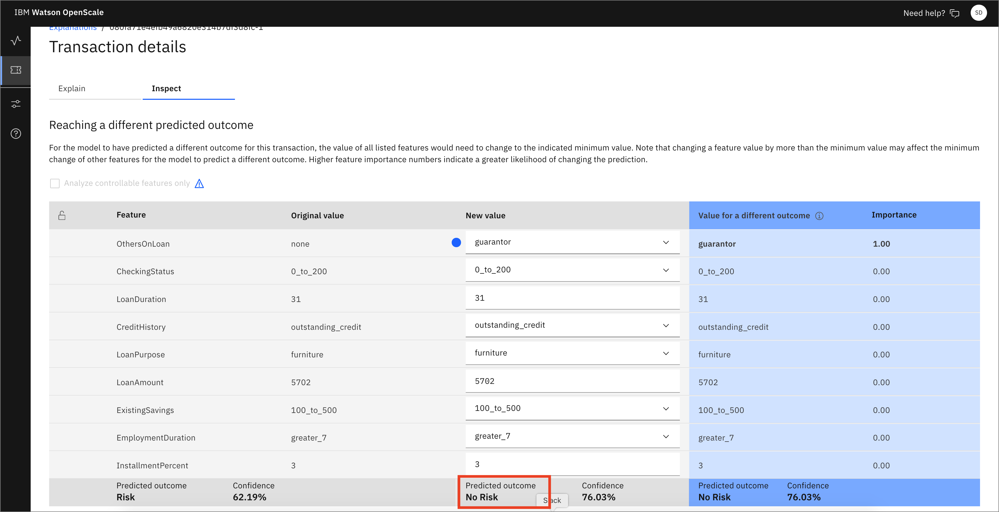

* Now, go back to the *Insights Dashboard* page by clicking on the left-hand menu icon for `Insights`, make sure that you are on the `Model monitors` tab. This time open the monitor configuration for the `GermanCreditRiskModelICP` model by clicking the 3-dot menu on the tile and then `Configure monitors`.

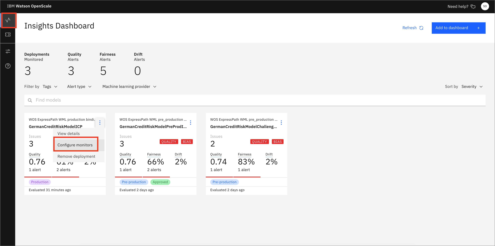

* Click the `Endpoints` menu on the left, then the Endpoints tab. Use the Endpoint pulldown to select `Debiased transactions`. This is the REST endpoint that offers a debiased version of the credit risk ML model, based on the features that were configured (i.e. Sex and Age). It will present an inference that attempts to remove the bias that has been detected. 

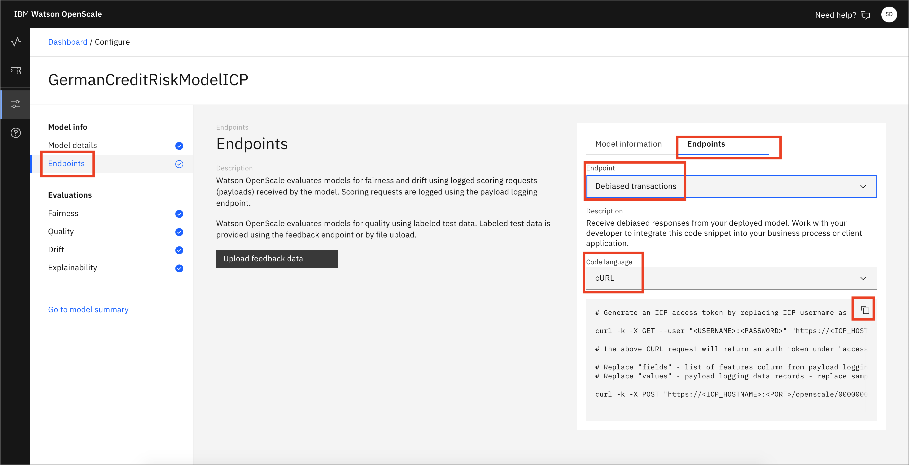

* You can see code snippets using cURL, Java, and Python, which can be used in your scripts or applications.

* Similarly, you can choose the `Feedback logging` endpoint to get code for Feedback Logging. This provides an endpoint for sending fresh test data for ongoing quality evaluation. You can upload feedback data here or work with your developer to integrate the code snippet provided to publish feedback data to your Watson OpenScale database.

## Using the Analytics tools

* Click on the left-hand menu icon for `Insights`, make sure that you are on the `Model monitors` tab, and then open the tile for the `GermanCreditRiskModelICP` model (click the 3-dot menu on the tile and then `View Details`):

* Notice the red alert indicators on the various monitors (Fairness, Quality, Drift). You should see a red indicator under Fairness. Click on the `Fairness score`.

* Click on `Analytics` -> `Predictions by Confidence`. It may take a minute or more to create the chart. Here you can see a bar chart that indicates confidence levels and predictions of "Risk" and "No Risk".

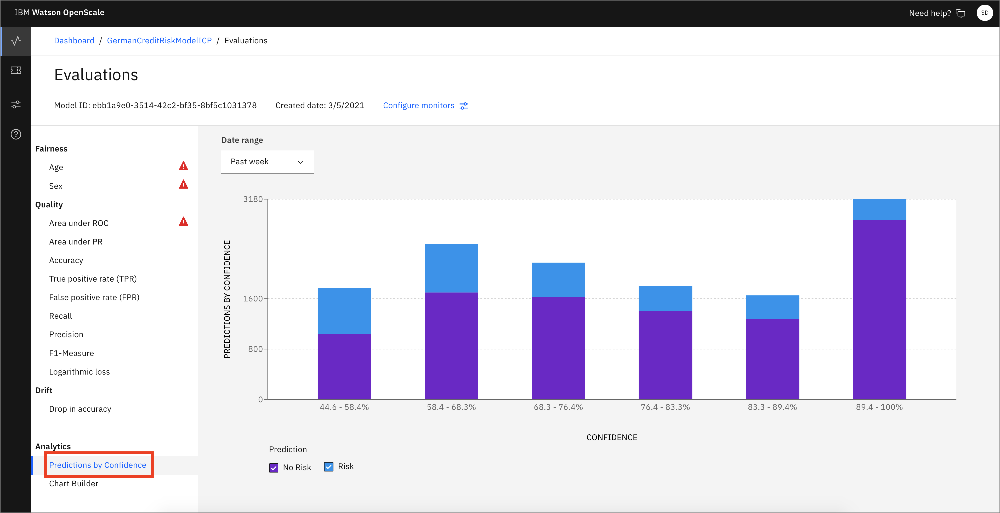

* From this dashboard click on `Analytics` -> `Chart Builder`. Here you can create charts using various Measurements, Features, and Dimensions of your machine learning model. You can  see a chart that breaks down `Predictions by Confidence`

  > *Note: You may need to click the date range for 'Past Week' or 'Yesterday' to load the data.*

* You can experiment with changing the values and examine the charts that are created.

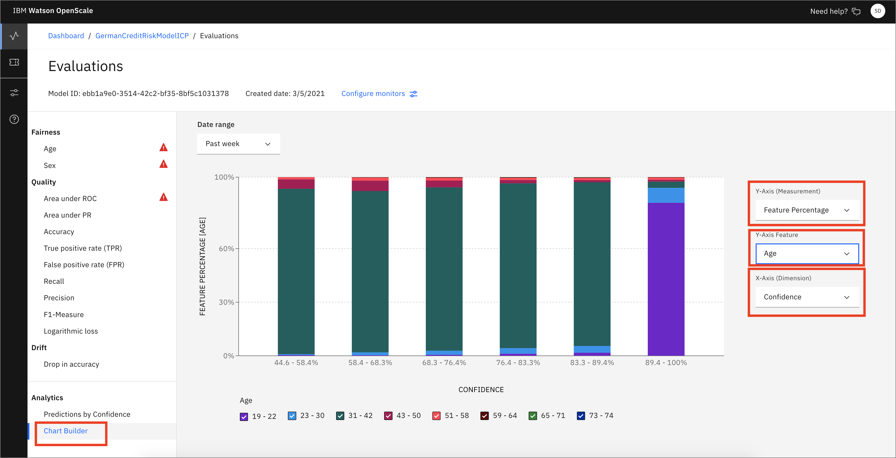

## Conclusion

This lab provides a walkthrough of many of the GUI features using the Watson OpenScale tools. The Auto setup deployment creates a machine learning model, deploys it, and inserts historical data to simulate a model that has been used in production over time. The OpenScale monitors are configured, and the user can then explore the various metrics and data. Please continue to explore on your own.
