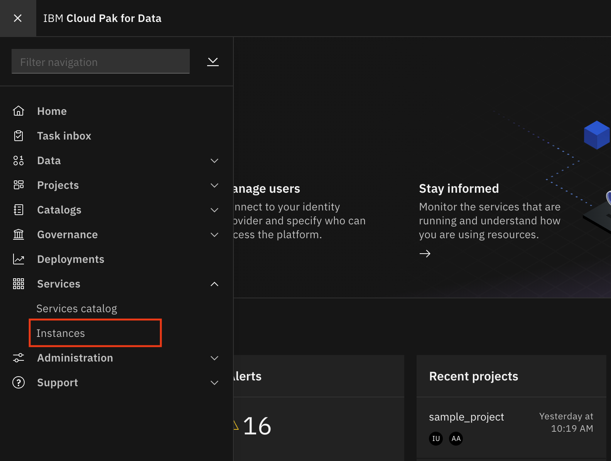

# Monitoring models with OpenScale GUI tool using Fastpath setup

This exercise shows a few of the features of the OpenScale GUI tool. When you first provision Watson OpenScale, either in the IBM Cloud or on Cloud Pak for Data, you will be offered the choice to automatically configure and setup OpenScale. This is called the Fastpath, and it walks the admin through the required steps and loads some sample data to demonstrate the features of OpenScale. We will use this automated Fastpath setup in this lab.
It is presumed that OpenScale Fastpath and Watson Machine Learning have already been configured.

## Use the Insights Dashboard

The *Insights Dashboard* provides an overview of the models that OpenScale is monitoring.

* In the Cloud Pak for Data instance, click on the `Services` icon.

* Find and click on the `Watson OpenScale` tile.

* Launch the OpenScale UI tooling by clicking on the *`Launch`* button

* OpenScale will load the *Insights Dashboard*. This will contain tiles for any models being monitored. The tile for `GermanCreditRiskModelICP` will be the one we will use for this lab, which was configured using the Fastpath script.

* Click on the left-hand menu icon for `Insights`, make sure that you are on the `Model monitors` tab, and then open the tile for the `GermanCreditRiskModelICP` model (click the 3-dot menu on the tile and then `View Details`):

* Notice the red alert indicators on the various monitors (Fairness, Quality, Drift). You should see a red indicator under Fairness. Click on the *Fairness score*.

* Click on the triangle with `!` under `Fairness` -> `Sex`. This indicates that there has been an alert for this attribute in the `Fairness` monitor. Alerts are configurable, based on thresholds for fairness outcomes which can be set and altered as desired.

* By moving your mouse pointer over the trend chart, you can see the values change, and which contains bias. Find and click on a spot in the graph that is above the red threshold line to view details.

* Once you open the details page, you can see more information. Note that you can choose the radio buttons for your choice of data (Payload + Perturbed, Payload, Training, Debiased):

* Click the `View Transactions` button on the right to drill deeper.

* In the transactions page, you have radio buttons to view *All transactions* or *Biased transactions*. Each of the individual transactions can be examined to see them in detail. Doing so will cache that transaction, as we will see later. Note that the Explainability feature requires 1000's of REST calls to the endpoint using variations of the data that are slightly perturbed, which can require several seconds to complete.

* Now, go back to the *Insights Dashboard* page by clicking on the left-hand menu icon for `Insights`, make sure that you are on the `Model monitors` tab. This time open the monitor configuration for the `GermanCreditRiskModelICP` model by clicking the 3-dot menu on the tile and then `Configure monitors`).

* Click the `Endpoints` menu on the left, then the Endpoints tab. Use the Endpoint pulldown to select `Debiased transactions`. This is the REST endpoint that offers a debiased version of the credit risk ML model, based on the features that were configured (i.e. Sex and Age). It will present an inference that attempts to remove the bias that has been detected.

* You could also use the Code language pulldown to see example code for using the Fairness Debiased endpoint. You can see code snippets using cURL, Java, and Python, which can be used in your scripts or applications.

* Similarly, you can choose the `Feedback logging` endpoint to get code for Feedback Logging. This provides an endpoint for sending fresh test data for ongoing quality evaluation. You can upload feedback data here or work with your developer to integrate the code snippet provided to publish feedback data to your Watson OpenScale database.

### Examine an individual transaction

* Click on the left-hand menu icon for `Explain a transaction`. Below the text input you may see a series of tabs with transaction ids. These are the transactions that have been explained and cached. Click on one of these cached transaction ids if it is present.

> If you do not have cached transaction IDs, you can use one of the following approaches to find a transaction to explain: (1) As you did in the section above, you can go back to the transactions page that you navigated to from the Fairness alert and click the `Explain` link under the 'Action' column.  (2) If you've run the `OpenScale Notebook` modules. You can enter a transaction UID you copied from that Jupyter notebook into the search bar.

> *NOTE: Each time you create the Explainibility data, the perterbation algorithm is sending 1000's of requests to the deployed Machine Learning REST endpoint, so the first time this is done can take a few seconds.*

* Click on the info icon next to `Details`: "Explanations show the most significant factors when determining an outcome. Classification models also include advanced explanations. Advanced explanations are not available for regression, image, and unstructured text models."

* Click on the info icon next to `Minimum changes for No Risk outcome` and look at the feature values:

> "Pertinent Negative - If the feature values were set to these values, the prediction would change. This is the minimum set of changes in feature values to generate a different prediction. Each feature value is changed so that it moves towards its median value in the training data."

* Click on the info icon next to `Maximum changes allowed for the same outcome` and look at the feature values:

> "Pertinent Positive - The prediction will not change even if the feature values are set to these values. This is the maximum change allowed while maintaining the existing prediction. Each feature value is changed so that it moves towards its median value in the training data."

* You can see under `Most important factors influencing prediction` the Feature, Value, and Weight of the most important factors for this score.

* A full breakdown of the factors contributing to either "Risk" or "No Risk" are at the bottom.

## Using the Analytics tools

* Click on the left-hand menu icon for `Insights`, make sure that you are on the `Model monitors` tab, and then open the tile for the `GermanCreditRiskModelICP` model (click the 3-dot menu on the tile and then `View Details`):

* Notice the red alert indicators on the various monitors (Fairness, Quality, Drift). You should see a red indicator under Fairness. Click on the `Fairness score`.

* From this dashboard click on `Analytics` -> `Chart Builder`. Here you can create charts using various Measurements, Features, and Dimensions of your machine learning model. You can  see a chart that breaks down `Predictions by Confidence`

  > *Note: You may need to click the date range for 'Past Week' or 'Yesterday' to load the data.*

* You can experiment with changing the values and examine the charts that are created.

## Conclusion

This lab provides a walkthrough of many of the GUI features using the Watson OpenScale tools. The Fastpath deployment creates a machine learning model, deploys it, and inserts historical data to simulate a model that has been used in production over time. The OpenScale monitors are configured, and the user can then explore the various metrics and data. Please continue to explore on your own.
