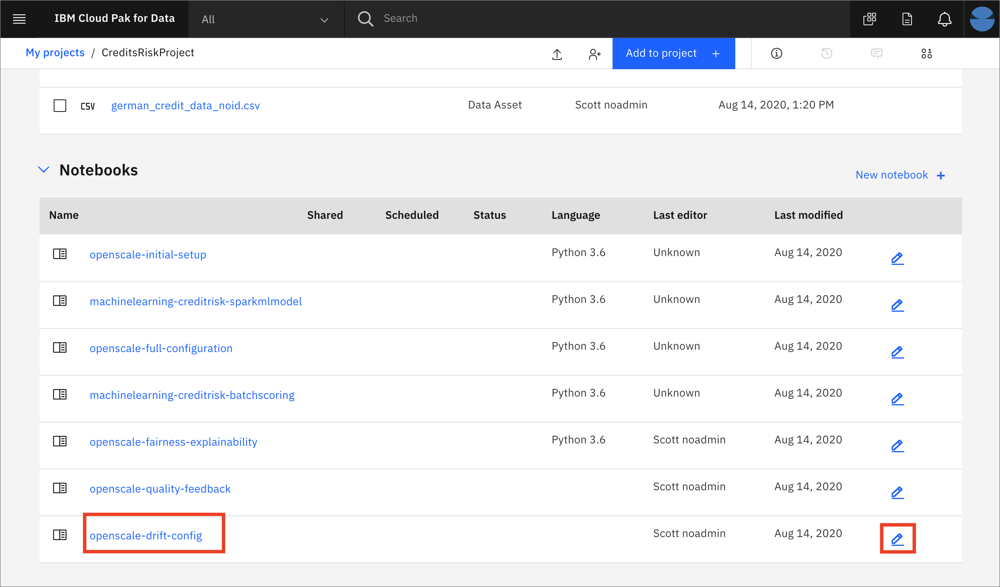
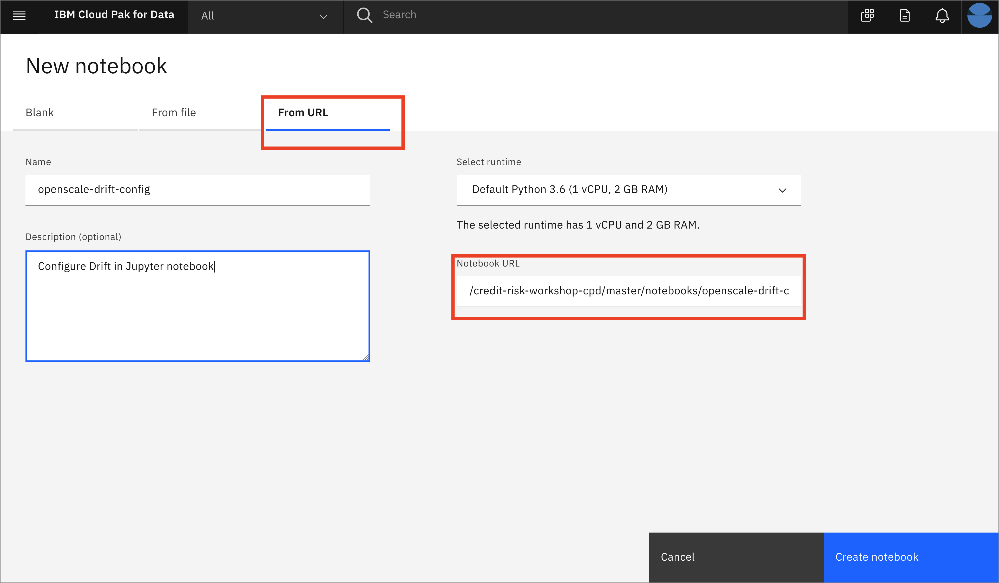
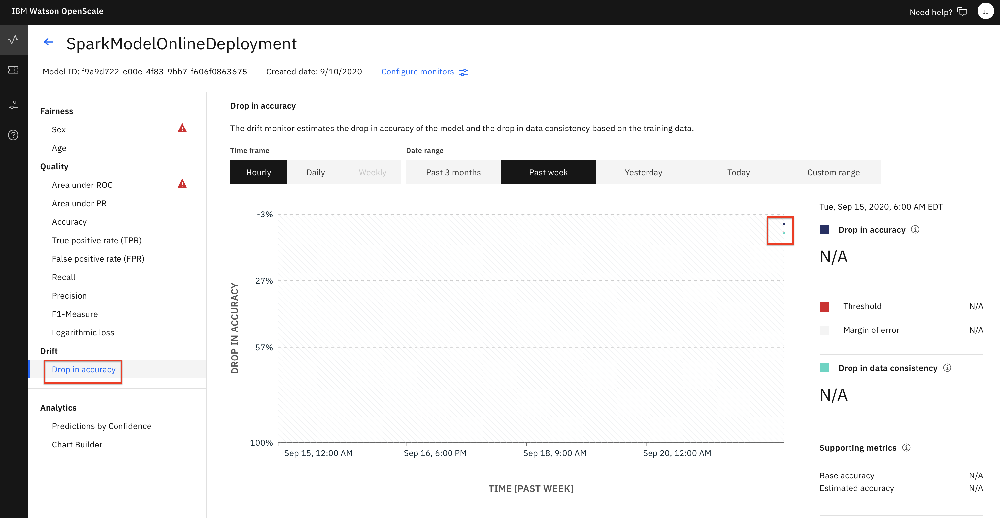

## Configuring the Drift Monitor manually using the GUI tool

The submodule contains the following steps:

1. [Open the notebook](#1-open-the-notebook)
1. [Update credentials](#2-update-credentials)
1. [Run the notebook](#3-run-the-notebook)
1. [Look at Drift in the Dashboard](#4-look-at-drift-in-the-dashboard)

## 1. Open the notebook

If you [Created the Project](https://ibm-developer.gitbook.io/cloudpakfordata-credit-risk-workshop/getting-started/pre-work#create-a-new-project) using the [CreditRiskProject.zip](https://github.ibm.com/IBMDeveloper/cp4d-workshop-credit-risk/blob/master/projects/CreditRiskProject.zip) file, the `openscale-drift-config` notebook will be present in that project, under the `Assets` tab:



You may now skip to the next step [Update credentials](#2-update-credentials)

## Import the notebook (If you are not using the Project Import pre-work steps)

> NOTE: You should probably not need this step, and should only perform it if instructed to.

If, for some reason, you are not using the [Created the Project](https://ibm-developer.gitbook.io/cloudpakfordata-credit-risk-workshop/getting-started/pre-work#create-a-new-project) step in the Pre-work to import [CreditRiskProject.zip](https://github.ibm.com/IBMDeveloper/cp4d-workshop-credit-risk/blob/master/projects/CreditRiskProject.zip), then you will need to import the notebook file by itself. Use the following steps for that.

At the project overview click the *New Asset* button, and choose *Add notebook*.


On the next panel select the *From URL* tab, give your notebook a name, provide the following URL, and choose the Python 3.6 environment:

```bash
https://raw.githubusercontent.com/IBM/credit-risk-workshop-cpd/master/notebooks/openscale-drift-config.ipynb
```

> The notebook is hosted in the same repo as [the workshop](https://github.com/IBM/credit-risk-workshop-cpd)
>
> * **Notebook**: [openscale-drift-config.ipynb](../../notebooks/openscale-drift-config.ipynb)
> * **Notebook with output**: [openscale-drift-config-with-output.ipynb](../../notebooks/with-output/openscale-drift-config-with-output.ipynb)



When the Jupyter notebook is loaded and the kernel is ready then we can start executing cells.


### 2. Update credentials

#### WOS_CREDENTIALS

* In the notebook section *2.0*  you will add your Cloud Pak for Data platform credentials for the *WOS_CREDENTIALS*.

* For the `url` field, change `https://w.x.y.z` to use the URL your Cloud Pak for Data cluster, i.e something like: `"url": "https://zen-cpd-zen.cp4d-2343434502000c44fc2b2-0001.us-south.containers.appdomain.cloud"`.
* For the `username`, use your Cloud Pak for Data login username.
* For the `password`, user your Cloud Pak for Data login password.

### 3. Run the notebook

> **Important**: *Make sure that you stop the kernel of your notebook(s) when you are done, in order to prevent leaking of memory resources!*


Spend an minute looking through the sections of the notebook to get an overview. You will run cells individually by highlighting each cell, then either click the `Run` button at the top of the notebook. While the cell is running, an asterisk (`[*]`) will show up to the left of the cell. When that cell has finished executing a sequential number will show up (i.e. `[17]`).


### 4. Look at Drift in the Dashboard

* In the same browser \(but a separate tab\), open the `Services` tab by clicking the icon in the upper right. Click on the `OpenScale` tile under the `AI` category, and in the next window, click `Open`:


* When the dashboard loads, _**Click**_ on the _**'Model Monitors'**_  tab and you will see the deployment you configured in the jupyter notebook when you ran it in a previous section:


Do not worry if the name you see does not match exactly with the screenshot. The deployment name you see will correspond to the variable used in the Jupyter notebook

* Either click on the `Drift` area of the card and then `Drop in accuracy` on the subsequent page, *or* 
  click on the top of the card and then on the percentage shown for drift and then `Drop in accuracy`:



* Click on a time slice in the graph and a window will show the number of transactions responsible "for drop in accuracy" and "for drop in data consistency":


* You can choose either or both to get details about "Transactions responsible for drop in accuracy and data consistency":


* Drilling deeper will bring up the individual transactions:


* And as we've seen before, we can choose a transaction to get the details:


### Recap

We've seen how to configure Drift monitoring using a Jupyter notebook. Next, we'll add some historical data to emulate what would happen for a Machine learning model that is deployed in production, monitored with OpenScale, and continually receiving scoring requests. Please proceed to the [HISTORICAL-DATA-README.md](./HISTORICAL-DATA-README.md)
