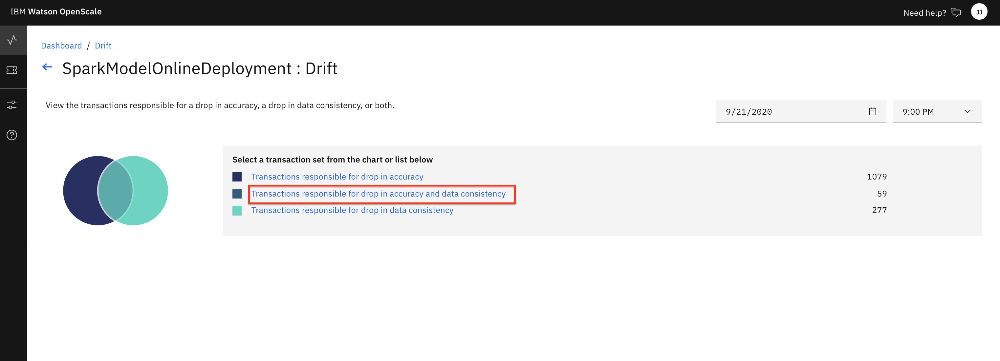
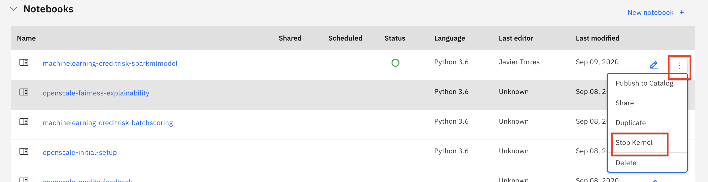

# Configuring Drift Monitor for OpenScale

The submodule contains the following steps:

1. [Open the notebook](#1-open-the-notebook)
1. [Run the notebook](#2-run-the-notebook)
1. [Look at Drift in the Dashboard](#3-look-at-drift-in-the-dashboard)

## 1. Open the notebook

If you [Created the Project](https://ibm-developer.gitbook.io/cloudpakfordata-credit-risk-workshop/getting-started/pre-work#create-a-new-project) using the [CreditRiskProject.zip](../../projects/CreditRiskProject.zip) file, your notebook will be present in that project.

* Go the (☰) navigation menu and click on the *Projects* link and then click on your analytics project.

  

* From your *Project* overview page, click on the *`Assets`* tab to open the assets page where your project assets are stored and organized.

* Scroll down to the `Notebooks` section of the page and *Click* on the pencil icon at the right of the `openscale-drift-config` notebook.

  

* When the Jupyter notebook is loaded and the kernel is ready, we will be ready to start executing it in the next section.

  

* You may now skip to the next section, [running the notebook](#2-run-the-notebook).

### Import the Notebook

> **NOTE: You should probably not need this step and should only perform it if instructed to do so.**

* If, for some reason, you are not using the [Created the Project](https://ibm-developer.gitbook.io/cloudpakfordata-credit-risk-workshop/getting-started/pre-work#create-a-new-project) step in the Pre-work to import [CreditRiskProject.zip](../../projects/CreditRiskProject.zip), then you will need to import the notebook file by itself. Use the following steps for that.

* At the project overview click the *New Asset* button, and choose *Add notebook*.

* On the next panel select the *From URL* tab, give your notebook a name, provide the following 'Notebook URL', and choose the default Python 3.6 environment:

  ```bash
  https://raw.githubusercontent.com/IBM/credit-risk-workshop-cpd/master/notebooks/openscale-drift-config.ipynb
  ```

  

* When the Jupyter notebook is loaded and the kernel is ready then we can start executing cells.

## 2. Run the Notebook

Spend some time looking through the sections of the notebook to get an overview. A notebook is composed of text (markdown or heading) cells and code cells. The markdown cells provide comments on what the code is designed to do.

You will run cells individually by highlighting each cell, then either click the `Run` button at the top of the notebook or hitting the keyboard short cut to run the cell (Shift + Enter but can vary based on platform). While the cell is running, an asterisk (`[*]`) will show up to the left of the cell. When that cell has finished executing a sequential number will show up (i.e. `[17]`).

_**Please note that there are several places in the notebook where you need to update variables. Some of the comments in the notebook are directions for you to modify specific sections of the code. Perform any changes as indicated before running / executing the cell. These changes are described below.**_

#### WOS_CREDENTIALS

* In the notebook section *2.0*  you will add your Cloud Pak for Data platform credentials for the *WOS_CREDENTIALS*.

  * For the `url`, use the URL your Cloud Pak for Data cluster, i.e something like: `"url": "https://zen.clusterid.us-south.containers.appdomain.cloud"`
  * For the `username`, use your Cloud Pak for Data login username.
  * For the `password`, user your Cloud Pak for Data login password.

> *Note: The Jupyter notebook included in the project has been cleared of output. If you would like to see the notebook that has already been completed with associated output, it is hosted in the same repo as this workshop: **Notebook with output**: [openscale-drift-config-with-output.ipynb](../../notebooks/with-output/openscale-drift-config-with-output.ipynb)*

### 3. Look at Drift in the Dashboard

* In the same browser \(but a separate tab\), open the `Services` tab by clicking the `Services` icon on the top right.

  

* Find and click on the `Watson OpenScale` tile.

  

* Launch the OpenScale UI tooling by clicking on the *`Launch`* button

  

* When the dashboard loads, _**Click**_ on the _**'Model Monitors'**_  tab and you will see the deployment you configured in the jupyter notebook when you ran it in the previous section. Click on the `Drift` section of the tile to bring up the *Drift monitor*.

  

  > *Note: Do not worry if the name you see does not match exactly with the screenshot. The deployment name you see will correspond to the variable used in the Jupyter notebook.*
  > *Note: If you click on the card itself, you can get to the drift monitor page by clicking on the percentage shown for drift in the UI.*

* Click on `Drop in accuracy`and then look for a time slot on the graph that shows bias (i.e. below the red threshold line). The monitor only runs every three hours, so there may only be one teal colored "dot" representing a single run when you first visit the graph. Click on it for more details that will show the number of transactions responsible "for drop in accuracy" and "for drop in data consistency".

  

* You can choose to get details about "Transactions responsible for drop in accuracy and data consistency":

  

* From here you can see groupings of transactions that caused drift. Where the groups are formed by shared features. Drilling deeper will bring up the individual transactions, and as we've seen before, we can choose a transaction to get the details.

  

### Conclusion

We've seen how to configure Drift monitoring using a Jupyter notebook. Next, we'll add some historical data to emulate what would happen for a Machine learning model that is deployed in production, monitored with OpenScale, and continually receiving scoring requests.

Please proceed to the [HISTORICAL-DATA-README.md](./HISTORICAL-DATA-README.md)

> **Important**: *Make sure that you stop the kernel of your notebook(s) when you are done, in order to conserve resources! You can do this by going to the Asset page of the project, selecting the three vertical dots under the Action column for the notebook you have been running (in this case the `openscale-fairness-explainability`) and selecting to `Stop Kernel` from the Actions menu. If you see a lock icon on the notebook, click it to unlock the notebook before you click the Actions menu so you can see the stop kernel option.*
> 
