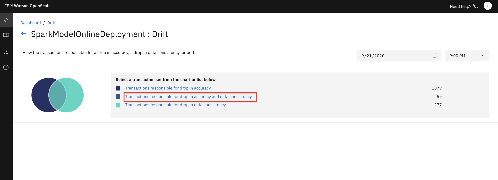

# Configuring Drift Monitor for OpenScale

> *Note: It is assumed that you have followed the instructions in the pre-work section to create a project based on an existing project file. If you did not use the project import or do not see the Jupyter notebooks mentioned in this module, see the `Workshop Resources` -> `FAQs / Tips` section for instructions to import the necessary notebooks. Also note that the Jupyter notebooks included in the project have been cleared of output. If you would like to see the notebook that has already been completed with output, see the `Workshop Resources` -> `FAQs / Tips` section for links to the completed notebooks.*

## Steps for Drift Monitor Configuration

The submodule contains the following steps:

1. [Open the notebook](#1-open-the-notebook)
1. [Run the notebook](#2-run-the-notebook)
1. [Look at Drift in the Dashboard](#3-look-at-drift-in-the-dashboard)

## 1. Open the notebook

If you [Created the Project](https://ibm-developer.gitbook.io/cloudpakfordata-credit-risk-workshop/getting-started/pre-work#create-a-new-project) using the [CreditRiskProject.zip](../../projects/CreditRiskProject.zip) file, your notebook will be present in that project.

* Go the (☰) navigation menu and click on the *Projects* link and then click on your analytics project.

* From your *Project* overview page, click on the *`Assets`* tab to open the assets page where your project assets are stored and organized.

* Scroll down to the `Notebooks` section of the page and *Click* on the pencil icon at the right of the `openscale-drift-config` notebook.

* When the Jupyter notebook is loaded and the kernel is ready, we will be ready to start executing it in the next section.

## 2. Run the Notebook

Spend some time looking through the sections of the notebook to get an overview. A notebook is composed of text (markdown or heading) cells and code cells. The markdown cells provide comments on what the code is designed to do.

You will run cells individually by highlighting each cell, then either click the `Run` button at the top of the notebook or hitting the keyboard short cut to run the cell (Shift + Enter but can vary based on platform). While the cell is running, an asterisk (`[*]`) will show up to the left of the cell. When that cell has finished executing a sequential number will show up (i.e. `[17]`).

_**Please note that there are several places in the notebook where you need to update variables. Some of the comments in the notebook are directions for you to modify specific sections of the code. Perform any changes as indicated before running / executing the cell. These changes are described below.**_

#### WOS_CREDENTIALS

* In the notebook section *2.0*  you will add your Cloud Pak for Data platform credentials for the *WOS_CREDENTIALS*.

  * For the `url`, use the URL your Cloud Pak for Data cluster, i.e something like: `"url": "https://zen.clusterid.us-south.containers.appdomain.cloud"`
  * For the `username`, use your Cloud Pak for Data login username.
  * For the `password`, user your Cloud Pak for Data login password.

## 3. Look at Drift in the Dashboard

* In the same browser \(but a separate tab\), open the `Services` tab by clicking the `Services` icon on the top right.

* Find and click on the `Watson OpenScale` tile.

* Launch the OpenScale UI tooling by clicking on the *`Launch`* button

* When the dashboard loads, _**Click**_ on the _**'Model Monitors'**_  tab and you will see the deployment you configured in the jupyter notebook when you ran it in the previous section. Click on the `Drift` section of the tile to bring up the *Drift monitor*.

  > *Note: Do not worry if the name you see does not match exactly with the screenshot. The deployment name you see will correspond to the variable used in the Jupyter notebook.*
  > *Note: If you click on the card itself, you can get to the drift monitor page by clicking on the percentage shown for drift in the UI.*

* Click on `Drop in accuracy`and then look for a time slot on the graph that shows bias (i.e. below the red threshold line). The monitor only runs every three hours, so there may only be one teal colored "dot" representing a single run when you first visit the graph. Click on it for more details that will show the number of transactions responsible "for drop in accuracy" and "for drop in data consistency".

* You can choose to get details about "Transactions responsible for drop in accuracy and data consistency":

* From here you can see groupings of transactions that caused drift. Where the groups are formed by shared features. Drilling deeper will bring up the individual transactions, and as we've seen before, we can choose a transaction to get the details.

## Stop the Environment

**Important:** When you have completed the last submodule in this "openscale-manual-config" section that you will be doing, it's recommended you stop the environment in order to conserve resources. **You should only follow these steps to stop your environment if you are not going to proceed with the other sub-modules in this section.**

* Navigate back to your project information page by clicking on your project name from the navigation drill down on the top left of the page.

* Click on the 'Environments' tab near the top of the page. Then in the 'Active environment runtimes' section, you will see the environment used by your notebook (i.e the `Tool` value is `Notebook`). Click on the three vertical dots at the right of that row and select the `Stop` option from the menu.

* Click the `Stop` button on the subsequent pop up window.

## Conclusion

We've seen how to configure Drift monitoring using a Jupyter notebook. Next, we'll add some historical data to emulate what would happen for a Machine learning model that is deployed in production, monitored with OpenScale, and continually receiving scoring requests.

Proceed to the next sub-module to [load historical data](./HISTORIC-DATA-README.md)
