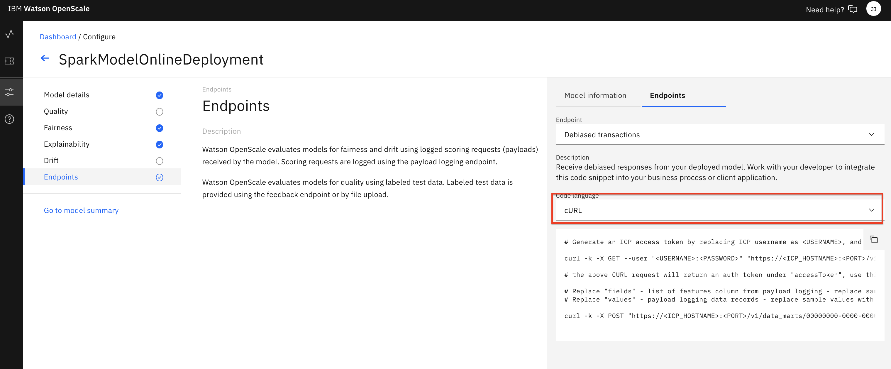

# Configure Fairness and Explainability monitors for OpenScale

Watson OpenScale utilizes several monitors to gather data about machine learning inferences and the GUI tool can then present that data in a form that is useful. In this sub-module we will use a Jupyter notebook to configure the monitor for Fairness, allowing us to choose a feature to monitor. In our loan risk scenario, we'll monitor the *Risk* feature and look at 2 groups. For *Gender*, we'll designate `Male` as the majority group and `Female` as the minority group, and then use the Fairness monitor to make sure that the majority group does not recieve a favorable outcome more often than the minority group, within a tolerance of 5%. We'll also designate the *Age* group of people *18-25* the minority and *26-75* the majority to look for bias against those in the minority age cohort.

We'll then enable the Explainability monitor, which allows us to then use the API or GUI tool to explain individual transactions. By sending slightly perturbed data to the scoring endpoint, the explainability algorithm can build a model of which features contributed to the category of *Risk* or *No Risk*, and give a quantitative breakdown of the contributions of each feature to the results.

> *Note: It is assumed that you have followed the instructions in the pre-work section to create a project based on an existing project file. If you did not use the project import or do not see the Jupyter notebooks mentioned in this module, see the `Workshop Resources` -> `FAQs / Tips` section for instructions to import the necessary notebooks. Also note that the Jupyter notebooks included in the project have been cleared of output. If you would like to see the notebook that has already been completed with output, see the `Workshop Resources` -> `FAQs / Tips` section for links to the completed notebooks.*

## Steps for OpenScale Fairness and Explainabilty monitor setup

The submodule contains the following steps:

1. [Open the notebook](#1-open-the-notebook)
1. [Run the notebook](#2-run-the-notebook)
1. [Begin to Explore the Watson OpenScale UI](#3-begin-to-explore-the-watson-openscale-ui)

## 1. Open the notebook

* Go the (☰) navigation menu and click on the *Projects* link and then click on your analytics project.

* From your *Project* overview page, click on the *`Assets`* tab to open the assets page where your project assets are stored and organized.

* Scroll down to the `Notebooks` section of the page and *Click* on the pencil icon at the right of the `openscale-fairness-explainability` notebook.

* When the Jupyter notebook is loaded and the kernel is ready, we will be ready to start executing it in the next section.

## 2. Run the Notebook

Spend some time looking through the sections of the notebook to get an overview. A notebook is composed of text (markdown or heading) cells and code cells. The markdown cells provide comments on what the code is designed to do.

You will run cells individually by highlighting each cell, then either click the `Run` button at the top of the notebook or hitting the keyboard short cut to run the cell (Shift + Enter but can vary based on platform). While the cell is running, an asterisk (`[*]`) will show up to the left of the cell. When that cell has finished executing a sequential number will show up (i.e. `[17]`).

_**Please note that there are several places in the notebook where you need to update variables. Some of the comments in the notebook are directions for you to modify specific sections of the code. Perform any changes as indicated before running / executing the cell. These changes are described below.**_

#### WOS_CREDENTIALS

* In the notebook section *2.0*  you will add your Cloud Pak for Data platform credentials for the *WOS_CREDENTIALS*.

  * For the `url`, use the URL your Cloud Pak for Data cluster, i.e something like: `"url": "https://zen.clusterid.us-south.containers.appdomain.cloud"`
  * For the `username`, use your Cloud Pak for Data login username.
  * For the `password`, user your Cloud Pak for Data login password.

#### Get Explainability transaction_id

* In order to use the Explainability feature, we will need the ID for an individual transaction.

* In the notebook, after running cell *5.5 Run explanation for sample record* , the output will print a `transaction_id`. Copy this id.

## 3. Begin to Explore the Watson OpenScale UI

We've enabled the monitors for Fairness and Explainability, now let's explore the results in the OpenScale GUI.

* In the same browser \(but a separate tab\), open the `Services` tab by clicking the `Services` icon on the top right.

* Find and click on the `Watson OpenScale` tile.

* Launch the OpenScale UI tooling by clicking on the *`Launch`* button

* When the dashboard loads, _**Click**_ on the _**'Model Monitors'**_  tab and you will see the deployment you configured in the jupyter notebook when you ran it in the previous section. Click on the `Fairness` section of the tile to bring up the *Fairness monitor*.

  > *Note: Do not worry if the name you see does not match exactly with the screenshot. The deployment name you see will correspond to the variable used in the Jupyter notebook.*

### Fairness Monitor

* You will see that the *Fairness* monitor is enabled and shows a graph of recent transactions. Details for the Fairness monitor are on the left side of the graph, including the *Threshold* to trigger a bias alert, details of the monitored groups, and *Schedule* information. You can hover over sections of the graph to see the results of each hour and the scoring requests that were performed.

* Look for a time slot that shows bias (i.e. below the red threshold line). The monitor only runs once per hour, so there may only be one teal colored "dot" representing a single run when you first visit the graph. Click on it for more details:

* For a given time slot, we will see a comparison between the 2 groups, in this case, female and male. A bar chart presents information for percent of favorable vs. unfavorable outcomes.

* We can choose our *Data set* from a series of radio buttons, whether *Payload + Perturbed*, *Payload*, *Training*, or *Debiased*. The *Monitored features* can be toggled, and we can change the *Date and time*. Click on the various radio buttons, toggle the monitored features, and change the time to see how the tool works:

* Now back to our biased time slot, click on *Debiased* Data Set and *Sex* and view how the use of the Debiased endpoint has made our scoring more fair:

* Click on the `View Debiased Endpoint` button. Here you can see some *Debiased Endpoint Code Snippet* examples, showing *cURL*, *Java*, and *Python* code that can utilize the endpoint for debiased transactions, enabling a developer to get a machine learning model score that prevents the biased outcome. (You may need to change the *'Code language'* drop down list to see code snippets in different languages):

* Click the `Back` button on your browser to go back to the Transactions details for the Fairness monitor page.

* Click on the `View Transactions` button. We can see the various transactions that took place during this time slot, as well as some aggregate information around "Risk" and "No Risk" for both the Current model and the Debiased model. We can click on `Explain` for one of the transactions for more detailed information (HINT: A "Risk" transaction might be more interesting):

  > *Note that the explanation of a transaction requires that 1000's of scoring transactions take place using slightly perturbed data for each of the features. This can take several seconds, or even minutes. Future use of this individual transaction will be cached, so the network latency and overhead from performing the scoring will not be a factor.*

* There is a lot of information available for a single transaction:

* Click the "i" information icons next to *Minimum changes for another outcome* and *Maximum changes allowed for the same outcome* to help understand the use of the *Pertinent Negative* and *Pertinent Positive*:

* You can see information about the *Pertinent Negative*, for example, that shows what the minimum changes would need to be to cause a different outcome, i.e from *Risk* to *No Risk*, or changing *No Risk* to *Risk*. In my example shown, you can see that this is not always calculated:

* Scroll down and you can see that the *Most important factors influencing prediction* are highlighted, and below is a complet breakdown of all features, with the percent of influence for the score of either *Risk* or *No Risk*:

* (Optional) If you saved the transaction_id that you copied after running cell *5.5* in the notebook, you can past it into the search bar and press enter:

* Any previous Explainability transactions will be cached and presented as a tab that you can click on to revisit in the future.

## Stop the Environment

**Important:** When you have completed the last submodule in this "openscale-manual-config" section that you will be doing, it's recommended you stop the environment in order to conserve resources. **You should only follow these steps to stop your environment if you are not going to proceed with the other sub-modules in this section.**

* Navigate back to your project information page by clicking on your project name from the navigation drill down on the top left of the page.

* Click on the 'Environments' tab near the top of the page. Then in the 'Active environment runtimes' section, you will see the environment used by your notebook (i.e the `Tool` value is `Notebook`). Click on the three vertical dots at the right of that row and select the `Stop` option from the menu.

* Click the `Stop` button on the subsequent pop up window.

## Conclusion

You were able to configure *Fairness monitoring* of your machine learning deployment using the OpenScale python SDK and the APIs in a Juypyter notebook. You then scored 200 randomly selected records to provide enough information to calculate fairness, and run the monitor. After that, Explainability was enabled and an indiviudal transaction selected for later inspection.

The OpenScale GUI tool was utilized to look at the Fairness monitor and the Explainability tool. Later in this workshop we will add more historical data to simulate a machine learning model deployed in production and the data available from these monitors.

Proceed to the next sub-module to [configure Quality monitor and Feedback logging](./QUALITY-FEEDBACK-README.md)
