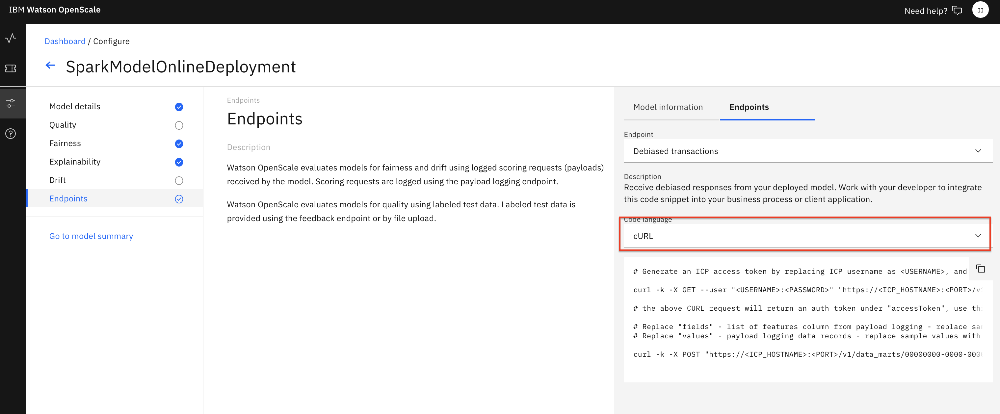

# Configure Fairness and Explainability monitors for OpenScale

Watson OpenScale utilizes several monitors to gather data about machine learning inferences and the GUI tool can then present that data in a form that is useful. In this sub-module we will use a Jupyter notebook to configure the monitor for Fairness, allowing us to choose a feature to monitor. In our loan risk scenario, we'll monitor the *Risk* feature and look at 2 groups. For *Gender*, we'll designate `Male` as the majority group and `Female` as the minority group, and then use the Fairness monitor to make sure that the majority group does not recieve a favorable outcome more often than the minority group, within a tolerance of 5%. We'll also designate the *Age* group of people *18-25* the minority and *26-75* the majority to look for bias against those in the minority age cohort.

We'll then enable the Explainability monitor, which allows us to then use the API or GUI tool to explain individual transactions. By sending slightly perturbed data to the scoring endpoint, the explainability algorithm can build a model of which features contributed to the category of *Risk* or *No Risk*, and give a quantitative breakdown of the contributions of each feature to the results.

## Steps for OpenScale Fairness and Explainabilty monitor setup

The submodule contains the following steps:

1. [Open the notebook](#1-open-the-notebook)
1. [Update credentials](#2-update-credentials)
1. [Run the notebook](#3-run-the-notebook)
1. [Begin to Explore the Watson OpenScale UI](#4-begin-to-explore-the-watson-openscale-ui)

## 1. Open the notebook

If you [Created the Project](https://ibm-developer.gitbook.io/cloudpakfordata-credit-risk-workshop/getting-started/pre-work#create-a-new-project) using the [CreditRiskProject.zip](https://github.ibm.com/IBMDeveloper/cp4d-workshop-credit-risk/blob/master/projects/CreditRiskProject.zip) file, the `openscale-fairness-explainability` notebook will be present in that project, under the `Assets` tab:


You may now skip to the next step [Update credentials](#2-update-credentials)

## Import the notebook (If you are not using the Project Import pre-work steps)

> NOTE: You should probably not need this step, and should only perform it if instructed to.

If, for some reason, you are not using the [Created the Project](https://ibm-developer.gitbook.io/cloudpakfordata-credit-risk-workshop/getting-started/pre-work#create-a-new-project) step in the Pre-work to import [CreditRiskProject.zip](https://github.ibm.com/IBMDeveloper/cp4d-workshop-credit-risk/blob/master/projects/CreditRiskProject.zip), then you will need to import the notebook file by itself. Use the following steps for that.

At the project overview click the *New Asset* button, and choose *Add notebook*.


On the next panel select the *From URL* tab, give your notebook a name, provide the following URL, and choose the Python 3.6 environment:

```bash
https://raw.githubusercontent.com/IBM/credit-risk-workshop-cpd/master/notebooks/openscale-fairness-explainability.ipynb
```

> The notebook is hosted in the same repo as [the workshop](https://github.com/IBM/credit-risk-workshop-cpd)
>
> * **Notebook**: [openscale-fairness-explainability.ipynb](../../notebooks/openscale-fairness-explainability.ipynb)
> * **Notebook with output**: [openscale-fairness-explainability-with-output.ipynb](../../notebooks/with-output/openscale-fairness-explainability-with-output.ipynb)


When the Jupyter notebook is loaded and the kernel is ready then we can start executing cells.


### 2. Update credentials

#### WOS_CREDENTIALS

* In the notebook section *2.0*  you will add your Cloud Pak for Data platform credentials for the *WOS_CREDENTIALS*.

* For the `url` field, change `https://w.x.y.z` to use the URL your Cloud Pak for Data cluster, i.e something like: `"url": "https://zen-cpd-zen.omid-cp4d-v5-2bef1f4b4097001da9502000c44fc2b2-0001.us-south.containers.appdomain.cloud"`.
* For the `username`, use your Cloud Pak for Data login username.
* For the `password`, user your Cloud Pak for Data login password.

### 3. Run the notebook

> **Important**: *Make sure that you stop the kernel of your notebook(s) when you are done, in order to prevent leaking of memory resources!*


Spend an minute looking through the sections of the notebook to get an overview. You will run cells individually by highlighting each cell, then either click the `Run` button at the top of the notebook. While the cell is running, an asterisk (`[*]`) will show up to the left of the cell. When that cell has finished executing a sequential number will show up (i.e. `[17]`).

#### Get Explainability transaction_id

In order to use the Explainability feature, we will need the ID for an individual transaction.

* In the notebook, after running cell *5.7 Run explanation for sample record* , the output will print a `transaction_id`. Copy this id.

## 4. Begin to Explore the Watson OpenScale UI

We've enabled the monitors for Fairness and Explainability, now let's explore the results in the OpenScale GUI.

* In the same browser \(but a separate tab\), open the `Services` tab by clicking the icon in the upper right. Go to the `OpenScale` tile under the `AI` category and click `Open`:


* When the dashboard loads, _**Click**_ on the _**'Model Monitors'**_  tab and you will see the deployment you configured in the jupyter notebook when you ran it in the previous section. Click on the `Fairness` section of the tile to bring up the *Fairness monitor*:


Do not worry if the name you see does not match exactly with the screenshot. The deployment name you see will correspond to the variable used in the Jupyter notebook

### Fairness Monitor

You will see that the *Fairness* monitor is enabled and shows a graph of recent transactions. Details for the Fairness monitor are on the left side of the graph, including the *Threshold* to trigger a bias alert, details of the monitored groups, and *Schedule* information. You can hover over sections of the graph to see the results of each hour and the scoring requests that were performed.

* Look for a time slot that shows bias. The monitor only runs once per hour, so there may only be one "dot" representing a single run when you first visit the graph. Click on it for more details:


For a given time slot, we will see a comparison between the 2 groups, in this case, female and male. A bar chart presents information for percent of favorable vs. unfavorable outcomes.

We can choose our *Data set* from a series of radio buttons, whether *Payload + Perturbed*, *Payload*, *Training*, or *Debiased*. The *Monitored features* can be toggled, and we can change the *Date and time*.

* Click on the various radio buttons, toggle the monitored features, and change the time to see how the tool works:


* Now back to our biased time slot, click on *Debiased* Data Set and *Sex* and view how the use of the Debiased endpoint has made our scoring more fair:


* Click on the `View Transactions` button. We can see the various transactions that took place during this time slot, as well as some aggregate information around "Risk" and "No Risk" for both the Current model and the Debiased model. We can click on `Explain` for one of the transactions for more detailed information (HINT: A "Risk" transaction might be more interesting):


> Note that the explanation of a transaction requires that 1000's of scoring transactions take place using slightly perturbed data for each of the features. This can take several seconds, or even minutes. Future use of this individual transaction will be cached, so the network latency and overhead from performing the scoring will not be a factor.

There is a lot of information available for a single transaction:


* Higlight the "i" information icon next to *Minimum changes for another outcome* and *Maximum changes allowed for the same outcome* to help understand the use of the *Pertinent Negative* and *Pertinent Positive*:

* You can see information about the *Perntinent Negative*, for example, that shows what the minimum changes would need to be to cause a different outcome, i.e from Risk to No Risk, or changing No Risk to Risk. In my example shown, you can see that this is not always calculated:


* Scroll down and you can see that the *Most important factors influencing prediction* are highlighted, and below is a complet breakdown of all features, with the percent of influence for the score of either *Risk* or *No Risk*:


* Click on the `View Debiased Endpoint` button. Here you can see some *Debiased Endpoint Code Snippet* examples, showing *cURL*, *Java*, and *Python* code that can utilize the endpoint for debiased transactions, enabling a developer to get a machine learning model score that prevents the biased outcome. (You may need to scroll down to see this):



### Get Explainability information

* When you are done examining the code for debiased enpoints, click on the "Explain a transaction" icon on the left hand menu.

* If you saved the transaction_id that you copied after running cell *5.7* in the notebook, you can past it into the search bar and press enter:


* Any previous Explainability transactions will be cached and presented as a tab that you can click on to revisit.

## Recap

You were able to configure *Fairness monitoring* of your machine learning deployment using the OpenScale python SDK and the APIs in a Juypyter notebook. You then scored 200 randomly selected records to provide enough information to calculate fairness, and run the monitor. After that, Explainability was enabled and an indiviudal transaction selected for later inspection.
The OpenScale GUI tool was utilized to look at the Fairness monitor and the Explainability tool. Later in this workshop we will add more historical data to simulate a machine learning model deployed in production and the data available from these monitors.

Proceed to the next sub-module to [configure Quality monitor and Feedback logging](./QUALITY-FEEDBACK-README.md)
