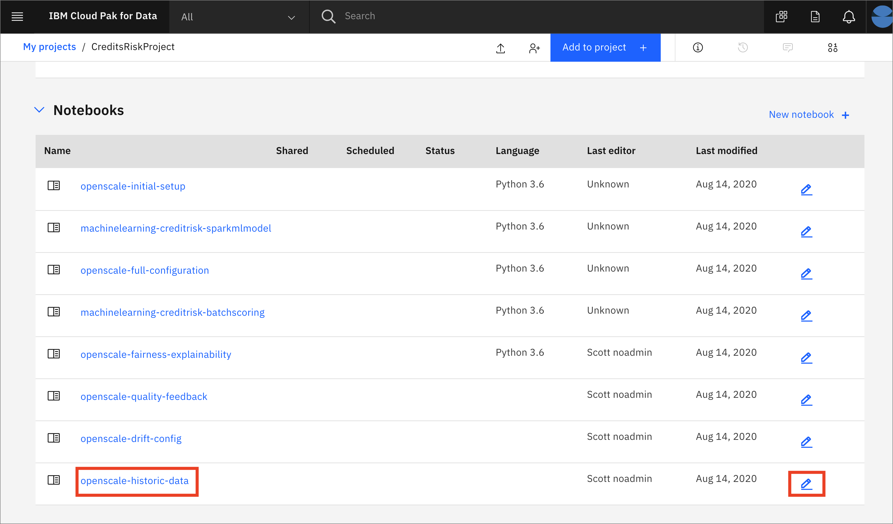
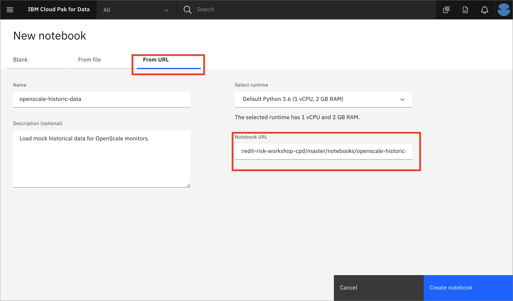

# Load Historic Data for OpenScale

For a deployed machine learning model, OpenScale will record all of the requests for scoring and the results in the datamart using feedback logging. In this submodule, we'll emulate a production system that has been used for a week to score many requests, allowing the various configured monitors to present some interesting data. Note that this Historic Data submodule can be run at any time.

## Steps for basic OpenScale setup

The submodule contains the following steps:

1. [Open the notebook](#1-open-the-notebook)
1. [Update credentials](#2-update-credentials)
1. [Run the notebook](#3-run-the-notebook)
1. [Explore the Watson OpenScale UI](#4-explore-the-watson-openscale-ui)

## 1. Open the notebook

If you [Created the Project](https://ibm-developer.gitbook.io/cloudpakfordata-credit-risk-workshop/getting-started/pre-work#create-a-new-project) using the [CreditRiskProject.zip](https://github.ibm.com/IBMDeveloper/cp4d-workshop-credit-risk/blob/master/projects/CreditRiskProject.zip) file, your notebook will be present in that project, under the `Assets` tab:



You may now skip to the next step [Update credentials](#2-update-credentials)

## Import the notebook (If you are not using the Project Import pre-work steps)

> NOTE: You should probably not need this step, and should only perform it if instructed to.

If, for some reason, you are not using the [Created the Project](https://ibm-developer.gitbook.io/cloudpakfordata-credit-risk-workshop/getting-started/pre-work#create-a-new-project) step in the Pre-work to import [CreditRiskProject.zip](https://github.ibm.com/IBMDeveloper/cp4d-workshop-credit-risk/blob/master/projects/CreditRiskProject.zip), then you will need to import the notebook file by itself. Use the following steps for that.

At the project overview click the *New Asset* button, and choose *Add notebook*.


On the next panel select the *From URL* tab, give your notebook a name, provide the following URL, and choose the Python 3.6 environment:

```bash
https://raw.githubusercontent.com/IBM/credit-risk-workshop-cpd/master/notebooks/openscale-historic-data.ipynb
```

> The notebook is hosted in the same repo as [the workshop](https://github.com/IBM/credit-risk-workshop-cpd)
>
> * **Notebook**: [openscale-historic-data.ipynb](../../notebooks/openscale-historic-data.ipynb)
> * **Notebook with output**: [openscale-historic-data-with-output.ipynb](../../notebooks/with-output/openscale-historic-data-with-output.ipynb)



When the Jupyter notebook is loaded and the kernel is ready then we can start executing cells.


### 2. Update credentials

#### WOS_CREDENTIALS

* In the notebook section *2.0*  you will add your Cloud Pak for Data platform credentials for the *WOS_CREDENTIALS*.

* For the `url` field, change `https://w.x.y.z` to use the URL your ICP cluster, i.e something like: `"url": "https://zen-cpd-zen.cp4d-v5-2bef101da9502000c44fc2b2-0001.us-south.containers.appdomain.cloud"`.
* For the `username`, use your Cloud Pak for Data login username.
* For the `password`, user your Cloud Pak for Data login password.

### 3. Run the notebook

> **Important**: *Make sure that you stop the kernel of your notebook(s) when you are done, in order to prevent leaking of memory resources!*


Spend an minute looking through the sections of the notebook to get an overview. You will run cells individually by highlighting each cell, then either click the `Run` button at the top of the notebook. While the cell is running, an asterisk (`[*]`) will show up to the left of the cell. When that cell has finished executing a sequential number will show up (i.e. `[17]`).

## 4. Explore the Watson OpenScale UI

Now that we've simulated a Machine Learning deployment in production, we can look at the associated monitors again and see more detail. Re-visit the various monitors and look again at the graphs, charts and explanations after the addition of the historical data:

* [Fairness monitor and Explainability](https://github.ibm.com/IBMDeveloper/cp4d-workshop-credit-risk/blob/addDriftManual/workshop/openscale-manual-config/FAIRNESS-EXPLAINABILITY-README.md#5-begin-to-explore-the-watson-openscale-ui)

* [Quality monitor and Feedback logging](https://github.ibm.com/IBMDeveloper/cp4d-workshop-credit-risk/blob/addDriftManual/workshop/openscale-manual-config/QUALITY-FEEDBACK-README.md#5-begin-to-explore-the-watson-openscale-ui)

* [Drift monitor](https://github.ibm.com/IBMDeveloper/cp4d-workshop-credit-risk/blob/addDriftManual/workshop/openscale-manual-config/DRIFT.md#3-look-at-drift-in-the-dashboard)

## Recap

With the addition of historical data, we can now use the OpenScale tools in a simulated production environment. We can look at Fairness, Explainability, Quality, and Drift, and see how all transactions are logged. This workshop contains API code, configuration tools, and details around using the UI tool to enable a user to monitor production machine learning environments.
