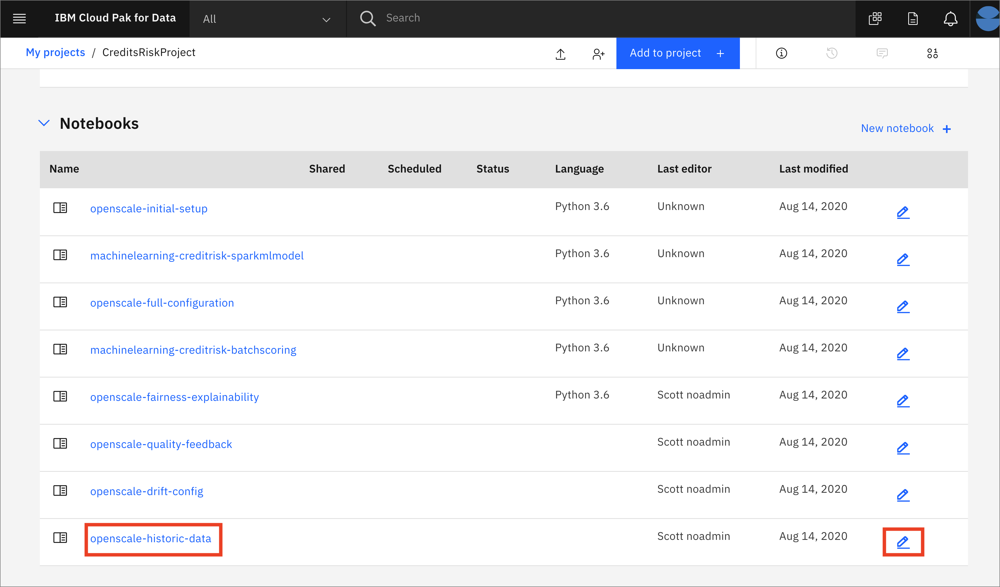

# Load Historic Data for OpenScale

For a deployed machine learning model, OpenScale will record all of the requests for scoring and the results in the datamart using feedback logging. In this submodule, we'll emulate a production system that has been used for a week to score many requests, allowing the various configured monitors to present some interesting data. Note that this Historic Data submodule can be run at any time.

> *Note: It is assumed that you have followed the instructions in the pre-work section to create a project based on an existing project file. If you did not use the project import or do not see the Jupyter notebooks mentioned in this module, see the `Workshop Resources` -> `FAQs / Tips` section for instructions to import the necessary notebooks. Also note that the Jupyter notebooks included in the project have been cleared of output. If you would like to see the notebook that has already been completed with output, see the `Workshop Resources` -> `FAQs / Tips` section for links to the completed notebooks.*

## Steps for Historical Data Load

The submodule contains the following steps:

1. [Open the notebook](#1-open-the-notebook)
1. [Run the notebook](#2-run-the-notebook)
1. [Explore the Watson OpenScale UI](#3-explore-the-watson-openscale-ui)

## 1. Open the notebook

* Go the (☰) navigation menu and click on the *Projects* link and then click on your analytics project.

* From your *Project* overview page, click on the *`Assets`* tab to open the assets page where your project assets are stored and organized.

* Scroll down to the `Notebooks` section of the page and *Click* on the pencil icon at the right of the `openscale-historic-data` notebook.

* When the Jupyter notebook is loaded and the kernel is ready, we will be ready to start executing it in the next section.

## 2. Run the Notebook

Spend some time looking through the sections of the notebook to get an overview. A notebook is composed of text (markdown or heading) cells and code cells. The markdown cells provide comments on what the code is designed to do.

You will run cells individually by highlighting each cell, then either click the `Run` button at the top of the notebook or hitting the keyboard short cut to run the cell (Shift + Enter but can vary based on platform). While the cell is running, an asterisk (`[*]`) will show up to the left of the cell. When that cell has finished executing a sequential number will show up (i.e. `[17]`).

_**Please note that there are several places in the notebook where you need to update variables. Some of the comments in the notebook are directions for you to modify specific sections of the code. Perform any changes as indicated before running / executing the cell. These changes are described below.**_

#### WOS_CREDENTIALS

* In the notebook section *2.0*  you will add your Cloud Pak for Data platform credentials for the *WOS_CREDENTIALS*.

  * For the `url`, use the URL your Cloud Pak for Data cluster, i.e something like: `"url": "https://zen.clusterid.us-south.containers.appdomain.cloud"`
  * For the `username`, use your Cloud Pak for Data login username.
  * For the `password`, user your Cloud Pak for Data login password.

## 3. Explore the Watson OpenScale UI

Now that we've simulated a Machine Learning deployment in production, we can look at the associated monitors again and see more detail. Re-visit the various monitors and look again at the graphs, charts and explanations after the addition of the historical data:

* [Fairness monitor and Explainability](./FAIRNESS-EXPLAINABILITY-README.md#3-begin-to-explore-the-watson-openscale-ui)

* [Quality monitor and Feedback logging](./QUALITY-FEEDBACK-README.md#3-begin-to-explore-the-watson-openscale-ui)

* [Drift monitor](./DRIFT.md#3-look-at-drift-in-the-dashboard)

## Stop the Environment

**Important:** When you have completed the last submodule in this "openscale-manual-config" section that you will be doing, it's recommended you stop the environment in order to conserve resources. **You should only follow these steps to stop your environment if you are not going to proceed with the other sub-modules in this section.**

* Navigate back to your project information page by clicking on your project name from the navigation drill down on the top left of the page.

* Click on the 'Environments' tab near the top of the page. Then in the 'Active environment runtimes' section, you will see the environment used by your notebook (i.e the `Tool` value is `Notebook`). Click on the three vertical dots at the right of that row and select the `Stop` option from the menu.

* Click the `Stop` button on the subsequent pop up window.

## Conclusion

With the addition of historical data, we can now use the OpenScale tools in a simulated production environment. We can look at Fairness, Explainability, Quality, and Drift, and see how all transactions are logged. This workshop contains API code, configuration tools, and details around using the UI tool to enable a user to monitor production machine learning environments.
