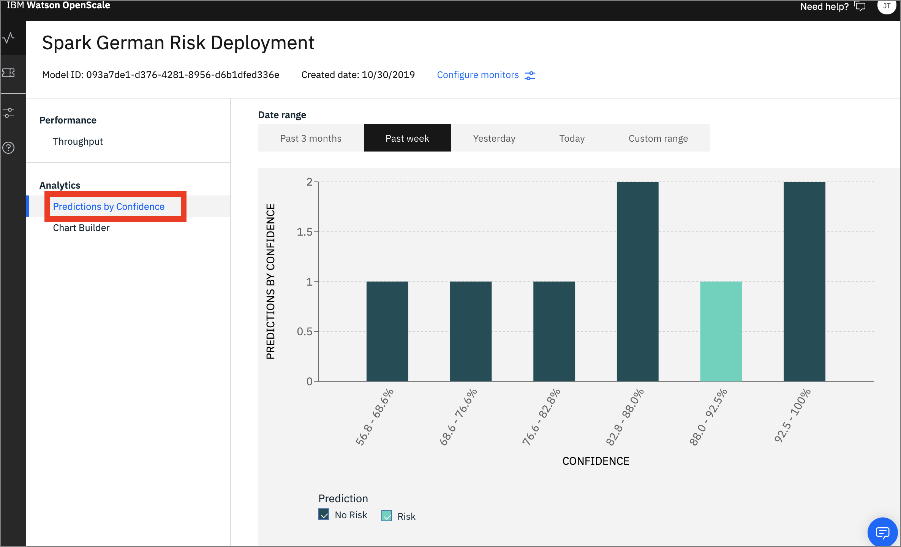
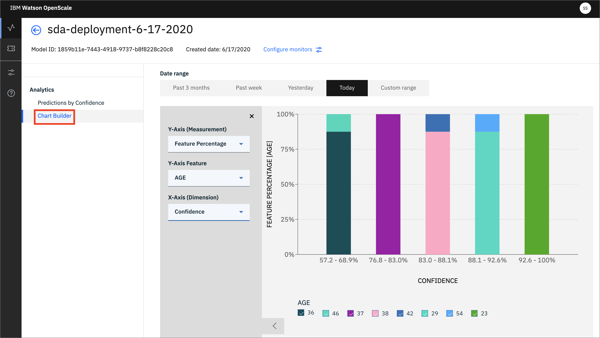

# Trust in AI & Watson OpenScale

This lab will demonstrate how to monitor your deployed machine learning model using Watson OpenScale. We will run several Jupyter notebooks to show the OpenScale APIs and how they configure various monitors. For each notebook, we'll use the OpenScale GUI tool to explore the results.

## Steps

The lab contains the following steps:

1. [Introduction](#1-introduction)
1. [Open the notebook](#2-open-the-notebook)
1. [Update credentials](#3-update-credentials)
1. [Run the notebook](#4-run-the-notebook)
1. [Begin to Explore the Watson OpenScale UI](#5-begin-to-explore-the-watson-openscale-ui)

## 1. Introduction

Watson OpenScale tracks and measures outcomes from your AI models, and helps ensure they remain fair, explainable and compliant wherever your models were built or are running. OpenScale is designed as an open platform that will operate with various model development environments and various open source tools, including TensorFlow, Keras, SparkML, Seldon, AWS SageMaker, AzureML and more.

Watson OpenScale provides a set of monitoring and management tools that help you build trust and implement control and governance structures around your AI investments.

* Providing production monitoring for compliance and safeguards \(auditing model decisions, detecting biases, etc\)
* Ensuring that models are resilient to changing situations
* Aligning model performance with business outcomes

In this lab will walk through the process of deploying a credit risk model and then monitoring the model to explore the different aspects of trusted AI. By the end of the lab, we will have:

* Deployed a model from development to a runtime environment.
* Monitored the performance \(operational\) of the model over time.
* Tracked the model quality \(accuracy metrics\) over time.
* Identified and explored the fairness of the model as it's receiving new data.
* Understood how the model arrived at its predictions.
* Tracked the robustness of the model.

### Prerequisites

It is assumed that an admin has already connected a database to OpenScale, and associated a Machine Learning Provider (in our case, Watson Machine Learning on Cloud Pak for Data).

You have already provided a set of sample data to your model when you tested your deployed ML model in an earlier model of the workshop.

For example, using the UI to test the deployed model, or using cURL or the Python app. Do this now if you have not already run a test.


## 2. Open the notebook

If you [Created the Project](https://ibm-developer.gitbook.io/cloudpakfordata-credit-risk-workshop/getting-started/pre-work#create-a-new-project) using the [CreditRiskProject.zip](https://github.ibm.com/IBMDeveloper/cp4d-workshop-credit-risk/blob/master/projects/CreditRiskProject.zip) file, your notebook will be present in that project, under the `Assets` tab:

TODO: Replace with new image


You may now skip to the next step [Update credentials](#2-update-credentials)

## Import the notebook (If you are not using the Project Import pre-work steps)

> NOTE: You should probably not need this step, and should only perform it if instructed to.

If, for some reason, you are not using the [Created the Project](https://ibm-developer.gitbook.io/cloudpakfordata-credit-risk-workshop/getting-started/pre-work#create-a-new-project) step in the Pre-work to import [CreditRiskProject.zip](https://github.ibm.com/IBMDeveloper/cp4d-workshop-credit-risk/blob/master/projects/CreditRiskProject.zip), then you will need to import the notebook file by itself. Use the following steps for that.

At the project overview click the *New Asset* button, and choose *Add notebook*.


On the next panel select the *From URL* tab, give your notebook a name, provide the following URL, and choose the Python 3.6 environment:

```bash
https://raw.githubusercontent.com/IBM/credit-risk-workshop-cpd/master/notebooks/openscale-initial-setup.ipynb
```

> The notebook is hosted in the same repo as [the workshop](https://github.com/IBM/credit-risk-workshop-cpd)
>
> * **Notebook**: [openscale-initial-setup.ipynb](../../notebooks/openscale-initial-setup.ipynb)
> * **Notebook with output**: [openscale-initial-setup-with-output.ipynb](../../notebooks/with-output/openscale-initial-setup-with-output.ipynb)

TODO: new image


When the Jupyter notebook is loaded and the kernel is ready then we can start executing cells.


### 3. Update credentials

#### WOS_CREDENTIALS

* In the notebook section *2.0*  you will add your Cloud Pak for Data platform credentials for the *WOS_CREDENTIALS*.

* For the `url` field, change `https://w.x.y.z` to use the URL your ICP cluster, i.e something like: `"url": "https://zen-cpd-zen.omid-cp4d-v5-2bef1f4b4097001da9502000c44fc2b2-0001.us-south.containers.appdomain.cloud"`.
* For the `username`, use your Cloud Pak for Data login username.
* For the `password`, user your Cloud Pak for Data login password.

#### DATABASE_CREDENTIALS

In order to setup the OpenScale DataMart to store the transaction and scoring data, you will need to provide the DATABASE_CREDENTIALS that are used to configure OpenScale. Your instructor will provide these for you.

#### MODEL_NAME

After running cell *5.1* containing `ai_client.data_mart.bindings.list_assets()` you should see the machine learning model that you deployed previously in the workshop.

You will add the name of this model in cell *5.2* as *MODEL_NAME*

#### default_space

After running cell *6.1* containing `wml_client.spaces.list()` you should see the name of your deployment space.

Use the *GUID* of this deployment space in cell *6.2* as *default_space*.

#### DEPLOYMENT_NAME

In section *6.3* set the *DEPLOYMENT_NAME* to the name that you gave to your *Analytics deployment* in the previous workshop.

### 4. Run the notebook

> **Important**: *Make sure that you stop the kernel of your notebook(s) when you are done, in order to prevent leaking of memory resources!*


Spend an minute looking through the sections of the notebook to get an overview. You will run cells individually by highlighting each cell, then either click the `Run` button at the top of the notebook. While the cell is running, an asterisk (`[*]`) will show up to the left of the cell. When that cell has finished executing a sequential number will show up (i.e. `[17]`).

## 5. Begin to Explore the Watson OpenScale UI

Now that you have created a machine learning model and configured OpenScale, you can utilize the OpenScale dashboard to monitor the model. Although we have not enabled any type of monitoring yet, with the deployment approach we are using for this lab \( Watson Machine Learning as the model engine \), we will be able to see payload and some performance information out of the box.

* In the same browser \(but a separate tab\), open the `Services` tab by clicking the icon in the upper right. Go to the `OpenScale` tile under the `AI` category and click `Open`:


* When the dashboard loads, _**Click**_ on the _**'Model Monitors'**_  tab and you will see the deployment you configured in the jupyter notebook when you ran it in the previous section:


Do not worry if the name you see does not match exactly with the screenshot. The deployment name you see will correspond to the variable used in the Jupyter notebook


### Confidence Distribution

* From the 'Model Monitors' tab, click on the deployment tile you have created. You will a some *Analytics* data, with the Date Range set to *Today*. We've just configured OpenScale to monitor our deployment, and sent 1 scoring request, so there is not much here.

* Click on the _**'Predictions by Confidence'**_ option on the left panel.



* You will see the number of 'Risk' and 'No Risk' predictions for each confidence range.

## Chart Builder

Some additional data is present in the *Chart Builder* tab.

* Click on `Analytics` -> `Chart Builder`. Here you can create charts using various Measurements, Features, and Dimensions of your machine learning model. Change them and examine the charts that are created:



## Recap

We begun the process of monitoring our machine learning deployment with openscale. Proceed to the next sub-module.
