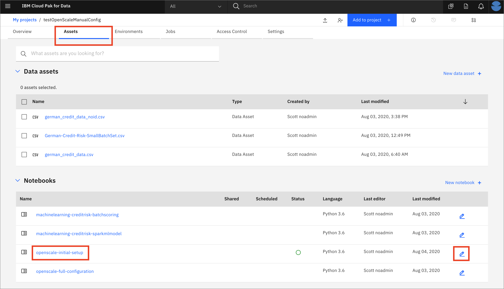
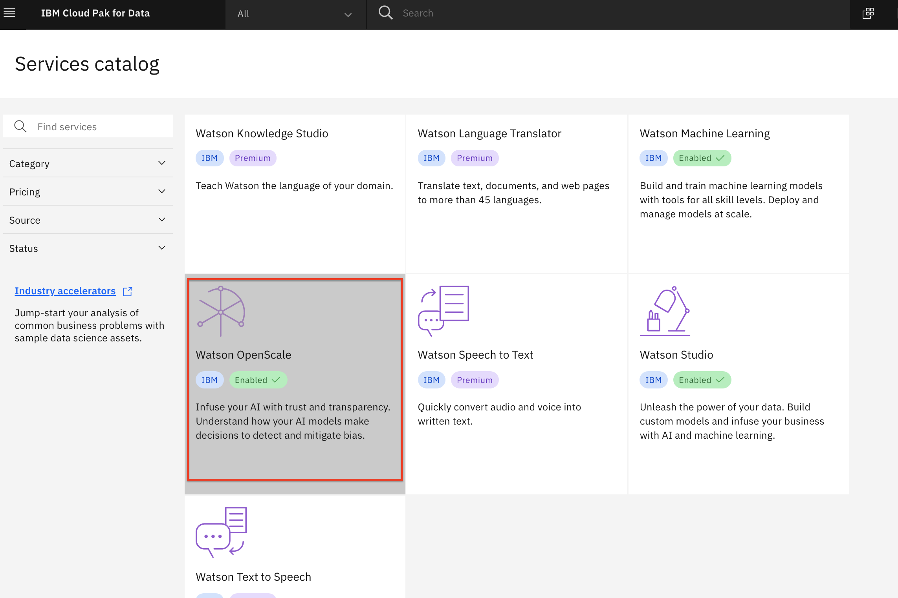
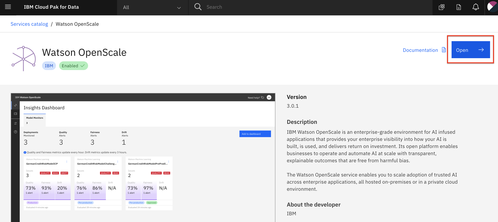
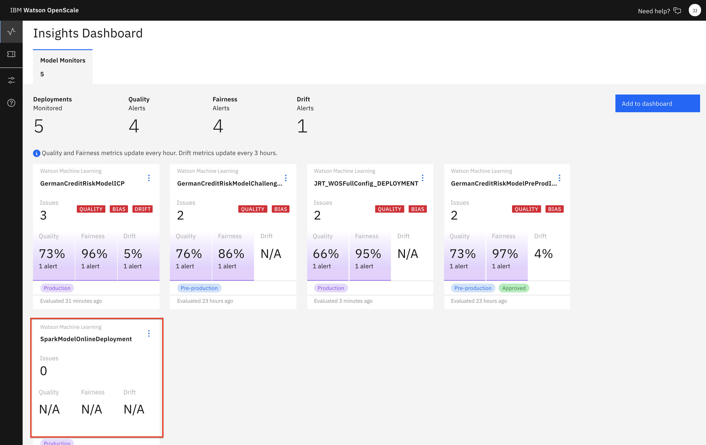
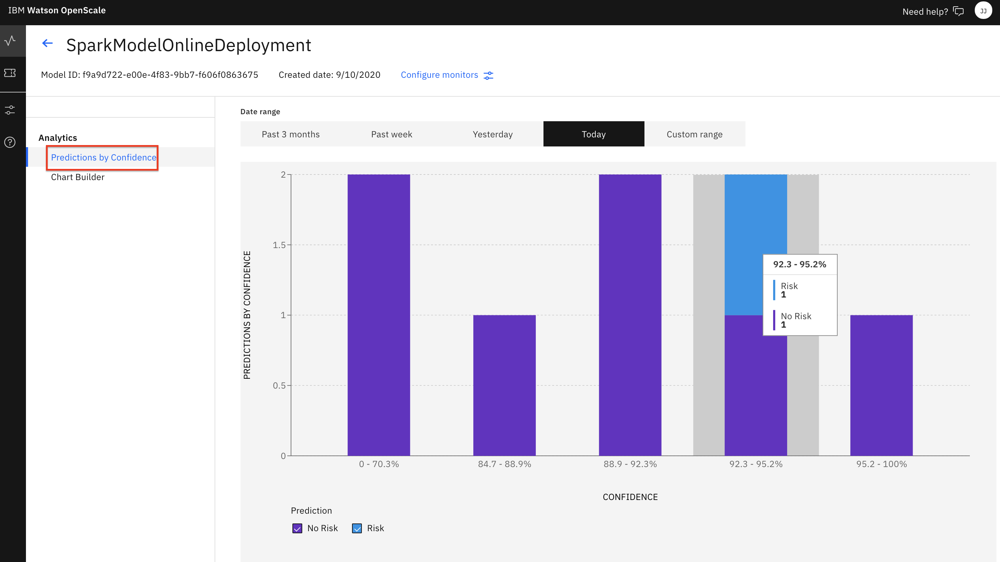
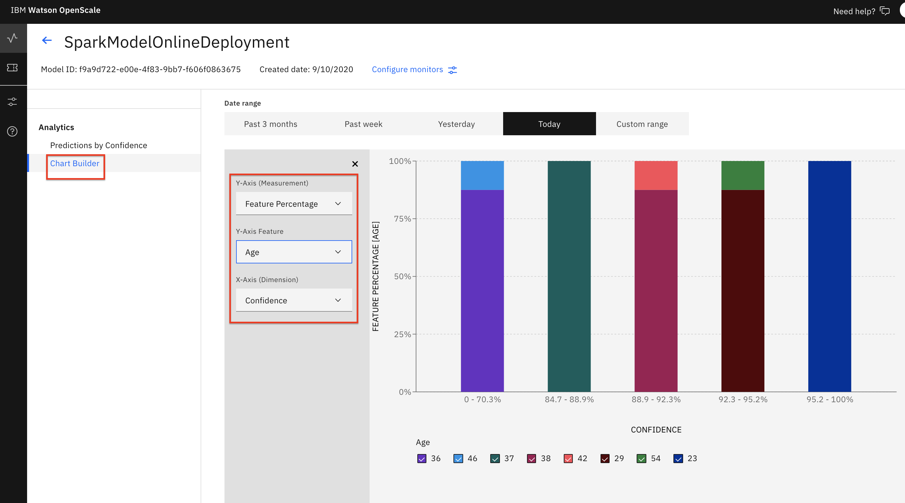

# Trust in AI & Watson OpenScale

This lab will demonstrate how to monitor your deployed machine learning model using Watson OpenScale. We will run several Jupyter notebooks to show the OpenScale APIs and how they configure various monitors. For each notebook, we'll use the OpenScale GUI tool to explore the results.

We'll use several jupyter notebook and instructions:

* [These instructions for basic OpenScale setup](./README.md)
* [Fairness and Explainiblity monitors](./FAIRNESS-EXPLAINABILITY-README.md)
* [Quality monitor and Feedback logging](./QUALITY-FEEDBACK-README.md)
* [Drift monitor](./DRIFT-README.md)

> *Note: It is assumed that you have followed the instructions in the pre-work section to create a project based on an existing project file. If you did not use the project import or do not see the Jupyter notebooks mentioned in this module, see the `Workshop Resources` -> `FAQs / Tips` section for instructions to import the necessary notebooks. Also note that the Jupyter notebooks included in the project have been cleared of output. If you would like to see the notebook that has already been completed with output, see the `Workshop Resources` -> `FAQs / Tips` section for links to the completed notebooks.*

## Steps for basic OpenScale setup

The submodule contains the following steps:

1. [Introduction](#1-introduction)
1. [Open the notebook](#2-open-the-notebook)
1. [Run the notebook](#3-run-the-notebook)
1. [Begin to Explore the Watson OpenScale UI](#4-begin-to-explore-the-watson-openscale-ui)

## 1. Introduction

Watson OpenScale tracks and measures outcomes from your AI models, and helps ensure they remain fair, explainable and compliant wherever your models were built or are running. OpenScale is designed as an open platform that will operate with various model development environments and various open source tools, including TensorFlow, Keras, SparkML, Seldon, AWS SageMaker, AzureML and more.

Watson OpenScale provides a set of monitoring and management tools that help you build trust and implement control and governance structures around your AI investments.

* Providing production monitoring for compliance and safeguards \(auditing model decisions, detecting biases, etc\)
* Ensuring that models are resilient to changing situations
* Aligning model performance with business outcomes

In this lab will walk through the process of deploying a credit risk model and then monitoring the model to explore the different aspects of trusted AI. By the end of the lab, we will have:

* Deployed a model from development to a runtime environment.
* Monitored the performance \(operational\) of the model over time.
* Tracked the model quality \(accuracy metrics\) over time.
* Identified and explored the fairness of the model as it's receiving new data.
* Understood how the model arrived at its predictions.
* Tracked the robustness of the model.

### Prerequisites

It is assumed that an admin has already connected a database to OpenScale, and associated a Machine Learning Provider (in our case, Watson Machine Learning on Cloud Pak for Data).

You have already provided a set of sample data to your model when you [tested](https://ibm-developer.gitbook.io/cloudpakfordata-credit-risk-workshop/credit-risk-workshop/machine-learning-deployment-scoring#test-online-model-deployment) your [deployed ML model](https://ibm-developer.gitbook.io/cloudpakfordata-credit-risk-workshop/credit-risk-workshop/machine-learning-deployment-scoring#online-model-deployment) earlier in the workshop.

For example, using the UI to test the deployed model, or using cURL or the Python app. Do this now if you have not already run a [test](https://ibm-developer.gitbook.io/cloudpakfordata-credit-risk-workshop/credit-risk-workshop/machine-learning-deployment-scoring#test-online-model-deployment).

## 2. Open the notebook

* Go the (☰) navigation menu and click on the *Projects* link and then click on your analytics project.

* From your *Project* overview page, click on the *`Assets`* tab to open the assets page where your project assets are stored and organized.

* Scroll down to the `Notebooks` section of the page and *Click* on the pencil icon at the right of the `openscale-initial-setup` notebook.

* When the Jupyter notebook is loaded and the kernel is ready, we will be ready to start executing it in the next section.

## 3. Run the Notebook

Spend some time looking through the sections of the notebook to get an overview. A notebook is composed of text (markdown or heading) cells and code cells. The markdown cells provide comments on what the code is designed to do.

You will run cells individually by highlighting each cell, then either click the `Run` button at the top of the notebook or hitting the keyboard short cut to run the cell (Shift + Enter but can vary based on platform). While the cell is running, an asterisk (`[*]`) will show up to the left of the cell. When that cell has finished executing a sequential number will show up (i.e. `[17]`).

_**Please note that there are several places in the notebook where you need to update variables. Some of the comments in the notebook are directions for you to modify specific sections of the code. Perform any changes as indicated before running / executing the cell. These changes are described below.**_

#### WOS_CREDENTIALS

* In the notebook section *2.0*  you will add your Cloud Pak for Data platform credentials for the *WOS_CREDENTIALS*.

  * For the `url`, use the URL your Cloud Pak for Data cluster, i.e something like: `"url": "https://zen.clusterid.us-south.containers.appdomain.cloud"`
  * For the `username`, use your Cloud Pak for Data login username.
  * For the `password`, user your Cloud Pak for Data login password.

#### MODEL_NAME

* After running cell *5.1* containing `ai_client.data_mart.bindings.list_assets()` you should see the machine learning model that you deployed previously in the workshop.

* You will add the name of this model in cell *5.2* as *MODEL_NAME*

#### default_space

* After running cell *6.1* containing `wml_client.spaces.list()` you should see the name of your deployment space.

* Use the *GUID* of this deployment space in cell *6.2* as *default_space*.

#### DEPLOYMENT_NAME

* In section *6.3* set the *DEPLOYMENT_NAME* to the name that you gave to your *Online deployment* for the model during the 'Deploy and Test Machine Learning Modles' portion of the workshop.

## 4. Begin to Explore the Watson OpenScale UI

Now that you have created a machine learning model and configured OpenScale with a subscription to that model deployment, you can utilize the OpenScale dashboard to monitor the model. Although we have not enabled any type of monitoring yet, with the deployment approach we are using for this lab \( Watson Machine Learning as the model engine \), we will be able to see payload and some performance information out of the box.

* In the same browser \(but a separate tab\), open the `Services` tab by clicking the `Services` icon on the top right.

* Find and click on the `Watson OpenScale` tile.

* Launch the OpenScale UI tooling by clicking on the *`Launch`* button

* When the *Insights Dashboard* loads, _**Click**_ on the _**'Model Monitors'**_  tab. Here you will see tiles for all model subscriptions that are being monitored including the deployment you configured in the jupyter notebook when you ran it in the previous section:

> *Note:Do not worry if the name you see does not match exactly with the screenshot. The subscription name you see will correspond to the variable used in the Jupyter notebook and the name you used when you deployed the model. At this point, it is normal for the subscription tile to show no monitors have ben configured (i.e N/A under Quality, Fairness, Drift)*

### Confidence Distribution

* From the 'Model Monitors' tab, in the subscription tile you have created, click on one of the `N/A` values (i.e the `N/A` under the 'Fairness' heading). You will see some *Analytics* data, with the Date Range set to *Today*. We've just configured OpenScale to monitor our deployment, and sent a scoring request with 8 records, so there is not much here yet. We can see the distribution of confidence for those 8 predictions.

* If you hover over the bars you will see the number of 'Risk' and 'No Risk' predictions for each confidence range.

### Chart Builder

* Some additional data is present in the *Chart Builder* tab.

* Click on `Analytics` -> `Chart Builder`. Here you can create charts using various Measurements, Features, and Dimensions of your machine learning model. Experiment with different values from the drop downs and examine the charts that are created.

## Stop the Environment

**Important:** When you have completed the last submodule in this "openscale-manual-config" section that you will be doing, it's recommended you stop the environment in order to conserve resources. **You should only follow these steps to stop your environment if you are not going to proceed with the other sub-modules in this section.**

* Navigate back to your project information page by clicking on your project name from the navigation drill down on the top left of the page.

* Click on the 'Environments' tab near the top of the page. Then in the 'Active environment runtimes' section, you will see the environment used by your notebook (i.e the `Tool` value is `Notebook`). Click on the three vertical dots at the right of that row and select the `Stop` option from the menu.

* Click the `Stop` button on the subsequent pop up window.

## Conclusion

We begun the process of monitoring our machine learning deployment with openscale. At this point we have just a subscription from OpenScale for our deployed model.

Proceed to the next sub-module to [configure the Fairness and Explainability monitors.](FAIRNESS-EXPLAINABILITY-README.md)
