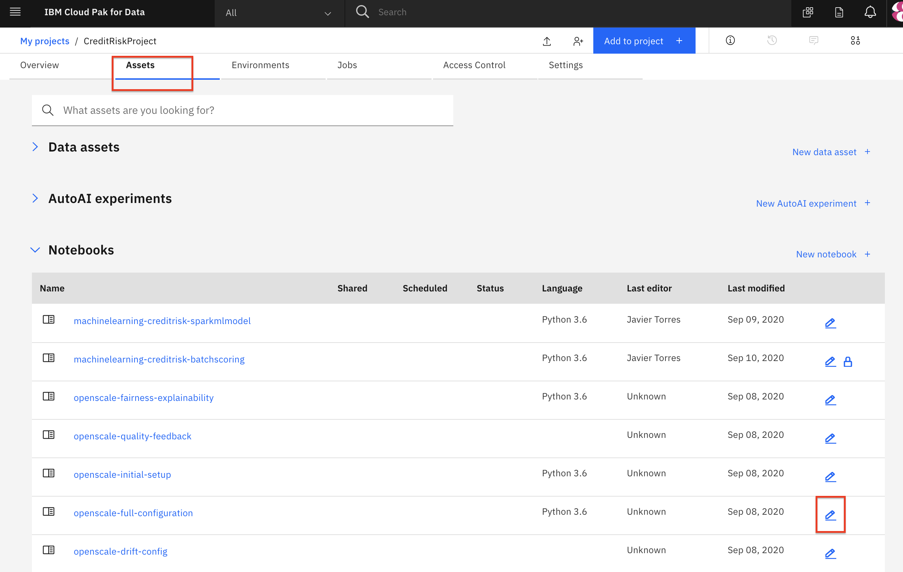
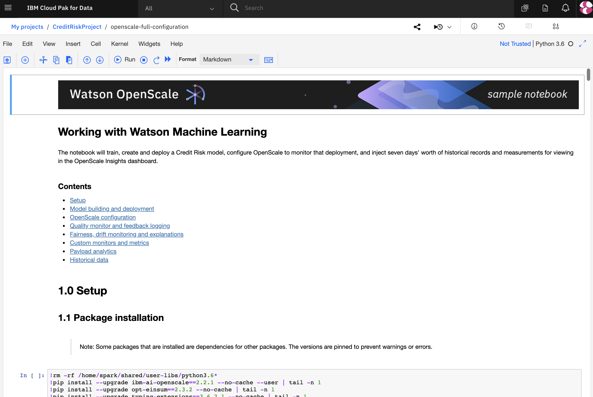
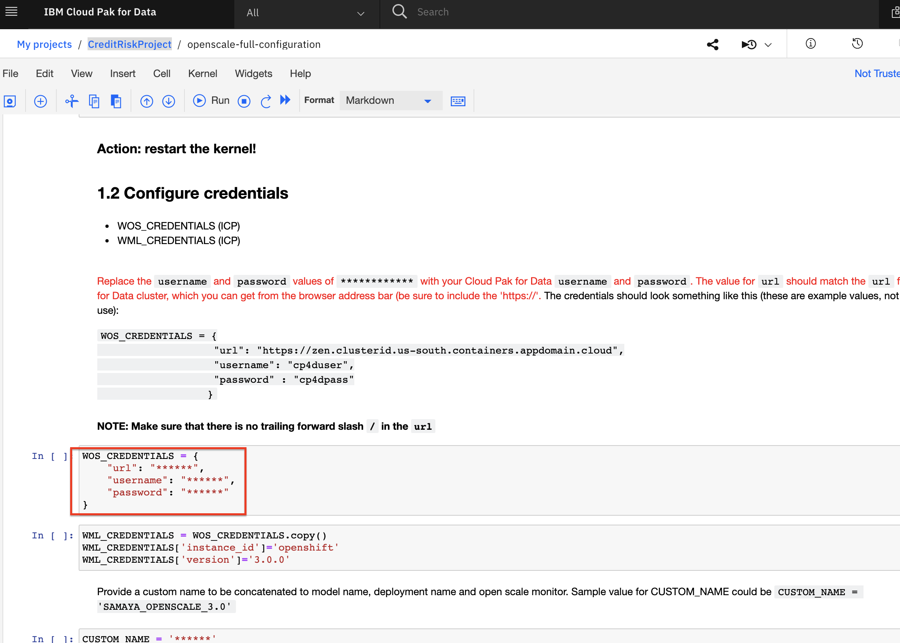

# Configure OpenScale in a Jupyter Notebook

There are several ways of configuring Watson OpenScale to monitor machine learning deployments, including the FastPath automatic configuration, using the GUI tool, a more manual configuration using the APIs, and some combintation of these. For this exercise we're going to configure our OpenScale service by running a Jupyter Notebook. This provides examples of using the OpenScale Python APIs programatically.

This lab is comprised of the following steps:

1. [Open the notebook](#1-open-the-notebook)
2. [Update credentials](#2-update-credentials)
3. [Run the notebook](#3-run-the-notebook)
4. [Get transactions for Explainability](#4-get-transactions-for-explainability)

> *Note: The Jupyter notebook included in the project has been cleared of output. If you would like to see the notebook that has already been completed with output, it is hosted in the same repo as this workshop: **Notebook with output**: [with-output/openscale-full-configuration-output.ipynb](../../notebooks/with-output/openscale-full-configuration-output.ipynb)*

## 1. Open the Notebook

If you followed the pre-work and [created the project](../pre-work/README.md#create-a-new-project) using the CreditRiskProject.zip file, your notebook will be present in that project.

* Go the (☰) navigation menu and click on the *Projects* link and then click on your analytics project.

  

* From your *Project* overview page, click on the *`Assets`* tab to open the assets page where your project assets are stored and organized.

* Scroll down to the `Notebooks` section of the page and *Click* on the pencil icon at the right of the `openscale-full-configuration` notebook.

  

* When the Jupyter notebook is loaded and the kernel is ready, we will be ready to start executing it in the next section.

  

* You may now skip to the next step [Update credentials](#2-update-credentials)

### Import the Notebook

> NOTE: You should probably not need this step, and should only perform it if instructed to do so.

* If, for some reason, you are not using the steps in the [Pre-work to import the CreditRiskProject.zip](../pre-work/README.md#create-a-new-project), then you will need to import the notebook file by itself. Use the following steps for that.

* At the project overview click the *New Asset* button, and choose *Add notebook*.

* On the next panel select the *From URL* tab, give your notebook a name, provide the following URL, and leave the default Python 3.7 environment:

  ```bash
  https://raw.githubusercontent.com/IBM/credit-risk-workshop-cpd/workshop-CPDaaS-master/notebooks/openscale-full-configuration.ipynb
  ```

  

* When the Jupyter notebook is loaded and the kernel is ready then we can start executing cells.

## 2. Update Credentials

* In the notebook section 1.2 you edit the first code cell to use your Cloud API Key in the `CLOUD_API_KEY`. You also set the `WML_LOCATION` variable to the location where your Watson Machine Learning instance is provisioned.

* In the third code cell of this section, you will enter the Cloud Object Storage instance API Key, Resource CRN and Endpoint. You will also provide a `BUCKET_NAME` for bucket that will be used to store your training data.

  

  > Note: Use the instructions in the pre-work or directly in the notebook if you do not already have an API Key, WML location or COS details.
  > Note: The `BUCKET_NAME` has to be globally unique. So consider using the example in the notebook and append your own uniqueID (i.e initials + date).

* In the notebook section 1.3 you will need to provide a value for the `CUSTOM_NAME` variable. Choose a value that is unique and memorable to you, it will be used as part of the naming for various artifacts in the notebook (i.e. the ML model, deployment, etc).

## 3. Run the Notebook

Spend some time looking through the sections of the notebook to get an overview. A notebook is composed of text (markdown or heading) cells and code cells. The markdown cells provide comments on what the code is designed to do.

You will run cells individually by highlighting each cell, then either click the `Run` button at the top of the notebook or hitting the keyboard short cut to run the cell (Shift + Enter but can vary based on platform). While the cell is running, an asterisk (`[*]`) will show up to the left of the cell. When that cell has finished executing a sequential number will show up (i.e. `[17]`).

_**Please note that some of the comments in the notebook are directions for you to modify specific sections of the code. Perform any changes as indicated before running / executing the cell.**_

## 4. Get Transactions for Explainability

Code cell `9.0 Identify transactions for Explainability` will produce a series of IDs for indidvidual ML scoring transactions. Copy one or more of them to examine in the OpenScale UI.

## Conclusion

In this section we covered one of the approaches to configure Watson OpenScale to monitor a machine learning model on Cloud Pak for Data. We have seen:

* How to build a model using Jupyter Notebook.
* How to use the OpenScale Python APIs programatically.
* How to configure all the monitors in OpenScale.

> **Important**: *Make sure that you stop the kernel of your notebook(s) when you are done, in order to conserve resources! You can do this by going to the Asset page of the project, selecting the three vertical dots under the Action column for the notebook you have been running (in this case the `openscale-full-configuration`) and selecting to `Stop Kernel` from the Actions menu. If you see a lock icon on the notebook, click it to unlock the notebook before you click the Actions menu so you can see the stop kernel option. Note: The screenshot below is an example of stopping the kernel, the name of the notebook may not match your notebook.*
> 
