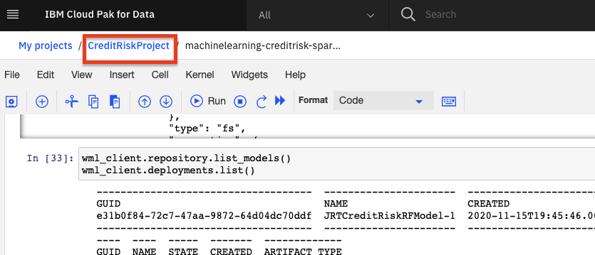

# Configure OpenScale in a Jupyter Notebook

There are several ways of configuring Watson OpenScale to monitor machine learning deployments, including the automatic configuration, using the GUI tool, a more manual configuration using the APIs, and some combintation of these. For this exercise we're going to configure our OpenScale service by running a Jupyter Notebook. This provides examples of using the OpenScale Python APIs programatically.

> *Note: It is assumed that you have followed the instructions in the pre-work section to create a project based on an existing project file. If you did not use the project import or do not see the Jupyter notebooks mentioned in this module, see the `Workshop Resources` -> `FAQs / Tips` section for instructions to import the necessary notebooks. Also note that the Jupyter notebooks included in the project have been cleared of output. If you would like to see the notebook that has already been completed with output, see the `Workshop Resources` -> `FAQs / Tips` section for links to the completed notebooks.*

## 1. Open the Notebook

* Go the (☰) navigation menu and click on the *Projects* link and then click on your analytics project.

* From your *Project* overview page, click on the *`Assets`* tab to open the assets page where your project assets are stored and organized.

* Scroll down to the `Notebooks` section of the page and *Click* on the pencil icon at the right of the `openscale-full-configuration` notebook.

* When the Jupyter notebook is loaded and the kernel is ready, we will be ready to start executing it in the next section.

## 2. Update Credentials

* In the notebook section 1.2 you edit the first code cell to use your Cloud Pak for Data platform credentials in the `WOS_CREDENTIALS`.

  * For the `url`, use the URL your cluster, i.e something like: `"url": "https://zen.clusterid.us-south.containers.appdomain.cloud"`.
  * For the `username`, use your login username.
  * For the `password`, user your login password.

## 3. Run the Notebook

Spend some time looking through the sections of the notebook to get an overview. A notebook is composed of text (markdown or heading) cells and code cells. The markdown cells provide comments on what the code is designed to do.

You will run cells individually by highlighting each cell, then either click the `Run` button at the top of the notebook or hitting the keyboard short cut to run the cell (Shift + Enter but can vary based on platform). While the cell is running, an asterisk (`[*]`) will show up to the left of the cell. When that cell has finished executing a sequential number will show up (i.e. `[17]`).

_**Please note that some of the comments in the notebook are directions for you to modify specific sections of the code. Perform any changes as indicated before running / executing the cell.**_

### Get Transactions for Explainability

Under `7.8 Identify transactions for Explainability` run the cell. It will produce a series of UIDs for indidvidual ML scoring transactions. Copy one or more of them to examine in the next section.

## Stop the Environment

**Important**: In order to conserve resources, make sure that you stop the environment used by your notebook(s) when you are done.

* Navigate back to your project information page by clicking on your project name from the navigation drill down on the top left of the page.

* Click on the 'Environments' tab near the top of the page. Then in the 'Active environment runtimes' section, you will see the environment used by your notebook (i.e the `Tool` value is `Notebook`). Click on the three vertical dots at the right of that row and select the `Stop` option from the menu.

* Click the `Stop` button on the subsequent pop up window.

## Conclusion

In this section we covered one of the approaches to configure Watson OpenScale to monitor a machine learning model on Cloud Pak for Data. We have seen:

* How to build a model using Jupyter Notebook.
* How to use the OpenScale Python APIs programatically.
* How to configure all the monitors in OpenScale.
