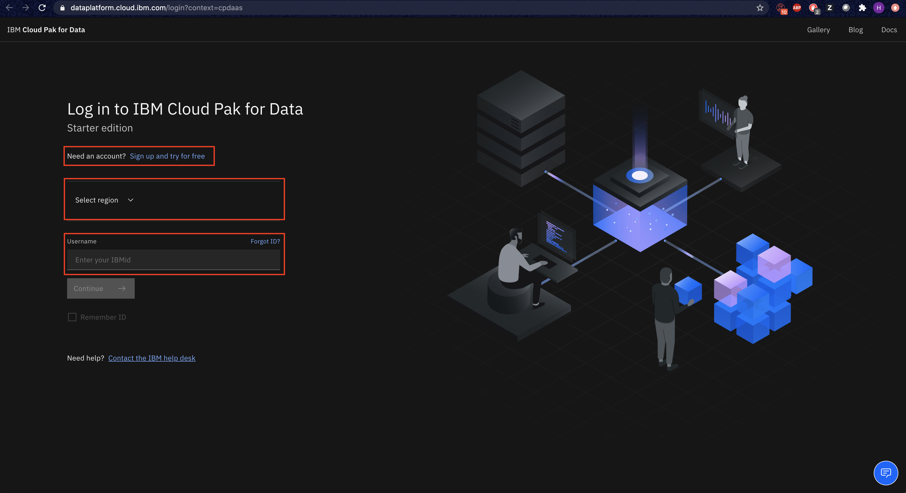

# Pre-work

Before we get started, we will download some assets and complete some setup for our workshop. This section is broken up into the following steps:

1. [Download or Clone the Repository](#1-download-or-clone-the-repository)
1. [Create IBM Cloud account and log into IBM Cloud Pak for Data](#2-create-ibm-cloud-account-and-log-into-ibm-cloud-pak-for-data)
1. [Create an Analytics Project and Deployment Space](#3-create-a-project-and-deployment-space)

## 1. Download or Clone the Repository

Various parts of this workshop will require the attendee to upload files or run scripts that we've stored in the repository. To download the repository and its assets, you have two options. Option 1, if you have the [`git`](https://git-scm.com) command line interface on your laptop, you can clone the repository directly. Option 2, if you don't have git you can access the [GitHub repository](https://github.com/IBM/credit-risk-workshop-cpd) page to download the zip file.

* [Option 1] If you have the git CLI, run the following commands from a terminal or command prompt:

   ```bash
   git clone https://github.com/IBM/credit-risk-workshop-cpd.git
   cd credit-risk-workshop-cpd
   ```

* [Option 2] To download the repository as a zip file, go to the [GitHub repo for this workshop](https://github.com/IBM/credit-risk-workshop-cpd) and download the archived version of the workshop and extract it on your laptop.


> **Note: If its not automatically done for you, make sure you extract or unzip the zip file after its downloaded.**

## 2. Create IBM Cloud account and log into IBM Cloud Pak for Data

* Launch a browser and navigate to [IBM Cloud Pak for Data as a Service](https://dataplatform.cloud.ibm.com/login?context=cpdaas).

* Log into your IBM Cloud account using your IBMId. If you don't have one, you can click on `Sign up and try for free` to create a free IBM Cloud account.



* The apps required for IBM Cloud Pak for Data will be provisioned for you. Once you see a message that says that the apps are ready to use, click on `Go to IBM Cloud Pak for Data`.


## 3. Create a Project and Deployment Space

### Create a New Project

In Cloud Pak for Data, we use the concept of a project to collect / organize the resources used to achieve a particular goal (resources to build a solution to a problem). Your project resources can include data, collaborators, and analytic assets like notebooks and models, etc.

* Go the (☰) navigation menu, expand *Projects* and click on the *View all projects* link.


* Click on the *New +* button on the top.


* We are going to create a project from an existing file (which contains the assets we will use throughout this workshop), as opposed to creating an empty project. Select the _*Create a project from a sample or file*_ option.


* Click on the **browse** link and in the file browser popup, navigate to where you cloned or downloaded this repository in the previous section. From within that root directory, navigate to the `projects/` sub-directory and choose the `CreditRiskProject.zip` file. Then click the **open** button.


* Give the project a name. You also need to provide an object storage instance for this project. If you haven't already created a Cloud Object Storage instance in your IBM Cloud account, you can create one now by clicking `Add`.


* A new tab opens up, where you can create the Cloud Object Service. By default, a `Lite` (Free) plan will be selected. Scroll down and update the name of your Cloud Object Storage service if you wish, and click `Create`.


* The browser tab will automatically close when the Cloud Object Storage instance has been created. Back on IBM Cloud Pak for Data as a Service, click `Refresh`.


* The newly created Cloud Object Storage instance will now be displayed under "Storage". Click `Create` to finish creating the project.


* You can see a progress bar that says your project is being created. Once the project is succesfully created, on the pop up window click on the *View new project* button.


* Clicking on the *Assets* tab will show all the assets that were imported into the project when it was created.


### Add a connection to the project

Some of the data assets required for this workshop are stored in an external DB2 Warehouse instance on IBM Cloud. The next step is to add the DB2 Warehouse instance as a connection to the project, so that these data assets can be accessed.

* Click on `Add to project +` and select `Connection`.


* Click on `Db2 Warehouse`.


* Provide the connection details for the Db2 Warehouse connection and click `Create`.

> **Note**: The Db2 Warehouse connection details will be provided by the instructor.


* Once the connection has been successfully added to the project, you can see it listed under *Data assets* on your project's *Assets* tab.


### Create a Deployment Space

Cloud Pak for Data uses the concept of `Deployment Spaces` to configure and manage the deployment of a set of related deployable assets. These assets can be data files, machine learning models, etc.

* Go the (☰) navigation menu, expand `Deployment spaces` and then select `View all spaces`.


* Click on the `New deployment space` button.


* We will create an empty deployment space, so click on the `Create an empty space` option.


* Give your deployment space a unique name and optional description. Provide the Cloud Object Storage instance that you had created when you were creating the project and select the Machine Learning Service that was provisioned when you signed up for IBM Cloud Pak for Data as a Service, then click the `Create` button.


* Once the deployment space is created, you can click on `View new space`. 


## Conclusion

We've completed creating the project and deployment space that we will be using for the rest of this workshop.
