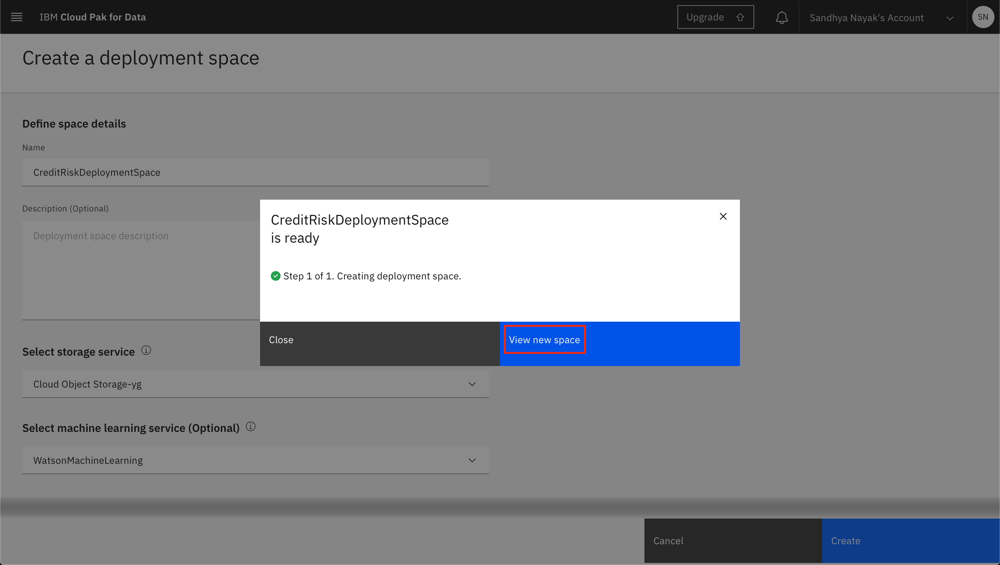

# Pre-work

Before we get started, we will download some assets and complete some setup for our workshop. This section is broken up into the following steps:

- [Pre-work](#pre-work)
  - [1. Download a copy of the the Repository](#1-download-a-copy-of-the-the-repository)
  - [2. Create IBM Cloud account and log into IBM Cloud Pak for Data as a Service](#2-create-ibm-cloud-account-and-log-into-ibm-cloud-pak-for-data-as-a-service)
  - [3. Create a Project and Deployment Space](#3-create-a-project-and-deployment-space)
    - [Create a New Project](#create-a-new-project)
    - [Associate a Watson Machine Learning Service instance to the project](#associate-a-watson-machine-learning-service-instance-to-the-project)
    - [Create a Deployment Space](#create-a-deployment-space)
  - [4. Get the IBM Cloud platform API key and Watson Machine Learning service instance location](#4-get-the-ibm-cloud-platform-api-key-and-watson-machine-learning-service-instance-location)
    - [Get the IBM Cloud platform API key](#get-the-ibm-cloud-platform-api-key)
      - [1. Using the IBM Cloud CLI](#1-using-the-ibm-cloud-cli)
      - [2. Using the IBM Cloud console](#2-using-the-ibm-cloud-console)
    - [Get the Watson Machine Learning service instance location](#get-the-watson-machine-learning-service-instance-location)
  - [Conclusion](#conclusion)
  - [FAQ](#faq)
    - [Download FAQ](#download-faq)
    - [Sign up FAQ](#sign-up-faq)


<!-- ## 1. Download or Clone the Repository -->
<!-- TODO: ADD PROJECT TO GALLERY -->
<!-- Various parts of this workshop will require the attendee to upload files or run scripts that we've stored in the repository. To download the repository and its assets, you have two options. Option 1, if you have the [`git`](https://git-scm.com) command line interface on your laptop, you can clone the repository directly. Option 2, if you don't have git you can access the [GitHub repository](https://github.com/IBM/credit-risk-workshop-cpd) page to download the zip file.

* **[Option 1]** If you have the git CLI, run the following commands from a terminal or command prompt:

   ```bash
   git clone https://github.com/IBM/credit-risk-workshop-cpd.git
   cd credit-risk-workshop-cpd
   ```

* **[Option 2]** To download the repository as a zip file, go to the [GitHub repo for this workshop](https://github.com/IBM/credit-risk-workshop-cpd) and download the archived version of the workshop and extract it on your laptop.


> **Note: If you used Option 2, make sure you extract or unzip the zip file after it's downloaded. This is not needed if you followed Option 1** -->

## 1. Download a copy of the the Repository

Various parts of this workshop will require the attendee to upload files or run scripts. These artifacts have been collected in the following two zip files which you can download using the links below. 

For each line below, click on the `[Download]` link to get the file. If the link isn't working for you, try clicking the `[Mirror]` to get it from out backup servers. You'll need these files in the next sections.


1. CP4DaaS Project [[Download]](http://ibm.biz/ddc-cp4daas-project) | [[Mirror]](http://ibm.biz/ddc-cp4daas-project-mirror)
2. Python Application [[Download]](http://ibm.biz/ddc-cp4daas-python-app) | [[Mirror]](http://ibm.biz/ddc-cp4daas-python-app-mirror)

## 2. Create IBM Cloud account and log into IBM Cloud Pak for Data as a Service

* Launch a browser and navigate to one of the following links based on what day you're joining us and if you already have an account:
    - [Sign Up Page [Nov 10]](http://ibm.biz/ddc-cp4daas-nov-10)
    - [Sign Up Page [Nov 24]](http://ibm.biz/ddc-cp4daas-nov-24)

* You can then log into your IBM Cloud account using your IBMid or create a new one. Note that the correct region should already be selected for you.
  - If you are a new user, use the `Create a new IBM Cloud Account` section.
  - If you are a returning user, click on the `Log in with your IBMid` link.
    > **Note:** If you are a returning user and you have watson services in a different region than the pre-selected one, you will see an error message telling you to select that region instead. See `Q3` in the [Sign up FAQ](#sign-up-faq) section for help.

 


* The services required for IBM Cloud Pak for Data will be automatically provisioned for you. Once you see a message that says that the apps are ready to use, click on `Go to IBM Cloud Pak for Data`.


If you have any issues, please see the [Sign up FAQ:](#sign-up-faq).


## 3. Create a Project and Deployment Space

### Create a New Project
<!-- TODO: If project is cloned form the Gallery, this is already done. -->

In Cloud Pak for Data, we use the concept of a project to collect / organize the resources used to achieve a particular goal (resources to build a solution to a problem). Your project resources can include data, collaborators, and analytic assets like notebooks and models, etc.

* Go the (☰) navigation menu, expand *Projects* and click on the *View all projects* link.


* Click on the `New +` button on the top.


* We are going to create a project from an existing file (which contains the assets we will use throughout this workshop), as opposed to creating an empty project. Select the _*Create a project from a sample or file*_ option.


* Click on the **browse** link and in the file browser popup, navigate to where you downloaded the files for this lab. Then select the `CreditRiskProject.zip` file.


* Give the project a name. You also need to provide an object storage instance for this project. If you haven't already created a Cloud Object Storage instance in your IBM Cloud account, you can create one now by clicking `Add`.


* A new tab opens up, where you can create the Cloud Object Service. By default, a `Lite` (Free) plan will be selected. Scroll down and update the name of your Cloud Object Storage service if you wish, and click `Create`.


* The browser tab will automatically close when the Cloud Object Storage instance has been created. Back on IBM Cloud Pak for Data as a Service, click `Refresh`.


* The newly created Cloud Object Storage instance will now be displayed under "Storage". Click `Create` to finish creating the project.


* You can see a progress bar that says your project is being created. Once the project is succesfully created, on the pop up window click on the `View new project` button.


* Clicking on the *Assets* tab will show all the assets that were imported into the project when it was created.

<!-- TODO: Once the zip file is finalized, update the screenshot. -->


<!-- TODO later: Add this back once DV is rolled out
### Add a connection to the project

Some of the data assets required for this workshop are stored in an external DB2 Warehouse instance on IBM Cloud. The next step is to add the DB2 Warehouse instance as a connection to the project, so that these data assets can be accessed.

* Click on `Add to project +` and select `Connection`.


* Click on `Db2 Warehouse`.


* Provide the connection details for the Db2 Warehouse connection and click `Create`.

> **Note**: The Db2 Warehouse connection details will be provided by the instructor.


* Once the connection has been successfully added to the project, you can see it listed under *Data assets* on your project's *Assets* tab.

 -->

### Associate a Watson Machine Learning Service instance to the project

You will need to associate a Watson Machine Learning service instance to your project in order to run Machine Learning experiments.

* Go to the *Settings* tab of your project and look for the *Associated services* section. Click on `Add service` and in the menu that opens up, click on `Watson`.


* Click the checkbox next to the Watson Machine Learning service instance that was created for you when you signed up for Cloud Pak for Data as a Service. Click `Associate service`.

> **Note:** If you have multiple WatsonMachineLearning services, make sure you select the one that is in the same regions as is your Cloud Pak for Data as a service. 

> **Note:** Also make sure that the Name of the instance matches the name of the WatsonMachineLearning that you added in the earlier steps


* You will  see a notification that the WatsonMachineLearning service was successfully associated with your project. Click on the `X` in the right top corner to close the pop up modal and go back to your project.


### Create a Deployment Space

Cloud Pak for Data uses the concept of `Deployment Spaces` to configure and manage the deployment of a set of related deployable assets. These assets can be data files, machine learning models, etc. For this workshop, we need to create one.

* Go the (☰) navigation menu, expand `Deployment spaces` and then select `View all spaces`.


* Click on the `New deployment space` button.


* We will create an empty deployment space, so click on the `Create an empty space` option.


* Give your deployment space a unique name and optional description. Provide the Cloud Object Storage instance that you had created when you were creating the project and select the Machine Learning Service instance associated with your IBM Cloud Pak for Data as a Service instance, then click the `Create` button.


* Once the deployment space is created, you can click on `View new space`. 



## 4. Get the IBM Cloud platform API key and Watson Machine Learning service instance location

In some parts of this workshop, you will be executing Jupyter notebooks which use the Watson Machine Learning API to perform operations on your Watson Machine Learning instance. For the Jupyter notebooks to gain access to your Watson Machine Learning instance, you will need to provide them with the API key for your IBM Cloud account as well as the location of the WML service instance.

### Get the IBM Cloud platform API key

Use one of the following methods to retrieve the IBM Cloud Platform API key:

1. [Using the IBM Cloud CLI](#1-using-the-ibm-cloud-cli)
1. [Using the IBM Cloud console](#2-using-the-ibm-cloud-console)

#### 1. Using the IBM Cloud CLI

* Install the [IBM Cloud CLI](https://cloud.ibm.com/docs/cli/index.html) using the instructions in the link.

* Once the IBM Cloud CLI is installed, run the following command in your terminal to log into your IBM Cloud account. Running this command will prompt you to enter your email address and password.

```bash
ibmcloud login
```

* Once you have successfully logged in, generate an API key using the following command. Replace API_KEY_NAME with a unique name.

```bash
ibmcloud iam api-key-create API_KEY_NAME
```

* Get the value of `API Key` from the result of the command. This is the *api_key* value that you will need to provide in your Jupyter notebooks for accessing the Watson Machine Learning service instance.

#### 2. Using the IBM Cloud console

Alternatively, you can use the IBM Cloud Console to generate the IBM Cloud API key.

* Go to the [API keys section of the Cloud console](https://cloud.ibm.com/iam/apikeys).

* Select `My IBM Cloud API keys` in the *View* dropdown and then click `Create an IBM Cloud API key +`. 


* Give your API key a unique name and click `Create`. You should see a message that says `API key successfully created`. Click `Copy` to copy the generated API key. 


This is the `api_key` value that you will need to provide in your Jupyter notebooks for accessing the Watson Machine Learning service instance.

### Get the Watson Machine Learning service instance location

**Option 1:**
You can select the Watson Machine Learning location code from the table below if you are sure where you've deployed your instance. 

| Region       |   Region Codes | 
|--------------|------------| 
| Dallas       | us-south   | 
| Tokyo        | jp-tok     | 


**Option 2:** Alternatively, if you prefer to use the CLI, you can use the API key to obtain the location of the Watson Machine Learning Service instance associated with your IBM Cloud Pak for Data as a Service instance.

* Install the [IBM Cloud CLI](https://cloud.ibm.com/docs/cli/index.html) using the instructions in the link.

* Run the following command in a terminal to log into IBM Cloud using the API Key you had generated earlier. Remember to update `API_KEY` with your api key.

```bash
ibmcloud login --apikey API_KEY -a https://cloud.ibm.com
```

* Run the following command to retrieve information about the Watson Machine Learning service instance. Remember to update `WML_INSTANCE_NAME` with the name of the Watson Machine Learning instance associated with your IBM Cloud Pak for Data as a Service instance.

```bash
ibmcloud resource service-instance WML_INSTANCE_NAME
```

* Get the value of `Location` from this result. This is the *location* value that you will need to provide in your Jupyter notebooks for accessing the Watson Machine Learning service instance.


## Conclusion

At this point we are done with this section. We have completed creating an IBM Cloud account, a Cloud Pak for Data as a Service instance, and the project and deployment space that we will use in the rest of this workshop. We have also obtained the IBM Cloud API key and the Watson Machine Learning service instance location region code that we will use in the Jupyter notebooks section. 

If you have any questions, see the [FAQ](#faq) section. Otherwise, you can go to the next lab.

---
## FAQ

### Download FAQ

**Q1: I'm having issues downloading the files**

A: For each file that you need to download, we have provided multiple options: the `[Download]` button as well as the `[Mirror]` links. Try downloading the file from any of those links. If neither works for you, reach out to the instructors and they can provide the files to you.

### Sign up FAQ
 
**Q1: I don't have all the services needed.**

A: In some rare cases, the services will not auttomatically provision for you. You can do that manually by following these instructions:

  1. Once you are on IBM Cloud Pak for Data, on the top right corner click on your avatar, and then click on `Profile and settings`. Go to the `Services` tab.
  
  2. If the `Machine Learning` service instance is not listed under `You Cloud Pak for Data Services` then find it in the `Try our Available Services` section and click on the `Add` button. 
  

  1.  Next, note down the name of the `Machine Learning` service instance in your `Cloud Pak for Data` section. This is the blue hyperlink underneeth the `Machine Learning` card title. You will need to provide this name in future steps.
  

**Q2: I get the `That email address is already registered to an IBM Cloud account.` messsage.**

A: You must already have an IBMid account. Follow the login link provided in the error message to login to your existing account. 

**Q3: I get the `Your Watson Studio, Watson Knowledge Catalog, and Watson Machine Learning Lite services must be created in the same service region.` error.**

A: This means you have previously created some Watson services in a different region. To resolve this, go to the [CP4DaaS Login](https://dataplatform.cloud.ibm.com/registration/stepone?context=cpdaas&apps=all) page, select the region you had previously used and then login using the login link at the bottom right. Alternatively, you can create a new account and proceed as a new user to follow along.
