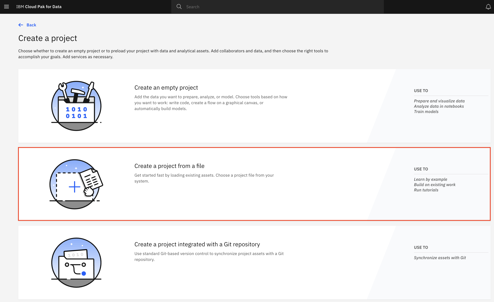
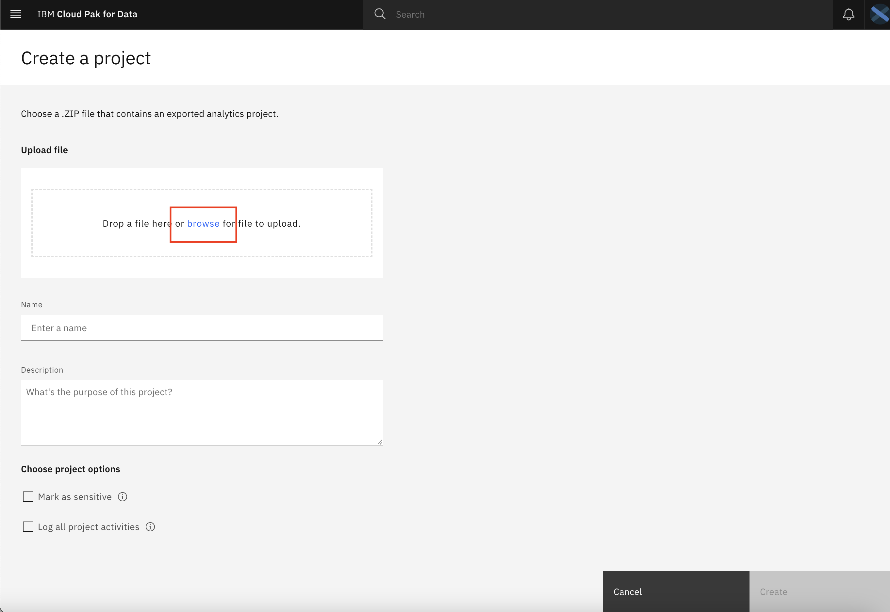
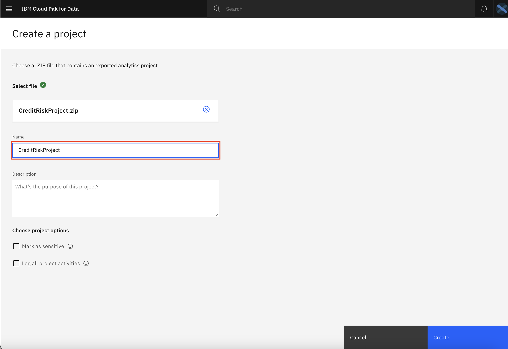
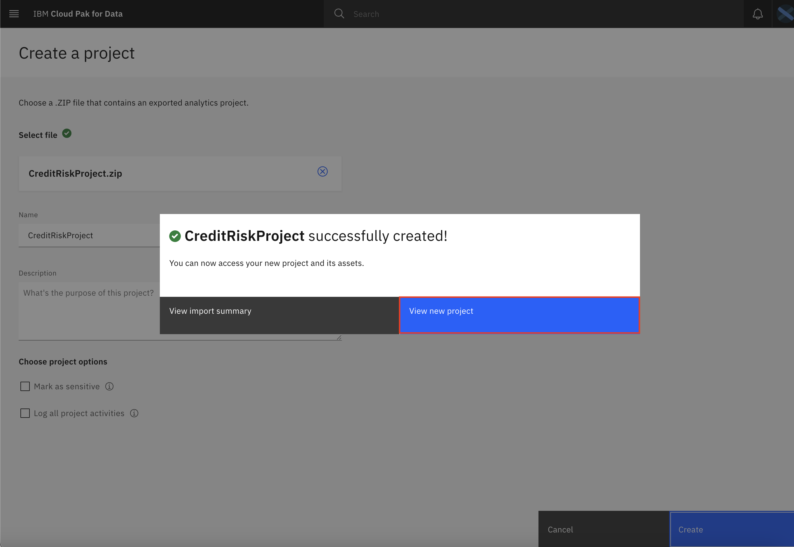
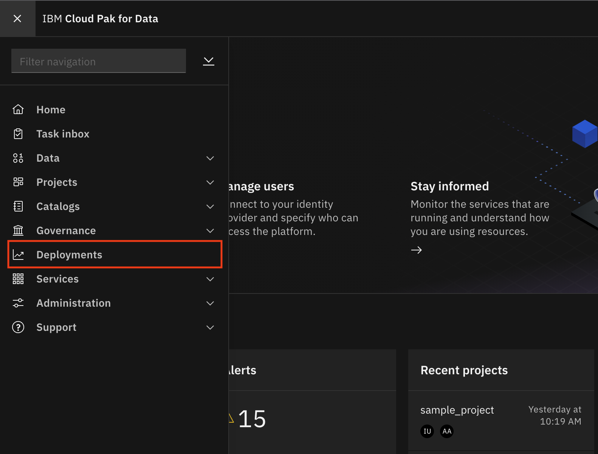
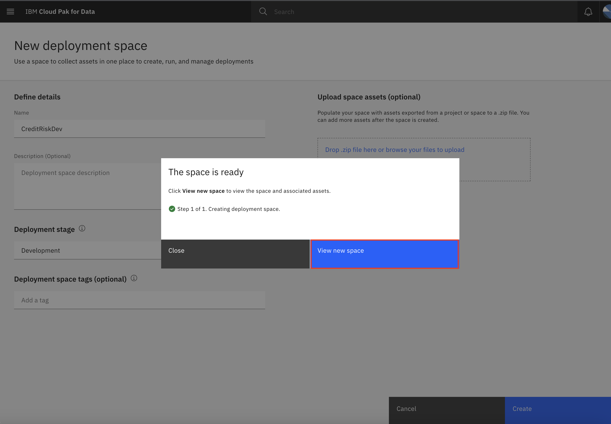
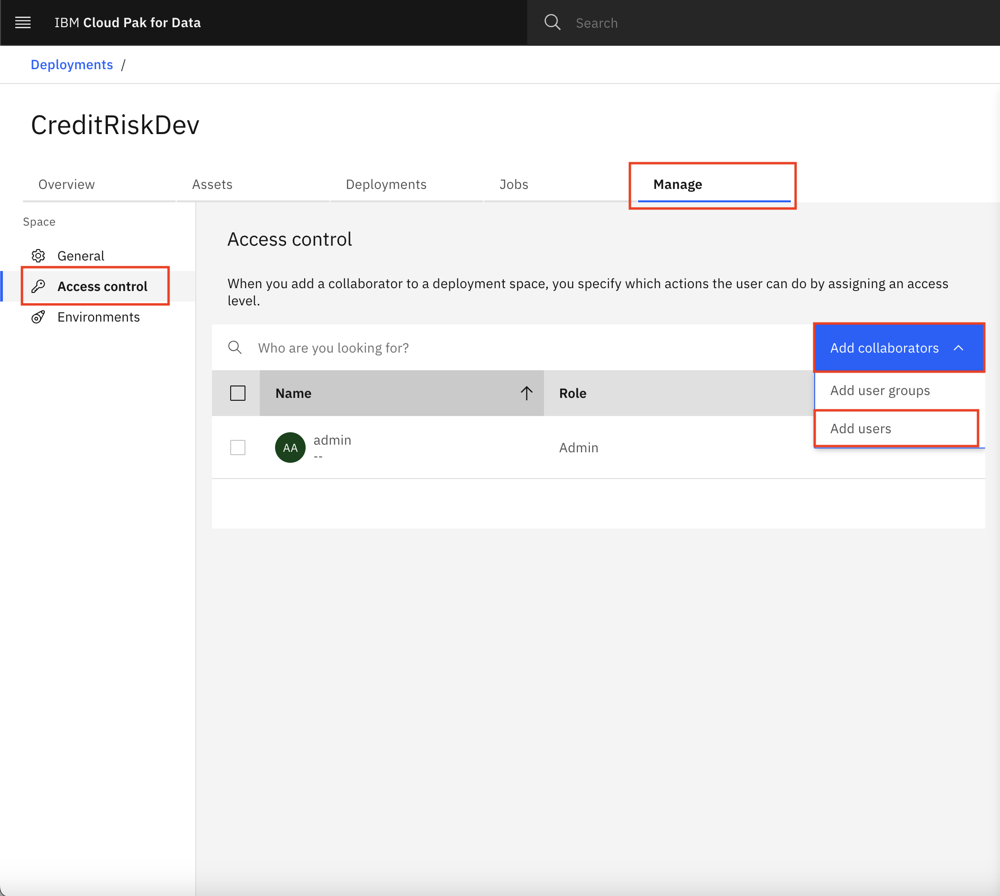
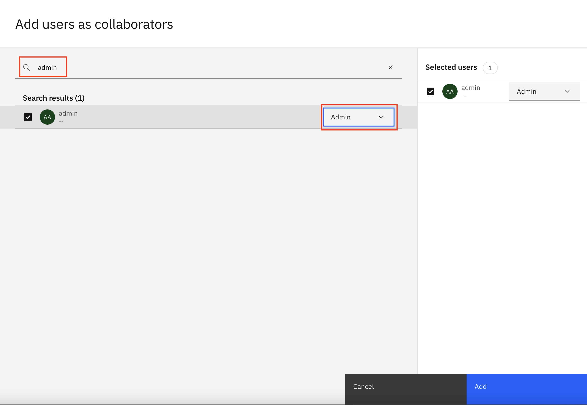

# Pre-work

Before we get started, we will download some assets and complete some setup for our workshop. This section is broken up into the following steps:

1. [Download or Clone the Repository](#1-download-or-clone-the-repository)
1. [Create an Analytics Project and Deployment Space](#2-create-a-project-and-deployment-space)

## 1. Download Workshop Assets

Various parts of this workshop will require the attendee to upload files or run scripts. These artifacts have been collected in the following zip file which you can download by clicking the link below and saving the zip file locally to your machine.

* [Cloud Pak for Data Analytics Project](https://github.com/IBM/credit-risk-workshop-cpd/raw/master/projects/CreditRiskProject.zip)

> **Note: The analytics project zip file does not to be unzipped/expanded. It will be directly uploaded to the Cloud Pak for Data platform as a zip file. For reference, all these assets are also in the [GitHub repo for this workshop](https://github.com/IBM/credit-risk-workshop-cpd).**

## 2. Create a Project and Deployment Space

At this point of the workshop we will be using Cloud Pak for Data for the remaining steps.

* Launch a browser and navigate to your Cloud Pak for Data deployment.

> *NOTE: Your instructor will provide a URL and credentials to log into Cloud Pak for Data!*

### Create a New Project

In Cloud Pak for Data, we use the concept of a project to collect / organize the resources used to achieve a particular goal (resources to build a solution to a problem). Your project resources can include data, collaborators, and analytic assets like notebooks and models, etc.

* Go the (☰) navigation menu and under the *Projects* section click on *`All Projects`*.

* Click on the **`New project`** button on the top right.

* Select the `Analytics project` radio button and click the **`Next`** button.

* We are going to create a project from an existing file (which contains the assets we will use throughout this workshop), as opposed to creating an empty project. Select the *`Create a project from a sample or file`* option.

* Click on the *`browse`* link and in the file browser pop-up, navigate to where you downloaded the `CreditRiskProject.zip` file in the previous section, then click the **`open`** button.

* Give the project a name and click the **`Create`** button.

* From the project creation succesfully created pop up window, click on the **`View new project`** button.

### Create a Deployment Space

Cloud Pak for Data uses the concept of `Deployment Spaces` to configure and manage the deployment of a set of related deployable assets. These assets can be data files, machine learning models, etc.

* Go the (☰) navigation menu and click **`Deployments`**.

* Click on the **`New deployment space`** button.

* We will create an empty deployment space, so click on the **`Create an empty space`** option.

* Give your deployment space a unique name, optional description, then click the **`Create`** button.

* From the deployment space creation pop up window, click on the **`View new space`** button.

* Next, we will add a collaborator to the new deployment space. Collaborators allow others to view/edit/manage the assets being deployed. In this workshop, we want the models we deploy to be visible and monitored in the OpenScale model monitoring lab.

* Click on the `Access control` tab and then click on **`Add collaborators`** on the right.

* Enter "admin" as a Collaborator input field and select the `Admin` user from the drop down list. Then click on the **`Add to list`** button.

> *NOTE: We are adding the user that configured the machine learning instance for OpenScale monitoring. In this case, the user is the admin user.*

* Click the **`Add`** button to finish adding the collaborator. You should be brought back to the deployment space page and see your user ID along with the `Admin` user as collaborators for this space.

## Conclusion

We've completed creating the project and deployment space that we will be using for the rest of this workshop.
