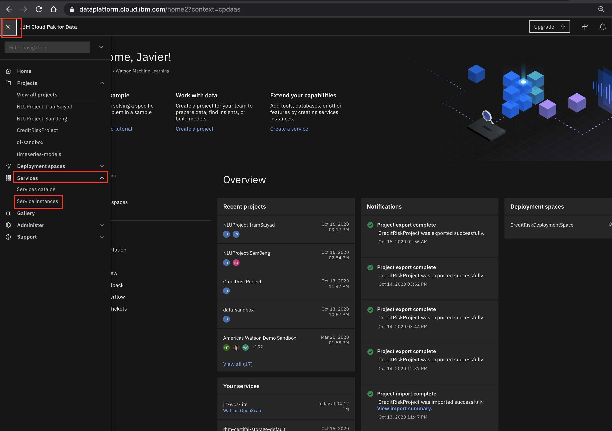
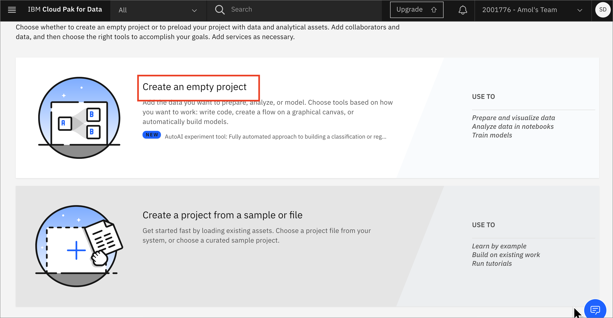
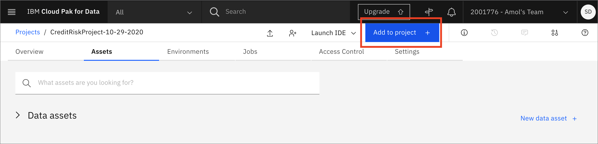

# Pre-work

Before we get started, we will download some assets and complete some setup for our workshop. This section is broken up into the following steps:

- [Pre-work](#pre-work)
  - [1. Download the Data](#1-download-the-data)
  - [2. Create IBM Cloud account and log into IBM Cloud Pak for Data as a Service](#2-create-ibm-cloud-account-and-log-into-ibm-cloud-pak-for-data-as-a-service)
  - [3. Create a Project and Deployment Space](#3-create-a-project-and-deployment-space)
    - [Create a New Project](#create-a-new-project)
    - [Associate a Watson Machine Learning Service instance to the project](#associate-a-watson-machine-learning-service-instance-to-the-project)
    - [Create a Deployment Space](#create-a-deployment-space)
  - [4. Get the IBM Cloud platform API key](#get-the-ibm-cloud-platform-api-key)
      - [1. Using the IBM Cloud CLI](#1-using-the-ibm-cloud-cli)
      - [2. Using the IBM Cloud console](#2-using-the-ibm-cloud-console)
  - [5. Upload the data to your project](#5-upload-the-data-to-your-project)
  - [Conclusion](#conclusion)

## 1. Download the data

* Click on this link to download the data to your workstation or laptop:

[german_credit_data_noid.csv](https://ibm.biz/credit_data)

You will use this later to upload to your CPDaaS project.

## 2. Create IBM Cloud account and log into IBM Cloud Pak for Data as a Service

* Launch a browser and navigate to [IBM Cloud Pak for Data as a Service](https://dataplatform.cloud.ibm.com/login?context=cpdaas).

* Click the `Select Region` button and choose whichever one is closest to you.

* Then you can log into your IBM Cloud account using your IBMid. If you don't have one, you can click on `Sign up and try for free` to create a free IBM Cloud account.


* Some of the services required for IBM Cloud Pak for Data will be provisioned for you. Once you see a message that says that the apps are ready to use, click on `Go to IBM Cloud Pak for Data`.


* Go the (☰) navigation menu on the top left corner of the Cloud Pak for Data UI. Expand *Services* and then click on `Service instances`.



* If you see an instance of *Watson Machine Learning* you are ready to use it, and you can skip to [3. Create a Project and Deployment Space](#3-create-a-project-and-deployment-space). If you do not have an instance of *Watson Machine Learning*, click on the `Add service +` button.


* Search or scroll until you find the tile for *Machine Learning* and click on it.


* Choose the same region as you chose for your Cloud Pak for Data as a Service platform, select the *Free* tier unless your organization has already used their 1 free tier, change the name and add tags if you like. The *Default* resource group should be correct, and then click `Create`.

## 3. Create a Project and Deployment Space

### Create a New Project

In Cloud Pak for Data, we use the concept of a project to collect / organize the resources used to achieve a particular goal (resources to build a solution to a problem). Your project resources can include data, collaborators, and analytic assets like notebooks and models, etc.

* Go the (☰) navigation menu, expand *Projects* and click on the *View all projects* link.


* Click on the `New +` button on the top.


* We are going to `Create an empty project`. Select the _*Create an empty project*_ option.



* Give the project a name. You also need to provide an object storage instance for this project. If you haven't already created a Cloud Object Storage instance in your IBM Cloud account, you can create one now by clicking `Add`.


* A new tab opens up, where you can create the Cloud Object Service. By default, a `Lite` (Free) plan will be selected. Scroll down and update the name of your Cloud Object Storage service if you wish, and click `Create`.


* The browser tab will automatically close when the Cloud Object Storage instance has been created. Back on IBM Cloud Pak for Data as a Service, click `Refresh`.


* The newly created Cloud Object Storage instance will now be displayed under "Storage". Click `Create` to finish creating the project.


* You can see a progress bar that says your project is being created. Once the project is succesfully created, on the pop up window click on the `View new project` button.


### Associate a Watson Machine Learning Service instance to the project

You will need to associate a Watson Machine Learning service instance to your project in order to run Machine Learning experiments.

* Go to the *Settings* tab of your project and look for the *Associated services* section. Click on `Add service` and in the menu that opens up, click on `Watson`.


* Click the checkbox next to the Watson Machine Learning service instance that was created for you when you signed up for Cloud Pak for Data as a Service. Click `Associate service`.

> **Note:** If you have multiple WatsonMachineLearning services, make sure you select the one that is in the same regions as is your Cloud Pak for Data as a service. 

> **Note:** Also make sure that the Name of the instance matches the name of the WatsonMachineLearning that you added in the earlier steps


* You will  see a notification that the WatsonMachineLearning service was successfully associated with your project. Click on the `X` in the right top corner to close the pop up modal and go back to your project.


### Create a Deployment Space

Cloud Pak for Data uses the concept of `Deployment Spaces` to configure and manage the deployment of a set of related deployable assets. These assets can be data files, machine learning models, etc. For this workshop, we need to create one.

* Go the (☰) navigation menu, expand `Deployment spaces` and then select `View all spaces`.


* Click on the `New deployment space` button.


* We will create an empty deployment space, so click on the `Create an empty space` option.


* Give your deployment space a unique name and optional description. Provide the Cloud Object Storage instance that you had created when you were creating the project and select the Machine Learning Service instance associated with your IBM Cloud Pak for Data as a Service instance, then click the `Create` button.


* Once the deployment space is created, you can click on `View new space`. 


## 4. Get the IBM Cloud platform API key

Use one of the following methods to retrieve the IBM Cloud Platform API key:

1. [Using the IBM Cloud CLI](#1-using-the-ibm-cloud-cli)
1. [Using the IBM Cloud console](#2-using-the-ibm-cloud-console)

#### 1. Using the IBM Cloud CLI

* Install the [IBM Cloud CLI](https://cloud.ibm.com/docs/cli/index.html) using the instructions in the link.

* Once the IBM Cloud CLI is installed, run the following command in your terminal to log into your IBM Cloud account. Running this command will prompt you to enter your email address and password.

```bash
ibmcloud login
```

* Once you have successfully logged in, generate an API key using the following command. Replace API_KEY_NAME with a unique name.

```bash
ibmcloud iam api-key-create API_KEY_NAME
```

* Get the value of `API Key` from the result of the command. This is the *api_key* value that you will need to provide in your Jupyter notebooks for accessing the Watson Machine Learning service instance.

#### 2. Using the IBM Cloud console

Alternatively, you can use the IBM Cloud Console to generate the IBM Cloud API key.

* Go to the [API keys section of the Cloud console](https://cloud.ibm.com/iam/apikeys).

* Select `My IBM Cloud API keys` in the *View* dropdown and then click `Create an IBM Cloud API key +`. 


* Give your API key a unique name and click `Create`. You should see a message that says `API key successfully created`. Click `Copy` to copy the generated API key. 


This is the *api_key* value that you will need to provide in your Jupyter notebooks for accessing the Watson Machine Learning service instance.

## Upload the data to your project

* On your project page, click `Add to project +`.



* Choose the `Data` tile.


* Click on `browse` and navigate to where you downloaded the *german_credit_data_noid.csv* file.

* After the file has uploaded, it will be visible under your *Assets* tab in the *Data assets* section.


## Conclusion

We have now completed creating an IBM Cloud account, a Cloud Pak for Data as a Service instance, and the project and deployment space that we will use in the rest of this workshop. We have also obtained the IBM Cloud API key that we will use in the AutoAI Jupyter notebook section.
