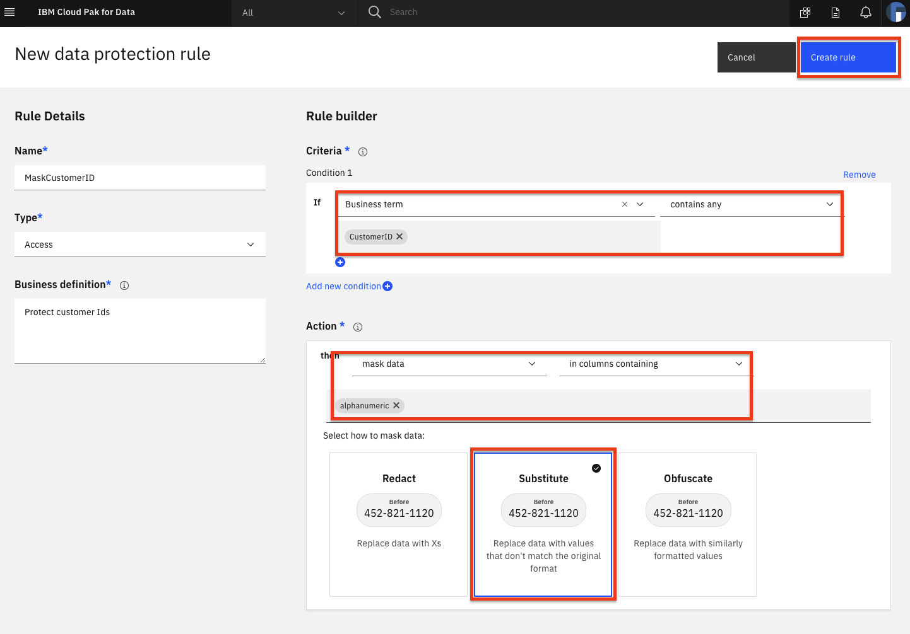

# Watson Knowledge Catalog for Admins

This exercise demonstrates how to solve the problems of enterprise data governance using Watson Knowledge Catalog on the Cloud Pak for Data-as-a-Service (CP4DaaS). We'll explain how to use governance, data quality and active policy management in order to help your organization protect and govern sensitive data, trace data lineage and manage data lakes. This knowledge will help users quickly discover, curate, categorize and share data assets, data sets, analytical models and their relationships with other members of your organization. It serves as a single source of truth for data engineers, data stewards, data scientists and business analysts to gain self-service access to data they can trust.

You will need the *Admin* role to create a catalog.

This section is comprised of the following steps:

1. [Set up Catalog and Data](#1-set-up-catalog-and-data)
1. [Add collaborators and control access](#2-add-collaborators-and-control-access)
1. [Add categories](#3-add-categories)
1. [Add Business terms](#5-add-business-terms)
1. [Add rules for policies](#6-add-rules-for-policies)

## 1. Set up Catalog and Data

First we'll create a catalog and load some data

### Create the catalog

#### Add Watson Knowledge Catalog the First Time

* Once you are on IBM Cloud Pak for Data, on the top right corner click on your avatar, and then click on `Profile and settings`. Go to the `Services` tab.

If the `Watson Knowledge Catalog` service instance is not added then click `Add`, choose the right plan for you and create the service.

#### Open Watson Knowledge Catalog

* Go to the upper-left (☰) hamburger menu and choose `Catalogs` -> `View All catalogs`:

* From the *Your catalogs* page, click either `Create catalog +`, and fill in all the required information, and click `create`

### Add data assets

* Under the *Browse Assets* tab, below "Now you can add assets!" click `here` or `Add to Catalog +` in the top right and, for example, choose `Local files`:

* Browse to the `/data/split/applicant_personal_data.csv` file and double-click or click `Open`. Add an optional description and click `Add`:

* The newly added file will show up under the *Browse Assets* tab of your catalog:

## 2. Add collaborators and control access

* Under the *Access Control* tab you can click `Add Collaborator +` to give other users access to your catalog:

* You can search for a user, click on the name to select them, choose a role for that use and click `Add`:

* To access data in the catalog, click on the name of the data:

* A preview of the data will open, with metadata and the first few rows:

* You can click the `Review` tab and rate the data, as well as comment on it, to provide feedback for your teammates:

## 3. Add categories

The fundamental abstraction in Watson Knowledge Catalog is the Category. A category is analogous to a folder.
You can add categories as needed.

### Add category

* Add a category for your assets by going to the upper-left (☰) hamburger menu, choose `Governance` -> `Policy Manager`, then click `Create category` or click `Add +` from top right menu and choose `Category`:

* Give your category a name, such as *Personal Data*, and an optional description, and then click `Create`:

## 4. Add Business terms

You can use [Business terms](https://dataplatform.cloud.ibm.com/docs/content/wsj/governance/dmg16.html) to standardize definitions of business concepts so that your data is described in a uniform and easily understood way across your enterprise.

* From the upper-left (☰) hamburger menu, choose `Governance` -> `Business Glossary`, and click `Add Terms +` and from drop down select `Create New`:

* Give the new Business term a name such as *Contact Information* and optional description, and click `Save as draft`. 

* You can `edit` the term saved as draft by clicking 3 dots. You can also add `tags`, `owner` and `term` ex: `Business Term` For now, click `Publish` to make this term available to users of the platform.

* Now go back to your *Credit Risk Catalog* by opening it up to the column view ((☰) hamburger menu `Catalogs` -> choose `Credit Risk Catalog`). Under the *Browse assets* tab, click on the data set *applicant_personal_data.csv* to get the column/row preview. Scroll right to get to the *email* column and click the *Column information* icon (looks like an "eye"):

* In the window that opens, click the *edit* icon (looks like a "pencil") next to *Business terms* :

* Enter *Contact Information* under *Business terms* and the term will be searched for. Click on the `Contact Information` term that is found, and click `Apply`:

Close that window once the term has been applied.
Now, do the same thing to add the *Contact Information* Business term to the *Telephone* column.

* You will now be able to search for these terms from within the platform. For example, going back to your top level *Credit Risk Catalog*, in the search bar with the comment "What assets are you searching for?" enter your  *Contact Information* term:

The *applicant_personal_data.csv* data set will show up, since it contains columns tagged with the *Contact Infomation* business term.

## 5. Add rules for policies

We can now create rules to control how a user can access data.

* Create a business term called *CustomerID* and assign it to your *CustomerID* column in the data set using the instructions above. See below if you need details, but try it yourself first, and skip to *Adding a rule* below if you do not need a reminder.

### How to create a Business term review

* From the upper-left (☰) hamburger menu, choose `Governance` -> `Business Glossary`.

* Click on the upper-right `Add terms +` button.

* Give the new Business term the name *CustomerID* and optional description, and  click `Publish`.

* Now go back to your *Credit Risk Catalog* by opening it up to the column view ((☰) hamburger menu `Governance` -> and choose `Credit Risk Catalog`). Under the *Browse assets* tab, click on the data set *applicant_personal_data.csv* to get the column/row preview. Scroll right to get to the *CustomerID* column and click the *Column information* icon (looks like an "eye").

* In the window that opens, click the *edit* icon (looks like a "pencil") next to *Business terms* .

* Enter *CustomerID* under *Business terms* and the term will be searched for. Click on the `CustumerID` term that is found, and click `Apply`.

### Adding a Policy and Rule

* From the upper-left (☰) hamburger menu, choose `Governance` -> `Policy Manager`, then click `Add +` and select `Policy`.

* Under *Details* give your rule a *Name*, *Type* = *Access*, *Category* ex: `Personal Data` that you added earlier, and `Description`.

* Next, under *Rule builder* *Condition1* fill out If *Business term* *Contains any* *CustomerID*  and Action then *anonymize data* *in columns containing* *Product Data*. Choose the tile for `Substitute`, which will make a non-identifiable hash. This obscures the actual CustomerID, but allows actions like database joins to still work. Click `Create`:

* Now if we go back to our *applicant_personal_data.csv* asset in the catalog at the *CustomerID* column, it will look the same as before. But a non-admin user will see the "lock" icon and see that the customerID has now been substituted with a hash value:

* To add a rule to *Obfuscate* data, create a new data class called *Age*. See the instructions above if needed.

* Back in the *Credit Risk Catalog*, under the *applicant_personal_data.csv* asset, go to the `Overview` tab and scroll to the *Age* column. Click the "down arrow" and you can see that the data has been inferred to be classified as a *Code*:

* Change the classifier by clicking `View all`.

* Now change the classifier by starting to type *Age*. When this comes up in the search, click `Use` and then `Close`:

* You can build a rule to *Obfuscate* this *Age* column:

* And now when that column is viewed by a non-admin user, it will have data that is replaced with similarly formatted data:

## Wrap up

In this lab, we learned how to:

* Set up Catalog and Data
* Add collaborators and control access
* Add categories
* Add Business terms
* Add rules for policies
