# Watson Knowledge Catalog for Users

This exercise demonstrates how to solve the problems of enterprise data governance using Watson Knowledge Catalog on the Cloud Pak for Data platform. We'll explain how to use governance, data quality and active policy management in order to help your organization protect and govern sensitive data, trace data lineage and manage data lakes. This knowledge will help users quickly discover, curate, categorize and share data assets, data sets, analytical models and their relationships with other members of your organization. It serves as a single source of truth for data engineers, data stewards, data scientists and business analysts to gain self-service access to data they can trust.

This section is comprised of the following steps:

1. [Find the Right Data](#1-find-the-right-data)
1. [Understand the Data](#2-understand-the-data)
//1. [Trust the Data Quality](#3-trust-the-data-quality)
//1. [Understand the Data Content](#4-understand-the-data-content)
1. [Understand the Data Content](#3-understand-the-data-content)

## 1. Find the Right Data

We need to find the right data and business information related to the Mortgage Default analysis project. You can use the global search to search across catalogs, projects and the business glossary to find all assets that you may be interested in.

* Enter the words `mortgage` in the global search area and press the enter key to start finding what you need. Place your cursor inside the global search area next to the word mortgage and press the enter key:

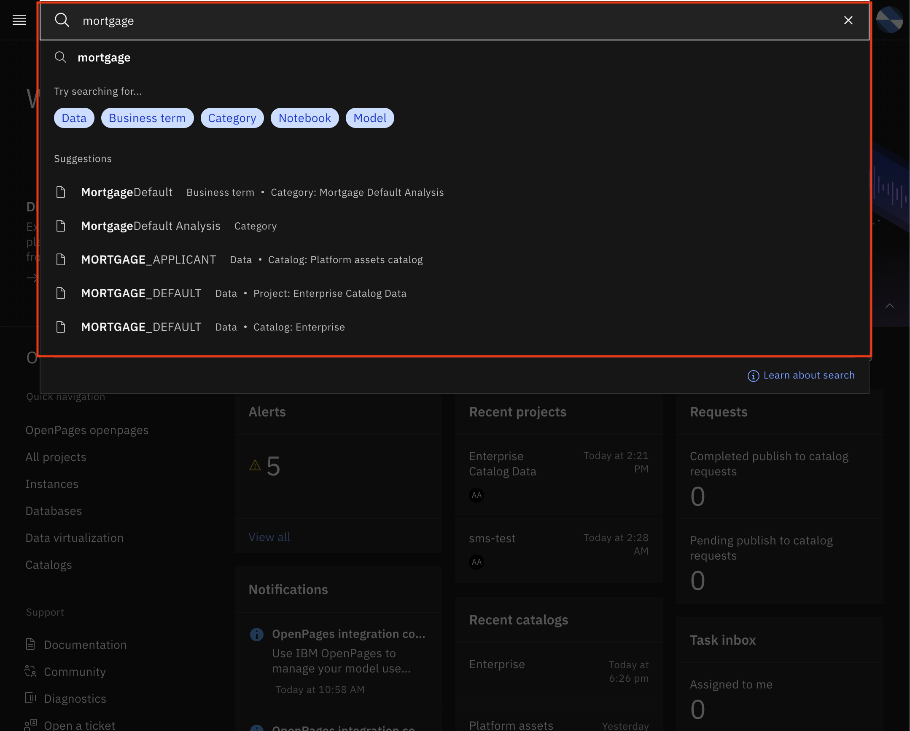

* The search returns all data and information assets related to the search criteria across all catalogs, projects and governance artifacts. Scroll down through the list to take a closer look at what was found.

* You can further refine your search results by using the filters supplied by type, tag, catalog, project etc.

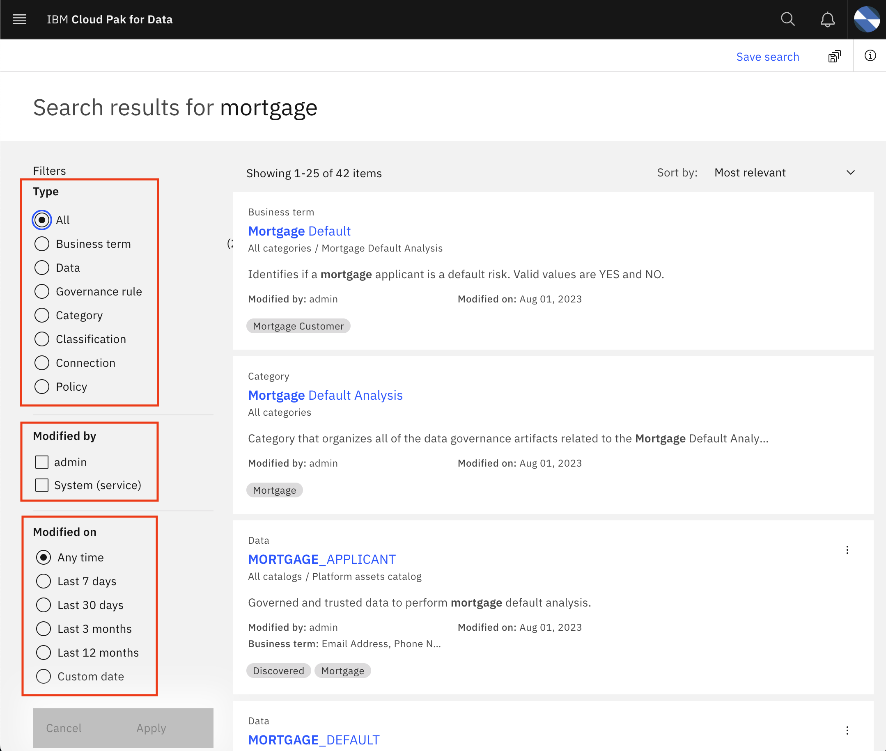

* First and foremost, we need to verify that all the data needed for the project has been cataloged and available to the project team to use. We can do this very easily by refining the search to only display mortgage data that exists across all catalogs.

* From the search drop down menu select `Governance` > `All governance artifacts`.

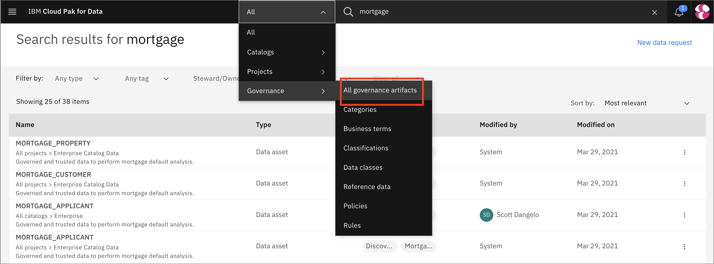

* All data assets across catalogs meeting the criteria are displayed. This is the data we are looking for.

* The connection to the Analytics Data Warehouse and the 4 mortgage tables are what the project team requested; Mortgage Default, Applicant, Property and Customer are all in the Enterprise catalog.

* However, before we proceed to the catalog we need to also find all the business information related to the project to review the terms and content of the data and identify if there are any policies and rules set by the business that the project team needs to be aware of and adhere to.

* From the search drop down menu select `Governance` > `Business terms`.

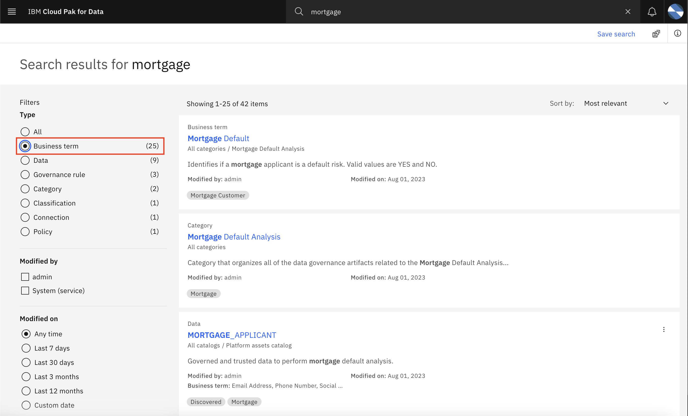

* Notice that the governance team has been hard at work and has defined 25 business terms related to the mortgage data the project will be using. Also notice that they are tagged with the key word Mortgage to easily find them

* Scroll down the list of business terms to view them all.

  * Note that the Email Address, Phone Number and Social Security Number have all been tagged as Sensitive information.

* Click on the Clear all button to get ready for the next search task.

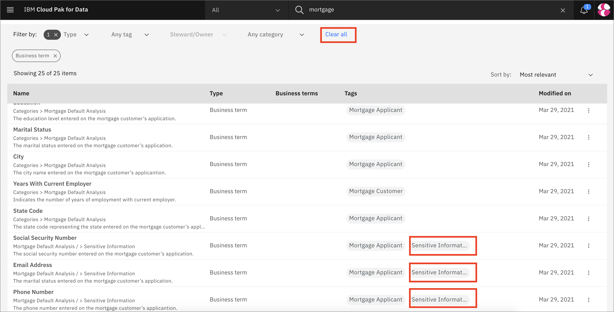

* Click on the Any type filter and select the Category type from the list to refine the results.

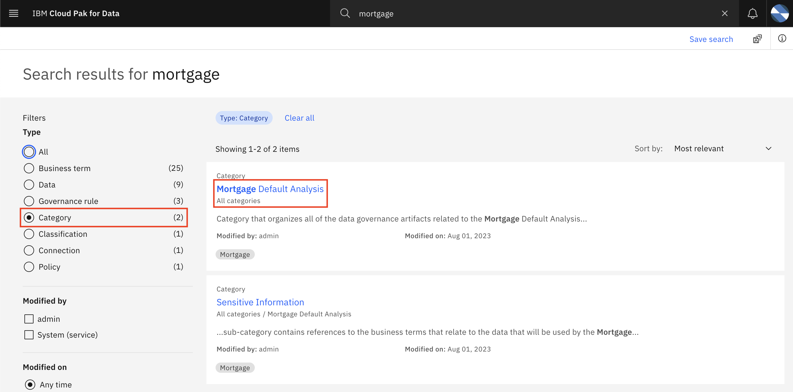

* Notice that there is a Mortgage Default Analysis category defined that contains all the business information related to the project and a category named Sensitive Information that is a subcategory. This is a good indication that the mortgage data being used by the project contains sensitive information that needs to be protected.

## 2. Understand the Data

The best data is data that is fully understood and trusted.

You can be confident in your data when you know where it comes from, that it complies to a set of policies and rules that address data privacy regulations and that it is clean and conforms to data quality policies, rules and standards, and that others have used it and trust it and are willing to share that information, to ensure you can produce meaningful and accurate analytical and AI results that will benefit better business outcomes.

### Understand Data Policies and Rules

In this section you will use the Business glossary to gain a deeper understanding of the business terminology defined by the data steward and the governance team responsible for establishing policies and rules to govern and protect the data. Since we see that there is an indication of sensitive information Let’s take a closer look at the Sensitive Information category content.

* Click on the Sensitive Information category from the list.

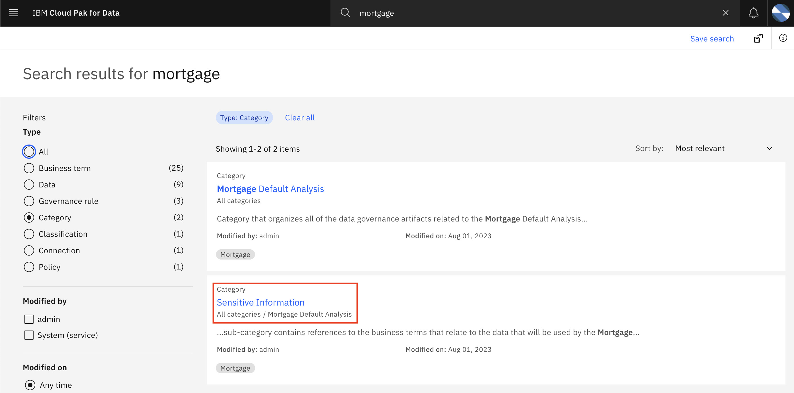

* The description clearly states that this subcategory contains references to business terms that relate to data that will be used by the project team that need to be governed by data protection rules. Let’s get more information on the Social Security Number.

* In the global search area, enter the words `social security number` and press the enter key.

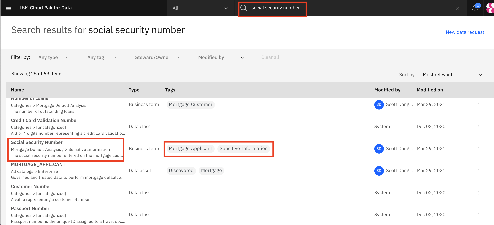

* A Social Security Number term appears in the list with tags of Mortgage applicant and Sensitive information. This is an indication that the Mortgage Applicant table has a social security number.

<!--- TODO. Get this working on the cluster, and updated docs
* Click on the Social Security Number business term with the two tags applied from the list.

* Click on the Related Content tab.

* Click on the arrow next to the `MORTGAGE_APPLICANT` table in the Catalog assets section. There is definitely a SOCIAL_SECURITY_NUMBER column that resides in this table.

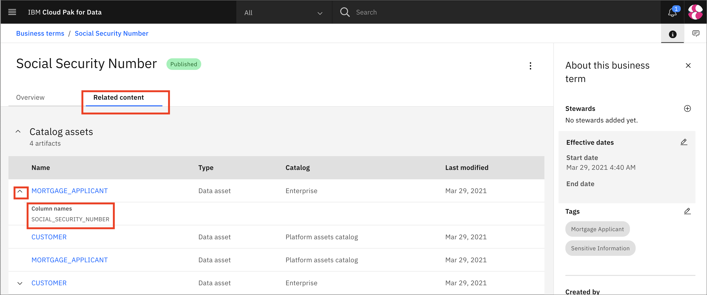

* Click on the CUSTOMER table in the Additional information assets section.

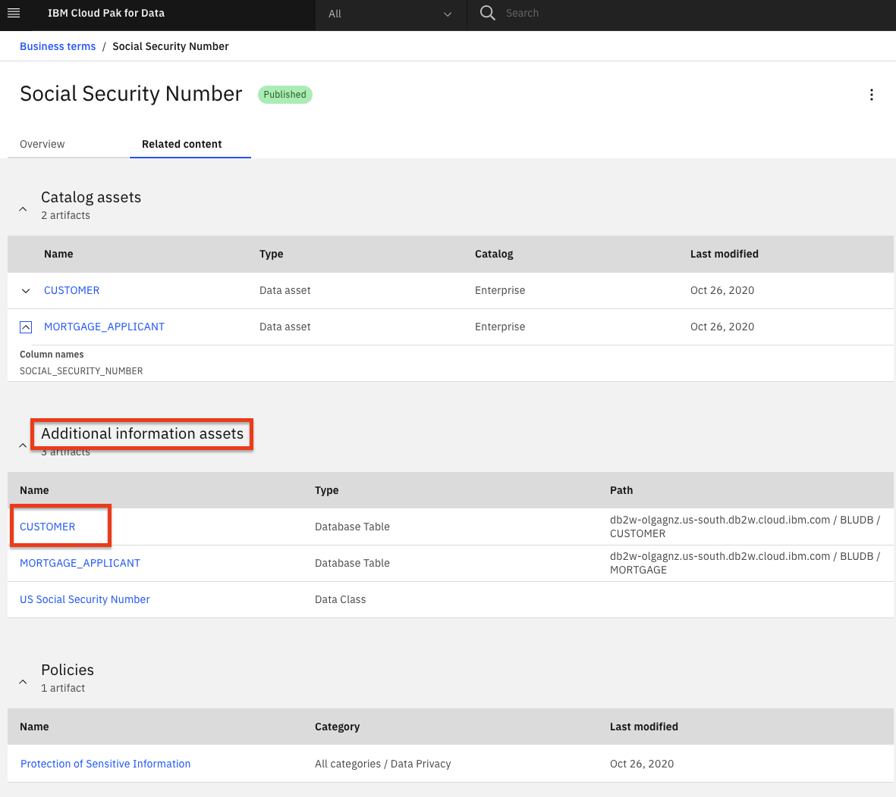

* It has been assigned the four business terms that relate to sensitive information. It has 28 columns and is from the CUSTOMER schema from the BLUDB database. Let’s investigate further and Explore and visualize these relationships.

* Click on the ellipses (…) in the top right corner and select the Explore relationships menu item:

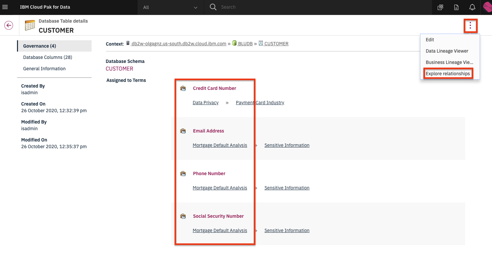

* A new tab will open in your browser and display the relationship graph:

* Click the magnifying glass with a + sign in the lower left corner to increase the graph size.

* Click the plus sign next to Database Columns to expand it and view all the columns.

* Click on the Center graph button in the lower left corner to center the graph for easier viewing.

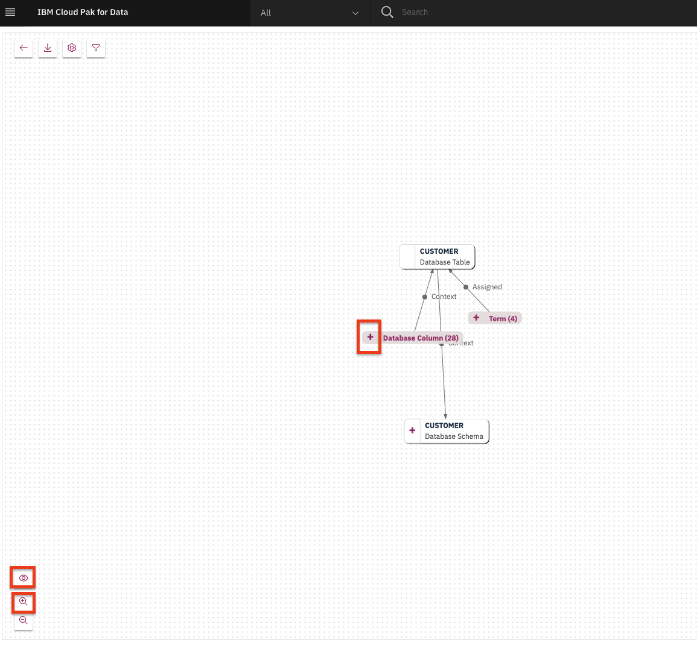

* The table also contains EMAIL_ADDRESS, CREDIT_CARD_NUMBER, and PHONE_NUMBER data that we know is sensitive.

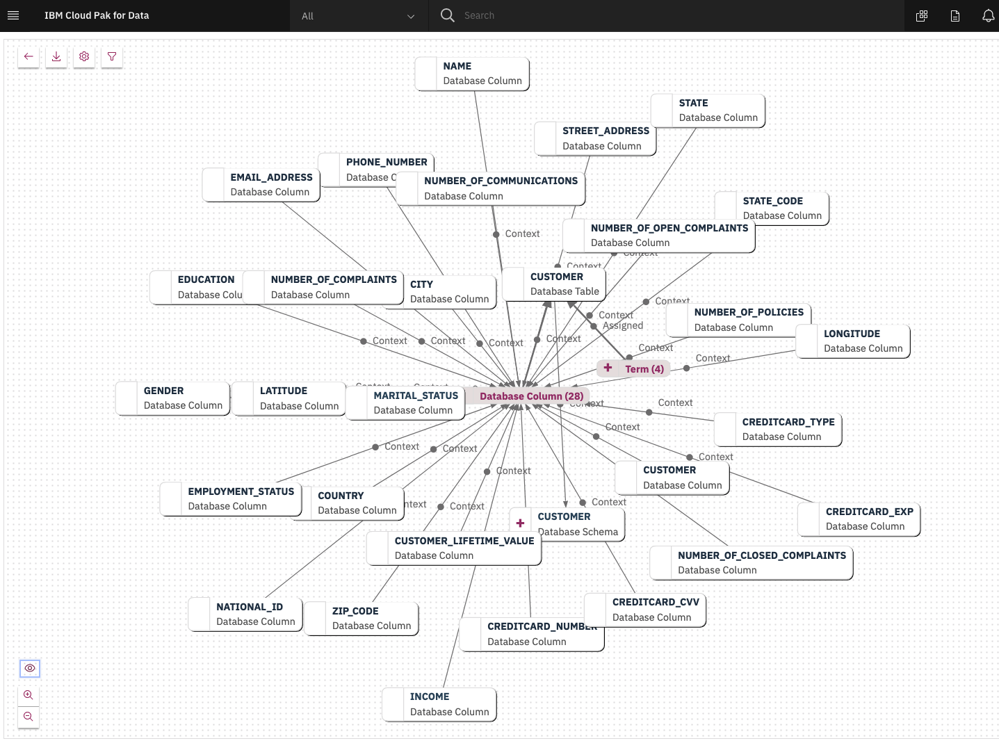

* Close this tab in your browser and go back to the source tab that got you here.

* Click on the IBM Cloud Pak for Data title, or the (☰) hamburger menu -> `Home`, to get ready for the next section.

## 3. Trust the Data Quality

The data quality analyst has informed the project team that the mortgage data quality meets the company’s standards and the data content was thoroughly analyzed and assessed before it was published to the catalog after it was discovered. You can see the results of that discovery and analysis in the Data Curation section of the Organize component of Cloud Pak for Data.

To review the data quality results:

* Click the (☰) hamburger menu in the upper left corner and click `Organize` -> `Curation` -> `Data discovery`.

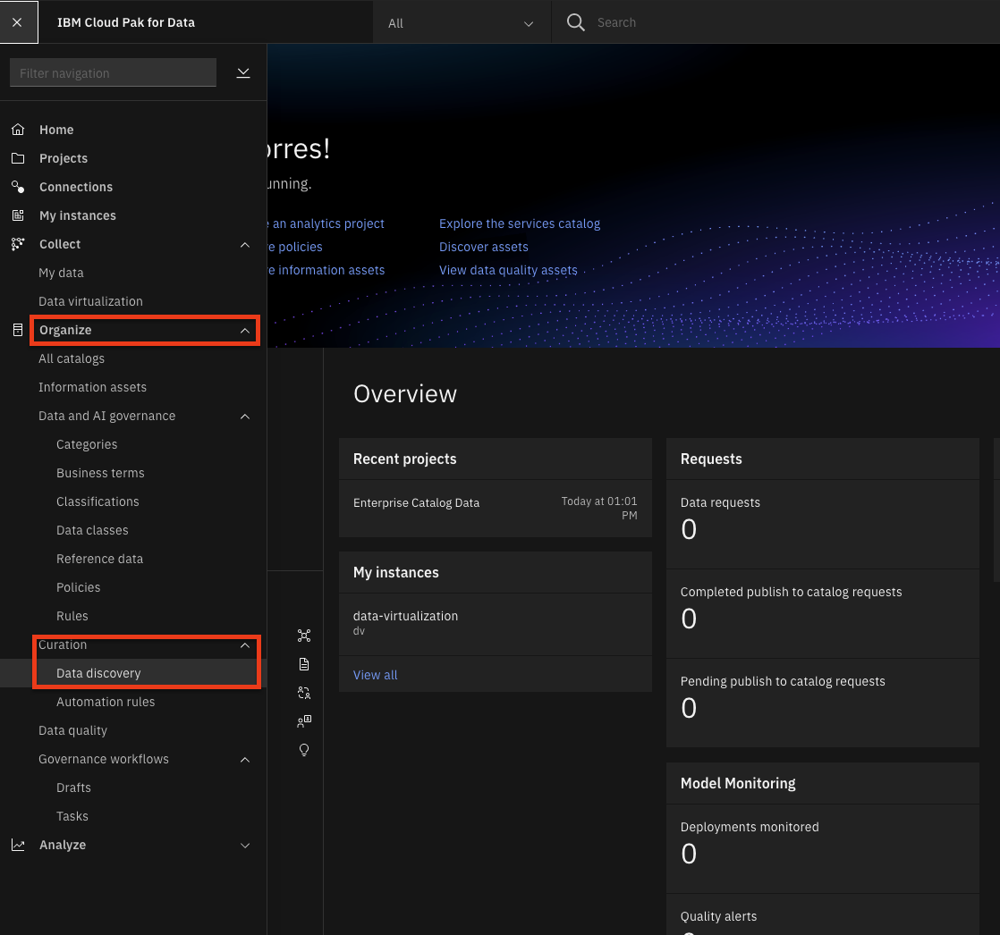

* Click on the `View automated discovery results` link in the top right corner.

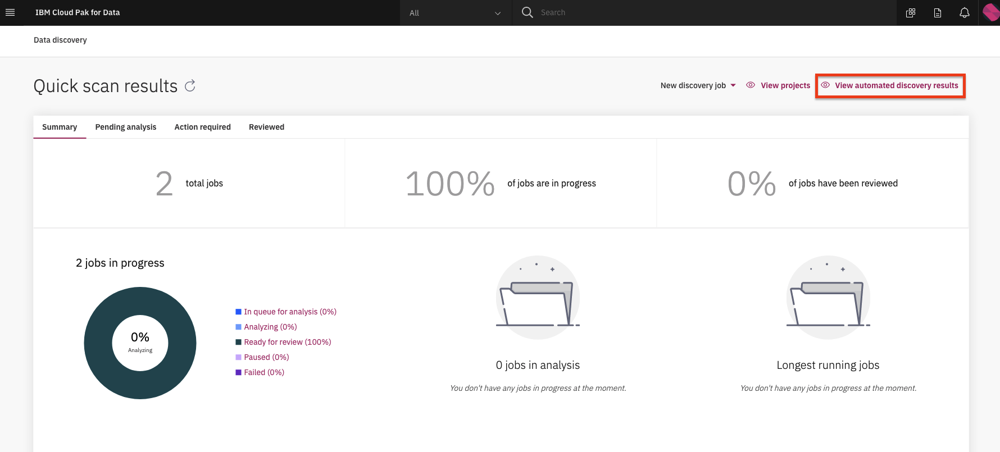

* Click on the Discovery results ID for view the Mortgage Default Analysis quality results. (*Note: Look for a discovery root using `CUSTOMER`, `INSURANCE` and `MORTGAGE`)

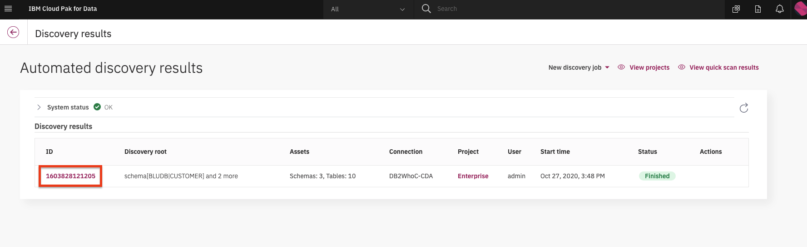

* Click on the Review discovery results button under Actions in the bottom right corner for the `MORTGAGE` asset.

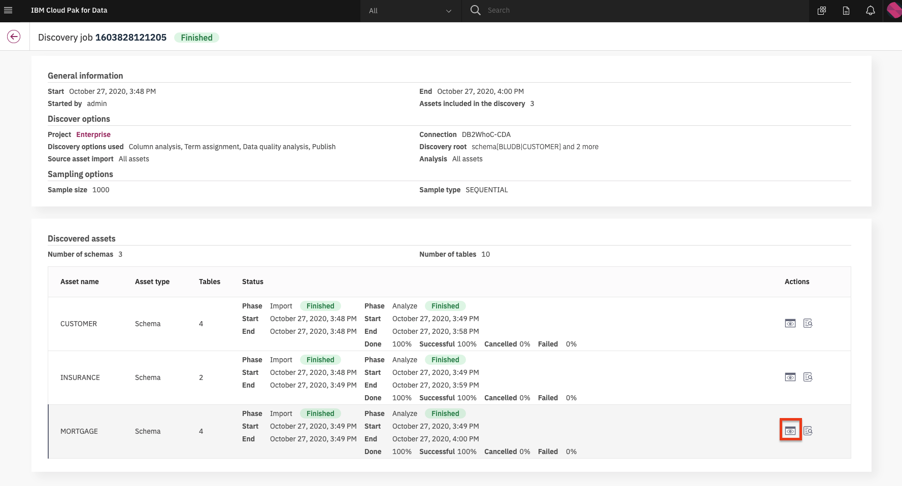

* You immediately see the Quality score for each table analyzed with the lowest score being 98% and the highest being 100%. Also notice that business terms have been assigned at the table level.

* Since we know the MORTGAGE_APPLICANT table is a new addition to the project, that was just requested, and it contains sensitive information, we will drill down into the details of the analysis

* Click on the Arrow next to the MORTGAGE_APPLICANT table to expand it and review the column analysis.

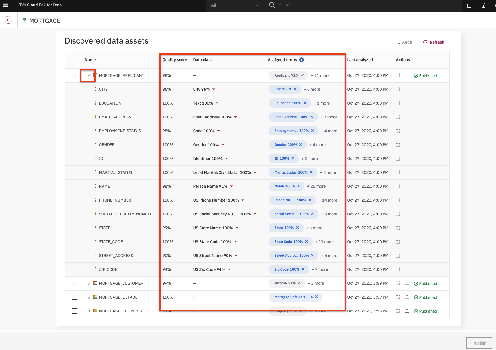

* You are presented with a Quality score for each column analyzed. The quality looks satisfactory and meets the quality standard thresholds and the data classes and business terms are accurately assigned and complete. This is important to ensure the data is autonomously protected and that the governance artifacts are related to data assets they apply to.

* Scroll down to see the remaining columns.

* Click on the IBM Cloud Pak for Data title, or the (☰) hamburger menu -> `Home`, to get ready for the next section.

## 4. Understand the Data Content
-->
## 3. Understand the Data Content

You have gained an understanding of the policies and rules and information related to sensitive data and validated and trust the data quality. In this section we will go to the Enterprise catalog, which is where we identified all the data we need resides, and use all of the features it provides to gain an even better understanding of the data content and have even more confidence in the data based on what others are saying and by utilizing the AI assisted recommendations, automatic profiling and additional data content statistics provided.

* Click the (☰) hamburger menu in the upper left corner and click `Catalog` -> `All catalogs`

* Click on the `Enterprise` catalog.

Watson Knowledge Catalog provides suggested assets to you based on recommendations using AI, things you might be interested in based on your past viewing history. Notice that it is already recommending Mortgage data to you based on your past searches. It also keeps track of what’s hot and Highly Rated based on reviews and ranks them in order of their rating highest to lowest.

* Click on the `Highly Rated` section to see what’s hot:

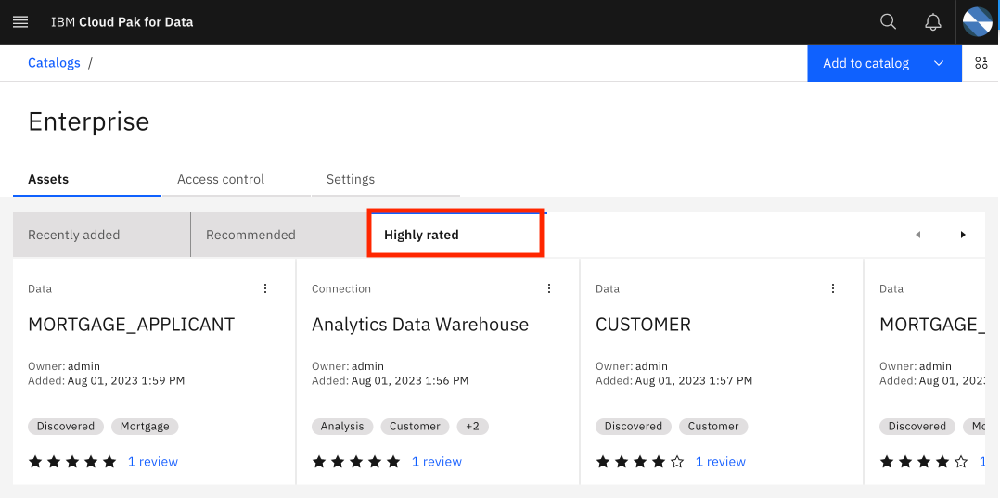

* Notice that the Analytics Data Warehouse, MORTGAGE_APPLICANT and MORTGAGE_CUSTOMER tables have been reviewed and are rated quite high. A good indication of their quality and usability.

* Lastly, Watson Knowledge Catalog keeps track of what’s new that has been Recently Added since the last time you visited the catalog. This are all means to help you find and understand the data more quickly and easily.

* Click on the `Recently Added` section to see what’s new.

* Notice that the `MORTGAGE_APPLICANT` table was the most recent data asset added to the catalog.

* Click on the `MORTGAGE_APPLICANT` table to review its content and metadata.

* You are brought into the Overview section of the MORTGAGE_APPLICANT table. Click on the `Asset` tab. You may see that Data masking is in progress and that 3 columns are being masked. The asset is being masked by the Protect Sensitive Personal Information data protection rule being enforced by the data governance team. Because you are not authorized to view the sensitive information, the data is being protected.

* The data that is masked is indicated with a lock icon next to their column names; EMAIL_ADDRESS, PHONE_NUMBER and SOCIAL_SECURITY_NUMBER. Scroll to the right to view all the masked columns.

* Click on the lock icon on the `EMAIL_ADDRESS` column to view the data protection message.

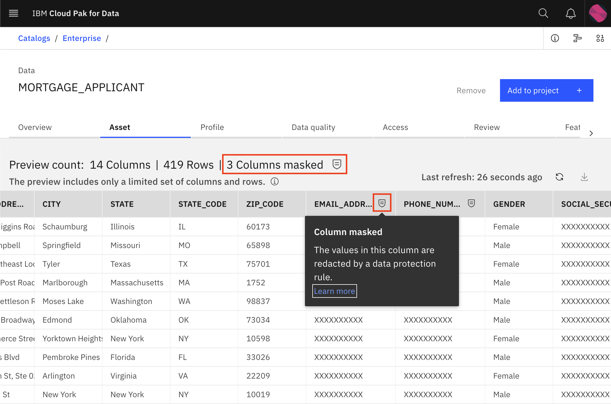

* Click on the Review tab to read the review. The table has a 5 star rating with a very positive review. Reviews can be written by anyone who has access to the catalog and the asset to notify and inform others of the content and usability of the data.

* Click on the Profile tab to view the data profile.

* As data assets are discovered and added to the catalog they are automatically profiled and classified to give end users a more in-depth understanding of the data content, quality and usability. Data classifications are used to identify what type of data it is and to autonomously enforce data protect rules to mask sensitive data, like you just saw.

* Scroll to the right to view the other columns. Notice that the protected data does not have any profile information displayed.

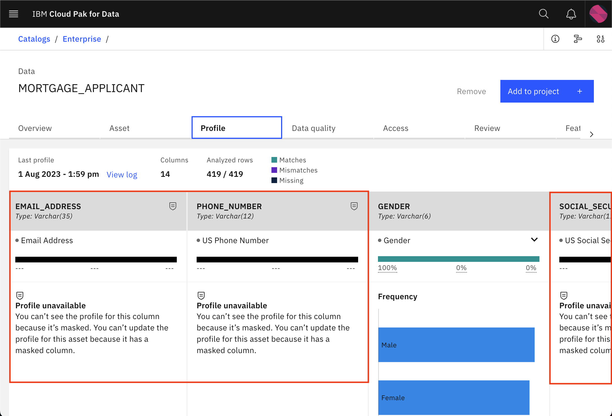

* Lineage is captured for every data asset in a catalog. It keeps track of where it came from, any updates or changes that have been made to its metadata and any movement of the data outside of the catalog. Click on the `Activities` tab to view the data asset lineage.

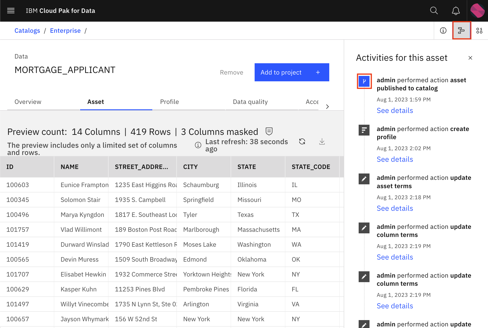

* Click on any node to see the detail pane on the right. Do this for every node in the lineage graph to see what is tracked.

## Conclusion

In this section we covered several aspects of data organization and governance. We've seen:

* How data is cataloged.
* How to search for data.
* How policies and rules can be applied to protect and govern sensitive data.
